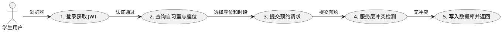
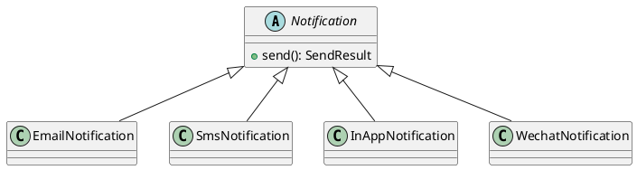
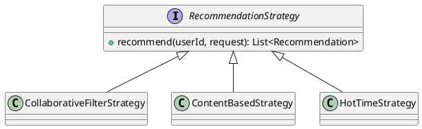
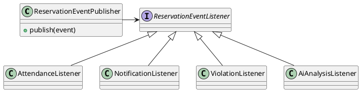
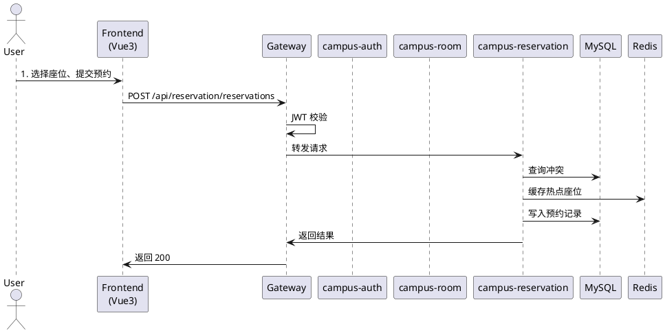
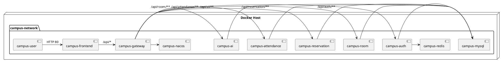

# 校园自习室预约系统 — 架构设计文档

## 文档信息

| 项目 | 内容 |
|------|------|
| 项目名称 | 校园自习室预约系统（Campus Study Room Reservation System） |
| 文档版本 | V1.0 |
| 编写日期 | 2026年6月 |
| 编写团队 | CampusStudio |

---

## 1 引言

### 1.1 编写目的

本文档旨在从架构视角全面描述校园自习室预约系统的总体设计，包括逻辑视图、开发视图、进程视图、物理视图和场景视图（4+1 视图），以及微服务架构、安全架构、数据架构、可观测性架构和 AI 架构等专项设计。文档为系统实现、测试、部署和后期演进提供依据。

### 1.2 项目背景

高校自习室资源紧张、占座现象普遍、考勤管理依赖人工，导致资源利用率低、学生体验差。本系统通过微服务架构和 AI 技术，实现自习室资源的数字化、智能化管理。

### 1.3 术语定义

| 术语 | 定义 |
|------|------|
| 4+1 视图 | Kruchten 提出的软件架构描述方法：逻辑视图、开发视图、进程视图、物理视图和场景视图 |
| DDD | 领域驱动设计（Domain-Driven Design） |
| RBAC | 基于角色的访问控制（Role-Based Access Control） |
| JWT | JSON Web Token，用于无状态身份认证 |
| RAG | 检索增强生成（Retrieval-Augmented Generation） |
| CF | 协同过滤（Collaborative Filtering） |
| TPS | 每秒事务处理量 |

### 1.4 参考资料

- 《软件架构设计：大型网站技术架构与业务架构融合之道》
- Spring Cloud Alibaba 官方文档
- Vue 3 官方文档
- 达梦8 数据库适配指南

---

## 2 架构设计原则与选型

### 2.1 设计原则

1. **高内聚低耦合**：按业务领域拆分微服务，每个服务独立开发、部署、扩展。
2. **前后端分离**：前端负责界面交互，后端负责业务逻辑，通过 RESTful API 通信。
3. **无状态服务**：业务服务无状态，状态集中存储在 MySQL、Redis 中，便于水平扩展。
4. **防御性编程**：关键接口有降级、限流、超时、重试机制。
5. **可观测性**：日志、指标、链路追踪全覆盖。

### 2.2 技术架构总览

系统采用 **Spring Cloud Alibaba 微服务架构 + Vue3 前后端分离架构**，整体技术栈如下：

| 技术域 | 技术选型 | 版本 |
|--------|----------|------|
| 后端框架 | Java + Spring Boot + Spring Cloud Alibaba | JDK 17 / Spring Boot 3.2.5 / SCA 2023.0.1.2 |
| 前端框架 | Vue 3 + TypeScript + Pinia + Element Plus | Vue 3.4.21 / TS 5.4 |
| 数据库 | MySQL + 达梦8 | MySQL 8.0.36 / DM8 |
| 缓存 | Redis | 7.0.15 |
| 服务治理 | Nacos | 2.3.0 |
| 网关 | Spring Cloud Gateway | 4.x |
| 容器化 | Docker + Kubernetes | Docker 26.0 / K8s 1.29 |
| 可观测 | Prometheus + Grafana + SkyWalking | - |

### 2.3 架构选型论证

**微服务 vs 单体架构**

| 维度 | 微服务架构 | 单体架构 |
|------|------------|----------|
| 团队并行 | 高，各服务可独立开发 | 低，代码冲突频繁 |
| 部署弹性 | 可按服务独立扩缩容 | 整体扩缩容 |
| 技术异构 | 支持不同技术栈 | 统一技术栈 |
| 运维复杂度 | 较高 | 较低 |
| 适用场景 | 中大型、多团队协作项目 | 小型、快速验证项目 |

本系统涉及 7 个业务领域，且答辩要求体现微服务架构能力，因此选择微服务架构。

**Spring Cloud Alibaba vs Spring Cloud Netflix**

Spring Cloud Alibaba 提供 Nacos（注册中心/配置中心）、Sentinel（限流熔断）、Seata（分布式事务）等国产化组件，与阿里云生态和国内信创要求更契合。Netflix 部分组件已进入维护模式，因此选择 SCA。

---

## 3 4+1 视图详细设计

### 3.1 场景视图

场景视图通过核心用户场景串联其他视图，验证架构合理性。本系统核心场景为"学生预约自习室"。

#### 3.1.1 场景描述

1. 学生打开浏览器，访问前端页面；
2. 通过网关进行 JWT 认证；
3. 浏览自习室列表，查看座位可用情况；
4. 选择日期、时间段和座位，提交预约；
5. 预约服务进行时间冲突检测；
6. 创建预约记录，更新座位状态；
7. 学生在预约时段内签到、签退。

#### 3.1.2 场景视图 UML



#### 3.1.3 视图关联说明

| 场景步骤 | 逻辑视图 | 开发视图 | 物理视图 |
|----------|----------|----------|----------|
| 登录 | User 实体 | AuthController / AuthService | campus-auth Pod |
| 查询自习室 | StudyRoom / Seat 实体 | RoomController / RoomService | campus-room Pod |
| 提交预约 | Reservation 实体 | ReservationController / ReservationService | campus-reservation Pod |
| 冲突检测 | ReservationService 领域逻辑 | ReservationServiceImpl / ReservationMapper | campus-reservation Pod + MySQL |
| 签到签退 | Attendance 实体 | AttendanceController | campus-attendance Pod |

---

### 3.2 逻辑视图

#### 3.2.1 领域模型

系统按 DDD 思想划分为 5 个核心领域：

1. **用户域（User Domain）**：用户、角色、权限、JWT 认证
2. **空间域（Space Domain）**：自习室、座位、教学楼
3. **预约域（Reservation Domain）**：预约、时间段、冲突检测
4. **考勤域（Attendance Domain）**：签到、签退、学习时长
5. **AI 域（AI Domain）**：智能推荐、智能客服、知识库

#### 3.2.2 核心领域对象

| 实体 | 职责 | 关键属性 |
|------|------|----------|
| User | 系统用户 | userId, username, password, role, status |
| StudyRoom | 自习室 | roomId, roomName, building, floor, capacity |
| StudySeat | 座位 | seatId, roomId, seatNumber, type, hasPower |
| Reservation | 预约记录 | reservationId, userId, roomId, seatId, status |
| Attendance | 考勤记录 | attendanceId, reservationId, checkInTime, checkOutTime |
| KnowledgeBase | 知识库 | knowledgeId, title, content, keywords |
| AiRecommendation | 推荐记录 | recommendationId, userId, roomId, seatId, score |

#### 3.2.3 设计模式应用

**工厂模式 — 通知系统**

系统支持邮件、短信、站内信、微信等多种通知渠道。通过工厂方法模式，客户端通过抽象工厂接口创建通知对象，新增渠道时只需扩展具体产品类和工厂类，符合开闭原则。



**策略模式 — 推荐算法**

推荐系统支持协同过滤、内容推荐、热门时段分析、位置偏好、行为模式匹配等多种策略。通过策略模式，算法可动态切换、组合，便于 A/B 测试和算法演进。



**观察者模式 — 预约事件**

当预约状态发生变化（创建、取消、签到、签退、超时）时，需要触发考勤记录、通知发送、违规检测、AI 分析等多个后续动作。通过观察者模式，事件发布者与监听者解耦。



---

### 3.3 开发视图

#### 3.3.1 代码组织

项目采用 Maven 多模块结构：

```
campus-studyroom/
├── backend/
│   ├── campus-gateway/        # API 网关
│   ├── campus-auth/           # 认证服务
│   ├── campus-user/           # 用户服务
│   ├── campus-room/           # 自习室服务
│   ├── campus-reservation/    # 预约服务
│   ├── campus-attendance/     # 考勤服务
│   └── campus-ai/             # AI 服务
├── frontend/                  # Vue3 前端
├── docs/                      # 设计文档与 UML
├── k8s/                       # Kubernetes 部署配置
└── docker-compose.yml         # Docker Compose 部署配置
```

#### 3.3.2 后端分层架构

每个微服务采用经典分层架构：

| 层级 | 职责 | 典型类 |
|------|------|--------|
| Controller | 接收 HTTP 请求，参数校验 | *Controller.java |
| Service | 业务逻辑编排，事务管理 | *Service.java / *ServiceImpl.java |
| Mapper | 数据访问 | *Mapper.java |
| Entity | 领域对象 / POJO | *Entity.java |
| Config | 配置类、拦截器、全局异常处理 | *Config.java |

#### 3.3.3 前端组件架构

前端采用 Vue 3 组合式 API + TypeScript + Pinia：

```
frontend/src/
├── api/           # 按领域封装的 Axios 请求
├── views/         # 页面组件
├── components/    # 公共组件
├── stores/        # Pinia 状态管理
├── router/        # 路由配置
├── types/         # TypeScript 类型定义
└── utils/         # 工具函数
```

---

### 3.4 进程视图

#### 3.4.1 运行时交互



#### 3.4.2 并发控制

- 同一座位同一时间段通过数据库唯一索引 + 应用层冲突检测保证幂等；
- 热点座位数据使用 Redis 缓存，降低数据库压力；
- 服务内部使用 Tomcat 线程池处理并发请求。

---

### 3.5 物理视图

#### 3.5.1 Docker Compose 部署拓扑



#### 3.5.2 Kubernetes 部署拓扑

在 K8s 环境中，所有服务部署在 `campus-studyroom` 命名空间：

- MySQL：StatefulSet + PVC 持久化
- Redis：Deployment
- Nacos：Deployment（standalone + 内置 Derby）
- 业务服务：Deployment + ClusterIP Service
- Gateway / Frontend：Deployment + NodePort Service
- 监控：Prometheus + Grafana + SkyWalking

---

## 4 微服务架构设计

### 4.1 服务拆分

| 服务 | 端口 | 职责 | 依赖 |
|------|------|------|------|
| campus-gateway | 8000 | 统一入口、JWT 校验、路由转发 | Nacos |
| campus-auth | 8001 | 登录注册、JWT 签发、用户信息 | MySQL、Redis |
| campus-user | 8002 | 用户资料、角色权限 | MySQL |
| campus-room | 8003 | 自习室、座位、教学楼管理 | MySQL、Redis |
| campus-reservation | 8004 | 预约创建、取消、冲突检测、签到签退 | MySQL、Redis |
| campus-attendance | 8005 | 考勤记录、学习时长统计 | MySQL |
| campus-ai | 8006 | 智能推荐、RAG 客服 | MySQL、Redis、智谱 AI |

### 4.2 服务间通信

- **同步调用**：通过 Spring Cloud OpenFeign 在必要时调用其他服务（当前主要采用网关统一路由，服务间直接调用较少）；
- **数据共享**：campus-ai 直接访问同一 MySQL 中的 reservation / study_room / study_seat / knowledge_base 表，避免跨服务调用延迟；
- **事件驱动**：预留 ReservationEvent 扩展点，可用于后续引入 RabbitMQ/Kafka 实现异步事件。

### 4.3 API 网关设计

Gateway 承担以下职责：

1. **统一路由**：所有前端请求通过 `http://localhost:8000/api/{service}/**` 访问后端；
2. **JWT 校验**：除登录、注册、健康检查、Swagger 外，其余接口必须携带有效 token；
3. **CORS 处理**：统一配置跨域，允许前端开发服务器访问；
4. **限流预留**：可集成 Sentinel 实现网关层限流。

---

## 5 安全架构设计

### 5.1 认证机制

采用 JWT（JSON Web Token）无状态认证：

1. 用户登录成功后，`campus-auth` 签发 accessToken（有效期 2 小时）和 refreshToken（有效期 7 天）；
2. 前端将 token 存储在 localStorage；
3. 每次请求在 `Authorization: Bearer {token}` 头部携带 accessToken；
4. Gateway 解析并校验 token 有效期，过期返回 401；
5. 前端捕获 401 后，使用 refreshToken 刷新或跳转登录页。

### 5.2 授权机制

采用 RBAC（基于角色的访问控制）：

- 角色：学生、管理员、超级管理员；
- 权限：通过 role_permission 表维护；
- 接口权限：通过网关或各服务 Controller 前的注解控制；
- 数据权限：通过 SQL 中 `user_id = ?` 过滤，确保用户只能操作自己的预约和考勤。

### 5.3 数据安全

- 用户密码使用 BCrypt 加密存储；
- 敏感接口使用 HTTPS（生产环境）；
- 数据库连接使用独立账号，最小权限原则；
- JWT Secret 通过配置文件或环境变量注入，避免硬编码。

---

## 6 数据架构设计

### 6.1 数据库选型

| 数据库 | 用途 | 版本 |
|--------|------|------|
| MySQL 8.0 | 主数据库，存储业务数据 | 8.0.36 |
| 达梦8 | 国产化适配，双数据库兼容 | DM8 |
| Redis | 缓存、会话、热点数据 | 7.0.15 |

### 6.2 双数据库兼容策略

- 使用 MyBatis-Plus 作为 ORM 层，屏蔽底层 SQL 差异；
- SQL 脚本同时提供 MySQL 版和达梦8 版；
- 避免使用数据库特定函数（如 MySQL 的 `LIMIT` 在达梦中用 `TOP`/`ROWNUM`）；
- 日期函数、字符串函数等尽量使用标准 SQL 或 MyBatis-Plus 封装。

### 6.3 缓存设计

| 缓存对象 | 存储方式 | 过期策略 |
|----------|----------|----------|
| 用户登录 token | Redis | 与 token 有效期一致 |
| 自习室列表 | Redis + 本地缓存 | 5 分钟 |
| 座位可用状态 | Redis | 实时更新，预约时失效 |
| 首页统计 | Redis | 1 分钟 |

---

## 7 可观测性架构设计

### 7.1 日志

- 各服务统一输出到 `logs/` 目录；
- 使用 SLF4J + Logback；
- 日志级别：生产环境 INFO，调试环境 DEBUG；
- Docker/K8s 部署时可通过 `kubectl logs` 或 ELK 收集。

### 7.2 指标

- 暴露 Spring Boot Actuator `/actuator/prometheus` 端点；
- Prometheus 定期抓取各服务指标；
- Grafana 配置 JVM、HTTP、业务自定义看板。

### 7.3 链路追踪

- 预留 SkyWalking Agent 接入点；
- 通过 SkyWalking UI 查看跨服务调用链。

---

## 8 AI 架构设计

### 8.1 智能推荐架构

推荐系统由 campus-ai 服务实现，采用"协同过滤 + 内容推荐"混合策略：

1. **数据层**：从 reservation 表读取用户-房间交互矩阵；
2. **算法层**：计算用户余弦相似度，找出 Top-N 相似用户；
3. **排序层**：聚合相似用户的偏好房间，排除目标用户已去过的房间；
4. **解释层**：调用智谱 AI 生成自然语言推荐理由；
5. **持久层**：将推荐结果写入 ai_recommendation 表，便于后续效果分析。

冷启动处理：新用户无历史记录时，退回基于热门房间和偏好的内容推荐。

### 8.2 RAG 智能客服架构

客服系统采用 RAG（检索增强生成）架构：

1. **知识库**：knowledge_base 表存储分类知识条目；
2. **检索层**：根据用户问题提取关键词，匹配标题、关键词、内容，返回 Top-3 相关文档；
3. **生成层**：将检索到的文档拼入 system prompt，调用智谱 AI 生成回答；
4. **返回层**：同时返回回答和引用的文档标题，增强可信度。

当智谱 API 不可用时，系统自动降级为本地关键词匹配回答。

### 8.3 AI 辅助开发

项目开发过程中使用 Claude Code、GitHub Copilot、通义千问等 AI 工具辅助：

- 代码生成与重构；
- 架构设计文档撰写；
- 测试用例生成；
- Bug 定位与修复建议。

---

## 9 性能与扩展性设计

### 9.1 性能指标

| 指标 | 目标值 | 达成方式 |
|------|--------|----------|
| 接口平均响应时间 | ≤ 250ms | Redis 缓存、SQL 索引优化 |
| 并发 TPS | ≥ 400 | 数据库连接池、线程池调优 |
| 系统可用性 | ≥ 99.5% | K8s 多副本、健康检查 |

### 9.2 扩展策略

- **水平扩展**：无状态业务服务可通过增加 Pod/容器副本横向扩展；
- **数据库扩展**：读写分离、分库分表（未来演进）；
- **缓存扩展**：Redis Cluster；
- **AI 服务扩展**：独立部署，不影响核心预约流程。

---

## 10 总结

本文档从 4+1 视图、微服务、安全、数据、可观测、AI 等多个维度描述了校园自习室预约系统的架构设计。架构遵循高内聚低耦合、前后端分离、无状态服务、可观测等原则，技术选型以 Spring Cloud Alibaba + Vue3 + MySQL/达梦8 + Redis 为核心，兼顾功能实现与国产化适配要求，为后续开发、测试、部署和答辩提供了完整的架构依据。
