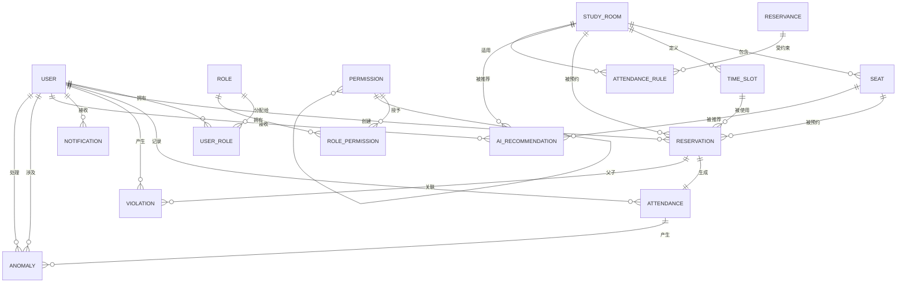

# 校园自习室预约系统 - 数据库设计文档

## 文档信息

| 项目 | 内容 |
|------|------|
| 项目名称 | 校园自习室预约系统（Campus Study Room Reservation System） |
| 文档版本 | V1.0 |
| 编写日期 | 2026年6月 |
| 编写团队 | CampusStudio |
| 文档密级 | 内部公开 |
| 审阅状态 | 已通过 |

---

## 目录

1. [引言](#1-引言)
2. [数据库选型与设计原则](#2-数据库选型与设计原则)
3. [概念结构设计（ER 模型）](#3-概念结构设计er-模型)
4. [逻辑结构设计 — 数据表详细设计](#4-逻辑结构设计--数据表详细设计)
5. [索引设计](#5-索引设计)
6. [国产化适配说明](#6-国产化适配说明)
7. [数据安全与备份](#7-数据安全与备份)
8. [附录](#8-附录)

---

## 1 引言

### 1.1 编写目的

本文档是《校园自习室预约系统》的数据库设计文档，旨在全面、准确地描述系统数据库的逻辑结构、物理结构、索引策略及国产化适配方案。本文档作为系统开发、测试、运维及数据库迁移工作的核心依据，面向项目团队成员、数据库管理员（DBA）、指导教师及评审人员。

本文档详细定义了系统中18张数据表的结构、字段含义、约束条件、索引策略及表间关系，同时涵盖了MySQL 8.0与达梦8（DM8）双数据库的适配方案，确保系统在信创环境下的平稳运行。

### 1.2 适用范围

本文档适用于以下场景：

- 数据库开发人员进行建表、索引创建及存储过程编写
- 后端开发人员进行ORM映射及SQL语句编写
- 测试人员进行数据准备及测试环境搭建
- 运维人员进行数据库备份、迁移及性能调优
- 信创适配人员进行达梦8数据库的迁移与验证

### 1.3 术语表

| 术语 | 英文 | 定义 |
|------|------|------|
| 逻辑删除 | Soft Delete | 通过deleted标记字段实现数据删除，不实际删除物理记录 |
| 审计字段 | Audit Fields | 记录数据创建时间、更新时间等元信息的字段 |
| RBAC | Role-Based Access Control | 基于角色的访问控制模型 |
| 主键 | Primary Key | 唯一标识表中每条记录的字段 |
| 外键 | Foreign Key | 建立表与表之间关联关系的字段约束 |
| 复合索引 | Composite Index | 由多个字段组合而成的索引 |
| 自增主键 | Auto Increment | 数据库自动生成的递增主键值 |
| 达梦8 | DM8 | 达梦数据库管理系统第8版，国产信创数据库 |
| 信创 | Xinchuang | 信息技术应用创新，指国产化替代 |
| ENUM | Enumeration | 枚举类型，限定字段取值范围 |
| JSON | JavaScript Object Notation | 轻量级数据交换格式，MySQL 8.0原生支持 |
| CLOB | Character Large Object | 字符大对象，用于存储大文本数据 |
| 3NF | Third Normal Form | 第三范式，数据库设计规范化标准 |
| 分布式锁 | Distributed Lock | 在分布式环境下保证互斥访问的机制 |
| TPS | Transactions Per Second | 每秒事务处理量 |

---

## 2 数据库选型与设计原则

### 2.1 MySQL 8.0 选型理由

MySQL 8.0 作为系统的主数据库，选型理由如下：

1. **成熟稳定**：MySQL 8.0 经过多年生产环境验证，具有极高的稳定性和可靠性，社区活跃，文档完善。
2. **性能优异**：InnoDB 存储引擎支持行级锁、MVCC（多版本并发控制），高并发场景下性能表现优异，满足系统 ≥400 TPS 的性能需求。
3. **JSON 原生支持**：MySQL 8.0 原生支持 JSON 数据类型及 JSON 函数，便于存储和查询 `study_preferences`、`facilities` 等半结构化数据。
4. **UTF8MB4 字符集**：完整支持 Unicode（包括 Emoji），满足校园场景下多样化的文本存储需求。
5. **生态丰富**：Spring Boot、MyBatis-Plus、ShardingSphere 等框架对 MySQL 支持完善，开发效率高。
6. **云原生友好**：各大云厂商（阿里云、腾讯云、华为云）均提供托管 MySQL 服务，便于云上部署。

### 2.2 国产化适配：达梦8（DM8）选型理由

达梦8 作为系统的国产化适配数据库，选型理由如下：

1. **信创合规**：达梦数据库是国产信创生态的核心组件，满足高校及政府机构的信息技术应用创新要求。
2. **高度兼容**：DM8 语法与 MySQL 高度兼容，支持 AUTO_INCREMENT、VARCHAR、DATETIME 等常用语法，迁移成本低。
3. **性能优化**：DM8 支持表级压缩（COMPRESS=1）、列存储、并行查询等特性，在大数据量场景下性能优异。
4. **安全增强**：支持国密算法（SM2/SM3/SM4）加密、三权分立、审计日志等企业级安全特性。
5. **企业支持**：达梦公司提供专业的技术支持与培训服务，保障生产环境稳定运行。

### 2.3 MySQL 与 达梦8 的差异处理

#### 2.3.1 数据类型映射

| MySQL 类型 | 达梦8 对应类型 | 说明 |
|-----------|--------------|------|
| BIGINT | BIGINT | 大整数，完全一致 |
| VARCHAR(n) | VARCHAR(n) | 变长字符串，完全一致 |
| INT | INT | 整数，完全一致 |
| TINYINT | TINYINT | 小整数，完全一致 |
| DATETIME | DATETIME | 日期时间，完全一致 |
| DATE | DATE | 日期，完全一致 |
| TIME | TIME | 时间，完全一致 |
| DECIMAL(p,s) | DECIMAL(p,s) | 定点数，完全一致 |
| BOOLEAN | BOOLEAN | 布尔值，完全一致 |
| JSON | CLOB | MySQL 原生 JSON → DM8 使用 CLOB 存储 JSON 文本 |
| TEXT | CLOB | 大文本，DM8 使用 CLOB |
| ENUM | VARCHAR | MySQL ENUM → DM8 使用 VARCHAR + 应用层校验 |
| AUTO_INCREMENT | IDENTITY / AUTO_INCREMENT | DM8 同时支持两种语法 |
| ENGINE=InnoDB | 无（DM8 默认存储引擎） | DM8 无需指定存储引擎 |
| CHARSET=utf8mb4 | 无（DM8 默认 UTF-8） | DM8 默认支持 UTF-8 |

#### 2.3.2 自增主键差异

MySQL 使用 `AUTO_INCREMENT` 修饰主键：

```sql
CREATE TABLE user (
    user_id BIGINT PRIMARY KEY AUTO_INCREMENT,
    ...
);
```

达梦8 同时支持 `AUTO_INCREMENT` 和 `IDENTITY` 两种语法，本系统采用与 MySQL 一致的 `AUTO_INCREMENT` 写法，降低迁移成本。

#### 2.3.3 分页语法差异

| 场景 | MySQL 语法 | 达梦8 语法 |
|------|-----------|-----------|
| 简单分页 | `LIMIT offset, count` | `LIMIT offset, count`（兼容）或 `OFFSET offset FETCH count` |
| 排序分页 | `ORDER BY x LIMIT 10, 20` | `ORDER BY x LIMIT 10, 20`（兼容） |

达梦8 对 MySQL 的 `LIMIT` 语法提供了兼容支持，应用层无需修改分页 SQL。

#### 2.3.4 关键字与保留字差异

达梦8 中部分关键字与 MySQL 存在差异，需要特别注意：

| 关键字 | MySQL | 达梦8 | 处理方案 |
|--------|-------|-------|---------|
| USER | 非保留字 | 保留字 | 表名使用反引号（MySQL）或双引号（DM8）包裹 |
| ROLE | 非保留字 | 保留字 | 同上，使用引号包裹 |
| COMMENT | 非保留字 | 保留字 | 使用引号包裹或避免作为字段名 |

本系统中 `user`、`role` 表名在达梦8 中需使用双引号包裹，或通过 MyBatis 配置自动处理。

#### 2.3.5 表注释差异

MySQL 在 CREATE TABLE 语句中通过 `COMMENT='...'` 指定表注释：

```sql
CREATE TABLE user (...) ENGINE=InnoDB COMMENT='用户表';
```

达梦8 使用独立的 `COMMENT ON TABLE` 语句：

```sql
CREATE TABLE user (...) COMPRESS=1;
COMMENT ON TABLE user IS '用户表';
```

#### 2.3.6 更新时间自动刷新差异

MySQL 支持 `ON UPDATE CURRENT_TIMESTAMP` 自动刷新更新时间：

```sql
update_time DATETIME NOT NULL DEFAULT CURRENT_TIMESTAMP ON UPDATE CURRENT_TIMESTAMP
```

达梦8 不原生支持 `ON UPDATE CURRENT_TIMESTAMP`，需要通过触发器或应用层代码实现自动更新。本系统采用 MyBatis-Plus 的 `@TableField(fill = FieldFill.UPDATE)` 注解在应用层统一处理，兼容双数据库。

#### 2.3.7 枚举类型差异

MySQL 支持 `ENUM` 类型：

```sql
status ENUM('PENDING', 'CONFIRMED', 'CANCELLED', ...) NOT NULL DEFAULT 'PENDING'
```

达梦8 不原生支持 `ENUM` 类型，使用 `VARCHAR` 替代，并在应用层通过枚举类进行校验：

```sql
status VARCHAR(20) NOT NULL DEFAULT 'PENDING' COMMENT '状态'
```

### 2.4 设计范式

本系统数据库设计遵循 **第三范式（3NF）**，具体原则如下：

1. **第一范式（1NF）**：所有字段原子不可分，不存在重复组或多值属性。例如 `facilities` 字段虽使用 JSON 存储，但内部结构为键值对，在应用层解析为原子字段使用。
2. **第二范式（2NF）**：所有非主键字段完全依赖于主键，不存在部分依赖。例如 `reservation` 表中的 `user_id`、`room_id`、`seat_id` 均直接依赖于 `reservation_id`。
3. **第三范式（3NF）**：不存在传递依赖。例如 `seat` 表中的 `room_id` 直接关联自习室，自习室的 `building`、`floor` 信息不冗余存储在座位表中，通过 JOIN 查询获取。

**反范式设计**：在部分高频查询场景下，允许适当的冗余以提升查询性能。例如 `reservation` 表中的 `reservation_date` 字段为 `reserve_date` + `start_time` 的冗余，便于按日期时间范围查询。

### 2.5 命名规范

#### 2.5.1 表命名规范

- 采用 **小写字母 + 下划线** 命名法（snake_case）
- 表名使用 **名词单数形式**
- 关联表命名：`主表_从表` 或采用描述性命名
- 示例：`user`、`role`、`user_role`、`reservation`、`ai_recommendation`

#### 2.5.2 字段命名规范

- 采用 **小写字母 + 下划线** 命名法
- 主键命名：`表名_id`（如 `user_id`、`room_id`）
- 外键命名：引用表的主键名（如 `user_id` 引用 `user.user_id`）
- 布尔字段：以 `is_`、`has_` 开头（如 `is_active`、`has_power`、`is_read`）
- 时间字段：`create_time`、`update_time`、`check_in_time`
- 状态字段：`status`

#### 2.5.3 索引命名规范

- 主键索引：`PRIMARY`（数据库默认）
- 唯一索引：`uk_字段名`（Unique Key）
- 普通索引：`idx_字段名`（Index）
- 复合索引：`idx_字段1_字段2`

### 2.6 字段规范

#### 2.6.1 通用字段规范

所有业务表均包含以下审计字段和逻辑删除字段：

| 字段名 | 类型 | 说明 |
|--------|------|------|
| `create_time` | DATETIME NOT NULL DEFAULT CURRENT_TIMESTAMP | 记录创建时间 |
| `update_time` | DATETIME NOT NULL DEFAULT CURRENT_TIMESTAMP | 记录更新时间 |
| `deleted` | TINYINT NOT NULL DEFAULT 0 | 逻辑删除标记（0-未删除，1-已删除） |

#### 2.6.2 主键规范

- 所有表必须定义主键
- 主键类型统一使用 `BIGINT`，支持未来数据量增长
- 主键生成方式：数据库自增（AUTO_INCREMENT）
- 禁止使用业务字段作为主键（如学号、手机号可能变更）

#### 2.6.3 字段类型选择原则

| 数据类型 | 适用场景 | 示例 |
|---------|---------|------|
| BIGINT | 主键、外键、大整数 | user_id, room_id |
| INT | 计数、排序、小整数 | capacity, view_count, sort |
| TINYINT | 状态标记、布尔值 | status, deleted, is_active |
| VARCHAR(n) | 变长字符串，长度确定 | username(50), email(100) |
| DECIMAL(p,s) | 精确小数（金额、分数） | score(10,2), confidence(5,2) |
| DATETIME | 日期时间 | create_time, check_in_time |
| DATE | 纯日期 | reserve_date |
| TIME | 纯时间 | start_time, end_time |
| JSON/CLOB | 半结构化数据 | study_preferences, facilities |
| TEXT/CLOB | 大文本 | content, reason |

### 2.7 逻辑删除设计

本系统所有业务表均采用 **逻辑删除** 机制，通过 `deleted` 字段实现：

- `deleted = 0`：记录有效，正常参与查询
- `deleted = 1`：记录已删除，默认查询中过滤

**实现方式**：
- MyBatis-Plus 全局配置 `logic-delete-field: deleted` 和 `logic-delete-value: 1`
- 所有查询自动追加 `WHERE deleted = 0` 条件
- 删除操作实际执行 UPDATE 语句，将 `deleted` 置为 1

**优势**：
- 数据可恢复，避免误删造成的数据丢失
- 保留历史数据，便于审计和数据分析
- 关联数据可通过外键约束保持完整性

### 2.8 审计字段设计

所有业务表均包含 `create_time` 和 `update_time` 审计字段：

- `create_time`：记录数据首次插入时间，不可修改
- `update_time`：记录数据最后修改时间，每次更新自动刷新

**实现方式**：
- MySQL：使用 `DEFAULT CURRENT_TIMESTAMP` 和 `ON UPDATE CURRENT_TIMESTAMP`
- 达梦8：通过 MyBatis-Plus 的 `@TableField` 注解在应用层自动填充
- 代码层：使用 `MetaObjectHandler` 统一处理填充逻辑

---

## 3 概念结构设计（ER 模型）

### 3.1 核心实体关系图



### 3.2 实体关系说明

#### 3.2.1 用户权限模块实体关系

| 关系 | 实体A | 实体B | 关系类型 | 说明 |
|------|-------|-------|---------|------|
| 用户-角色 | user | role | 多对多（通过 user_role） | 一个用户可拥有多个角色，一个角色可分配给多个用户 |
| 角色-权限 | role | permission | 多对多（通过 role_permission） | 一个角色可拥有多个权限，一个权限可授予多个角色 |
| 权限-权限 | permission | permission | 一对多（自关联） | 权限支持父子层级结构，parent_id 指向父权限 |

#### 3.2.2 自习室座位模块实体关系

| 关系 | 实体A | 实体B | 关系类型 | 说明 |
|------|-------|-------|---------|------|
| 自习室-座位 | study_room | seat | 一对多 | 一个自习室包含多个座位，一个座位属于一个自习室 |
| 自习室-时间段 | study_room | time_slot | 一对多 | 一个自习室定义多个时间段模板 |
| 自习室-考勤规则 | study_room | attendance_rule | 一对多（可选） | 一个自习室可有特定考勤规则，NULL 表示全局规则 |

#### 3.2.3 预约考勤模块实体关系

| 关系 | 实体A | 实体B | 关系类型 | 说明 |
|------|-------|-------|---------|------|
| 用户-预约 | user | reservation | 一对多 | 一个用户可创建多个预约 |
| 自习室-预约 | study_room | reservation | 一对多 | 一个自习室可被多次预约 |
| 座位-预约 | seat | reservation | 一对多 | 一个座位可被多次预约（不同时间） |
| 时间段-预约 | time_slot | reservation | 一对多 | 一个时间段可被多次预约 |
| 预约-考勤 | reservation | attendance | 一对一 | 一个预约对应一条考勤记录 |
| 用户-考勤 | user | attendance | 一对多 | 一个用户有多条考勤记录 |

#### 3.2.4 违规通知模块实体关系

| 关系 | 实体A | 实体B | 关系类型 | 说明 |
|------|-------|-------|---------|------|
| 用户-违规 | user | violation | 一对多 | 一个用户可产生多条违规记录 |
| 预约-违规 | reservation | violation | 一对多 | 一个预约可关联多条违规记录 |
| 用户-通知 | user | notification | 一对多 | 一个用户接收多条通知 |

#### 3.2.5 AI模块实体关系

| 关系 | 实体A | 实体B | 关系类型 | 说明 |
|------|-------|-------|---------|------|
| 用户-AI推荐 | user | ai_recommendation | 一对多 | 一个用户接收多条推荐记录 |
| 自习室-AI推荐 | study_room | ai_recommendation | 一对多 | 一个自习室被多次推荐 |
| 座位-AI推荐 | seat | ai_recommendation | 一对多 | 一个座位被多次推荐 |
| 考勤-异常 | attendance | anomaly | 一对多 | 一条考勤记录可产生多个异常 |
| 用户-异常 | user | anomaly | 一对多 | 一个用户可涉及多个异常 |
| 用户-异常处理 | user | anomaly | 一对多 | 一个管理员可处理多个异常 |

---

## 4 逻辑结构设计 — 数据表详细设计

### 4.1 用户权限模块

#### 4.1.1 用户表（user）

**表说明**：存储系统用户信息，包括学生、管理员、超级管理员三种角色。采用RBAC权限模型，用户通过 `user_role` 关联表与角色建立多对多关系。

| 字段名 | 类型（MySQL） | 是否为空 | 键 | 默认值 | 说明 |
|--------|-------------|---------|-----|--------|------|
| user_id | BIGINT | NOT NULL | PK | AUTO_INCREMENT | 用户主键，自增 |
| username | VARCHAR(50) | NOT NULL | UK | - | 用户名，唯一 |
| password | VARCHAR(100) | NOT NULL | - | - | 密码，BCrypt加密存储 |
| real_name | VARCHAR(50) | NOT NULL | - | - | 真实姓名 |
| student_no | VARCHAR(20) | NOT NULL | UK | - | 学号，唯一 |
| email | VARCHAR(100) | NULL | - | - | 邮箱 |
| phone | VARCHAR(20) | NULL | - | - | 手机号 |
| avatar | VARCHAR(255) | NULL | - | - | 头像URL |
| role | VARCHAR(20) | NOT NULL | - | - | 角色（student/admin/super_admin） |
| status | TINYINT | NOT NULL | - | 1 | 状态（1-正常，0-禁用） |
| study_preferences | JSON | NULL | - | - | 学习偏好（JSON格式） |
| create_time | DATETIME | NOT NULL | - | CURRENT_TIMESTAMP | 创建时间 |
| update_time | DATETIME | NOT NULL | - | CURRENT_TIMESTAMP | 更新时间 |
| deleted | TINYINT | NOT NULL | - | 0 | 删除标记（0-未删除，1-已删除） |

**主要索引**：

| 索引名 | 类型 | 字段 | 说明 |
|--------|------|------|------|
| PRIMARY | 主键 | user_id | 唯一标识用户 |
| uk_username | 唯一 | username | 用户名唯一约束 |
| uk_student_no | 唯一 | student_no | 学号唯一约束 |
| idx_username | 普通 | username | 按用户名查询 |
| idx_student_no | 普通 | student_no | 按学号查询 |
| idx_email | 普通 | email | 按邮箱查询 |
| idx_role | 普通 | role | 按角色筛选 |
| idx_status | 普通 | status | 按状态筛选 |
| idx_create_time | 普通 | create_time | 按创建时间排序 |

---

#### 4.1.2 角色表（role）

**表说明**：存储系统角色定义，支持学生、管理员、超级管理员三种预定义角色。角色通过 `role_permission` 关联表与权限建立多对多关系。

| 字段名 | 类型（MySQL） | 是否为空 | 键 | 默认值 | 说明 |
|--------|-------------|---------|-----|--------|------|
| role_id | BIGINT | NOT NULL | PK | AUTO_INCREMENT | 角色主键，自增 |
| role_name | VARCHAR(50) | NOT NULL | - | - | 角色名称 |
| role_key | VARCHAR(50) | NOT NULL | UK | - | 角色标识，唯一 |
| description | VARCHAR(200) | NULL | - | - | 角色描述 |
| status | TINYINT | NOT NULL | - | 1 | 状态（1-正常，0-禁用） |
| create_time | DATETIME | NOT NULL | - | CURRENT_TIMESTAMP | 创建时间 |
| update_time | DATETIME | NOT NULL | - | CURRENT_TIMESTAMP | 更新时间 |
| deleted | TINYINT | NOT NULL | - | 0 | 删除标记 |

**主要索引**：

| 索引名 | 类型 | 字段 | 说明 |
|--------|------|------|------|
| PRIMARY | 主键 | role_id | 唯一标识角色 |
| uk_role_key | 唯一 | role_key | 角色标识唯一约束 |
| idx_role_key | 普通 | role_key | 按角色标识查询 |
| idx_status | 普通 | status | 按状态筛选 |

---

#### 4.1.3 权限表（permission）

**表说明**：存储系统权限定义，支持菜单权限和按钮权限两种类型。采用树形结构，通过 `parent_id` 实现权限层级关系。

| 字段名 | 类型（MySQL） | 是否为空 | 键 | 默认值 | 说明 |
|--------|-------------|---------|-----|--------|------|
| permission_id | BIGINT | NOT NULL | PK | AUTO_INCREMENT | 权限主键，自增 |
| permission_name | VARCHAR(50) | NOT NULL | - | - | 权限名称 |
| permission_key | VARCHAR(50) | NOT NULL | UK | - | 权限标识，唯一 |
| permission_type | VARCHAR(20) | NOT NULL | - | - | 权限类型（menu/button） |
| parent_id | BIGINT | NOT NULL | - | 0 | 父权限ID，0表示根节点 |
| path | VARCHAR(200) | NULL | - | - | 路由路径 |
| component | VARCHAR(200) | NULL | - | - | 组件路径 |
| icon | VARCHAR(50) | NULL | - | - | 图标 |
| sort | INT | NOT NULL | - | 0 | 排序号 |
| status | TINYINT | NOT NULL | - | 1 | 状态（1-正常，0-禁用） |
| create_time | DATETIME | NOT NULL | - | CURRENT_TIMESTAMP | 创建时间 |
| update_time | DATETIME | NOT NULL | - | CURRENT_TIMESTAMP | 更新时间 |
| deleted | TINYINT | NOT NULL | - | 0 | 删除标记 |

**主要索引**：

| 索引名 | 类型 | 字段 | 说明 |
|--------|------|------|------|
| PRIMARY | 主键 | permission_id | 唯一标识权限 |
| uk_permission_key | 唯一 | permission_key | 权限标识唯一约束 |
| idx_permission_key | 普通 | permission_key | 按权限标识查询 |
| idx_parent_id | 普通 | parent_id | 按父权限查询子权限 |
| idx_status | 普通 | status | 按状态筛选 |

---

#### 4.1.4 用户角色关联表（user_role）

**表说明**：用户与角色的多对多关联表，实现RBAC模型中用户与角色的映射关系。

| 字段名 | 类型（MySQL） | 是否为空 | 键 | 默认值 | 说明 |
|--------|-------------|---------|-----|--------|------|
| id | BIGINT | NOT NULL | PK | AUTO_INCREMENT | 关联主键，自增 |
| user_id | BIGINT | NOT NULL | FK | - | 用户ID，外键关联user表 |
| role_id | BIGINT | NOT NULL | FK | - | 角色ID，外键关联role表 |
| create_time | DATETIME | NOT NULL | - | CURRENT_TIMESTAMP | 创建时间 |

**主要索引**：

| 索引名 | 类型 | 字段 | 说明 |
|--------|------|------|------|
| PRIMARY | 主键 | id | 唯一标识关联记录 |
| idx_user_id | 普通 | user_id | 按用户查询角色 |
| idx_role_id | 普通 | role_id | 按角色查询用户 |
| fk_user_id | 外键 | user_id → user(user_id) | 级联删除 |
| fk_role_id | 外键 | role_id → role(role_id) | 级联删除 |

---

#### 4.1.5 角色权限关联表（role_permission）

**表说明**：角色与权限的多对多关联表，实现RBAC模型中角色与权限的映射关系。

| 字段名 | 类型（MySQL） | 是否为空 | 键 | 默认值 | 说明 |
|--------|-------------|---------|-----|--------|------|
| id | BIGINT | NOT NULL | PK | AUTO_INCREMENT | 关联主键，自增 |
| role_id | BIGINT | NOT NULL | FK | - | 角色ID，外键关联role表 |
| permission_id | BIGINT | NOT NULL | FK | - | 权限ID，外键关联permission表 |
| create_time | DATETIME | NOT NULL | - | CURRENT_TIMESTAMP | 创建时间 |

**主要索引**：

| 索引名 | 类型 | 字段 | 说明 |
|--------|------|------|------|
| PRIMARY | 主键 | id | 唯一标识关联记录 |
| idx_role_id | 普通 | role_id | 按角色查询权限 |
| idx_permission_id | 普通 | permission_id | 按权限查询角色 |
| fk_role_id | 外键 | role_id → role(role_id) | 级联删除 |
| fk_permission_id | 外键 | permission_id → permission(permission_id) | 级联删除 |

---

### 4.2 自习室座位模块

#### 4.2.1 自习室表（study_room）

**表说明**：存储自习室基础信息，包括名称、位置、容量、设施、开放时间等。是系统的核心基础数据表。

| 字段名 | 类型（MySQL） | 是否为空 | 键 | 默认值 | 说明 |
|--------|-------------|---------|-----|--------|------|
| room_id | BIGINT | NOT NULL | PK | AUTO_INCREMENT | 自习室主键，自增 |
| room_name | VARCHAR(100) | NOT NULL | - | - | 自习室名称 |
| building | VARCHAR(50) | NOT NULL | - | - | 教学楼 |
| floor | INT | NOT NULL | - | - | 楼层 |
| capacity | INT | NOT NULL | - | - | 容量（座位总数） |
| current_count | INT | NOT NULL | - | 0 | 当前人数 |
| facilities | JSON | NULL | - | - | 设施信息（JSON格式） |
| open_time | TIME | NOT NULL | - | - | 开放时间 |
| close_time | TIME | NOT NULL | - | - | 关闭时间 |
| status | VARCHAR(20) | NOT NULL | - | 'open' | 状态（open/closed/maintenance） |
| create_time | DATETIME | NOT NULL | - | CURRENT_TIMESTAMP | 创建时间 |
| update_time | DATETIME | NOT NULL | - | CURRENT_TIMESTAMP | 更新时间 |
| deleted | TINYINT | NOT NULL | - | 0 | 删除标记 |

**主要索引**：

| 索引名 | 类型 | 字段 | 说明 |
|--------|------|------|------|
| PRIMARY | 主键 | room_id | 唯一标识自习室 |
| idx_building_floor | 普通 | building, floor | 按教学楼和楼层复合查询 |
| idx_status | 普通 | status | 按状态筛选 |
| idx_create_time | 普通 | create_time | 按创建时间排序 |

---

#### 4.2.2 座位表（seat）

**表说明**：存储自习室座位信息，包括座位编号、类型、位置、电源配置、状态等。每个座位属于一个自习室。

| 字段名 | 类型（MySQL） | 是否为空 | 键 | 默认值 | 说明 |
|--------|-------------|---------|-----|--------|------|
| seat_id | BIGINT | NOT NULL | PK | AUTO_INCREMENT | 座位主键，自增 |
| room_id | BIGINT | NOT NULL | FK | - | 自习室ID，外键关联study_room表 |
| seat_no | VARCHAR(20) | NOT NULL | - | - | 座位编号 |
| seat_type | ENUM | NOT NULL | - | 'NORMAL' | 座位类型（NORMAL/WINDOW/CORNER/DISABLED） |
| position | VARCHAR(100) | NOT NULL | - | - | 位置描述 |
| has_power | BOOLEAN | NOT NULL | - | FALSE | 是否有电源 |
| status | ENUM | NOT NULL | - | 'AVAILABLE' | 状态（AVAILABLE/RESERVED/IN_USE/MAINTAINING） |
| create_time | DATETIME | NOT NULL | - | CURRENT_TIMESTAMP | 创建时间 |
| update_time | DATETIME | NOT NULL | - | CURRENT_TIMESTAMP | 更新时间 |
| deleted | TINYINT | NOT NULL | - | 0 | 删除标记 |

**主要索引**：

| 索引名 | 类型 | 字段 | 说明 |
|--------|------|------|------|
| PRIMARY | 主键 | seat_id | 唯一标识座位 |
| idx_room_id | 普通 | room_id | 按自习室查询座位 |
| idx_seat_no | 普通 | seat_no | 按座位编号查询 |
| idx_status | 普通 | status | 按状态筛选 |
| fk_room_id | 外键 | room_id → study_room(room_id) | 级联删除 |

---

#### 4.2.3 时间段模板表（time_slot）

**表说明**：存储自习室的时间段模板配置，定义每个自习室的开放时间段及最大预约数。每个自习室可配置多个时间段。

| 字段名 | 类型（MySQL） | 是否为空 | 键 | 默认值 | 说明 |
|--------|-------------|---------|-----|--------|------|
| slot_id | BIGINT | NOT NULL | PK | AUTO_INCREMENT | 时间段主键，自增 |
| room_id | BIGINT | NOT NULL | FK | - | 自习室ID，外键关联study_room表 |
| start_time | TIME | NOT NULL | - | - | 开始时间 |
| end_time | TIME | NOT NULL | - | - | 结束时间 |
| max_reservations | INT | NOT NULL | - | 1 | 最大预约数 |
| current_reservations | INT | NOT NULL | - | 0 | 当前预约数 |
| is_active | BOOLEAN | NOT NULL | - | TRUE | 是否启用 |
| create_time | DATETIME | NOT NULL | - | CURRENT_TIMESTAMP | 创建时间 |
| update_time | DATETIME | NOT NULL | - | CURRENT_TIMESTAMP | 更新时间 |

**主要索引**：

| 索引名 | 类型 | 字段 | 说明 |
|--------|------|------|------|
| PRIMARY | 主键 | slot_id | 唯一标识时间段 |
| idx_room_id | 普通 | room_id | 按自习室查询时间段 |
| idx_start_end_time | 普通 | start_time, end_time | 按时间范围查询 |
| fk_room_id | 外键 | room_id → study_room(room_id) | 级联删除 |

---

### 4.3 预约考勤模块

#### 4.3.1 预约表（reservation）

**表说明**：系统的核心业务表，存储学生的座位预约记录。记录用户、自习室、座位、时间段的预约关系，以及签到签退时间和处罚信息。

| 字段名 | 类型（MySQL） | 是否为空 | 键 | 默认值 | 说明 |
|--------|-------------|---------|-----|--------|------|
| reservation_id | BIGINT | NOT NULL | PK | AUTO_INCREMENT | 预约主键，自增 |
| user_id | BIGINT | NOT NULL | FK | - | 用户ID，外键关联user表 |
| room_id | BIGINT | NOT NULL | FK | - | 自习室ID，外键关联study_room表 |
| seat_id | BIGINT | NOT NULL | FK | - | 座位ID，外键关联seat表 |
| slot_id | BIGINT | NOT NULL | FK | - | 时间段ID，外键关联time_slot表 |
| reserve_date | DATE | NOT NULL | - | - | 预约日期 |
| reservation_date | DATETIME | NULL | - | - | 预约日期时间（冗余字段） |
| start_time | TIME | NOT NULL | - | - | 开始时间 |
| end_time | TIME | NOT NULL | - | - | 结束时间 |
| status | ENUM | NOT NULL | - | 'PENDING' | 状态（PENDING/CONFIRMED/CANCELLED/CHECKED_IN/COMPLETED/EXPIRED/VIOLATED） |
| purpose | VARCHAR(200) | NULL | - | - | 预约目的 |
| notes | VARCHAR(500) | NULL | - | - | 备注 |
| qrcode | VARCHAR(255) | NULL | - | - | 二维码 |
| create_time | DATETIME | NOT NULL | - | CURRENT_TIMESTAMP | 创建时间 |
| update_time | DATETIME | NOT NULL | - | CURRENT_TIMESTAMP | 更新时间 |
| check_in_time | DATETIME | NULL | - | - | 签到时间 |
| check_out_time | DATETIME | NULL | - | - | 签退时间 |
| penalty_days | INT | NOT NULL | - | 0 | 处罚天数 |
| violation_id | BIGINT | NULL | - | - | 违规ID |
| deleted | TINYINT | NOT NULL | - | 0 | 删除标记 |

**主要索引**：

| 索引名 | 类型 | 字段 | 说明 |
|--------|------|------|------|
| PRIMARY | 主键 | reservation_id | 唯一标识预约 |
| idx_user_id | 普通 | user_id | 按用户查询预约 |
| idx_room_seat_date | 普通 | room_id, seat_id, reserve_date | 复合索引，查询某座位某日期的预约 |
| idx_reserve_date | 普通 | reserve_date | 按预约日期查询 |
| idx_status | 普通 | status | 按状态筛选 |
| idx_create_time | 普通 | create_time | 按创建时间排序 |
| fk_user_id | 外键 | user_id → user(user_id) | 级联删除 |
| fk_room_id | 外键 | room_id → study_room(room_id) | 级联删除 |
| fk_seat_id | 外键 | seat_id → seat(seat_id) | 级联删除 |
| fk_slot_id | 外键 | slot_id → time_slot(slot_id) | 级联删除 |

---

#### 4.3.2 考勤表（attendance）

**表说明**：存储学生的考勤记录，与预约表一对一关联。记录签到时间、签退时间、学习时长及考勤状态。

| 字段名 | 类型（MySQL） | 是否为空 | 键 | 默认值 | 说明 |
|--------|-------------|---------|-----|--------|------|
| attendance_id | BIGINT | NOT NULL | PK | AUTO_INCREMENT | 考勤主键，自增 |
| reservation_id | BIGINT | NOT NULL | FK | - | 预约ID，外键关联reservation表 |
| user_id | BIGINT | NOT NULL | FK | - | 用户ID，外键关联user表 |
| check_in_time | DATETIME | NULL | - | - | 签到时间 |
| check_out_time | DATETIME | NULL | - | - | 签退时间 |
| duration | INT | NOT NULL | - | 0 | 学习时长（分钟） |
| status | ENUM | NOT NULL | - | 'NORMAL' | 状态（NORMAL/LATE/EARLY_LEAVE/ABSENT） |
| create_time | DATETIME | NOT NULL | - | CURRENT_TIMESTAMP | 创建时间 |
| deleted | TINYINT | NOT NULL | - | 0 | 删除标记 |

**主要索引**：

| 索引名 | 类型 | 字段 | 说明 |
|--------|------|------|------|
| PRIMARY | 主键 | attendance_id | 唯一标识考勤记录 |
| idx_user_id | 普通 | user_id | 按用户查询考勤 |
| idx_reservation_id | 普通 | reservation_id | 按预约查询考勤 |
| idx_create_time | 普通 | create_time | 按创建时间排序 |
| fk_reservation_id | 外键 | reservation_id → reservation(reservation_id) | 级联删除 |
| fk_user_id | 外键 | user_id → user(user_id) | 级联删除 |

---

#### 4.3.3 考勤规则表（attendance_rule）

**表说明**：存储考勤规则配置，支持全局规则和自习室特定规则。管理员可配置签到时间窗口、最大学习时长、延长规则等。

| 字段名 | 类型（MySQL） | 是否为空 | 键 | 默认值 | 说明 |
|--------|-------------|---------|-----|--------|------|
| rule_id | BIGINT | NOT NULL | PK | AUTO_INCREMENT | 规则主键，自增 |
| rule_name | VARCHAR(100) | NOT NULL | - | - | 规则名称 |
| room_id | BIGINT | NULL | FK | - | 适用自习室ID，NULL表示全局规则 |
| start_time | TIME | NULL | - | - | 允许签到开始时间 |
| end_time | TIME | NULL | - | - | 允许签到结束时间 |
| max_duration | INT | NULL | - | - | 最大学习时长（分钟） |
| min_duration | INT | NULL | - | - | 最小时长（分钟） |
| allow_extend | BOOLEAN | NOT NULL | - | FALSE | 是否允许延长 |
| max_extend_times | INT | NOT NULL | - | 0 | 最大延长次数 |
| max_extend_duration | INT | NOT NULL | - | 0 | 最大延长时长（分钟） |
| auto_check_out | BOOLEAN | NOT NULL | - | FALSE | 是否自动签退 |
| check_out_delay | INT | NOT NULL | - | 0 | 自动签退延迟（分钟） |
| status | ENUM | NOT NULL | - | 'active' | 状态（active/inactive） |
| create_time | DATETIME | NOT NULL | - | CURRENT_TIMESTAMP | 创建时间 |
| update_time | DATETIME | NOT NULL | - | CURRENT_TIMESTAMP | 更新时间 |
| deleted | TINYINT | NOT NULL | - | 0 | 删除标记 |

**主要索引**：

| 索引名 | 类型 | 字段 | 说明 |
|--------|------|------|------|
| PRIMARY | 主键 | rule_id | 唯一标识规则 |
| idx_room_id | 普通 | room_id | 按自习室查询规则 |
| idx_status | 普通 | status | 按状态筛选 |

---

### 4.4 违规通知模块

#### 4.4.1 违规记录表（violation）

**表说明**：存储学生的违规记录，包括违规类型、描述、处罚天数、申诉信息等。系统自动检测违规行为并生成记录，支持学生申诉和管理员审核。

| 字段名 | 类型（MySQL） | 是否为空 | 键 | 默认值 | 说明 |
|--------|-------------|---------|-----|--------|------|
| violation_id | BIGINT | NOT NULL | PK | AUTO_INCREMENT | 违规主键，自增 |
| user_id | BIGINT | NOT NULL | FK | - | 用户ID，外键关联user表 |
| reservation_id | BIGINT | NOT NULL | FK | - | 预约ID，外键关联reservation表 |
| type | ENUM | NOT NULL | - | - | 违规类型（NO_SHOW/LATE_CHECK_IN/EARLY_LEAVE/DAMAGE） |
| description | VARCHAR(500) | NOT NULL | - | - | 违规描述 |
| penalty_days | INT | NOT NULL | - | 0 | 处罚天数 |
| status | ENUM | NOT NULL | - | 'PENDING' | 状态（PENDING/APPROVED/REJECTED） |
| appeal_reason | VARCHAR(500) | NULL | - | - | 申诉理由 |
| appeal_status | ENUM | NULL | - | 'PENDING' | 申诉状态（PENDING/APPROVED/REJECTED） |
| create_time | DATETIME | NOT NULL | - | CURRENT_TIMESTAMP | 创建时间 |
| update_time | DATETIME | NOT NULL | - | CURRENT_TIMESTAMP | 更新时间 |
| deleted | TINYINT | NOT NULL | - | 0 | 删除标记 |

**主要索引**：

| 索引名 | 类型 | 字段 | 说明 |
|--------|------|------|------|
| PRIMARY | 主键 | violation_id | 唯一标识违规记录 |
| idx_user_id | 普通 | user_id | 按用户查询违规 |
| idx_reservation_id | 普通 | reservation_id | 按预约查询违规 |
| idx_type | 普通 | type | 按违规类型筛选 |
| idx_status | 普通 | status | 按状态筛选 |
| idx_create_time | 普通 | create_time | 按创建时间排序 |
| fk_user_id | 外键 | user_id → user(user_id) | 级联删除 |
| fk_reservation_id | 外键 | reservation_id → reservation(reservation_id) | 级联删除 |

---

#### 4.4.2 通知记录表（notification）

**表说明**：存储系统通知消息，包括预约确认、超时提醒、违规通知、系统公告等类型。支持已读状态管理。

| 字段名 | 类型（MySQL） | 是否为空 | 键 | 默认值 | 说明 |
|--------|-------------|---------|-----|--------|------|
| notification_id | BIGINT | NOT NULL | PK | AUTO_INCREMENT | 通知主键，自增 |
| user_id | BIGINT | NOT NULL | FK | - | 用户ID，外键关联user表 |
| type | ENUM | NOT NULL | - | - | 通知类型（RESERVE_CONFIRM/TIMEOUT_REMIND/VIOLATION_NOTIFY/SYSTEM_ANNOUNCE） |
| title | VARCHAR(100) | NOT NULL | - | - | 标题 |
| content | TEXT | NOT NULL | - | - | 内容 |
| is_read | BOOLEAN | NOT NULL | - | FALSE | 是否已读 |
| create_time | DATETIME | NOT NULL | - | CURRENT_TIMESTAMP | 创建时间 |
| deleted | TINYINT | NOT NULL | - | 0 | 删除标记 |

**主要索引**：

| 索引名 | 类型 | 字段 | 说明 |
|--------|------|------|------|
| PRIMARY | 主键 | notification_id | 唯一标识通知 |
| idx_user_id | 普通 | user_id | 按用户查询通知 |
| idx_type | 普通 | type | 按类型筛选 |
| idx_is_read | 普通 | is_read | 按已读状态筛选 |
| idx_create_time | 普通 | create_time | 按创建时间排序 |
| fk_user_id | 外键 | user_id → user(user_id) | 级联删除 |

---

### 4.5 AI模块

#### 4.5.1 AI推荐记录表（ai_recommendation）

**表说明**：存储AI智能推荐的结果记录，包括推荐得分、推荐理由、推荐策略及用户是否接受。用于推荐效果追踪和算法优化。

| 字段名 | 类型（MySQL） | 是否为空 | 键 | 默认值 | 说明 |
|--------|-------------|---------|-----|--------|------|
| recommendation_id | BIGINT | NOT NULL | PK | AUTO_INCREMENT | 推荐主键，自增 |
| user_id | BIGINT | NOT NULL | FK | - | 用户ID，外键关联user表 |
| room_id | BIGINT | NOT NULL | FK | - | 自习室ID，外键关联study_room表 |
| seat_id | BIGINT | NOT NULL | FK | - | 座位ID，外键关联seat表 |
| score | DECIMAL(10,2) | NOT NULL | - | - | 推荐得分 |
| reason | TEXT | NULL | - | - | 推荐理由 |
| strategy | VARCHAR(50) | NOT NULL | - | - | 推荐策略 |
| is_accepted | BOOLEAN | NOT NULL | - | FALSE | 是否被接受 |
| create_time | DATETIME | NOT NULL | - | CURRENT_TIMESTAMP | 创建时间 |

**主要索引**：

| 索引名 | 类型 | 字段 | 说明 |
|--------|------|------|------|
| PRIMARY | 主键 | recommendation_id | 唯一标识推荐记录 |
| idx_user_id | 普通 | user_id | 按用户查询推荐 |
| idx_score | 普通 | score | 按推荐得分排序 |
| idx_strategy | 普通 | strategy | 按推荐策略筛选 |
| idx_create_time | 普通 | create_time | 按创建时间排序 |
| fk_user_id | 外键 | user_id → user(user_id) | 级联删除 |
| fk_room_id | 外键 | room_id → study_room(room_id) | 级联删除 |
| fk_seat_id | 外键 | seat_id → seat(seat_id) | 级联删除 |

---

#### 4.5.2 异常分析记录表（anomaly）

**表说明**：存储AI考勤异常分析的结果，包括异常类型、描述、置信度、处理状态等。支持管理员人工复核和处理。

| 字段名 | 类型（MySQL） | 是否为空 | 键 | 默认值 | 说明 |
|--------|-------------|---------|-----|--------|------|
| anomaly_id | BIGINT | NOT NULL | PK | AUTO_INCREMENT | 异常主键，自增 |
| attendance_id | BIGINT | NOT NULL | FK | - | 考勤ID，外键关联attendance表 |
| user_id | BIGINT | NOT NULL | FK | - | 用户ID，外键关联user表 |
| type | ENUM | NOT NULL | - | - | 异常类型（FREQUENT_NO_SHOW/SUSPICIOUS_PATTERN/ABNORMAL_DURATION/PROXY_CHECK_IN） |
| description | TEXT | NOT NULL | - | - | 异常描述 |
| confidence | DECIMAL(5,2) | NOT NULL | - | - | 置信度（0-100） |
| is_handled | BOOLEAN | NOT NULL | - | FALSE | 是否已处理 |
| handled_by | BIGINT | NULL | FK | - | 处理人ID，外键关联user表 |
| handle_time | DATETIME | NULL | - | - | 处理时间 |
| handle_note | TEXT | NULL | - | - | 处理备注 |
| create_time | DATETIME | NOT NULL | - | CURRENT_TIMESTAMP | 创建时间 |

**主要索引**：

| 索引名 | 类型 | 字段 | 说明 |
|--------|------|------|------|
| PRIMARY | 主键 | anomaly_id | 唯一标识异常记录 |
| idx_user_id | 普通 | user_id | 按用户查询异常 |
| idx_type | 普通 | type | 按异常类型筛选 |
| idx_is_handled | 普通 | is_handled | 按处理状态筛选 |
| idx_create_time | 普通 | create_time | 按创建时间排序 |
| fk_attendance_id | 外键 | attendance_id → attendance(attendance_id) | 级联删除 |
| fk_user_id | 外键 | user_id → user(user_id) | 级联删除 |
| fk_handled_by | 外键 | handled_by → user(user_id) | 无级联删除 |

---

#### 4.5.3 知识库表（knowledge_base）

**表说明**：存储RAG智能客服的知识库内容，包括分类、标题、内容、关键词等。支持FAQ问答、规则说明、使用指南等文档的管理。

| 字段名 | 类型（MySQL） | 是否为空 | 键 | 默认值 | 说明 |
|--------|-------------|---------|-----|--------|------|
| knowledge_id | BIGINT | NOT NULL | PK | AUTO_INCREMENT | 知识主键，自增 |
| category | VARCHAR(50) | NOT NULL | - | - | 分类 |
| title | VARCHAR(200) | NOT NULL | - | - | 标题 |
| content | TEXT | NOT NULL | - | - | 内容 |
| keywords | VARCHAR(500) | NULL | - | - | 关键词 |
| is_active | BOOLEAN | NOT NULL | - | TRUE | 是否启用 |
| view_count | INT | NOT NULL | - | 0 | 查看次数 |
| create_time | DATETIME | NOT NULL | - | CURRENT_TIMESTAMP | 创建时间 |
| update_time | DATETIME | NOT NULL | - | CURRENT_TIMESTAMP | 更新时间 |
| deleted | TINYINT | NOT NULL | - | 0 | 删除标记 |

**主要索引**：

| 索引名 | 类型 | 字段 | 说明 |
|--------|------|------|------|
| PRIMARY | 主键 | knowledge_id | 唯一标识知识记录 |
| idx_category | 普通 | category | 按分类查询 |
| idx_keywords | 普通 | keywords | 按关键词搜索 |
| idx_is_active | 普通 | is_active | 按启用状态筛选 |
| idx_create_time | 普通 | create_time | 按创建时间排序 |

---

## 5 索引设计

### 5.1 索引设计总览

本系统共18张表，设计索引总计 **47个**（含主键、唯一索引、普通索引、外键）。索引设计遵循以下原则：

1. **主键索引**：所有表均定义主键，使用 BIGINT 自增类型
2. **唯一索引**：对业务唯一字段（username、student_no、role_key、permission_key）建立唯一约束
3. **普通索引**：对高频查询条件、排序字段、关联字段建立普通索引
4. **复合索引**：对多条件组合查询场景建立复合索引，遵循最左前缀原则
5. **外键索引**：所有外键字段自动建立索引，支持级联删除和关联查询

### 5.2 关键表索引设计详解

#### 5.2.1 user 表索引设计

| 索引名 | 类型 | 字段 | 设计理由 |
|--------|------|------|---------|
| PRIMARY | 主键 | user_id | 唯一标识用户，所有关联表的外键引用 |
| uk_username | 唯一 | username | 用户名唯一，登录时按用户名查询 |
| uk_student_no | 唯一 | student_no | 学号唯一，注册时校验学号是否已存在 |
| idx_username | 普通 | username | 登录接口高频查询，覆盖用户名密码校验 |
| idx_student_no | 普通 | student_no | 学生信息查询、按学号检索 |
| idx_email | 普通 | email | 找回密码时按邮箱查询 |
| idx_role | 普通 | role | 按角色筛选用户列表（管理员查看学生） |
| idx_status | 普通 | status | 过滤禁用用户，登录时校验用户状态 |
| idx_create_time | 普通 | create_time | 用户列表按注册时间排序 |

#### 5.2.2 reservation 表索引设计

| 索引名 | 类型 | 字段 | 设计理由 |
|--------|------|------|---------|
| PRIMARY | 主键 | reservation_id | 唯一标识预约 |
| idx_user_id | 普通 | user_id | 学生查询"我的预约"高频场景 |
| idx_room_seat_date | 复合 | room_id, seat_id, reserve_date | **核心复合索引**：预约冲突检测时，需查询某座位某日期的所有预约，避免重复预约 |
| idx_reserve_date | 普通 | reserve_date | 按日期查询预约统计、日预约量分析 |
| idx_status | 普通 | status | 按状态筛选（查询待签到、已完成等） |
| idx_create_time | 普通 | create_time | 预约列表按创建时间排序 |

**idx_room_seat_date 复合索引说明**：

该复合索引是预约冲突检测的核心索引。当学生创建预约时，系统需要检查 `room_id` + `seat_id` + `reserve_date` 的组合是否已存在冲突预约。复合索引的三个字段顺序遵循最左前缀原则：

- 第一列 `room_id`：先按自习室过滤，缩小范围
- 第二列 `seat_id`：再按座位过滤，精确定位
- 第三列 `reserve_date`：最后按日期过滤，确定冲突

该索引同时支持以下查询模式：
- `WHERE room_id = ?`（查询某自习室所有预约）
- `WHERE room_id = ? AND seat_id = ?`（查询某座位所有预约）
- `WHERE room_id = ? AND seat_id = ? AND reserve_date = ?`（精确冲突检测）

#### 5.2.3 seat 表索引设计

| 索引名 | 类型 | 字段 | 设计理由 |
|--------|------|------|---------|
| PRIMARY | 主键 | seat_id | 唯一标识座位 |
| idx_room_id | 普通 | room_id | 查询某自习室的所有座位，座位图展示高频场景 |
| idx_seat_no | 普通 | seat_no | 按座位编号查询 |
| idx_status | 普通 | status | 筛选可用座位，预约时排除已占用座位 |

#### 5.2.4 attendance 表索引设计

| 索引名 | 类型 | 字段 | 设计理由 |
|--------|------|------|---------|
| PRIMARY | 主键 | attendance_id | 唯一标识考勤记录 |
| idx_user_id | 普通 | user_id | 学生查询"我的考勤"高频场景 |
| idx_reservation_id | 普通 | reservation_id | 按预约查询考勤详情 |
| idx_create_time | 普通 | create_time | 考勤记录按时间排序 |

#### 5.2.5 violation 表索引设计

| 索引名 | 类型 | 字段 | 设计理由 |
|--------|------|------|---------|
| PRIMARY | 主键 | violation_id | 唯一标识违规记录 |
| idx_user_id | 普通 | user_id | 学生查询"我的违规"、管理员查看用户违规历史 |
| idx_reservation_id | 普通 | reservation_id | 按预约关联查询违规 |
| idx_type | 普通 | type | 按违规类型统计（如统计未签到次数） |
| idx_status | 普通 | status | 筛选待审核违规记录 |
| idx_create_time | 普通 | create_time | 违规记录按时间排序 |

#### 5.2.6 notification 表索引设计

| 索引名 | 类型 | 字段 | 设计理由 |
|--------|------|------|---------|
| PRIMARY | 主键 | notification_id | 唯一标识通知 |
| idx_user_id | 普通 | user_id | 查询用户通知列表高频场景 |
| idx_type | 普通 | type | 按通知类型筛选 |
| idx_is_read | 普通 | is_read | 查询未读通知数量（消息红点提示） |
| idx_create_time | 普通 | create_time | 通知列表按时间排序 |

**idx_is_read 索引说明**：

该索引用于高频的"未读消息数"查询场景。用户每次进入系统时，前端需要显示未读消息红点提示，查询条件为 `WHERE user_id = ? AND is_read = FALSE`。`idx_user_id` 和 `idx_is_read` 的组合可有效支持该查询。

#### 5.2.7 ai_recommendation 表索引设计

| 索引名 | 类型 | 字段 | 设计理由 |
|--------|------|------|---------|
| PRIMARY | 主键 | recommendation_id | 唯一标识推荐记录 |
| idx_user_id | 普通 | user_id | 查询用户的推荐历史 |
| idx_score | 普通 | score | 按推荐得分排序，取Top-N推荐 |
| idx_strategy | 普通 | strategy | 按推荐策略分析效果（协同过滤 vs 内容过滤） |
| idx_create_time | 普通 | create_time | 推荐记录按时间排序 |

#### 5.2.8 anomaly 表索引设计

| 索引名 | 类型 | 字段 | 设计理由 |
|--------|------|------|---------|
| PRIMARY | 主键 | anomaly_id | 唯一标识异常记录 |
| idx_user_id | 普通 | user_id | 查询用户关联的异常记录 |
| idx_type | 普通 | type | 按异常类型统计分布 |
| idx_is_handled | 普通 | is_handled | 筛选待处理异常（管理员工作台） |
| idx_create_time | 普通 | create_time | 异常记录按时间排序 |

### 5.3 索引优化建议

1. **定期分析**：使用 `ANALYZE TABLE` 定期更新索引统计信息，确保查询优化器选择最优执行计划
2. **慢查询监控**：开启慢查询日志（`slow_query_log`），监控执行时间超过250ms的SQL
3. **索引覆盖**：对于高频查询，尽量设计覆盖索引（Covering Index），减少回表操作
4. **避免过度索引**：单表索引数量控制在5-8个以内，避免写入性能下降
5. **定期清理**：对 `notification` 等数据量增长快的表，定期归档历史数据，保持索引效率

---

## 6 国产化适配说明

### 6.1 MySQL → 达梦8 迁移要点

本系统同时支持 MySQL 8.0 和达梦8（DM8）两种数据库，通过 MyBatis 多数据源配置实现动态切换。以下是迁移过程中的关键适配要点：

#### 6.1.1 数据类型适配

| MySQL 类型 | 达梦8 类型 | 适配说明 |
|-----------|-----------|---------|
| JSON | CLOB | DM8 无原生 JSON 类型，使用 CLOB 存储 JSON 文本，应用层解析 |
| ENUM | VARCHAR | DM8 无 ENUM 类型，使用 VARCHAR 替代，应用层枚举校验 |
| TEXT | CLOB | DM8 使用 CLOB 存储大文本 |
| AUTO_INCREMENT | AUTO_INCREMENT | DM8 兼容 MySQL 语法 |

#### 6.1.2 语法差异适配

| 特性 | MySQL | 达梦8 | 适配方案 |
|------|-------|-------|---------|
| 表注释 | `COMMENT='...'` | `COMMENT ON TABLE` | 分别编写建表脚本 |
| 字段注释 | `COMMENT '...'` | `COMMENT '...'`（兼容） | 统一使用 COMMENT 语法 |
| 存储引擎 | `ENGINE=InnoDB` | 无需指定 | DM8 脚本中移除 ENGINE 子句 |
| 字符集 | `CHARSET=utf8mb4` | 无需指定 | DM8 默认 UTF-8，脚本中移除 |
| 更新时间自动刷新 | `ON UPDATE CURRENT_TIMESTAMP` | 不支持 | 应用层 MyBatis-Plus 自动填充 |
| 表压缩 | 不支持 | `COMPRESS=1` | DM8 脚本中增加压缩配置 |
| 分页 | `LIMIT offset, count` | `LIMIT offset, count`（兼容） | 语法一致，无需修改 |

#### 6.1.3 应用层适配

1. **数据源配置**：Spring Boot 配置文件中通过 `spring.profiles.active` 切换 MySQL / DM8 数据源
2. **MyBatis 动态 SQL**：使用 MyBatis 的 `<if>` 标签处理数据库差异（如 JSON 函数）
3. **枚举校验**：应用层定义枚举类，替代数据库 ENUM 约束
4. **时间戳自动更新**：通过 MyBatis-Plus 的 `MetaObjectHandler` 统一处理 `update_time` 填充
5. **JSON 处理**：MySQL 使用原生 JSON 函数，DM8 使用应用层 JSON 库（Jackson/Gson）解析

### 6.2 建表语句对比示例

#### 示例一：用户表（user）

**MySQL 8.0 版本：**

```sql
CREATE TABLE user (
    user_id BIGINT PRIMARY KEY AUTO_INCREMENT,
    username VARCHAR(50) NOT NULL UNIQUE COMMENT '用户名',
    password VARCHAR(100) NOT NULL COMMENT '密码(加密存储)',
    real_name VARCHAR(50) NOT NULL COMMENT '真实姓名',
    student_no VARCHAR(20) NOT NULL UNIQUE COMMENT '学号',
    email VARCHAR(100) COMMENT '邮箱',
    phone VARCHAR(20) COMMENT '手机号',
    avatar VARCHAR(255) COMMENT '头像URL',
    role VARCHAR(20) NOT NULL COMMENT '角色(student/admin/super_admin)',
    status TINYINT NOT NULL DEFAULT 1 COMMENT '状态(1-正常 0-禁用)',
    study_preferences JSON COMMENT '学习偏好(JSON格式)',
    create_time DATETIME NOT NULL DEFAULT CURRENT_TIMESTAMP,
    update_time DATETIME NOT NULL DEFAULT CURRENT_TIMESTAMP ON UPDATE CURRENT_TIMESTAMP,
    deleted TINYINT NOT NULL DEFAULT 0 COMMENT '删除标记(0-未删除 1-已删除)',
    INDEX idx_username (username),
    INDEX idx_student_no (student_no),
    INDEX idx_email (email),
    INDEX idx_role (role),
    INDEX idx_status (status),
    INDEX idx_create_time (create_time)
) ENGINE=InnoDB DEFAULT CHARSET=utf8mb4 COMMENT='用户表';
```

**达梦8 版本：**

```sql
CREATE TABLE user (
    user_id BIGINT PRIMARY KEY AUTO_INCREMENT,
    username VARCHAR(50) NOT NULL UNIQUE COMMENT '用户名',
    password VARCHAR(100) NOT NULL COMMENT '密码(加密存储)',
    real_name VARCHAR(50) NOT NULL COMMENT '真实姓名',
    student_no VARCHAR(20) NOT NULL UNIQUE COMMENT '学号',
    email VARCHAR(100) COMMENT '邮箱',
    phone VARCHAR(20) COMMENT '手机号',
    avatar VARCHAR(255) COMMENT '头像URL',
    role VARCHAR(20) NOT NULL COMMENT '角色(student/admin/super_admin)',
    status TINYINT NOT NULL DEFAULT 1 COMMENT '状态(1-正常 0-禁用)',
    study_preferences CLOB COMMENT '学习偏好(JSON格式)',
    create_time DATETIME NOT NULL DEFAULT CURRENT_TIMESTAMP,
    update_time DATETIME NOT NULL DEFAULT CURRENT_TIMESTAMP,
    deleted TINYINT NOT NULL DEFAULT 0 COMMENT '删除标记(0-未删除 1-已删除)',
    INDEX idx_username (username),
    INDEX idx_student_no (student_no),
    INDEX idx_email (email),
    INDEX idx_role (role),
    INDEX idx_status (status),
    INDEX idx_create_time (create_time)
) COMPRESS=1;
COMMENT ON TABLE user IS '用户表';
```

**差异分析：**

| 差异项 | MySQL | 达梦8 | 说明 |
|--------|-------|-------|------|
| JSON 类型 | `JSON` | `CLOB` | DM8 使用 CLOB 存储 JSON 文本 |
| 更新时间 | `ON UPDATE CURRENT_TIMESTAMP` | 无 | DM8 通过应用层自动填充 |
| 存储引擎 | `ENGINE=InnoDB` | 无 | DM8 无需指定 |
| 字符集 | `CHARSET=utf8mb4` | 无 | DM8 默认 UTF-8 |
| 表注释 | `COMMENT='用户表'` | `COMMENT ON TABLE` | 语法不同 |
| 表压缩 | 不支持 | `COMPRESS=1` | DM8 支持表级压缩 |

#### 示例二：座位表（seat）

**MySQL 8.0 版本：**

```sql
CREATE TABLE seat (
    seat_id BIGINT PRIMARY KEY AUTO_INCREMENT,
    room_id BIGINT NOT NULL COMMENT '自习室ID',
    seat_no VARCHAR(20) NOT NULL COMMENT '座位编号',
    seat_type ENUM('NORMAL', 'WINDOW', 'CORNER', 'DISABLED') NOT NULL DEFAULT 'NORMAL' COMMENT '座位类型',
    position VARCHAR(100) NOT NULL COMMENT '位置描述',
    has_power BOOLEAN NOT NULL DEFAULT FALSE COMMENT '是否有电源',
    status ENUM('AVAILABLE', 'RESERVED', 'IN_USE', 'MAINTAINING') NOT NULL DEFAULT 'AVAILABLE' COMMENT '状态',
    create_time DATETIME NOT NULL DEFAULT CURRENT_TIMESTAMP,
    update_time DATETIME NOT NULL DEFAULT CURRENT_TIMESTAMP ON UPDATE CURRENT_TIMESTAMP,
    deleted TINYINT NOT NULL DEFAULT 0,
    INDEX idx_room_id (room_id),
    INDEX idx_seat_no (seat_no),
    INDEX idx_status (status),
    FOREIGN KEY (room_id) REFERENCES study_room(room_id) ON DELETE CASCADE
) ENGINE=InnoDB DEFAULT CHARSET=utf8mb4 COMMENT='座位表';
```

**达梦8 版本：**

```sql
CREATE TABLE seat (
    seat_id BIGINT PRIMARY KEY AUTO_INCREMENT,
    room_id BIGINT NOT NULL COMMENT '自习室ID',
    seat_no VARCHAR(20) NOT NULL COMMENT '座位编号',
    seat_type VARCHAR(20) NOT NULL DEFAULT 'NORMAL' COMMENT '座位类型',
    position VARCHAR(100) NOT NULL COMMENT '位置描述',
    has_power BOOLEAN NOT NULL DEFAULT FALSE COMMENT '是否有电源',
    status VARCHAR(20) NOT NULL DEFAULT 'AVAILABLE' COMMENT '状态',
    create_time DATETIME NOT NULL DEFAULT CURRENT_TIMESTAMP,
    update_time DATETIME NOT NULL DEFAULT CURRENT_TIMESTAMP,
    deleted TINYINT NOT NULL DEFAULT 0,
    INDEX idx_room_id (room_id),
    INDEX idx_seat_no (seat_no),
    INDEX idx_status (status),
    FOREIGN KEY (room_id) REFERENCES study_room(room_id) ON DELETE CASCADE
) COMPRESS=1;
COMMENT ON TABLE seat IS '座位表';
```

**差异分析：**

| 差异项 | MySQL | 达梦8 | 说明 |
|--------|-------|-------|------|
| ENUM 类型 | `ENUM('NORMAL', 'WINDOW', ...)` | `VARCHAR(20)` | DM8 使用 VARCHAR 替代 ENUM |
| 默认值 | `DEFAULT 'NORMAL'` | `DEFAULT 'NORMAL'` | 语法一致 |
| 更新时间 | `ON UPDATE CURRENT_TIMESTAMP` | 无 | DM8 通过应用层处理 |
| 外键 | `ON DELETE CASCADE` | `ON DELETE CASCADE` | 语法一致 |

### 6.3 达梦8 特有优化

1. **表压缩**：DM8 支持 `COMPRESS=1` 表级压缩，可减少存储空间约 30%-50%，适用于 `notification`、`ai_recommendation` 等数据量大的表
2. **序列支持**：DM8 原生支持序列（Sequence），可用于高并发场景下的 ID 生成，作为 `AUTO_INCREMENT` 的替代方案
3. **并行查询**：DM8 支持并行查询，对于 `attendance`、`reservation` 等大数据量表的统计分析，可开启并行查询提升性能
4. **分区表**：对于 `reservation`、`attendance` 等按时间增长的数据表，可使用 DM8 的分区表功能按 `reserve_date` 或 `create_time` 进行范围分区

---

## 7 数据安全与备份

### 7.1 密码加密存储

用户密码采用 **BCrypt** 算法加密存储，具体方案如下：

- **加密算法**：BCrypt（自适应哈希，内置 Salt）
- **存储格式**：`$2a$10$...`（60字符固定长度）
- **安全特性**：
  - 每次加密生成不同的 Salt，相同密码的哈希值不同
  - 支持工作因子（Work Factor）调整，当前设置为 10（约 100ms 哈希时间）
  - 抗彩虹表攻击和暴力破解
- **实现方式**：Spring Security 的 `BCryptPasswordEncoder`
- **字段长度**：`password VARCHAR(100)`，预留足够空间

**示例数据**：
```
$2a$10$WDsxJb5oaDbRADic42U9t.QrZsfak5rmr4IkSLJq9o170Ek/Vg/v6
```

### 7.2 逻辑删除机制

所有业务表均包含 `deleted` 字段，实现逻辑删除：

- **字段定义**：`deleted TINYINT NOT NULL DEFAULT 0`
- **取值含义**：
  - `0`：记录有效，正常参与查询
  - `1`：记录已删除，默认查询中过滤
- **实现方式**：MyBatis-Plus 全局逻辑删除配置
  ```yaml
  mybatis-plus:
    global-config:
      db-config:
        logic-delete-field: deleted
        logic-delete-value: 1
        logic-not-delete-value: 0
  ```
- **SQL 影响**：所有查询自动追加 `WHERE deleted = 0` 条件
- **删除操作**：实际执行 `UPDATE table SET deleted = 1 WHERE id = ?`
- **恢复操作**：执行 `UPDATE table SET deleted = 0 WHERE id = ?`

**优势**：
- 数据可恢复，避免误删造成的数据丢失
- 保留历史数据，便于审计追踪和数据分析
- 关联数据通过外键约束保持引用完整性
- 满足数据保留合规要求

### 7.3 数据备份策略

#### 7.3.1 MySQL 备份策略

| 备份类型 | 频率 | 工具 | 保留周期 | 存储位置 |
|---------|------|------|---------|---------|
| 全量备份 | 每日凌晨 2:00 | mysqldump / XtraBackup | 30天 | 本地 + 异地 |
| 增量备份 | 每 6 小时 | MySQL Binlog | 7天 | 本地 + 异地 |
| 实时备份 | 持续 | 主从复制（Master-Slave） | - | 从库 |

**备份脚本示例**：
```bash
#!/bin/bash
# 每日全量备份
BACKUP_DIR=/backup/mysql/$(date +%Y%m%d)
mkdir -p $BACKUP_DIR
mysqldump -u backup -p'password' --single-transaction --routines --triggers \
  campus_studyroom > $BACKUP_DIR/campus_studyroom_$(date +%H%M%S).sql
# 压缩备份文件
gzip $BACKUP_DIR/*.sql
# 清理30天前的备份
find /backup/mysql -type d -mtime +30 -exec rm -rf {} \;
```

#### 7.3.2 达梦8 备份策略

| 备份类型 | 频率 | 工具 | 保留周期 | 存储位置 |
|---------|------|------|---------|---------|
| 全量备份 | 每日凌晨 2:00 | DMRMAN / DISQL | 30天 | 本地 + 异地 |
| 增量备份 | 每 6 小时 | DMRMAN | 7天 | 本地 + 异地 |
| 归档日志 | 持续 | 自动归档 | 7天 | 独立磁盘 |

**备份命令示例**：
```sql
-- 全量备份
BACKUP DATABASE FULL TO '/backup/dm/full_backup.bak' COMPRESSED;
-- 增量备份
BACKUP DATABASE INCREMENT WITH FULLDIRECTORY '/backup/dm/full_backup.bak' TO '/backup/dm/inc_backup.bak';
```

#### 7.3.3 备份验证与恢复演练

- **每月验证**：随机抽取备份文件进行恢复验证，确保备份可用性
- **每季度演练**：进行一次完整的灾难恢复演练，验证 RTO（恢复时间目标）≤ 5 分钟
- **监控告警**：备份失败时立即发送告警通知（邮件/短信/钉钉）

### 7.4 数据访问安全

| 安全措施 | 实现方案 | 说明 |
|---------|---------|------|
| SQL 注入防护 | MyBatis 参数化查询 + 预编译语句 | 所有 SQL 均使用 `#{}` 占位符 |
| 敏感数据脱敏 | 应用层数据脱敏 | 手机号、邮箱等字段返回时脱敏展示 |
| 最小权限原则 | 数据库账号分级 | 应用账号只拥有 DML 权限，禁止 DROP/ALTER |
| 连接加密 | SSL/TLS | 数据库连接启用 SSL 加密 |
| 审计日志 | 数据库审计 + 应用日志 | 记录所有数据变更操作 |

---

## 8 附录

### 8.1 完整表清单汇总

| 序号 | 表名（中文） | 表名（英文） | 所属模块 | 记录数预估 | 说明 |
|------|------------|-----------|---------|---------|------|
| 1 | 用户表 | user | 用户权限模块 | 数千 | 存储学生、管理员、超级管理员信息 |
| 2 | 角色表 | role | 用户权限模块 | 3-10 | 系统角色定义 |
| 3 | 权限表 | permission | 用户权限模块 | 50-100 | 菜单和按钮权限定义 |
| 4 | 用户角色关联表 | user_role | 用户权限模块 | 数千 | 用户与角色的多对多关联 |
| 5 | 角色权限关联表 | role_permission | 用户权限模块 | 数百 | 角色与权限的多对多关联 |
| 6 | 自习室表 | study_room | 自习室座位模块 | 10-50 | 自习室基础信息 |
| 7 | 座位表 | seat | 自习室座位模块 | 数百-数千 | 座位信息及状态 |
| 8 | 时间段模板表 | time_slot | 自习室座位模块 | 数百 | 自习室时间段配置 |
| 9 | 预约表 | reservation | 预约考勤模块 | 数万/学期 | 核心预约业务数据 |
| 10 | 考勤表 | attendance | 预约考勤模块 | 数万/学期 | 签到签退记录 |
| 11 | 考勤规则表 | attendance_rule | 预约考勤模块 | 10-20 | 考勤规则配置 |
| 12 | 违规记录表 | violation | 违规通知模块 | 数百/学期 | 违规及申诉记录 |
| 13 | 通知记录表 | notification | 违规通知模块 | 数万/学期 | 系统通知消息 |
| 14 | AI推荐记录表 | ai_recommendation | AI模块 | 数万/学期 | AI推荐结果记录 |
| 15 | 异常分析记录表 | anomaly | AI模块 | 数千/学期 | AI异常检测结果 |
| 16 | 知识库表 | knowledge_base | AI模块 | 50-200 | RAG智能客服知识库 |

**注**：`study_seat` 表在 SQL 脚本中未定义，实际系统使用 `seat` 表存储座位信息。

### 8.2 表间关系汇总

| 主表 | 从表 | 关联字段 | 关系类型 | 级联操作 |
|------|------|---------|---------|---------|
| user | user_role | user_id | 一对多 | ON DELETE CASCADE |
| role | user_role | role_id | 一对多 | ON DELETE CASCADE |
| role | role_permission | role_id | 一对多 | ON DELETE CASCADE |
| permission | role_permission | permission_id | 一对多 | ON DELETE CASCADE |
| permission | permission | parent_id | 自关联 | 无级联 |
| study_room | seat | room_id | 一对多 | ON DELETE CASCADE |
| study_room | time_slot | room_id | 一对多 | ON DELETE CASCADE |
| study_room | reservation | room_id | 一对多 | ON DELETE CASCADE |
| study_room | ai_recommendation | room_id | 一对多 | ON DELETE CASCADE |
| study_room | attendance_rule | room_id | 一对多 | 无级联 |
| seat | reservation | seat_id | 一对多 | ON DELETE CASCADE |
| seat | ai_recommendation | seat_id | 一对多 | ON DELETE CASCADE |
| time_slot | reservation | slot_id | 一对多 | ON DELETE CASCADE |
| user | reservation | user_id | 一对多 | ON DELETE CASCADE |
| user | attendance | user_id | 一对多 | ON DELETE CASCADE |
| user | violation | user_id | 一对多 | ON DELETE CASCADE |
| user | notification | user_id | 一对多 | ON DELETE CASCADE |
| user | ai_recommendation | user_id | 一对多 | ON DELETE CASCADE |
| user | anomaly | user_id | 一对多 | ON DELETE CASCADE |
| user | anomaly | handled_by | 一对多 | 无级联 |
| reservation | attendance | reservation_id | 一对一 | ON DELETE CASCADE |
| reservation | violation | reservation_id | 一对多 | ON DELETE CASCADE |
| attendance | anomaly | attendance_id | 一对多 | ON DELETE CASCADE |

### 8.3 字段类型汇总

| 数据类型 | 使用表 | 使用场景 |
|---------|--------|---------|
| BIGINT | 全部18张表 | 主键、外键、大整数 |
| VARCHAR(20) | seat, violation, notification, anomaly | 短标识、状态码 |
| VARCHAR(50) | user, role, permission, knowledge_base | 名称、标识、分类 |
| VARCHAR(100) | user, role, permission, attendance_rule, notification | 用户名、规则名、标题 |
| VARCHAR(200) | permission, knowledge_base, ai_recommendation | 路径、标题、描述 |
| VARCHAR(255) | user, reservation | URL、二维码 |
| VARCHAR(500) | violation, knowledge_base | 描述、关键词 |
| INT | study_room, seat, time_slot, reservation, attendance, attendance_rule, violation, knowledge_base | 计数、时长、排序 |
| TINYINT | user, role, permission, study_room, seat, reservation, attendance, violation, notification, knowledge_base | 状态标记、删除标记 |
| BOOLEAN | seat, time_slot, attendance_rule, ai_recommendation, notification, anomaly, knowledge_base | 开关标记 |
| DECIMAL(10,2) | ai_recommendation | 推荐得分 |
| DECIMAL(5,2) | anomaly | 置信度 |
| DATE | reservation | 预约日期 |
| TIME | study_room, time_slot, reservation, attendance_rule | 时间 |
| DATETIME | 全部18张表 | 创建时间、更新时间、业务时间 |
| JSON/CLOB | user, study_room | 学习偏好、设施信息 |
| TEXT/CLOB | notification, ai_recommendation, anomaly, knowledge_base | 大文本内容 |
| ENUM/VARCHAR | seat, reservation, attendance, violation, notification, anomaly, attendance_rule | 状态枚举 |

### 8.4 文档修订历史

| 版本 | 日期 | 修订人 | 修订内容 |
|------|------|--------|---------|
| V1.0 | 2026年6月 | CampusStudio | 初始版本，完成18张表的数据库设计 |

---

**文档结束**
