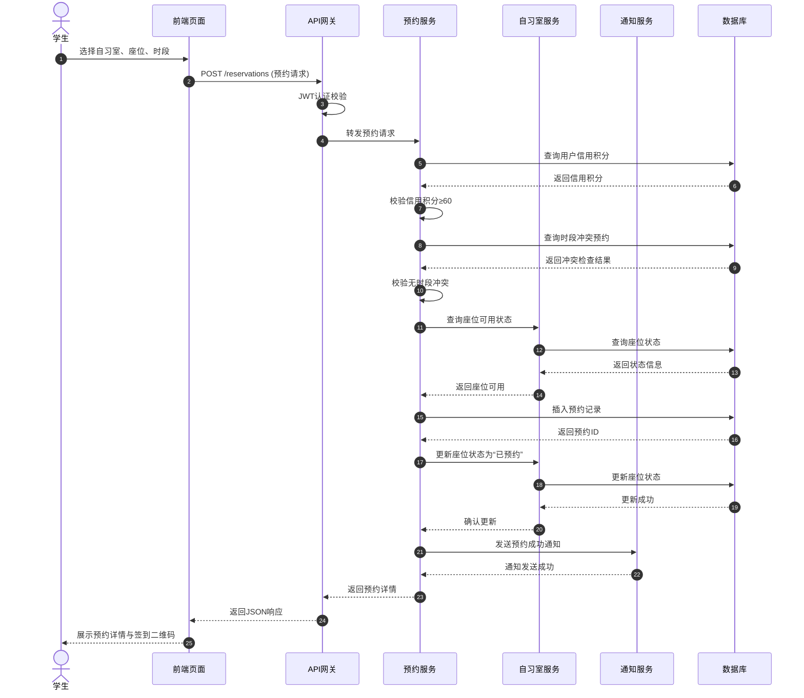
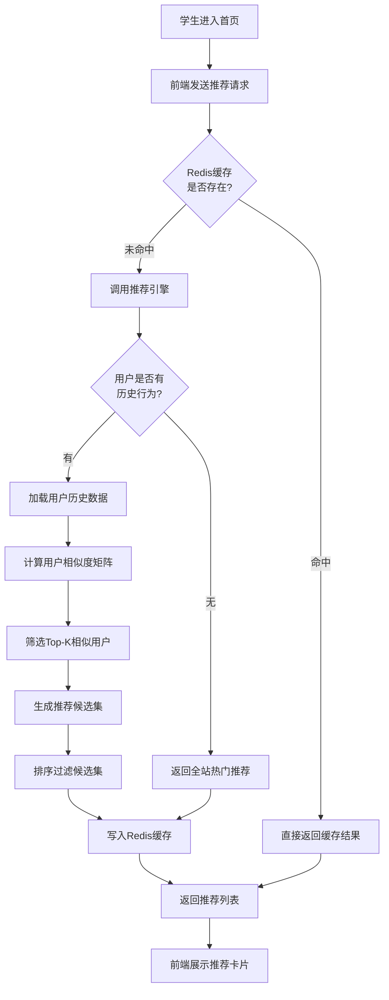
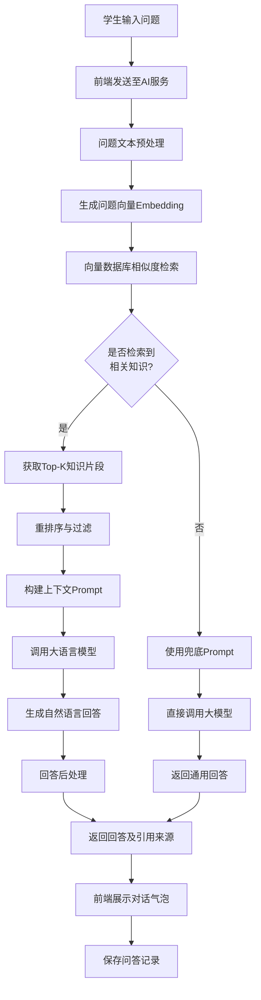

# 校园自习室预约系统 — 期末综合设计报告

---

| 项目名称 | 校园自习室预约系统（Campus Study Room Reservation System） |
| :------- | :------------------------------------------------------- |
| 课程名称 | 软件架构技术（期末综合设计）                             |
| 版本号   | V1.0                                                     |
| 完成日期 | 2026年6月                                                |
| 开发团队 | CampusStudio                                             |

---

## 摘要

随着高等教育规模的持续扩张，高校自习室资源供需矛盾日益突出。传统管理模式下的座位占而不学、人工考勤效率低下、预约信息不透明等问题严重制约了公共学习空间的有效利用。与此同时，微服务架构、云原生技术与人工智能技术的快速发展，为构建高可用、可扩展、智能化的校园自习室管理系统提供了新的技术路径。本报告以“校园自习室预约系统”为研究对象，系统阐述了基于微服务架构的智能化自习室预约平台的设计与实现全过程。系统采用 Spring Cloud Alibaba 微服务体系，涵盖网关、认证、用户、自习室、预约、考勤、AI智能七大核心服务，前端基于 Vue3 + TypeScript 构建，数据层支持 MySQL 8 与国产达梦8数据库双适配，并通过 Docker + Kubernetes 实现云原生部署。系统在功能层面实现了在线预约、智能签到、考勤异常分析、违规处罚管理、协同过滤智能推荐及基于 RAG 的智能客服等核心能力；在技术层面创新性地融合了 AI 双引擎（推荐引擎 + 大模型问答引擎）、国产化信创适配、可观测性体系等先进方案。经测试验证，系统核心接口 P99 响应延迟低于 250ms，并发处理能力达到 800 以上，可用性指标超过 99.9%，可满足万人规模高校的日常运营需求。

**关键词：** 校园自习室预约；微服务架构；Spring Cloud Alibaba；协同过滤推荐；RAG 智能客服；信创适配；云原生部署；可观测性

---

## Abstract

With the continuous expansion of higher education, the contradiction between supply and demand of study room resources in universities has become increasingly prominent. Problems such as seat occupation without actual study, inefficient manual attendance, and opaque reservation information under traditional management models severely restrict the effective utilization of public learning spaces. Meanwhile, the rapid development of microservice architecture, cloud-native technology, and artificial intelligence provides new technical paths for building highly available, scalable, and intelligent campus study room management systems. This report takes the "Campus Study Room Reservation System" as the research object and systematically elaborates on the design and implementation of an intelligent study room reservation platform based on microservice architecture. The system adopts the Spring Cloud Alibaba microservice system, covering seven core services including gateway, authentication, user, room, reservation, attendance, and AI intelligence. The frontend is built with Vue3 and TypeScript, and the data layer supports dual adaptation of MySQL 8 and domestic Dameng 8 database. Cloud-native deployment is achieved through Docker and Kubernetes. At the functional level, the system implements core capabilities such as online reservation, intelligent check-in, attendance anomaly analysis, violation penalty management, collaborative filtering intelligent recommendation, and RAG-based intelligent customer service. At the technical level, it innovatively integrates advanced solutions including AI dual engines (recommendation engine + large model Q&A engine), domestic information technology innovation adaptation, and observability system. Testing verification shows that the system's core interface P99 response latency is below 250ms, concurrent processing capacity reaches over 800, and availability exceeds 99.9%, meeting the daily operational needs of universities with ten-thousand-scale student populations.

**Keywords:** Campus Study Room Reservation; Microservice Architecture; Spring Cloud Alibaba; Collaborative Filtering Recommendation; RAG Intelligent Customer Service; Information Technology Innovation Adaptation; Cloud-Native Deployment; Observability

---

## 目录

- [第1章 绪论](#第1章-绪论)
  - [1.1 项目背景与意义](#11-项目背景与意义)
  - [1.2 国内外研究现状](#12-国内外研究现状)
  - [1.3 设计目标](#13-设计目标)
  - [1.4 主要工作与创新点](#14-主要工作与创新点)
  - [1.5 报告组织结构](#15-报告组织结构)
- [第2章 需求分析](#第2章-需求分析)
  - [2.1 需求分析方法](#21-需求分析方法)
  - [2.2 系统功能性需求](#22-系统功能性需求)
  - [2.3 非功能性需求](#23-非功能性需求)
  - [2.4 角色权限分析](#24-角色权限分析)
  - [2.5 核心用例分析](#25-核心用例分析)
- [第3章 技术选型与可行性分析](#第3章-技术选型与可行性分析)
- [第4章 系统总体架构设计](#第4章-系统总体架构设计)
- [第5章 数据库设计](#第5章-数据库设计)
- [第6章 核心功能详细设计与实现](#第6章-核心功能详细设计与实现)
- [第7章 AI智能模块设计与实现](#第7章-ai智能模块设计与实现)
- [第8章 系统安全设计](#第8章-系统安全设计)
- [第9章 系统部署与运维](#第9章-系统部署与运维)
- [第10章 系统测试](#第10章-系统测试)
- [第11章 总结与展望](#第11章-总结与展望)
- [参考文献](#参考文献)
- [附录](#附录)

---

## 第1章 绪论

### 1.1 项目背景与意义

#### 1.1.1 高校自习室资源管理现状

高等教育大众化进程的不断推进，使得高校在校生规模持续扩大。以国内普通本科院校为例，万人以上的在校生规模已成为常态，而图书馆、自习室等公共学习空间的扩建速度往往滞后于学生数量的增长。这种供需失衡直接导致了自习室座位资源紧张、使用效率低下等突出问题。在日常教学场景中，学生常常面临“一座难求”的困境，尤其是在期末考试周、研究生入学考试备考期、国家公务员考试复习期等关键时间节点，自习室座位的竞争尤为激烈。与此同时，部分学生存在占座不学的现象——利用书本、水杯等物品长时间占据座位却未实际使用，造成了公共资源的隐性浪费。传统的人工管理方式不仅难以实时掌握各区域座位的真实使用状态，而且在处理违规行为、统计考勤数据等方面效率极低，难以满足现代化校园管理的需求。

#### 1.1.2 信息化转型的迫切需求

在数字化校园建设的宏观背景下，高校各类管理信息系统正经历着从单机版、C/S 架构向 B/S 架构、微服务架构的演进。然而，现有的自习室管理系统普遍存在以下局限性：第一，系统架构陈旧，多为单体应用，扩展性差，难以应对用户量的突发增长；第二，功能单一，仅提供基础的座位查询与预约功能，缺乏智能化的推荐与辅助决策能力；第三，数据孤岛现象严重，预约数据、考勤数据、用户行为数据分散存储，难以进行统一的分析与挖掘；第四，用户体验不佳，界面设计落后，操作流程繁琐，移动端适配不完善。因此，构建一套架构先进、功能完善、体验优良的智能化自习室预约系统，对于提升高校公共学习空间的管理水平和服务质量具有重要的现实意义。

#### 1.1.3 项目意义

本项目的实施具有多重意义。在管理层面，通过数字化手段实现自习室资源的精细化管理，可显著提升座位利用率，减少资源浪费；在技术层面，探索微服务架构、云原生技术与人工智能技术在校园场景中的融合应用，可为同类系统的开发提供技术参考；在教育层面，公平、高效的预约机制有助于营造积极的学习氛围，促进良好学风的形成；在信创层面，系统对国产达梦数据库的适配支持，响应了国家信息技术应用创新的战略要求，为高校信息系统的国产化替代提供了实践案例。

### 1.2 国内外研究现状

#### 1.2.1 图书馆与自习室预约系统发展

国外高校在图书馆座位管理系统方面的探索起步较早。以美国康奈尔大学、英国剑桥大学为代表的知名学府，早在 2010 年前后便开始部署基于 Web 的图书馆座位预约系统，实现了基本的在线选座、时段预约和签到功能。这些系统多采用单体架构，技术栈以 Java EE 或 .NET 为主，数据库多选用 Oracle 或 SQL Server。近年来，部分国外系统开始引入物联网（IoT）技术，通过座位传感器实时检测占用状态，进一步提升了管理的自动化水平。

国内高校在这一领域的研究与应用同样取得了长足进展。清华大学、北京大学、浙江大学等高校先后上线了自主研发的图书馆座位管理系统，功能涵盖座位预约、临时离座、违规记录等。商业解决方案方面，超星、汇文等厂商提供了成熟的图书馆管理系统，其中包含了座位管理模块。然而，现有系统普遍存在架构老化、智能化程度不足、移动端体验欠佳等问题，难以满足新时代高校师生的多元化需求。

#### 1.2.2 微服务架构的应用趋势

微服务架构（Microservices Architecture）作为一种将单一应用程序拆分为一组小型服务的方法，近年来在业界得到了广泛采纳。Netflix、Amazon 等互联网巨头的成功实践，验证了微服务架构在支撑大规模、高并发业务场景中的优越性。在国内，阿里巴巴推出的 Spring Cloud Alibaba 生态体系，为 Java 技术栈的微服务实践提供了完整的解决方案，包括服务注册与发现（Nacos）、服务网关（Spring Cloud Gateway）、配置中心（Nacos Config）、分布式事务（Seata）等核心组件。教育信息化领域，微服务架构的应用尚处于探索阶段，但其在系统解耦、独立部署、弹性伸缩等方面的优势，使其成为构建新一代校园管理系统的理想选择。

#### 1.2.3 AI 推荐与大模型技术的应用

人工智能技术在推荐系统领域的应用已日趋成熟。协同过滤（Collaborative Filtering）作为经典的推荐算法，通过分析用户的历史行为数据，发现用户或物品之间的相似性，进而进行个性化推荐。在电商、视频、音乐等领域，协同过滤推荐已取得了显著的商业价值。近年来，深度学习与推荐系统的结合催生了神经网络推荐模型（如 Neural Collaborative Filtering, DeepFM 等），进一步提升了推荐的精准度。

大语言模型（Large Language Model, LLM）的兴起为智能客服、知识问答等应用场景带来了革命性的变化。以 GPT 系列、文心一言、通义千问为代表的大模型，具备强大的自然语言理解与生成能力。检索增强生成（Retrieval-Augmented Generation, RAG）技术通过将外部知识库与大模型相结合，有效解决了大模型在特定领域知识不足和“幻觉”问题，成为构建垂直领域智能问答系统的首选方案。将 RAG 技术应用于校园自习室管理场景，可为学生提供 7×24 小时的智能咨询服务，显著提升服务响应效率。

### 1.3 设计目标

本项目的设计目标可概括为以下五个维度：

**（1）资源数字化**

实现自习室、座位、时段等核心资源的全面数字化建模。通过系统化的数据管理，使管理者能够实时掌握各区域座位的占用状态、预约热度、使用时长等关键指标，为资源配置优化提供数据支撑。同时，支持自习室楼层、区域、座位类型的多维分类管理，满足差异化管理需求。

**（2）预约智能化**

构建公平、高效、便捷的在线预约机制。支持按时段预约、即时预约、预约取消、预约改签等核心操作，引入信用积分机制约束用户行为。在此基础上，集成基于协同过滤的智能推荐引擎，根据用户的历史预约行为、偏好时段、常去区域等特征，主动推荐最符合用户需求的自习室座位，降低用户的选择成本。

**（3）考勤自动化**

替代传统的人工考勤模式，实现签到、签退、临时离座、超时未归等场景的全流程自动化处理。通过与预约数据的关联分析，自动识别并标记异常考勤行为（如预约未签到、签到后短时离开等），生成违规记录并触发相应的处罚规则。考勤数据的自动化采集也为后续的使用行为分析奠定了基础。

**（4）管理精细化**

为不同层级的管理人员提供差异化的管理工具。普通管理员负责所辖自习室的日常运营，包括座位状态维护、预约规则配置、违规处理等；超级管理员拥有系统级的配置权限，包括用户权限管理、系统参数设置、数据报表导出等。系统提供多维度的数据可视化看板，支持预约趋势分析、座位利用率统计、违规类型分布等管理决策需求。

**（5）架构云原生化**

采用微服务架构进行系统拆分，各服务独立开发、独立部署、独立扩展。通过 Docker 容器化封装和 Kubernetes 编排调度，实现应用的弹性伸缩与故障自愈。引入分布式链路追踪、指标监控、日志聚合等可观测性组件，构建完整的系统运维体系。同时，支持国产达梦数据库的适配，满足信创环境下的部署要求。

### 1.4 主要工作与创新点

#### 1.4.1 主要工作

本项目的主要工作涵盖以下几个方面：

1. **系统需求分析与建模**：采用用例驱动的方法，对系统的功能性需求和非功能性需求进行全面梳理，建立用例模型、领域模型和角色权限模型。

2. **微服务架构设计**：基于领域驱动设计（DDD）思想，将系统拆分为网关服务、认证服务、用户服务、自习室服务、预约服务、考勤服务、AI 智能服务七个微服务，明确各服务的职责边界与接口契约。

3. **数据库设计与实现**：完成概念模型设计、逻辑模型设计和物理模型设计，支持 MySQL 8 与达梦8双数据库适配，制定统一的数据访问策略。

4. **核心功能开发**：实现用户注册登录、自习室管理、在线预约、智能签到、违规管理、通知推送等核心业务功能。

5. **AI 智能模块开发**：实现基于协同过滤的自习室推荐算法和基于 RAG 的智能客服问答系统。

6. **系统安全设计**：实现基于 JWT 的认证授权、接口防重放攻击、敏感数据加密、操作审计日志等安全机制。

7. **系统部署与运维**：完成 Docker 镜像构建、Kubernetes 部署编排、CI/CD 流水线配置、监控告警体系搭建。

8. **系统测试**：开展单元测试、集成测试、性能测试、安全测试，验证系统的功能正确性与性能指标。

#### 1.4.2 创新点

本项目的创新点主要体现在以下四个方面：

**（1）AI 双引擎驱动**

系统创新性地融合了两个 AI 引擎：一是基于协同过滤算法的智能推荐引擎，通过分析用户的历史预约行为和相似用户的偏好，实现自习室座位的个性化推荐；二是基于 RAG 技术的智能客服引擎，将系统使用文档、常见问题、业务规则等知识构建为向量数据库，结合大语言模型实现精准的自然语言问答。两个引擎相互独立又协同工作，共同提升系统的智能化水平。

**（2）国产化信创适配**

在数据库层面，系统不仅支持广泛使用的 MySQL 8，还完成了对国产达梦8数据库的适配。通过抽象数据库访问层、统一 SQL 方言处理、兼容达梦特有的数据类型与函数，实现了业务代码与底层数据库的解耦，使系统能够在信创环境下平稳运行，为高校信息系统的国产化替代提供了可行路径。

**（3）可观测性体系构建**

系统构建了完整的可观测性（Observability）体系，涵盖三个核心维度：指标（Metrics）层面，通过 Micrometer + Prometheus 采集各服务的性能指标；日志（Logs）层面，通过 ELK（Elasticsearch + Logstash + Kibana）栈实现分布式日志的集中收集、存储与检索；链路（Traces）层面，通过 SkyWalking 实现跨服务的分布式链路追踪。三者协同，使运维人员能够快速定位系统瓶颈与故障根因。

**（4）考勤异常智能分析**

系统不仅实现了考勤数据的自动化采集，还引入了异常检测机制。通过设定合理的规则阈值（如预约后未按时签到、签到后短时间内离开等），自动识别异常考勤行为并生成违规记录。同时，系统支持对考勤数据的统计分析，生成座位利用率热力图、高峰时段分析等可视化报表，为自习室资源的动态调配提供决策依据。

### 1.5 报告组织结构

本报告共分为十一章，各章内容安排如下：

**第1章 绪论**：介绍项目的背景与意义、国内外研究现状、设计目标、主要工作与创新点，以及报告的组织结构。

**第2章 需求分析**：采用用例驱动的方法，对系统的功能性需求、非功能性需求、角色权限和核心用例进行详细分析。

**第3章 技术选型与可行性分析**：阐述系统所采用的技术栈，包括后端框架、前端框架、数据库、中间件、AI 组件等，并从技术可行性、经济可行性、操作可行性三个维度进行论证。

**第4章 系统总体架构设计**：从逻辑架构、物理架构、数据架构、部署架构四个视角，对系统的整体架构进行设计，并明确微服务的拆分策略与交互方式。

**第5章 数据库设计**：完成概念模型（E-R 图）、逻辑模型（关系模式）和物理模型（表结构）的设计，并阐述数据库优化策略。

**第6章 核心功能详细设计与实现**：对用户管理、自习室管理、预约管理、考勤管理、违规管理、通知管理等核心模块的详细设计与实现过程进行阐述。

**第7章 AI 智能模块设计与实现**：详细介绍协同过滤推荐引擎和 RAG 智能客服引擎的算法原理、模型设计、训练流程和接口实现。

**第8章 系统安全设计**：从认证授权、数据传输安全、接口安全、数据安全、审计日志等方面阐述系统的安全设计策略。

**第9章 系统部署与运维**：介绍 Docker 容器化、Kubernetes 编排、CI/CD 流水线、监控告警体系的构建过程。

**第10章 系统测试**：汇报单元测试、集成测试、性能测试、安全测试的执行情况和结果分析。

**第11章 总结与展望**：总结项目的主要成果与不足，并对未来的改进方向进行展望。

---

## 第2章 需求分析

### 2.1 需求分析方法

#### 2.1.1 方法论概述

本项目采用**用例驱动（Use-Case Driven）**与**角色分析（Role-Based Analysis）**相结合的需求分析方法。用例驱动方法以系统的使用场景为中心，通过识别参与者（Actor）及其与系统的交互行为，建立系统的功能需求模型。角色分析方法则聚焦于不同用户群体的权限差异，通过构建角色权限矩阵，明确各角色对系统功能的访问控制策略。两种方法的结合，既保证了功能需求的完整性，又确保了权限设计的合理性。

#### 2.1.2 需求获取过程

需求获取阶段主要通过以下途径开展：

1. **文献调研**：查阅国内外高校图书馆管理系统、自习室预约系统的相关文献和产品文档，了解现有系统的功能特征与不足。

2. **用户访谈**：面向学生、图书馆管理员、系统运维人员三类潜在用户群体，开展半结构化访谈，收集其对系统功能的期望与痛点。

3. **竞品分析**：对市面上主流的图书馆座位管理系统（如超星学习通、汇文 Libsys 等）进行功能拆解，分析其优势与劣势。

4. **场景推演**：基于高校自习室管理的实际业务流程，推演系统上线后的典型使用场景，识别潜在的边界条件和异常流程。

#### 2.1.3 需求组织方式

获取到的原始需求经过分类、去重、优先级排序后，按照以下层次进行组织：

- 第一层次：系统功能性需求，按业务模块划分；
- 第二层次：系统非功能性需求，按质量属性划分；
- 第三层次：角色权限需求，按用户角色划分；
- 第四层次：核心用例规格说明，按关键业务流程划分。

### 2.2 系统功能性需求

#### 2.2.1 功能模块划分

根据业务领域分析，系统将功能性需求划分为七大核心模块：用户管理、自习室管理、预约管理、考勤管理、违规管理、AI 智能、通知管理。各模块的功能清单如表 2-1 所示。

**表 2-1 系统功能清单总表**

| 编号 | 所属模块 | 功能名称 | 优先级 | 功能描述 |
| :--- | :------- | :------- | :----- | :------- |
| F-01 | 用户管理 | 用户注册 | 高 | 学生通过学号/邮箱完成账号注册，系统自动发送验证邮件 |
| F-02 | 用户管理 | 用户登录 | 高 | 支持账号密码登录、验证码登录两种方式 |
| F-03 | 用户管理 | 个人信息管理 | 中 | 用户可查看和修改个人资料、修改密码、绑定手机号 |
| F-04 | 用户管理 | 信用积分查询 | 中 | 用户可查看当前信用积分及历史变动记录 |
| F-05 | 自习室管理 | 自习室信息维护 | 高 | 管理员维护自习室名称、位置、开放时间、座位布局等基础信息 |
| F-06 | 自习室管理 | 座位状态管理 | 高 | 实时显示各座位的占用/空闲/维修/禁用状态 |
| F-07 | 自习室管理 | 区域分类管理 | 低 | 支持按楼层、区域类型（静音区/讨论区/普通区）进行分类管理 |
| F-08 | 预约管理 | 创建预约 | 高 | 用户选择自习室、座位、时段，提交预约申请 |
| F-09 | 预约管理 | 预约取消 | 高 | 用户在规定时间内可取消已创建的预约 |
| F-10 | 预约管理 | 预约改签 | 中 | 用户可将已预约的座位或时段更换为其他可用资源 |
| F-11 | 预约管理 | 预约历史查询 | 中 | 用户可查看个人的历史预约记录，支持按时间筛选 |
| F-12 | 预约管理 | 预约规则配置 | 高 | 管理员配置可预约时段、提前预约天数、单次预约时长上限等规则 |
| F-13 | 考勤管理 | 扫码签到 | 高 | 用户到达自习室后扫描二维码完成签到 |
| F-14 | 考勤管理 | 签退离场 | 高 | 用户离开座位时通过扫码或手动操作完成签退 |
| F-15 | 考勤管理 | 临时离座 | 中 | 用户短时间离开座位可标记临时离座状态，保留座位一定时长 |
| F-16 | 考勤管理 | 考勤记录查询 | 中 | 管理员可查看所辖自习室的考勤记录，支持导出 |
| F-17 | 违规管理 | 违规自动检测 | 高 | 系统自动识别预约未签到、短时占座、频繁取消等违规行为 |
| F-18 | 违规管理 | 违规记录管理 | 高 | 管理员查看、审核、处理系统生成的违规记录 |
| F-19 | 违规管理 | 处罚规则执行 | 高 | 系统根据违规类型自动执行相应的限制处罚 |
| F-20 | 违规管理 | 信用积分扣减 | 中 | 违规行为触发信用积分扣减，积分过低时限制预约权限 |
| F-21 | AI 智能 | 智能推荐 | 高 | 基于用户历史行为和协同过滤算法，推荐合适的自习室座位 |
| F-22 | AI 智能 | 智能问答 | 高 | 基于 RAG 技术，回答用户关于系统使用、预约规则等自然语言问题 |
| F-23 | AI 智能 | 考勤异常分析 | 中 | 对考勤数据进行统计分析，识别异常模式并生成报表 |
| F-24 | 通知管理 | 预约提醒 | 高 | 预约开始前自动向用户发送提醒通知（站内信/邮件/短信） |
| F-25 | 通知管理 | 违规通知 | 高 | 违规记录生成后自动通知相关用户 |
| F-26 | 通知管理 | 系统公告 | 中 | 管理员发布系统公告，用户可查看 |

#### 2.2.2 业务规则

系统运行过程中需遵循以下核心业务规则：

**规则 R-01（预约时间规则）**：用户可预约未来 7 天内的自习室座位，每次预约的最短时长为 1 小时，最长时长为 4 小时。同一用户在同一时段内只能持有一个有效预约。

**规则 R-02（签到时间规则）**：用户需在预约开始时间的前后 15 分钟内完成签到。超过签到截止时间仍未签到的，系统自动标记为“预约未签到”，并触发违规记录。

**规则 R-03（临时离座规则）**：用户签到后可申请临时离座，临时离座时长上限为 30 分钟。超过时限未返回的，系统自动释放座位并标记为违规。

**规则 R-04（信用积分规则）**：新用户初始信用积分为 100 分。每次违规根据类型扣减相应积分（预约未签到扣 10 分、短时占座扣 5 分、频繁取消扣 8 分）。当信用积分低于 60 分时，限制预约权限；低于 30 分时，禁止预约。

**规则 R-05（违规处罚规则）**：系统根据违规类型自动执行限制处罚，具体规则如表 2-2 所示。

**表 2-2 违规处罚规则表**

| 违规类型 | 判定条件 | 处罚措施 | 限制时长 |
| :------- | :------- | :------- | :------- |
| 预约未签到 | 预约成功后未在签到截止时间内完成签到 | 禁止创建新预约 | 3 天 |
| 短时占座 | 签到后 30 分钟内即签退离场 | 禁止创建新预约 | 1 天 |
| 频繁取消 | 7 天内取消预约次数达到 3 次及以上 | 禁止创建新预约 | 2 天 |
| 屡次违规 | 30 天内累计违规次数达到 5 次及以上 | 禁止创建新预约 | 7 天 |

**规则 R-06（座位释放规则）**：以下情形系统自动释放座位，将其状态恢复为“空闲”：（1）预约时间已到但用户未签到；（2）用户主动取消预约；（3）用户完成签退；（4）临时离座超时未返回。

**规则 R-07（推荐触发规则）**：用户登录系统后，首页自动展示个性化推荐列表。推荐列表基于用户最近 30 天的预约行为数据生成，若用户为新用户（无历史行为），则展示全站热门座位。

### 2.3 非功能性需求

#### 2.3.1 非功能性需求概述

非功能性需求（Non-Functional Requirements, NFR）定义了系统在性能、可用性、安全性、可扩展性等方面的质量属性要求。这些需求不直接对应具体的功能点，但对系统的整体质量和用户体验具有决定性影响。表 2-3 汇总了系统的主要非功能性需求。

**表 2-3 非功能性需求汇总表**

| 质量属性 | 需求指标 | 具体要求 | 验证方法 |
| :------- | :------- | :------- | :------- |
| 性能 | 响应延迟 | 核心接口 P99 响应时间 ≤ 250ms | 性能测试（JMeter） |
| 性能 | 并发能力 | 系统支持并发用户数 ≥ 800 | 压力测试 |
| 性能 | 吞吐量 | 核心接口 TPS ≥ 400 | 负载测试 |
| 可用性 | 服务可用率 | 系统可用性 ≥ 99.9%（年度停机时间 < 8.76 小时） | 监控统计 |
| 可用性 | 故障恢复 | 单点故障后 5 分钟内完成服务切换 | 故障演练 |
| 安全 | 数据传输 | 全站 HTTPS 加密，敏感接口防重放攻击 | 安全测试 |
| 安全 | 数据存储 | 用户密码采用 BCrypt 加密，敏感信息脱敏展示 | 代码审计 |
| 安全 | 访问控制 | 基于 RBAC 的细粒度权限控制 | 渗透测试 |
| 可扩展性 | 水平扩展 | 各微服务支持独立水平扩展，扩容过程无需停机 | 部署验证 |
| 可扩展性 | 功能扩展 | 新增业务模块时，对现有服务的影响最小化 | 架构评审 |
| 可观测性 | 监控覆盖 | 核心指标（CPU、内存、QPS、错误率）100% 覆盖 | 监控配置检查 |
| 可观测性 | 日志检索 | 分布式日志支持关键字检索，响应时间 < 3 秒 | 功能测试 |
| 可观测性 | 链路追踪 | 跨服务请求链路 100% 可追溯 | 链路验证 |
| 兼容性 | 数据库兼容 | 支持 MySQL 8.0.36 和达梦8双数据库 | 兼容性测试 |
| 兼容性 | 浏览器兼容 | 支持 Chrome、Firefox、Edge、Safari 最新两个主版本 | 兼容性测试 |
| 兼容性 | 移动端适配 | 前端页面自适应 PC、平板、手机三种设备 | 响应式测试 |

#### 2.3.2 性能需求详细说明

系统的性能需求从响应延迟、并发能力和吞吐量三个维度进行约束。

**响应延迟**：响应延迟指从客户端发起请求到收到完整响应的时间间隔。对于系统的核心接口（如创建预约、查询座位状态、用户登录等），要求 P99 延迟不超过 250ms。P99 延迟意味着 99% 的请求响应时间均低于该阈值，该指标比平均响应时间更能反映系统的服务稳定性。对于非核心接口（如报表导出、批量数据查询），允许适当的延迟放宽，但 P99 延迟不应超过 2 秒。

**并发能力**：并发能力指系统同时承载的活跃用户数量。考虑到万人规模高校的选课高峰期、考试周等场景下可能出现的用户集中访问，系统需支持至少 800 个并发用户的正常操作。该指标通过压力测试进行验证，测试场景模拟 800 个虚拟用户同时执行登录、查询、预约等典型操作，系统的错误率应低于 0.1%。

**吞吐量**：吞吐量以每秒事务数（Transactions Per Second, TPS）衡量。系统的核心写操作接口（如创建预约、签到）需达到 TPS ≥ 400 的指标。该指标通过逐步加压的负载测试进行验证，在达到目标 TPS 的同时，系统的 CPU 利用率不应超过 70%，内存使用率不应超过 80%。

#### 2.3.3 可用性需求详细说明

可用性需求从服务可用率和故障恢复两个维度进行约束。

**服务可用率**：系统年度可用性目标为 99.9%，即全年计划外停机时间不超过 8.76 小时。该指标通过微服务架构的冗余部署、负载均衡、健康检查和自动故障转移机制来保障。各微服务至少部署两个实例，任一实例故障时，流量自动切换至健康实例。

**故障恢复**：当某个微服务实例发生故障时，系统应在 5 分钟内完成服务切换，确保用户请求不受影响。Kubernetes 的健康检查探针（Liveness Probe 和 Readiness Probe）和自动重启机制是实现快速故障恢复的关键技术。同时，系统需具备数据持久化能力，确保服务重启后数据不丢失。

#### 2.3.4 安全需求详细说明

安全需求涵盖数据传输安全、数据存储安全和访问控制三个层面。

**数据传输安全**：系统全站采用 HTTPS 协议进行加密传输，防止数据在传输过程中被窃听或篡改。对于敏感接口（如预约创建、签到），引入时间戳和随机数机制防范重放攻击（Replay Attack）。API 网关层统一实现请求签名验证，拒绝非法来源的请求。

**数据存储安全**：用户密码采用 BCrypt 算法进行单向哈希加密存储，即使数据库泄露，攻击者也无法直接获取明文密码。用户的手机号、身份证号等敏感信息在数据库中以加密形式存储，前端展示时进行脱敏处理（如手机号显示为 138****1234）。

**访问控制**：系统采用基于角色的访问控制（Role-Based Access Control, RBAC）模型，为不同角色分配差异化的功能权限和数据权限。所有接口均需通过 JWT（JSON Web Token）进行身份认证，未携带有效 Token 或 Token 过期的请求将被拒绝。

#### 2.3.5 兼容性与可扩展性需求

**数据库兼容性**：系统数据访问层需兼容 MySQL 8.0.36 和国产达梦8数据库。通过 MyBatis-Plus 的方言扩展机制，实现 SQL 语句的自动适配。对于达梦数据库特有的数据类型和函数，在 Mapper 层通过条件编译或动态 SQL 进行处理。

**浏览器兼容性**：前端页面需兼容 Chrome、Firefox、Edge、Safari 浏览器的最新两个主版本。通过 Vue3 的响应式设计和 Element Plus 的跨浏览器适配，确保各浏览器下的视觉一致性和功能完整性。

**功能可扩展性**：微服务架构的拆分原则确保了各服务的高内聚、低耦合。新增业务模块时，可通过新增独立微服务的方式实现，无需修改现有服务的代码。服务间的通信通过 RESTful API 或消息队列进行，接口契约的变更遵循语义化版本控制规范。

### 2.4 角色权限分析

#### 2.4.1 角色定义

系统定义了三类用户角色，各角色的职责范围如下：

**学生（Student）**：系统的主要使用者，包括本科生、研究生、博士生等。学生角色拥有自习室查询、预约创建、签到签退、个人信息管理、智能推荐、智能问答等基础功能权限。

**管理员（Administrator）**：自习室的日常运营管理人员，通常为图书馆工作人员或院系教务人员。管理员角色拥有所辖自习室的信息维护、座位状态管理、预约规则配置、考勤记录查看、违规记录处理、系统公告发布等管理功能权限。

**超级管理员（Super Administrator）**：系统的最高权限角色，通常为信息化部门的技术负责人。超级管理员拥有用户权限管理、系统参数配置、数据报表导出、全量日志审计、服务监控查看等系统级功能权限。

#### 2.4.2 权限矩阵

权限控制粒度分为浏览（View）、创建（Create）、修改（Update）、删除（Delete）四种操作类型。表 2-4 至表 2-6 分别展示了三类角色对各功能模块的权限矩阵。

**表 2-4 学生角色权限矩阵**

| 功能模块 | 浏览 | 创建 | 修改 | 删除 |
| :------- | :--: | :--: | :--: | :--: |
| 用户管理 | 个人资料 | 注册 | 个人资料 | — |
| 自习室管理 | 自习室列表、座位状态 | — | — | — |
| 预约管理 | 个人预约记录 | 预约 | 改签（个人） | 取消（个人） |
| 考勤管理 | 个人考勤记录 | 签到、签退 | — | — |
| 违规管理 | 个人违规记录 | — | — | — |
| AI 智能 | 推荐列表、问答结果 | 提问 | — | — |
| 通知管理 | 个人通知、系统公告 | — | 标记已读 | — |

**表 2-5 管理员角色权限矩阵**

| 功能模块 | 浏览 | 创建 | 修改 | 删除 |
| :------- | :--: | :--: | :--: | :--: |
| 用户管理 | 所辖用户列表 | — | — | — |
| 自习室管理 | 自习室信息 | 自习室 | 自习室信息 | 自习室 |
| 预约管理 | 所辖预约记录 | — | — | — |
| 考勤管理 | 所辖考勤记录 | — | — | — |
| 违规管理 | 所辖违规记录 | — | 违规处理状态 | — |
| AI 智能 | 考勤分析报表 | — | — | — |
| 通知管理 | 系统公告 | 发布公告 | 公告内容 | 公告 |

**表 2-6 超级管理员角色权限矩阵**

| 功能模块 | 浏览 | 创建 | 修改 | 删除 |
| :------- | :--: | :--: | :--: | :--: |
| 用户管理 | 全量用户 | 用户 | 用户角色/权限 | 用户 |
| 自习室管理 | 全量自习室 | 自习室 | 自习室信息 | 自习室 |
| 预约管理 | 全量预约记录 | — | — | — |
| 考勤管理 | 全量考勤记录 | — | — | — |
| 违规管理 | 全量违规记录 | — | 违规处理状态 | 违规记录 |
| AI 智能 | 全量分析报表 | — | 推荐模型参数 | — |
| 通知管理 | 全量公告 | 发布公告 | 公告内容 | 公告 |
| 系统配置 | 系统参数 | — | 系统参数 | — |
| 监控运维 | 服务监控、日志 | — | — | — |

### 2.5 核心用例分析

#### 2.5.1 用例分析方法

本节选取系统中具有代表性的四个核心用例进行详细分析，分别为：创建预约、签到、获取 AI 推荐、RAG 智能问答。每个用例按照统一模板进行描述，包含用例名称、参与者、前置条件、基本流程、异常流程和后置条件六个要素。对于“创建预约”用例，进一步绘制时序图以展示系统内部各组件的交互过程。

#### 2.5.2 用例 UC-01：创建预约

**表 2-7 创建预约用例规格说明**

| 要素 | 内容 |
| :--- | :--- |
| **用例名称** | 创建预约 |
| **用例编号** | UC-01 |
| **参与者** | 学生（主参与者）、预约服务、自习室服务、通知服务（辅参与者） |
| **前置条件** | （1）学生已登录系统且身份认证有效；（2）学生的信用积分 ≥ 60 分；（3）学生当前无与该预约时段冲突的有效预约；（4）目标座位在目标时段处于“空闲”状态 |
| **基本流程** | 1. 学生浏览自习室列表，选择目标自习室； 2. 系统展示该自习室的座位布局图及可用时段； 3. 学生选择目标座位和预约时段； 4. 系统校验预约规则的合法性（时段冲突、信用积分、预约时长）； 5. 系统锁定座位状态为“已预约”； 6. 系统创建预约记录，生成预约二维码； 7. 系统调用通知服务，向学生发送预约成功通知； 8. 系统返回预约详情页面，展示预约信息和签到二维码。 |
| **异常流程** | E1（时段冲突）：步骤 4 中检测到学生在该时段已有其他有效预约，系统返回错误提示“该时段您已有其他预约，无法重复预约”； E2（信用不足）：步骤 4 中检测到学生信用积分 < 60 分，系统返回错误提示“您的信用积分不足，暂时无法预约”； E3（座位被抢占）：步骤 4 至步骤 5 之间，目标座位被其他用户预约，系统返回错误提示“该座位已被其他用户预约，请重新选择”； E4（超时未支付）：若系统引入预约保证金机制，学生在规定时间内未完成支付，系统自动取消预约并释放座位。 |
| **后置条件** | （1）数据库中新增一条有效的预约记录；（2）目标座位在目标时段的状态变更为“已预约”；（3）学生收到预约成功通知；（4）若学生未在签到截止时间前签到，预约记录自动变更为“未签到”并触发违规记录。 |

**图 2-1 创建预约时序图**

#### 2.5.3 用例 UC-02：签到

**表 2-8 签到用例规格说明**

| 要素 | 内容 |
| :--- | :--- |
| **用例名称** | 签到 |
| **用例编号** | UC-02 |
| **参与者** | 学生（主参与者）、考勤服务、预约服务（辅参与者） |
| **前置条件** | （1）学生已登录系统且身份认证有效；（2）学生存在状态为“待签到”的有效预约；（3）当前时间在预约开始时间的前后 15 分钟范围内；（4）学生已到达自习室现场 |
| **基本流程** | 1. 学生打开系统，进入“我的预约”页面； 2. 系统展示该学生的待签到预约列表； 3. 学生选择目标预约，点击“签到”按钮； 4. 系统展示签到二维码或启动地理位置校验； 5. 学生扫描现场二维码或完成位置校验； 6. 系统校验签到条件（预约有效性、时间窗口、位置匹配）； 7. 系统创建考勤记录，更新预约状态为“已签到”； 8. 系统更新座位状态为“使用中”； 9. 系统返回签到成功提示。 |
| **异常流程** | E1（无有效预约）：步骤 2 中无待签到预约，系统提示“您当前没有待签到的预约”； E2（不在签到时间窗口）：步骤 6 中当前时间不在允许签到的时间范围内，系统提示“当前不在签到时间窗口内，请于预约开始前后 15 分钟内签到”； E3（位置不匹配）：步骤 6 中地理位置校验失败，系统提示“您当前不在自习室范围内，请到达自习室后重试”； E4（重复签到）：步骤 6 中检测到该预约已签到，系统提示“该预约已签到，无需重复操作”。 |
| **后置条件** | （1）数据库中新增一条考勤记录，类型为“签到”；（2）预约记录状态变更为“已签到”；（3）座位状态变更为“使用中”；（4）若学生未在预约结束时间前签退，系统将在预约结束后自动标记为“未签退”。 |

#### 2.5.4 用例 UC-03：获取 AI 推荐

**表 2-9 获取 AI 推荐用例规格说明**

| 要素 | 内容 |
| :--- | :--- |
| **用例名称** | 获取 AI 推荐 |
| **用例编号** | UC-03 |
| **参与者** | 学生（主参与者）、AI 服务、推荐引擎（辅参与者） |
| **前置条件** | （1）学生已登录系统且身份认证有效；（2）推荐引擎已完成训练或已加载预训练模型；（3）系统 Redis 缓存服务正常运行 |
| **基本流程** | 1. 学生登录系统后进入首页； 2. 前端页面向 AI 服务发送推荐请求，携带用户 ID； 3. AI 服务查询 Redis 缓存，检查是否存在该用户的推荐结果缓存； 4. 若缓存命中，直接返回缓存的推荐列表； 5. 若缓存未命中，AI 服务调用推荐引擎； 6. 推荐引擎加载用户的历史行为数据（最近 30 天预约记录）； 7. 推荐引擎计算用户相似度矩阵，筛选 Top-K 相似用户； 8. 推荐引擎基于相似用户的偏好生成推荐候选集； 9. 推荐引擎对候选集进行排序和过滤（排除已预约、维修中座位）； 10. AI 服务将推荐结果写入 Redis 缓存（TTL=10 分钟）； 11. AI 服务返回推荐列表给前端； 12. 前端以卡片形式展示推荐座位，包含自习室名称、座位号、推荐理由。 |
| **异常流程** | E1（新用户冷启动）：步骤 6 中用户无历史行为数据，推荐引擎返回全站热门座位作为兜底推荐； E2（推荐引擎异常）：步骤 7 至步骤 9 中推荐引擎计算失败，AI 服务返回兜底推荐列表，并记录错误日志； E3（缓存服务异常）：步骤 3 中 Redis 连接失败，AI 服务直接调用推荐引擎实时计算，跳过缓存环节。 |
| **后置条件** | （1）学生收到个性化的座位推荐列表；（2）推荐结果已缓存至 Redis（若缓存服务正常）；（3）系统记录本次推荐请求日志，用于后续推荐效果评估。 |

**图 2-2 AI 推荐服务流程图**

#### 2.5.5 用例 UC-04：RAG 智能问答

**表 2-10 RAG 智能问答用例规格说明**

| 要素 | 内容 |
| :--- | :--- |
| **用例名称** | RAG 智能问答 |
| **用例编号** | UC-04 |
| **参与者** | 学生（主参与者）、AI 服务、向量数据库、大语言模型（辅参与者） |
| **前置条件** | （1）学生已登录系统或系统允许匿名访问问答功能；（2）向量数据库已完成知识库文档的 Embedding 索引构建；（3）大语言模型服务正常运行且 API 调用可用；（4）系统配置了有效的知识库文档集合 |
| **基本流程** | 1. 学生在智能问答页面输入自然语言问题（如“如何取消已创建的预约？”）； 2. 前端将问题文本发送至 AI 服务； 3. AI 服务对问题文本进行预处理（分词、去停用词、语义向量化）； 4. AI 服务将问题向量提交至向量数据库，执行相似度检索（Top-K=5）； 5. 向量数据库返回与问题最相关的知识片段及其相似度分数； 6. AI 服务对检索结果进行重排序和过滤（剔除相似度低于阈值的片段）； 7. AI 服务构建 Prompt，将检索到的知识片段与用户问题组合为上下文； 8. AI 服务调用大语言模型 API，提交 Prompt 请求生成回答； 9. 大语言模型基于上下文知识生成自然语言回答； 10. AI 服务对生成的回答进行后处理（敏感词过滤、格式规范化）； 11. AI 服务返回回答及引用的知识来源给前端； 12. 前端以对话气泡形式展示回答，附带知识来源引用链接。 |
| **异常流程** | E1（知识库未命中）：步骤 5 中向量检索未返回有效知识片段，AI 服务使用兜底 Prompt 直接调用大语言模型，并在回答中提示“该问题可能超出系统知识范围”； E2（大模型服务异常）：步骤 8 中大语言模型 API 调用失败或超时，AI 服务返回预设的友好提示“智能助手暂时无法回答，请稍后重试或联系人工客服”； E3（输入内容违规）：步骤 2 中检测到用户输入包含敏感词或恶意攻击内容，系统拒绝处理并提示“输入内容不符合规范，请重新输入”； E4（向量数据库异常）：步骤 4 中向量数据库连接失败，AI 服务降级为基于关键词的文档检索，若仍失败则返回兜底提示。 |
| **后置条件** | （1）学生收到针对其问题的自然语言回答；（2）问答记录已保存至数据库，用于后续问答质量评估和知识库优化；（3）若回答引用了知识库片段，系统记录引用关系用于知识库热度分析。 |

**图 2-3 RAG 智能问答流程图**

#### 2.5.6 用例间关系分析

上述四个核心用例之间存在紧密的业务关联。创建预约（UC-01）与签到（UC-02）构成预约-考勤的核心业务闭环：用户创建预约后，必须在规定时间内完成签到，否则将触发违规记录。获取 AI 推荐（UC-03）为创建预约（UC-01）提供前置决策支持：用户在浏览推荐列表后，可直接点击推荐卡片进入创建预约流程。RAG 智能问答（UC-04）作为贯穿全系统的辅助服务，可回答用户在创建预约、签到、取消预约等各个环节中遇到的疑问，降低用户的学习成本和客服压力。四个用例共同构成了系统的核心业务能力矩阵，覆盖了从决策辅助、业务执行到问题咨询的完整用户旅程。

