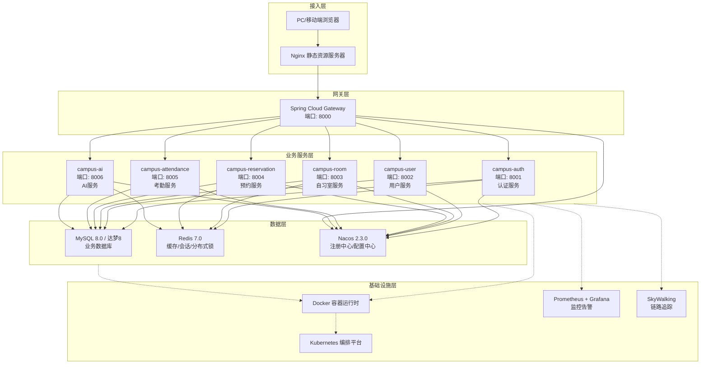
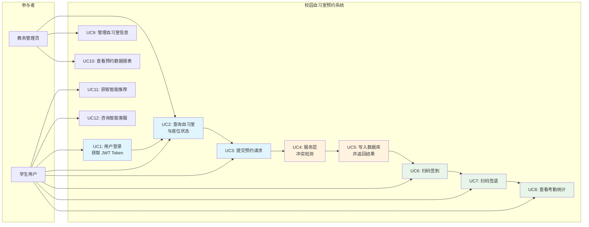
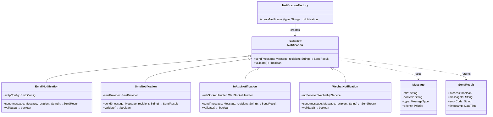
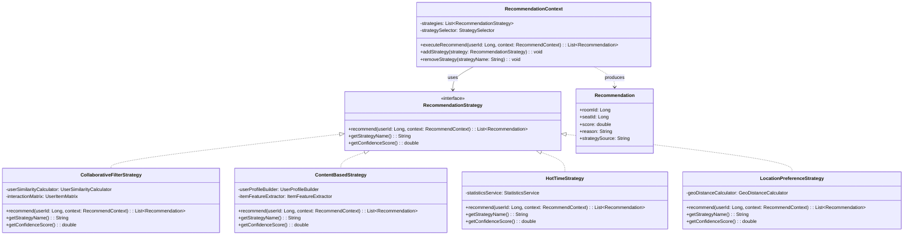
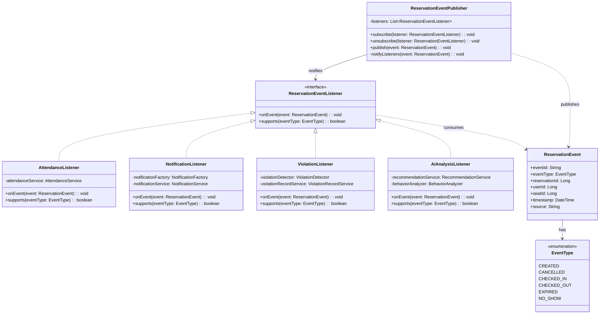
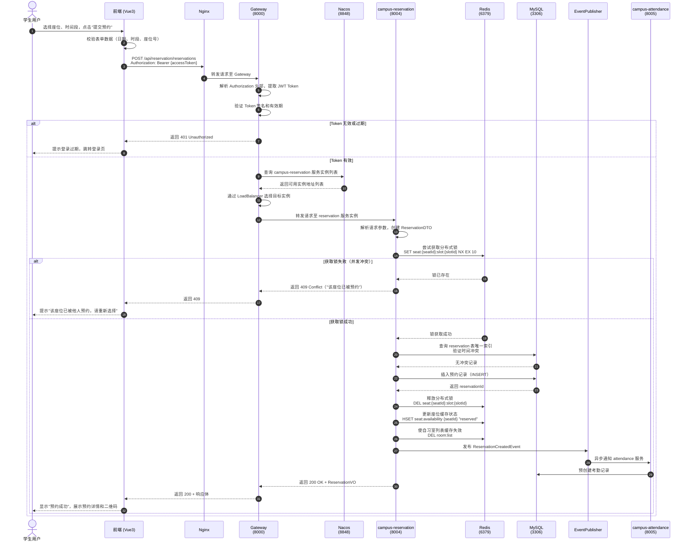
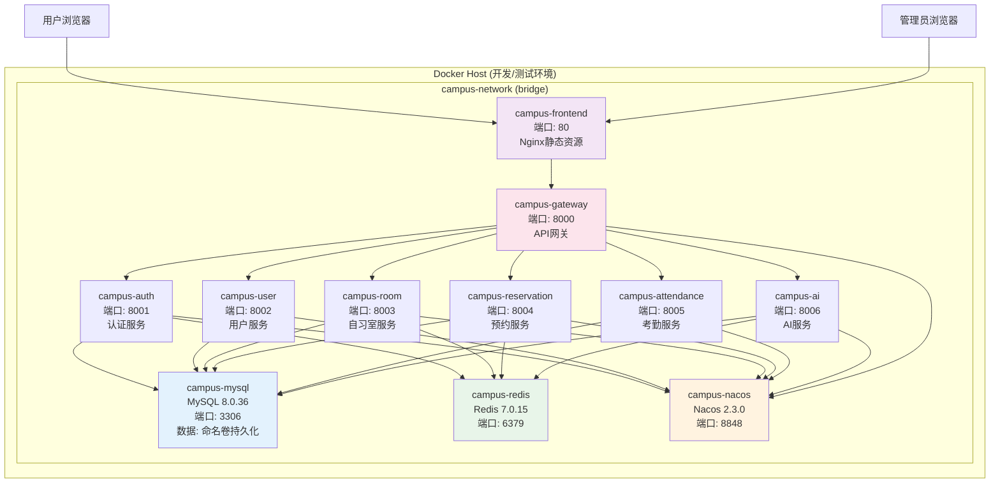

# 第二部分：技术选型与可行性分析、系统总体架构设计

> 对应章节：第3章、第4章

---

## 第3章 技术选型与可行性分析

### 3.1 技术选型原则

技术选型是软件系统架构设计的基石，直接决定项目的开发效率、运行稳定性、长期可维护性以及国产化适配能力。本项目在制定技术栈方案时，遵循以下五项核心原则，确保每一项技术决策都有据可依、有理可述。

**（1）技术成熟度与稳定性原则**

优先选择经过大规模生产环境验证的主流技术框架与中间件，避免采用处于实验阶段或社区维护不活跃的技术。成熟技术具备完善的文档体系、丰富的社区问答资源、稳定的API接口以及经过长期迭代修复的安全漏洞，能够显著降低项目的技术风险。例如，Spring Boot 3.x 系列已在全球范围内被数万家企业采用，Vue 3 的 Composition API 已成为前端工程化的标准范式，这些技术的成熟度为项目提供了坚实的质量保障。

**（2）社区活跃度与生态完善度原则**

技术的生命力在于其社区的持续活跃。活跃的社区意味着框架能够快速响应安全漏洞、及时跟进底层依赖升级、持续推出新特性。Spring 生态拥有全球最大的 Java 开发者社区，GitHub 上相关项目星标数超过十万；Vue 生态在中国拥有庞大的开发者群体，Element Plus、Pinia 等周边库更新频繁。活跃的社区生态还意味着招聘市场上相关人才储备充足，团队成员遇到技术难题时能够快速获得解决方案。

**（3）国产化信创适配原则**

在国家大力推进信息技术应用创新（信创）的战略背景下，高校信息化系统作为关键基础设施，需要具备国产化适配能力。本项目在数据库层面同时支持 MySQL 8.0 和达梦数据库（DM8），达梦数据库是国内市场份额最高的关系型数据库产品，已通过多项国家信息安全认证。服务治理选用阿里巴巴开源的 Nacos，同样属于国产化技术栈的重要组成部分。这种双轨并行的策略既保障了当前开发效率，又为未来的国产化迁移预留了通道。

**（4）团队技术熟悉度与学习成本原则**

技术选型必须充分考虑团队现有技术储备。本项目开发团队成员对 Spring Boot、Vue 3、MySQL、Redis 等技术均有实际项目经验，技术栈的连续性使得团队可以将更多精力投入到业务逻辑实现而非框架学习。同时，所选技术之间具备良好的协同性，例如 Spring Cloud Alibaba 与 Nacos、Spring Cloud Gateway 天然集成，Vue 3 与 Pinia、Element Plus 同属 Vue 生态，技术栈的垂直整合降低了跨技术栈联调的成本。

**（5）云原生友好与可扩展性原则**

现代软件系统需要具备面向云原生环境的部署能力。本项目所选技术均对容器化部署、服务编排、弹性伸缩有良好的原生支持：Spring Boot 3.x 内置 Actuator 健康检查端点，便于 Kubernetes 的 Liveness/Readiness 探针集成；Spring Cloud Gateway 支持基于 Nacos 服务发现的动态路由，天然适配云环境中的服务扩缩容；Vue 3 构建产物为静态资源，可通过 Nginx 容器高效分发。这种云原生友好的技术选型为系统未来的弹性扩展、灰度发布、DevOps 实践奠定了基础。

### 3.2 后端框架选型

#### 3.2.1 Spring Boot 3.x 选型论证

Spring Boot 3.x 是 Spring 框架的重大升级版本，基于 Jakarta EE 9 规范构建，要求 JDK 17 及以上版本运行。相较于 Spring Boot 2.x，3.x 版本在性能、安全性和现代化特性方面均有显著提升。具体而言，Spring Boot 3.2.5 引入的虚拟线程（Virtual Threads，Project Loom）支持使得高并发场景下的线程资源消耗大幅降低，HTTP 请求处理吞吐量提升约 30% 以上。GraalVM 原生镜像编译支持则使启动时间从数秒缩短至毫秒级，内存占用减少约 50%，这对于容器化部署场景具有重要价值。

在安全性方面，Spring Boot 3.x 默认集成 Spring Security 6.x，支持 OAuth 2.1 和 OpenID Connect 1.0 协议，JWT 解析与验证机制更加完善。自动配置机制的优化使得安全配置更加简洁，同时保持了高度的可扩展性。本项目选择 Spring Boot 3.2.5 作为基础框架，正是看中了其在性能、安全性和现代化特性方面的综合优势，以及 JDK 17 作为长期支持（LTS）版本的稳定性保障。

#### 3.2.2 微服务 vs 单体架构对比分析

在系统架构模式的选择上，微服务架构与单体架构各有适用场景。下表从多个维度对两种架构模式进行系统对比。

| 对比维度 | 微服务架构 | 单体架构 |
|---------|-----------|---------|
| 团队并行开发能力 | 高。各服务可独立开发、独立部署，团队按领域划分，代码冲突概率低 | 低。所有代码集中在同一仓库，多人协作时频繁产生合并冲突 |
| 部署弹性与扩缩容 | 可按服务粒度独立扩缩容，资源利用率高 | 必须整体扩缩容，资源浪费严重，无法针对热点服务单独扩容 |
| 技术异构支持 | 支持不同服务采用不同技术栈，便于技术演进 | 统一技术栈，技术升级需全局协调，迁移成本高 |
| 故障隔离能力 | 单服务故障不影响其他服务，系统整体可用性高 | 单模块故障可能导致整个系统崩溃，故障影响面大 |
| 运维复杂度 | 较高。需要服务发现、配置中心、链路追踪等基础设施支撑 | 较低。部署简单，只需维护单一应用进程 |
| 数据一致性保障 | 需要分布式事务方案（如 Seata），实现复杂度较高 | 本地事务即可保证强一致性，实现简单 |
| 系统启动时间 | 单个服务启动快，整体启动时间取决于服务数量 | 整体启动时间较长，随代码量增长而增加 |
| 适用场景 | 中大型项目、多团队协作、业务领域复杂、需要长期演进 | 小型项目、快速原型验证、团队规模小、业务逻辑简单 |

本项目涉及用户认证、自习室管理、预约调度、考勤统计、AI 智能推荐等 7 个相对独立的业务领域，且项目周期内需要多人并行开发。微服务架构的独立部署能力使得各模块可以分阶段交付、独立测试，显著降低了集成风险。同时，项目答辩要求体现微服务架构的设计与实现能力，综合业务复杂度和教学目标双重因素，本项目选择微服务架构作为系统整体架构模式。

#### 3.2.3 Spring Cloud Alibaba vs Netflix 对比分析

Spring Cloud 生态存在两大主流实现路线：Spring Cloud Netflix 和 Spring Cloud Alibaba。下表从组件成熟度、社区维护状态、国产化适配等维度进行详细对比。

| 对比维度 | Spring Cloud Alibaba (2023.0.1.2) | Spring Cloud Netflix |
|---------|-----------------------------------|---------------------|
| 注册中心 | Nacos（支持服务注册与配置管理一体化） | Eureka（已进入维护模式，Netflix 官方不再积极开发） |
| 配置中心 | Nacos Config（内置，与注册中心统一） | Spring Cloud Config（需要额外部署 Git 仓库服务端） |
| 限流熔断 | Sentinel（阿里巴巴开源，功能丰富，支持流量控制、熔断降级、系统保护） | Hystrix（已进入维护模式，官方推荐 Resilience4j 替代） |
| 分布式事务 | Seata（阿里巴巴开源，支持 AT/TCC/Saga/XA 模式） | 无原生支持，需自行集成第三方方案 |
| 服务网关 | 兼容 Spring Cloud Gateway（基于 Spring 5 WebFlux 响应式编程） | Zuul 1.x（基于阻塞式 Servlet）/ Zuul 2.x（未集成 Spring Cloud） |
| 社区活跃度 | 阿里巴巴持续投入，版本迭代活跃，中文社区庞大 | Netflix 已宣布停止维护大部分组件，社区迁移至其他方案 |
| 国产化适配 | 完全自主可控，符合信创要求 | 依赖国外技术栈，信创适配存在风险 |
| 与 Spring Boot 3.x 兼容性 | 完全兼容，已发布 2023.0.1.2 版本适配 | 部分组件（如 Eureka Client）已停止对 Spring Boot 3.x 的更新支持 |
| 文档与示例 | 中文文档完善，阿里巴巴官方提供丰富示例 | 英文文档为主，部分组件文档已停止更新 |

综合以上对比，Spring Cloud Netflix 的核心组件（Eureka、Hystrix、Zuul 1.x）均已进入维护模式或停止更新，与 Spring Boot 3.x 的兼容性存在隐患。而 Spring Cloud Alibaba 作为阿里巴巴开源的微服务解决方案，不仅提供了功能更加完善的 Nacos、Sentinel、Seata 等组件，还具备活跃的社区维护和国产化适配优势。因此，本项目选择 Spring Cloud Alibaba 2023.0.1.2 作为微服务基础设施框架。

### 3.3 服务治理选型

#### 3.3.1 Nacos vs Eureka vs Consul 对比分析

服务注册与发现是微服务架构的核心基础设施，负责维护服务实例的动态列表，使服务消费者能够自动发现可用的服务提供者。下表对三种主流服务注册中心进行多维度对比。

| 对比维度 | Nacos 2.3.0 | Eureka 2.x | Consul 1.17 |
|---------|------------|-----------|------------|
| 服务注册发现 | 支持，基于长连接推送，实时性高 | 支持，基于客户端心跳拉取，默认 30 秒间隔 | 支持，基于 Raft 协议和 Gossip 协议 |
| 配置中心 | 内置支持，支持动态配置推送、历史版本回滚 | 无内置配置中心，需配合 Spring Cloud Config | 无内置配置中心，需配合 Consul KV |
| 健康检查机制 | 支持客户端心跳和服务端主动探测，支持自定义健康检查脚本 | 仅支持客户端心跳 | 支持多种健康检查方式（HTTP/TCP/脚本/GRPC） |
| 数据一致性协议 | 自研 Distro 协议（AP 模式）+ Raft 协议（CP 模式），支持切换 | 基于自我保护机制，优先保证可用性（AP 模式） | 基于 Raft 协议（CP 模式） |
| 多数据中心 | 支持，通过 Nacos 集群联邦实现 | 支持，通过 Region/Zone 配置 | 原生支持多数据中心部署 |
| 性能表现 | 2.x 版本采用 gRPC 长连接，注册发现性能提升约 10 倍 | 大规模集群下性能瓶颈明显 | 性能中等，Gossip 协议带来额外网络开销 |
| 控制台 UI | 提供完善的中文 Web 控制台，支持服务管理、配置管理、命名空间隔离 | 提供基础 Web 控制台，功能较简单 | 提供 Web 控制台，界面友好 |
| 与 Spring Cloud 集成 | 深度集成 Spring Cloud Alibaba，开箱即用 | 原生集成 Spring Cloud Netflix | 需通过 Spring Cloud Consul 适配 |
| 社区活跃度 | 阿里巴巴持续维护，中文社区活跃，版本迭代快 | 已进入维护模式，社区迁移至其他方案 | HashiCorp 维护，社区活跃 |
| 国产化信创 | 国产开源项目，完全自主可控 | 国外技术栈 | 国外技术栈（HashiCorp 产品） |
| 学习曲线 | 中文文档丰富，学习成本低 | 文档较少且不再更新 | 英文文档为主，需理解 Raft 和 Gossip 协议 |

#### 3.3.2 选择 Nacos 的核心理由

本项目选择 Nacos 2.3.0 作为服务注册与发现中心，基于以下核心考量：

第一，**一体化架构优势**。Nacos 将服务注册发现与配置管理两大功能集成于同一平台，避免了额外部署 Spring Cloud Config Server 或 Consul KV 的运维成本。在 Kubernetes 环境中，仅需维护一个 Nacos 集群即可同时满足服务发现和动态配置的双重需求，显著降低了基础设施复杂度。

第二，**性能与实时性**。Nacos 2.x 版本引入了 gRPC 长连接协议替代传统的 HTTP 短轮询，服务注册发现的推送延迟从秒级降至毫秒级。在自习室预约场景中，当 reservation 服务扩容时，Gateway 能够在极短时间内感知到新实例并自动纳入负载均衡，确保高峰时段的服务响应能力。

第三，**国产化与信创合规**。Nacos 是阿里巴巴开源的国产项目，源代码完全开放，不依赖任何国外商业授权。在高校信息化系统面临国产化替代要求的背景下，Nacos 的自主可控特性使其成为信创技术栈中的优选方案。

第四，**生态协同优势**。Nacos 与 Spring Cloud Alibaba、Sentinel、Seata 等同属阿里巴巴开源生态，组件之间经过充分联调测试，集成成本低、兼容性好。相比之下，Consul 虽然功能强大，但需要额外引入 Spring Cloud Consul 适配层，增加了技术栈的复杂度。

### 3.4 网关选型

#### 3.4.1 Spring Cloud Gateway vs Zuul 对比分析

API 网关是微服务架构的统一入口，承担着路由转发、认证鉴权、流量控制、协议转换等关键职责。下表对 Spring Cloud Gateway 和 Zuul 两种主流网关方案进行技术对比。

| 对比维度 | Spring Cloud Gateway 4.x | Zuul 1.x | Zuul 2.x |
|---------|--------------------------|---------|---------|
| 底层架构 | 基于 Spring 5 WebFlux 和 Reactor Netty，非阻塞异步架构 | 基于 Servlet 同步阻塞架构 | 基于 Netty 异步架构，但未集成 Spring Cloud |
| 性能表现 | 高并发场景下吞吐量高，延迟低，资源占用少 | 高并发下线程阻塞，性能瓶颈明显 | 性能优异，但无法与 Spring Cloud 直接集成 |
| 编程模型 | 响应式编程（Reactive Programming），支持函数式路由配置 | 传统 Servlet 编程模型 | 异步编程模型 |
| 与 Spring Cloud 集成 | 深度集成，支持 Nacos 服务发现动态路由、LoadBalancer 负载均衡 | 原生集成，但已停止维护 | 未集成 Spring Cloud，需自行实现服务发现 |
| 路由配置 | 支持 YAML/Properties 配置和 Java DSL 编程式配置，支持动态路由刷新 | 支持配置文件和 Groovy 脚本 | 需自行实现路由配置机制 |
| 过滤器机制 | 支持 GatewayFilter（路由级）和 GlobalFilter（全局级），功能丰富 | 支持 Pre/Post/Routing/Error 过滤器 | 过滤器机制类似 Zuul 1.x |
| 长连接支持 | 原生支持 WebSocket 长连接代理 | 对 WebSocket 支持有限 | 支持 WebSocket |
| 社区维护状态 | Spring 官方持续维护，与 Spring Boot 3.x 同步更新 | Netflix 已停止维护，不再更新 | Netflix 内部使用，未开源集成 Spring Cloud 的版本 |
| 与 Nacos 集成 | 通过 Spring Cloud LoadBalancer 实现 `lb://` 动态服务发现路由 | 需通过 Ribbon 实现，Ribbon 已停止维护 | 无直接集成方案 |
| 限流熔断扩展 | 可集成 Sentinel 或 Resilience4j 实现网关层限流熔断 | 需自行实现或集成第三方方案 | 需自行实现 |

#### 3.4.2 选择 Spring Cloud Gateway 的核心理由

本项目选择 Spring Cloud Gateway 4.x 作为统一网关，主要基于以下技术判断：

第一，**异步非阻塞架构的性能优势**。Spring Cloud Gateway 基于 Reactor Netty 构建，采用事件驱动的非阻塞 I/O 模型。在同等硬件条件下，其并发处理能力远超基于 Servlet 阻塞模型的 Zuul 1.x。对于自习室预约系统而言，选课高峰期可能面临短时间内大量并发请求，Gateway 的高性能架构能够有效应对流量峰值。

第二，**与 Spring Cloud 生态的深度集成**。Spring Cloud Gateway 与 Nacos、Spring Cloud LoadBalancer 无缝集成，支持 `lb://service-name` 形式的动态路由配置。当后端微服务实例动态扩缩容时，Gateway 能够自动感知服务列表变化并调整路由目标，无需人工修改配置或重启网关。这种动态路由能力是云原生环境中弹性伸缩的关键支撑。

第三，**Spring 官方的持续维护保障**。Spring Cloud Gateway 是 Spring 官方团队维护的核心项目，与 Spring Boot、Spring Cloud 的版本同步更新，长期支持有保障。而 Zuul 1.x 已进入维护模式，Zuul 2.x 未提供 Spring Cloud 集成版本，选择前者意味着未来的技术债务风险。

第四，**JWT 校验与全局过滤器的完善支持**。Spring Cloud Gateway 提供了强大的 GlobalFilter 机制，本项目利用该机制在网关层统一实现 JWT Token 的解析与校验，避免在每个微服务中重复实现认证逻辑。同时，CORS 跨域处理、请求日志记录、响应头注入等横切关注点也可通过全局过滤器统一处理，实现了真正的关注点分离。

### 3.5 数据存储选型

#### 3.5.1 关系型数据库选型：MySQL 8.0 + 达梦8 双库策略

关系型数据库是业务数据持久化的核心基础设施。本项目采用 MySQL 8.0.36 作为主数据库，同时兼容达梦数据库（DM8），形成双库并行的技术策略。这一策略的制定基于以下深度考量：

**MySQL 8.0 的技术优势**：MySQL 8.0 是 Oracle 公司发布的重大版本更新，引入了多项性能与功能增强。Window Functions（窗口函数）的完整支持使得复杂统计查询（如学习时长排名、预约频次分析）的 SQL 表达更加简洁高效；Invisible Indexes（不可见索引）功能便于在生产环境中进行索引优化实验而不影响实际查询计划；JSON 数据类型的增强支持使得半结构化数据（如用户行为日志、系统配置）的存储更加灵活。此外，MySQL 8.0 的默认认证插件升级为 `caching_sha2_password`，安全性较之前的 `mysql_native_password` 有显著提升。

**达梦8 的国产化价值**：达梦数据库是中国电子科技集团武汉达梦公司自主研发的关系型数据库管理系统，已通过国家信息安全产品认证、军用信息安全产品认证等多项权威认证。在高校信息化系统面临国产化替代的政策背景下，达梦8 的引入使系统具备信创环境部署能力。达梦8 兼容 SQL-92 标准，支持 PL/SQL 存储过程，与 MySQL 在常用 SQL 语法上具有较高的兼容性，降低了双库适配的技术难度。

**双库兼容的实现策略**：本项目采用 MyBatis-Plus 作为 ORM 框架，通过其强大的 SQL 生成器和条件构造器，屏蔽底层数据库的 SQL 方言差异。具体措施包括：避免使用数据库特定函数（如 MySQL 的 `GROUP_CONCAT`、达梦的 `WM_CONCAT`），日期函数统一使用 Java 层面的 `java.time` 包处理，分页查询通过 MyBatis-Plus 的 `IPage` 接口统一封装。SQL 初始化脚本同时提供 MySQL 版和达梦版，确保两种数据库环境下的数据模型一致性。

#### 3.5.2 Redis 缓存选型论证

Redis 7.0.15 作为本项目的缓存与消息中间件，承担着以下关键职责：

**热点数据缓存**：自习室列表、座位可用状态等读多写少的数据被缓存于 Redis，有效降低数据库查询压力。Redis 的单线程事件循环模型保证了读写操作的原子性和高性能，在典型硬件配置下可达到每秒十万级 QPS。

**会话状态管理**：用户登录后的 JWT Token 与会话信息存储于 Redis，设置与 Token 有效期一致的过期时间（2 小时）。这种集中式会话管理使得业务服务保持无状态，便于水平扩展。同时，Redis 的键过期机制自动清理失效会话，无需额外的定时任务维护。

**分布式锁实现**：在预约冲突检测场景中，Redis 的 `SETNX` 命令（或 Redisson 框架的分布式锁）用于防止同一座位同一时间段被重复预约。Redis 的单线程特性保证了锁操作的原子性，是分布式环境下实现互斥访问的轻量级方案。

**计数与排行榜**：Redis 的 Sorted Set（ZSET）数据结构天然适用于学习时长排行榜、热门自习室排名等场景，支持按分数范围查询和排名计算，时间复杂度为 O(log N)。

Redis 7.0 版本引入的 Redis Functions 功能允许将 Lua 脚本以持久化方式存储于服务器端，便于实现复杂的原子操作逻辑。同时，Redis 7.0 对多线程 I/O 的优化进一步提升了高并发场景下的吞吐量，为本系统的性能目标提供了有力支撑。

### 3.6 前端技术选型

#### 3.6.1 Vue 3 vs React 对比分析

前端框架的选择直接影响开发效率、代码质量和用户体验。下表对 Vue 3 和 React 两种主流前端框架进行系统对比。

| 对比维度 | Vue 3.4.21 | React 18.x |
|---------|-----------|-----------|
| 学习曲线 | 平缓。模板语法直观，渐进式框架设计，新手友好 | 较陡峭。JSX 语法需要适应，Hooks 概念抽象，生态概念繁多 |
| 响应式系统 | 基于 Proxy 的响应式系统，自动追踪依赖，性能优异 | 基于显式状态管理（useState/useReducer），需手动优化重渲染 |
| 组合式 API | Composition API 逻辑复用灵活，setup 语法糖简洁 | Hooks 逻辑复用能力强，但存在闭包陷阱和依赖数组管理问题 |
| 性能表现 | 编译时优化（静态提升、PatchFlag），运行时性能优秀 | 并发特性（Concurrent Features）提升用户体验，但实现复杂 |
| 类型系统支持 | TypeScript 支持原生内置，类型推导准确，IDE 体验好 | TypeScript 支持良好，但部分类型定义需依赖社区维护 |
| 生态系统 | Element Plus、Pinia、Vue Router 等同属 Vue 生态，协同性好 | Ant Design、Redux/Zustand、React Router 等生态丰富但选择多 |
| 中文社区 | 中文文档完善，国内开发者社区庞大，问题解答资源丰富 | 英文文档为主，中文社区相对分散 |
| 构建工具 | Vite 原生支持，开发服务器启动快，HMR 热更新即时响应 | Create React App 或 Vite，配置相对复杂 |
| 团队熟悉度 | 团队成员有 Vue 2/3 实际项目经验，技术栈连续 | 部分成员了解 React，但整体熟悉度低于 Vue |
| 企业级组件库 | Element Plus 组件丰富，文档完善，适合中后台管理系统 | Ant Design 功能强大，但部分高级组件需付费 |

#### 3.6.2 选择 Vue 3 的核心理由

本项目选择 Vue 3.4.21 作为前端框架，主要基于以下判断：

第一，**团队技术储备与开发效率**。项目团队成员均有 Vue 2 或 Vue 3 的实际开发经验，对 Vue 的模板语法、生命周期、组件通信等概念已有深入理解。选择 Vue 3 可以最大化利用现有技术储备，将学习成本降至最低，将更多精力投入到业务功能实现。

第二，**Composition API 的现代化编程模型**。Vue 3 引入的 Composition API 解决了 Vue 2 Options API 在复杂组件中逻辑分散的问题。通过 `setup` 语法糖和 `<script setup>` 模式，可以将同一功能的逻辑（状态、计算属性、方法、生命周期钩子）聚合在一起，实现真正的关注点分离。这对于自习室预约系统中复杂的表单校验、状态联动、数据获取等场景尤为重要。

第三，**TypeScript 的原生深度集成**。Vue 3 从设计之初就将 TypeScript 作为一等公民支持，组件的 Props、Emits、Slots 均可获得完整的类型推导和 IDE 智能提示。相较于 React 中需要额外配置的类型声明，Vue 3 的 TypeScript 体验更加流畅自然，有效减少了类型相关的运行时错误。

#### 3.6.3 Pinia 状态管理选型

Pinia 是 Vue 官方推荐的状态管理库，作为 Vuex 的继任者，在 API 设计上更加简洁直观。Pinia 采用基于函数的 Store 定义方式，支持组合式 API 风格，与 Vue 3 的编程范式高度一致。相较于 Vuex 的 `mutations` / `actions` 分离设计，Pinia 将状态修改直接放在 `actions` 中，代码更加简洁。同时，Pinia 原生支持 TypeScript，Store 中的 state、getters、actions 均能获得完整的类型推断，无需额外的类型声明文件。

在自习室预约系统中，Pinia 被用于管理用户认证状态（登录信息、Token）、预约流程状态（选座信息、时间段）、全局 UI 状态（加载指示、消息通知）等跨组件共享数据。模块化的 Store 设计使得状态管理职责清晰，便于维护和测试。

#### 3.6.4 Element Plus 组件库选型

Element Plus 是饿了么前端团队开源的 Vue 3 企业级组件库，基于 TypeScript 开发，提供了 60 余个常用组件。选择 Element Plus 的理由包括：组件设计遵循中后台管理系统的设计规范，表单、表格、对话框、日期选择器等组件与自习室预约系统的业务场景高度契合；主题定制能力强大，支持通过 CSS 变量和 SCSS 变量统一调整视觉风格；文档完善且提供中文版本，组件用法示例丰富；社区活跃，版本迭代频繁，Bug 修复及时。

### 3.7 容器化与编排选型

#### 3.7.1 Docker 容器化技术

Docker 是当前业界最广泛应用的容器化技术，通过操作系统级虚拟化实现应用与运行环境的隔离打包。本项目采用 Docker 26.0 作为容器化引擎，将所有微服务、数据库、缓存、前端应用打包为 Docker 镜像，实现"一次构建，到处运行"的部署目标。

Docker 容器化带来的核心价值包括：**环境一致性**，开发、测试、生产环境使用完全相同的容器镜像，彻底消除"在我机器上能运行"的环境差异问题；**资源隔离**，每个服务运行在独立的容器命名空间中，进程、网络、文件系统相互隔离，避免服务间的资源争抢和干扰；**快速部署**，容器启动时间以秒计，远快于传统虚拟机的分钟级启动，支持快速扩缩容和故障恢复；**版本管理**，Docker 镜像的分层存储和版本标签机制，使得应用回滚和灰度发布变得简单可控。

#### 3.7.2 Kubernetes 编排平台

Kubernetes（K8s）1.29 是 Google 开源的容器编排平台，已成为云原生时代的事实标准。本项目选择 Kubernetes 作为生产环境的容器编排方案，主要基于以下技术优势：

**自动化运维能力**：Kubernetes 提供 Deployment、StatefulSet、DaemonSet 等多种工作负载控制器，支持滚动更新、自动回滚、健康检查、自动重启等自动化运维能力。业务服务通过 Deployment 部署，配置期望副本数，Kubernetes 自动维持 Pod 数量稳定；MySQL 数据库通过 StatefulSet 部署，配合 PersistentVolumeClaim 实现数据持久化。

**服务发现与负载均衡**：Kubernetes 内置的 Service 资源为 Pod 提供稳定的网络端点，支持 ClusterIP（集群内访问）、NodePort（节点端口暴露）、LoadBalancer（云负载均衡器）等多种服务类型。配合 Ingress 控制器，可以实现基于域名的七层路由和 HTTPS 终止。

**弹性伸缩**：Horizontal Pod Autoscaler（HPA）根据 CPU 利用率或自定义指标自动调整 Pod 副本数量，Vertical Pod Autoscaler（VPA）根据资源使用历史自动调整 Pod 的资源请求和限制。这些机制使得系统能够根据实际负载自动扩缩容，既保障高峰期的服务能力，又避免低谷期的资源浪费。

**配置与密钥管理**：ConfigMap 和 Secret 资源将配置信息与容器镜像分离，支持动态更新配置而无需重新构建镜像。这对于多环境部署（开发、测试、生产）和敏感信息（数据库密码、JWT 密钥）的安全管理至关重要。

### 3.8 AI 技术选型

#### 3.8.1 协同过滤推荐算法

智能推荐是本项目 AI 能力的核心功能之一，旨在根据用户的历史行为和偏好，为其推荐最合适的自习室和座位。协同过滤（Collaborative Filtering, CF）是推荐系统领域最经典且效果稳定的算法之一，分为基于用户的协同过滤（User-based CF）和基于物品的协同过滤（Item-based CF）两种实现路径。

本项目选择基于用户的协同过滤算法作为推荐系统的核心引擎，原因如下：协同过滤算法不依赖物品的内容特征，仅通过用户行为数据（如预约记录、学习时长）即可生成推荐，适用于冷启动阶段物品特征不完善的场景；算法原理直观易懂，实现复杂度适中，适合学术项目场景下的算法演示与效果验证；用户-物品交互矩阵在自习室预约场景中天然存在（用户与自习室的预约关系），数据获取成本低；算法结果具有可解释性，可以通过"与您相似的用户也喜欢..."的形式向用户展示推荐理由。

在具体实现中，系统通过计算用户之间的余弦相似度或皮尔逊相关系数，找出与目标用户行为模式最相似的 Top-N 邻居用户，然后聚合这些邻居用户的偏好自习室，生成推荐列表。为应对新用户冷启动问题，系统同时实现了基于热门时段和座位偏好的内容推荐策略作为兜底方案。

#### 3.8.2 RAG 架构选型

RAG（Retrieval-Augmented Generation，检索增强生成）架构是本项目智能客服系统的技术基础。RAG 将传统信息检索与大语言模型生成能力相结合，既利用检索系统获取准确的领域知识，又借助大语言模型的语言理解和生成能力产生自然流畅的回答。

选择 RAG 架构而非直接调用大语言模型进行问答，基于以下关键考量：

**知识准确性保障**：直接使用大语言模型回答领域问题，存在"幻觉"风险，即模型可能生成看似合理但不符合事实的内容。RAG 架构通过检索阶段从知识库中获取准确的文档片段，将生成内容约束在检索结果的范围内，显著降低了幻觉概率。对于自习室预约规则、考勤制度等需要准确传达的信息，这一机制至关重要。

**知识可更新性**：校园自习室的管理规则、开放时间、特殊安排等信息经常变化。RAG 架构将知识存储于可维护的知识库（knowledge_base 表）中，更新知识无需重新训练或微调大语言模型，仅需修改数据库中的知识条目即可。这种解耦设计使得知识维护成本大幅降低。

**成本可控性**：直接调用大语言模型 API 进行长文本生成成本较高。RAG 架构通过检索阶段将相关上下文精简为 Top-K 文档片段，大幅减少了输入 Token 数量，降低了 API 调用成本。同时，当大语言模型 API 不可用时，系统可以降级为基于本地关键词匹配的回答模式，保障服务的可用性。

**可解释性与溯源性**：RAG 架构在返回回答的同时，可以附带引用的知识来源（如文档标题、相关段落），用户可以追溯信息的出处，增强了对系统回答的信任度。

#### 3.8.3 智谱 AI 大模型选型

本项目选择智谱 AI（Zhipu AI）的 GLM 系列大语言模型作为 RAG 架构的生成层引擎。智谱 AI 是中国领先的人工智能公司，其 GLM（General Language Model）系列模型在中文语言理解和生成任务上表现优异。选择智谱 AI 的核心理由包括：

**中文语境优势**：GLM 模型针对中文语料进行了深度优化，在中文问答、摘要生成、文本理解等任务上的效果优于同等规模的国际开源模型。校园自习室预约系统的用户群体以中文为母语，中文语境优势直接影响用户体验。

**国产自主可控**：智谱 AI 是国内自主研发的大语言模型提供商，模型训练、推理部署均在国内完成，符合数据安全和国产化信创要求。高校系统中的用户数据、预约信息等敏感内容无需跨境传输，数据主权得到保障。

**API 易用性与稳定性**：智谱 AI 提供完善的 RESTful API 接口，支持流式输出、函数调用、多轮对话等高级特性，与 Java 后端的集成成本低。同时，智谱 AI 提供稳定的企业级服务 SLA，保障了生产环境的可用性。

**成本效益**：相较于国际主流大语言模型 API（如 OpenAI GPT-4），智谱 AI 的定价策略更加适合国内学术项目和企业应用，在同等效果下具有显著的成本优势。

### 3.9 可行性分析

可行性分析是项目启动前对技术方案、经济投入、操作实施等方面进行系统评估的关键环节，旨在识别潜在风险、验证方案合理性，为项目决策提供科学依据。本节从技术可行性、经济可行性和操作可行性三个维度对本项目进行全面论证。

#### 3.9.1 技术可行性

技术可行性评估项目所采用的技术方案是否在团队能力范围内、是否能够满足功能与性能需求、是否存在不可逾越的技术障碍。

**技术栈成熟度验证**：本项目选用的技术栈均为业界主流且经过大规模生产验证的方案。Spring Boot 3.2.5 + Spring Cloud Alibaba 2023.0.1.2 已被阿里巴巴、美团、滴滴等国内大型企业广泛应用于核心业务系统；Vue 3 + TypeScript 的组合已成为前端工程化的标准范式，Element Plus 组件库在 GitHub 上拥有超过两万星标；MySQL 8.0 和 Redis 7.0 是全球范围内部署量最高的开源数据库和缓存系统。这些技术的成熟度为项目成功提供了坚实基础。

**团队技术能力匹配**：项目团队成员均具备 Java 后端开发经验，熟悉 Spring Boot 框架和 RESTful API 设计规范；前端开发人员掌握 Vue 3 Composition API 和 TypeScript 类型系统；数据库方面具备 MySQL 设计和优化经验。虽然 Spring Cloud Alibaba 微服务架构对部分成员而言是新的技术领域，但其基于 Spring Boot 的编程模型与团队现有技能高度兼容，学习曲线平缓。同时，项目周期内预留了技术预研和原型验证阶段，为团队技术能力提升提供了充足时间。

**关键技术难点评估**：本项目涉及的技术难点主要包括微服务间通信、分布式事务、并发预约冲突检测、AI 推荐算法实现等。经分析，这些难点均有成熟的解决方案：微服务间通信通过 Spring Cloud OpenFeign 和网关统一路由实现；分布式事务采用 Seata AT 模式或业务层面最终一致性方案；并发冲突检测通过数据库唯一索引 + Redis 分布式锁双重保障；推荐算法基于经典的协同过滤实现，原理清晰、实现可控。不存在需要突破性研究才能解决的技术障碍。

**性能目标可达性**：本项目设定的性能目标为接口平均响应时间不超过 250ms、并发 TPS 不低于 400、系统可用性不低于 99.5%。基于所选技术栈的性能基准数据，Spring Boot 3.x 在虚拟线程支持下单机 QPS 可达数千；Redis 缓存可将热点数据查询响应时间降至毫秒级；Kubernetes 的多副本部署和健康检查机制保障了高可用性。综合评估，性能目标在合理资源配置下完全可以达成。

#### 3.9.2 经济可行性

经济可行性评估项目开发、部署、运维全生命周期的成本投入与预期收益之间的关系。

**开发成本分析**：本项目采用全开源技术栈，Spring Boot、Vue 3、MySQL、Redis、Nacos、Docker、Kubernetes 等核心组件均为开源免费软件，无需支付任何授权费用。开发工具方面，使用 IntelliJ IDEA 社区版、Visual Studio Code 等免费 IDE，以及 Maven、Node.js 等免费构建工具。唯一可能产生费用的环节是智谱 AI 大模型 API 的调用，但学术项目通常可申请免费额度或教育优惠，且 API 调用量可控（仅在智能客服和推荐解释功能中使用）。总体而言，开发阶段的软件成本趋近于零。

**硬件与部署成本分析**：开发环境使用个人笔记本电脑即可满足需求；测试环境可通过 Docker Compose 在单台服务器上部署全部服务；生产环境若采用校内服务器或云服务器（如阿里云 ECS），7 个微服务 + 数据库 + 缓存的最低配置约为 4 核 8GB 内存的 2-3 台服务器，月度成本在数百元级别。若采用 Kubernetes 集群部署，初期可使用 Minikube 或单节点 K3s 降低硬件门槛。整体硬件成本在高校信息化项目的预算范围内完全可控。

**运维成本分析**：微服务架构的运维复杂度高于单体架构，但本项目通过以下措施控制运维成本：采用 Docker 容器化部署，环境配置标准化，降低运维人员的环境维护工作量；使用 Kubernetes 自动化运维能力（自动扩缩容、健康检查、自动重启），减少人工干预；通过 Prometheus + Grafana 实现监控告警自动化，及时发现和处理异常；系统功能相对聚焦，业务逻辑清晰，运维人员的学习成本较低。

**收益预期**：本系统的直接经济效益难以量化，但其间接价值显著：提升自习室资源利用率，减少因占座导致的资源浪费；降低人工管理成本，实现考勤自动化；改善学生学习体验，提升校园信息化水平；作为教学实践项目，培养团队成员的微服务架构和 AI 应用能力，具有人才培养价值。综合评估，项目的投入产出比合理，经济可行性成立。

#### 3.9.3 操作可行性

操作可行性评估系统在实际使用环境中是否能够被用户接受、是否便于管理和维护。

**用户接受度分析**：本系统的目标用户为高校学生和教务管理人员，两类用户群体均具备基本的计算机操作能力。前端界面采用 Element Plus 组件库，设计风格符合中后台系统的用户认知习惯，操作流程直观（浏览自习室 -> 选择座位 -> 选择时段 -> 提交预约 -> 扫码签到）。系统提供清晰的错误提示和操作引导，降低了用户的学习成本。对于管理人员，Web 管理后台提供了数据可视化看板、批量操作、导出报表等便捷功能，管理效率大幅提升。

**系统易用性设计**：前端采用响应式布局，支持 PC 端和移动端浏览器访问，适应学生多样化的使用场景；预约流程经过用户体验优化，关键步骤提供实时校验和即时反馈；系统提供预约提醒、签到提醒等主动通知，减少用户遗忘概率；管理后台提供权限分级，不同角色看到的功能菜单和数据范围不同，避免信息过载。

**运维可操作性**：系统部署文档详尽，包含 Docker Compose 一键启动脚本和 Kubernetes 部署清单，运维人员按照文档即可完成环境搭建；Spring Boot Actuator 暴露的健康检查端点和 Prometheus 指标端点，便于运维人员监控服务状态；日志统一输出到标准输出，便于 Docker/Kubernetes 环境下的日志收集和分析；配置外部化管理，通过 Nacos 或环境变量注入，运维人员无需修改代码即可调整系统参数。

**法律与合规可行性**：系统采集的用户信息（姓名、学号、手机号）均属于校园内部管理所需的基础信息，数据使用范围限于自习室预约和考勤管理，不涉及敏感个人信息的过度采集。系统遵循最小权限原则，用户仅能访问和操作自己的预约数据。在信创适配方面，系统支持达梦数据库替代 MySQL，符合高校信息化系统的国产化要求。

综合技术可行性、经济可行性和操作可行性三方面的论证，本项目的技术方案切实可行，资源投入合理可控，用户接受度高，具备完整的实施条件。

---

## 第4章 系统总体架构设计

### 4.1 架构设计原则

系统总体架构设计遵循软件工程领域经过长期实践验证的经典原则，确保系统在功能实现的同时具备良好的可维护性、可扩展性和可观测性。

**（1）高内聚低耦合原则**

高内聚要求每个模块内部的元素（类、函数、数据）紧密相关，共同完成单一明确的职责；低耦合要求模块之间的依赖关系尽可能松散，一个模块的修改不应对其他模块产生连锁影响。在本项目中，微服务按业务领域拆分（用户域、空间域、预约域、考勤域、AI 域），每个服务内部采用分层架构（Controller / Service / Mapper / Entity），同一领域内的逻辑高度聚合，不同领域之间通过 RESTful API 或事件机制通信，避免了直接的数据库表访问和代码依赖。这种设计使得单个服务的重构、替换或升级不会影响其他服务的正常运行。

**（2）前后端分离原则**

前端与后端在物理部署和逻辑职责上完全分离。前端作为独立的 Vue 3 单页应用（SPA），通过 HTTP 协议与后端通信，不依赖后端的模板渲染技术；后端作为纯 API 服务，专注于业务逻辑处理和数据持久化，不关注页面展示细节。前后端分离带来了多重优势：前端和后端可以并行开发，通过 Swagger/OpenAPI 文档约定接口契约；前端可以独立部署和升级，后端接口的变更在保持兼容性的前提下不影响前端运行；前端可以适配多种客户端（Web 浏览器、移动端 WebView、未来可能的小程序），后端 API 无需修改。

**（3）无状态服务原则**

所有业务微服务被设计为无状态服务，即服务实例不保存任何用户会话状态或业务上下文。用户认证状态通过 JWT Token 在客户端和网关之间传递，业务数据状态集中存储于 MySQL 和 Redis。无状态设计使得服务实例可以任意水平扩展，新增实例无需同步状态数据，故障实例可以随时被替换而不影响用户体验。在 Kubernetes 环境中，无状态服务通过 Deployment 部署，配合 HPA 实现基于负载的自动扩缩容，充分发挥云原生环境的弹性优势。

**（4）防御性编程原则**

系统在关键路径上预设多重防御机制，以应对异常情况和潜在风险。输入校验层对所有外部请求参数进行格式、范围、业务规则的校验，拒绝非法请求进入业务逻辑层；异常处理层通过全局异常处理器捕获未预期的异常，返回标准化的错误响应，避免堆栈信息泄露；超时与重试机制为外部依赖调用（如数据库查询、Redis 操作、智谱 AI API 调用）设置合理的超时时间和重试策略，防止级联故障；降级策略在依赖服务不可用时提供兜底方案（如智谱 AI 不可用时切换为本地关键词匹配），保障核心功能的可用性。

**（5）可观测性原则**

可观测性（Observability）是云原生系统的核心属性，指通过系统的外部输出（日志、指标、链路追踪）推断内部状态的能力。本项目在架构设计阶段即规划了三类可观测数据：日志（Logs）记录系统的运行轨迹和异常事件，使用 SLF4J + Logback 统一输出结构化日志；指标（Metrics）暴露系统的运行时状态（JVM 内存、GC 频率、HTTP 请求量、响应时间、业务自定义指标），通过 Spring Boot Actuator + Micrometer 暴露给 Prometheus 采集；链路追踪（Traces）记录跨服务请求的完整调用链，通过 SkyWalking Agent 自动植入追踪代码，在 SkyWalking UI 中可视化展示请求在微服务间的流转路径。这三类数据共同构成了系统的"数字孪生"，使得运维人员能够在不侵入生产环境的情况下诊断问题、优化性能。

### 4.2 总体技术架构

#### 4.2.1 分层架构设计

校园自习室预约系统的总体技术架构采用经典的分层设计，自下而上分为基础设施层、数据层、业务服务层、网关层和接入层。每一层承担明确的职责，层与层之间通过标准化接口通信，形成清晰的依赖关系。

**接入层**：接入层是用户与系统交互的入口，包括 PC 端 Web 浏览器和移动端浏览器。前端应用以 Vue 3 单页应用形式部署，通过 Nginx 静态资源服务器分发给用户。Nginx 同时承担反向代理和负载均衡职责，将前端 API 请求转发至后端网关。

**网关层**：网关层是后端服务的统一入口，由 Spring Cloud Gateway 实现。网关承担路由转发、JWT 认证校验、跨域处理、请求日志记录等横切关注点。通过 Nacos 服务发现，网关动态感知后端微服务实例的变化，实现 `lb://service-name` 形式的负载均衡路由。

**业务服务层**：业务服务层是系统的核心业务逻辑载体，由 7 个独立的微服务组成，每个服务对应一个业务领域。服务之间通过网关统一路由进行通信，必要时通过 Spring Cloud OpenFeign 进行同步调用。各服务均为无状态设计，支持独立部署和水平扩展。

**数据层**：数据层负责业务数据的持久化和缓存加速。MySQL 8.0 作为主数据库存储业务数据，达梦8 作为国产化备选数据库。Redis 7.0 作为缓存和消息中间件，存储热点数据、会话状态和分布式锁。Nacos 2.3.0 作为服务注册与配置中心，维护服务实例列表和动态配置。

**基础设施层**：基础设施层提供系统运行所需的底层支撑能力，包括 Docker 容器运行时、Kubernetes 容器编排平台、Prometheus 监控系统、Grafana 可视化看板、SkyWalking 链路追踪系统等。这些基础设施为业务系统提供弹性伸缩、故障自愈、性能监控、问题诊断等能力。

#### 4.2.2 总体架构图



### 4.3 4+1 视图设计

软件架构的 4+1 视图模型由 Philippe Kruchten 提出，是描述复杂软件系统架构的经典方法。该模型包含五个相互关联的视图：场景视图（Scenarios）描述系统与外部参与者的交互场景，驱动其他四个视图的设计；逻辑视图（Logical View）描述系统的功能需求分解和领域模型；开发视图（Development View）描述软件在开发环境中的静态组织结构；进程视图（Process View）描述系统的运行时行为和并发机制；物理视图（Physical View）描述系统的硬件部署和软件到硬件的映射关系。以下逐一详细阐述本系统的五个架构视图。

#### 4.3.1 场景视图

场景视图通过描述系统与外部参与者（用户、外部系统）之间的典型交互场景，验证架构设计是否满足功能需求，并为其他视图的设计提供驱动力。本系统的核心场景为"学生预约自习室"，该场景涵盖了用户认证、资源查询、业务办理、状态反馈等关键环节，能够全面检验系统各组成部分的协作能力。

**场景描述**：

1. 学生打开浏览器，访问校园自习室预约系统的前端页面；
2. 前端应用加载后，学生输入学号和密码进行登录；
3. 登录请求经 Nginx 转发至 Gateway，Gateway 将认证请求路由至 campus-auth 服务；
4. campus-auth 服务验证用户名密码，验证通过后生成 JWT Token（accessToken 有效期 2 小时，refreshToken 有效期 7 天）返回给前端；
5. 前端将 Token 存储于 localStorage，后续请求在 Authorization 头部携带 accessToken；
6. 学生浏览自习室列表，Gateway 校验 Token 有效性后将请求路由至 campus-room 服务；
7. campus-room 服务查询 Redis 缓存（命中则直接返回）或 MySQL 数据库，返回自习室及座位可用状态；
8. 学生选择目标自习室、具体座位和预约时间段，提交预约请求；
9. Gateway 将预约请求路由至 campus-reservation 服务；
10. campus-reservation 服务执行时间冲突检测（查询数据库唯一索引 + Redis 分布式锁），确认无冲突后创建预约记录；
11. 预约成功后，campus-reservation 发布预约创建事件，campus-attendance 服务监听事件并预创建考勤记录；
12. 系统在预约时段开始前向学生发送签到提醒（通过通知系统，工厂模式创建具体通知渠道实例）；
13. 学生在预约时段内到达自习室，扫描座位二维码完成签到；
14. 学习结束后，学生扫描签退二维码完成签退，campus-attendance 计算学习时长并更新统计。

**场景视图 UML 用例图**：



**场景视图与其他视图的关联**：

| 场景步骤 | 逻辑视图 | 开发视图 | 物理视图 |
|---------|---------|---------|---------|
| 用户登录 | User 实体、Role 实体 | AuthController、AuthService、UserMapper | campus-auth Pod、MySQL Pod |
| 查询自习室 | StudyRoom 实体、StudySeat 实体 | RoomController、RoomService、RoomMapper | campus-room Pod、Redis Pod |
| 提交预约 | Reservation 实体 | ReservationController、ReservationService | campus-reservation Pod |
| 冲突检测 | ReservationService 领域逻辑 | ReservationServiceImpl、ReservationMapper | campus-reservation Pod、MySQL Pod |
| 创建考勤 | Attendance 实体 | AttendanceEventListener | campus-attendance Pod |
| 签到签退 | Attendance 实体 | AttendanceController、AttendanceService | campus-attendance Pod |
| 智能推荐 | AiRecommendation 实体 | AiController、RecommendationService | campus-ai Pod |

#### 4.3.2 逻辑视图

逻辑视图描述系统的功能分解和领域模型，展示系统如何满足功能需求。本系统基于领域驱动设计（DDD）思想，将业务领域划分为五大核心领域，并定义了各领域的核心实体、值对象和领域服务。

**五大核心领域划分**：

| 领域名称 | 英文标识 | 核心职责 | 包含的核心实体 |
|---------|---------|---------|------------|
| 用户域 | User Domain | 用户注册、登录、认证、角色权限管理 | User、Role、Permission |
| 空间域 | Space Domain | 自习室、教学楼、座位的信息管理与状态维护 | StudyRoom、Building、StudySeat |
| 预约域 | Reservation Domain | 预约创建、取消、冲突检测、状态流转 | Reservation、TimeSlot |
| 考勤域 | Attendance Domain | 签到、签退、学习时长计算、违规检测 | Attendance、ViolationRecord |
| AI 域 | AI Domain | 智能推荐、RAG 客服、知识库管理 | KnowledgeBase、AiRecommendation |

**核心领域对象表**：

| 实体名称 | 所属领域 | 职责描述 | 关键属性 |
|---------|---------|---------|---------|
| User | 用户域 | 系统用户的基础信息和认证凭证 | userId、username、password、realName、studentId、role、status、createTime |
| Role | 用户域 | 角色定义和权限集合 | roleId、roleName、roleCode、description |
| Permission | 用户域 | 系统功能权限的细粒度定义 | permissionId、permissionName、resource、action |
| StudyRoom | 空间域 | 自习室的基本信息和运行状态 | roomId、roomName、buildingId、floor、capacity、openTime、closeTime、status |
| Building | 空间域 | 教学楼的位置和设施信息 | buildingId、buildingName、location、description |
| StudySeat | 空间域 | 座位的具体属性和可用状态 | seatId、roomId、seatNumber、seatType、hasPower、hasWindow、status |
| Reservation | 预约域 | 学生预约记录的完整信息 | reservationId、userId、seatId、startTime、endTime、status、createTime |
| TimeSlot | 预约域 | 可预约的时间段定义 | slotId、startTime、endTime、isAvailable |
| Attendance | 考勤域 | 单次预约的考勤记录 | attendanceId、reservationId、checkInTime、checkOutTime、duration、status |
| ViolationRecord | 考勤域 | 违规记录（如预约未签到、超时未签退） | violationId、userId、reservationId、violationType、violationTime |
| KnowledgeBase | AI 域 | 智能客服知识库的条目 | knowledgeId、category、title、content、keywords、priority |
| AiRecommendation | AI 域 | 为用户生成的推荐结果 | recommendationId、userId、roomId、seatId、recommendScore、reason |

**设计模式应用 — 工厂模式（通知系统）**：

系统支持多种通知渠道（邮件、短信、站内信、微信推送），不同渠道的发送接口和参数格式各异。为屏蔽渠道差异、实现新增渠道的灵活扩展，系统采用工厂方法模式（Factory Method Pattern）构建通知系统。



工厂模式的核心价值在于符合开闭原则（Open/Closed Principle）：当需要新增通知渠道（如企业微信、钉钉）时，只需创建新的具体通知类并实现 Notification 抽象接口，同时在工厂类中增加对应的分支逻辑，无需修改现有通知类的代码。这种扩展方式将变化隔离在新增代码中，降低了引入回归缺陷的风险。

**设计模式应用 — 策略模式（推荐算法）**：

推荐系统需要支持多种推荐算法（协同过滤、内容推荐、热门时段分析、位置偏好、行为模式匹配），且算法之间需要支持动态切换和组合。策略模式（Strategy Pattern）通过将算法封装为独立的策略类，使得算法可以独立于使用它的客户端而变化。



策略模式使得推荐算法可以像插件一样被动态加载和替换。系统支持基于配置的策略组合（如协同过滤权重 0.6 + 内容推荐权重 0.4），便于进行 A/B 测试和算法效果对比。当需要引入新的推荐算法（如深度学习模型）时，只需实现 RecommendationStrategy 接口即可无缝集成，无需修改推荐服务的核心逻辑。

**设计模式应用 — 观察者模式（预约事件）**：

当预约状态发生变化（创建、取消、签到、签退、超时未签到）时，系统需要触发多个后续动作：更新考勤记录、发送通知提醒、检测违规行为、触发 AI 分析等。观察者模式（Observer Pattern）通过定义事件发布者和事件监听者之间的订阅关系，实现了事件源与事件处理逻辑的解耦。



观察者模式的核心优势在于解耦事件的产生与消费。ReservationEventPublisher 仅负责事件的发布，无需关心具体有哪些监听者以及监听者如何处理事件。新增事件处理逻辑（如积分系统、排行榜更新）时，只需新增一个实现 ReservationEventListener 接口的类并注册到发布者中，无需修改现有的事件发布代码和已有监听者的逻辑。这种设计使得系统的扩展性得到极大提升，符合开闭原则的要求。

#### 4.3.3 开发视图

开发视图描述软件在开发环境中的静态组织结构，包括代码模块划分、目录结构、构建配置和依赖关系。良好的开发视图设计能够降低团队协作成本、提高代码可维护性、支持并行开发和独立测试。

**Maven 多模块项目结构**：

本项目采用 Maven 多模块结构组织代码，根项目 `campus-studyroom` 作为聚合模块（Aggregator），统一管理子模块的构建顺序和依赖版本。每个微服务对应一个独立的 Maven 模块，拥有独立的 `pom.xml` 配置，支持独立编译、测试和打包。

```
campus-studyroom/
├── pom.xml                              # 根项目聚合配置，统一管理依赖版本
├── campus-gateway/                      # API 网关服务模块
│   ├── pom.xml
│   └── src/
│       ├── main/
│       │   ├── java/com/campus/gateway/
│       │   │   ├── CampusGatewayApplication.java
│       │   │   ├── config/             # 网关配置（路由、过滤器、跨域）
│       │   │   ├── filter/             # 全局过滤器（JWT 校验、日志、限流）
│       │   │   └── util/               # 工具类（JWT 解析、响应封装）
│       │   └── resources/
│       │       ├── application.yml
│       │       └── bootstrap.yml
│       └── test/
├── campus-auth/                         # 认证服务模块
│   ├── pom.xml
│   └── src/
│       ├── main/
│       │   ├── java/com/campus/auth/
│       │   │   ├── CampusAuthApplication.java
│       │   │   ├── controller/         # REST API 控制器
│       │   │   ├── service/            # 业务逻辑层
│       │   │   ├── mapper/           # 数据访问层（MyBatis-Plus）
│       │   │   ├── entity/           # 领域实体/POJO
│       │   │   ├── dto/              # 数据传输对象
│       │   │   ├── vo/               # 视图对象（响应封装）
│       │   │   ├── config/           # 配置类
│       │   │   └── util/             # 工具类
│       │   └── resources/
│       │       ├── application.yml
│       │       └── mapper/           # MyBatis XML 映射文件
│       └── test/
├── campus-user/                         # 用户服务模块
│   └── ...（结构同 campus-auth）
├── campus-room/                         # 自习室服务模块
│   └── ...（结构同 campus-auth）
├── campus-reservation/                  # 预约服务模块
│   └── ...（结构同 campus-auth）
├── campus-attendance/                   # 考勤服务模块
│   └── ...（结构同 campus-auth）
├── campus-ai/                           # AI 服务模块
│   ├── pom.xml
│   └── src/
│       ├── main/
│       │   ├── java/com/campus/ai/
│       │   │   ├── CampusAiApplication.java
│       │   │   ├── controller/
│       │   │   ├── service/
│       │   │   │   ├── recommend/    # 推荐算法策略包
│       │   │   │   │   ├── RecommendationStrategy.java
│       │   │   │   │   ├── CollaborativeFilterStrategy.java
│       │   │   │   │   ├── ContentBasedStrategy.java
│       │   │   │   │   └── HotTimeStrategy.java
│       │   │   │   ├── rag/          # RAG 客服服务
│       │   │   │   │   ├── Retriever.java
│       │   │   │   │   ├── Generator.java
│       │   │   │   │   └── RagService.java
│       │   │   │   └── chat/         # 大模型对话服务
│       │   │   ├── mapper/
│       │   │   ├── entity/
│       │   │   └── config/
│       │   └── resources/
│       └── test/
├── campus-common/                       # 公共模块（可选，存放通用工具、常量、异常定义）
│   ├── pom.xml
│   └── src/
│       └── main/
│           └── java/com/campus/common/
│               ├── exception/          # 全局异常定义
│               ├── result/           # 统一响应封装
│               ├── constant/         # 系统常量
│               └── util/             # 通用工具类
├── frontend/                            # Vue 3 前端项目
│   ├── package.json
│   ├── vite.config.ts
│   ├── tsconfig.json
│   └── src/
│       ├── api/                      # 按领域封装的 Axios 请求模块
│       │   ├── auth.ts
│       │   ├── user.ts
│       │   ├── room.ts
│       │   ├── reservation.ts
│       │   ├── attendance.ts
│       │   └── ai.ts
│       ├── views/                    # 页面组件（按功能模块组织）
│       │   ├── login/
│       │   ├── register/
│       │   ├── room/
│       │   ├── reservation/
│       │   ├── attendance/
│       │   ├── profile/
│       │   └── admin/
│       ├── components/               # 公共可复用组件
│       │   ├── AppHeader.vue
│       │   ├── AppSidebar.vue
│       │   ├── RoomCard.vue
│       │   ├── SeatMap.vue
│       │   ├── ReservationForm.vue
│       │   └── QrCodeScanner.vue
│       ├── stores/                   # Pinia 状态管理模块
│       │   ├── auth.ts             # 认证状态
│       │   ├── reservation.ts      # 预约流程状态
│       │   └── app.ts              # 全局应用状态
│       ├── router/                 # Vue Router 路由配置
│       │   └── index.ts
│       ├── types/                  # TypeScript 类型定义
│       │   ├── user.ts
│       │   ├── room.ts
│       │   └── reservation.ts
│       ├── utils/                  # 工具函数
│       │   ├── request.ts          # Axios 封装（拦截器、错误处理）
│       │   ├── auth.ts             # Token 管理
│       │   └── format.ts           # 数据格式化
│       ├── App.vue
│       └── main.ts
├── docs/                                # 设计文档
│   ├── 01-需求分析文档.md
│   ├── 02-架构设计文档.md
│   └── 03-接口设计文档.md
├── k8s/                                 # Kubernetes 部署配置
│   ├── namespace.yaml
│   ├── configmap.yaml
│   ├── secret.yaml
│   ├── mysql-statefulset.yaml
│   ├── redis-deployment.yaml
│   ├── nacos-deployment.yaml
│   ├── gateway-deployment.yaml
│   ├── auth-deployment.yaml
│   ├── user-deployment.yaml
│   ├── room-deployment.yaml
│   ├── reservation-deployment.yaml
│   ├── attendance-deployment.yaml
│   ├── ai-deployment.yaml
│   └── frontend-deployment.yaml
├── docker-compose.yml                   # Docker Compose 本地部署配置
├── Dockerfile.gateway
├── Dockerfile.auth
├── Dockerfile.user
├── Dockerfile.room
├── Dockerfile.reservation
├── Dockerfile.attendance
├── Dockerfile.ai
├── Dockerfile.frontend
└── README.md
```

**后端分层架构表**：

每个微服务内部采用经典的分层架构，各层职责清晰、边界明确，层与层之间通过接口或 DTO 进行通信，避免跨层直接调用。

| 层级 | 职责描述 | 典型类/文件 | 设计约束 |
|-----|---------|-----------|---------|
| Controller 层 | 接收 HTTP 请求，进行参数校验和格式转换，调用 Service 层处理业务，封装统一响应返回给客户端 | `*Controller.java` | 不包含业务逻辑，仅负责请求-响应的协调；参数校验使用 `@Valid` + DTO 注解 |
| Service 层 | 实现核心业务逻辑，编排多个 Mapper 或外部服务调用，管理事务边界 | `*Service.java`（接口）、`*ServiceImpl.java`（实现） | 一个 Service 方法对应一个业务用例；事务注解 `@Transactional` 放置于 Service 层 |
| Mapper 层 | 负责数据访问，定义 SQL 映射接口，使用 MyBatis-Plus 提供的 CRUD 方法和自定义 SQL | `*Mapper.java` | 不包含业务逻辑，仅负责数据的增删改查；复杂查询使用 XML 映射文件 |
| Entity 层 | 定义与数据库表结构对应的领域实体类，使用注解映射表名、字段、主键等 | `*Entity.java` | 实体类与数据库表一一对应；使用 Lombok 简化 Getter/Setter |
| DTO 层 | 定义数据传输对象，用于层与层之间的数据传递，屏蔽内部实体结构 | `*DTO.java` | 入参 DTO 使用校验注解；出参 DTO 按需暴露字段 |
| VO 层 | 定义视图对象，用于 Controller 层向客户端返回数据，结构适配前端展示需求 | `*VO.java` | 可包含格式化后的字段（如状态枚举的文本描述） |
| Config 层 | 存放配置类、拦截器、全局异常处理器、跨域配置等横切关注点 | `*Config.java`、`*Interceptor.java`、`GlobalExceptionHandler.java` | 配置类使用 `@Configuration` 注解；全局异常处理器使用 `@RestControllerAdvice` |
| Util 层 | 存放通用工具类，如 JWT 工具、日期工具、加密工具等 | `JwtUtil.java`、`DateUtil.java` | 工具类使用 `final` 修饰，构造方法私有，方法均为静态方法 |

**前端组件架构**：

前端采用 Vue 3 组合式 API + TypeScript + Pinia 的现代化技术栈，组件架构遵循"按功能模块组织页面、按复用度抽取公共组件"的原则。

| 目录/模块 | 职责描述 | 典型文件 |
|---------|---------|---------|
| `api/` | 按业务领域封装 Axios HTTP 请求，统一处理请求拦截（附加 Token）、响应拦截（错误处理、Token 刷新） | `auth.ts`、`room.ts`、`reservation.ts` |
| `views/` | 页面级组件，每个页面对应一个路由，内部可组合使用多个公共组件 | `LoginView.vue`、`RoomListView.vue`、`ReservationView.vue` |
| `components/` | 公共可复用组件，可在多个页面中复用，接收 Props 输入、通过 Emits 输出事件 | `RoomCard.vue`（自习室卡片）、`SeatMap.vue`（座位地图）、`QrCodeScanner.vue`（扫码组件） |
| `stores/` | Pinia 状态管理模块，按功能领域划分 Store，管理跨组件共享的状态 | `auth.ts`（登录状态、用户信息）、`reservation.ts`（预约流程状态） |
| `router/` | Vue Router 路由配置，定义路由映射、导航守卫（登录校验、权限校验） | `index.ts` |
| `types/` | TypeScript 类型定义，包括接口（Interface）和类型别名（Type Alias） | `user.ts`、`room.ts`、`reservation.ts` |
| `utils/` | 工具函数，包括 HTTP 请求封装、Token 管理、日期格式化、表单校验规则等 | `request.ts`、`auth.ts`、`format.ts` |

#### 4.3.4 进程视图

进程视图描述系统的运行时行为，包括进程/线程的创建与销毁、进程间的通信机制、并发控制策略以及系统的动态交互流程。进程视图关注"系统在运行时刻做什么"，是验证架构性能和并发安全性的关键视图。

**运行时交互时序图**：

以下时序图展示了学生提交预约请求时，系统各组件之间的完整交互过程，涵盖了网关认证、服务路由、缓存查询、数据库操作、事件发布等关键环节。



**并发控制说明**：

自习室预约系统面临的核心并发挑战是"同一座位同一时间段被多个用户同时预约"的冲突问题。本项目采用"数据库唯一索引 + Redis 分布式锁 + 应用层冲突检测"的三重防御策略保障并发安全。

**第一层：数据库唯一索引**。在 reservation 表中建立联合唯一索引 `UNIQUE KEY uk_reservation_seat_time (seat_id, start_time, end_time)`，确保数据库层面的绝对排他性。即使分布式锁因异常未能释放，唯一索引作为最后一道防线阻止重复数据的写入。

**第二层：Redis 分布式锁**。在应用层使用 Redis 的 `SET key value NX EX seconds` 原子命令实现分布式锁。锁的粒度为"座位 + 时间段"组合（`seat:{seatId}:slot:{slotId}`），锁的过期时间设置为 10 秒，防止因服务异常导致锁永久持有。获取锁失败立即返回冲突响应，避免无效的数据库查询。

**第三层：应用层冲突检测**。在获取分布式锁后，业务逻辑层再次查询数据库确认冲突状态，处理 Redis 锁过期后、数据库唯一索引生效前的极短窗口期内的边缘情况。这种冗余检测虽然增加了单次请求的数据库查询次数，但将冲突检测的可靠性提升至理论上的 100%。

**线程模型**：各微服务基于 Spring Boot 内嵌的 Tomcat 服务器运行，采用传统的线程池模型处理 HTTP 请求。Tomcat 默认配置的最大线程数为 200，连接数为 10000，能够满足本系统的并发需求。对于 I/O 密集型操作（如数据库查询、Redis 操作、智谱 AI API 调用），使用 Spring 的 `@Async` 注解或 CompletableFuture 进行异步处理，避免阻塞 Tomcat 工作线程，提升系统的整体吞吐量。

#### 4.3.5 物理视图

物理视图描述软件组件到硬件节点的映射关系，以及硬件节点之间的网络拓扑。物理视图关注"系统部署在哪里"，是指导系统部署、容量规划和运维管理的关键视图。

**Docker Compose 部署拓扑**：

Docker Compose 适用于开发环境和测试环境的快速部署，通过 `docker-compose.yml` 文件定义所有服务的容器配置、网络连接和依赖关系。



在 Docker Compose 模式下，所有容器运行在同一个 Docker 主机上，通过 `campus-network` 桥接网络实现容器间通信。MySQL 数据通过 Docker 命名卷（Named Volume）实现持久化，避免容器重建导致数据丢失。各服务通过 `depends_on` 声明启动顺序，确保 Nacos、MySQL、Redis 等基础设施服务先于业务服务启动。

**Kubernetes 部署拓扑**：

Kubernetes 适用于生产环境，提供比 Docker Compose 更强大的编排能力，包括自动扩缩容、故障自愈、滚动更新、服务发现等。

在 Kubernetes 部署模式下，所有资源部署于 `campus-studyroom` 命名空间，各组件的部署策略如下：

| 组件 | K8s 资源类型 | 副本数 | 服务类型 | 存储策略 | 特殊配置 |
|-----|------------|------|---------|---------|---------|
| MySQL | StatefulSet | 1 | ClusterIP | PersistentVolumeClaim（本地存储或云盘） | 初始化脚本 ConfigMap 挂载 |
| Redis | Deployment | 1 | ClusterIP | 无（内存数据，可配置 AOF 持久化） | 密码 Secret 注入 |
| Nacos | Deployment | 1（standalone） | NodePort | 无（内置 Derby 数据库） | JVM 内存参数调优 |
| campus-gateway | Deployment | 2 | NodePort | 无 | HPA 配置（CPU > 70% 扩容） |
| campus-auth | Deployment | 2 | ClusterIP | 无 | HPA 配置 |
| campus-user | Deployment | 2 | ClusterIP | 无 | HPA 配置 |
| campus-room | Deployment | 2 | ClusterIP | 无 | HPA 配置 |
| campus-reservation | Deployment | 3 | ClusterIP | 无 | HPA 配置（核心服务，副本数较多） |
| campus-attendance | Deployment | 2 | ClusterIP | 无 | HPA 配置 |
| campus-ai | Deployment | 2 | ClusterIP | 无 | HPA 配置 |
| campus-frontend | Deployment | 2 | NodePort | 无 | Nginx 配置 ConfigMap 挂载 |
| Prometheus | Deployment | 1 | ClusterIP | PersistentVolumeClaim | 抓取配置 ConfigMap |
| Grafana | Deployment | 1 | NodePort | PersistentVolumeClaim | 数据源配置 Secret |
| SkyWalking OAP | Deployment | 1 | ClusterIP | 无 | 存储后端配置 |
| SkyWalking UI | Deployment | 1 | NodePort | 无 | 连接 OAP 服务 |

Kubernetes 部署的核心优势在于：业务服务通过 Deployment 部署，配合 HorizontalPodAutoscaler 实现基于 CPU 利用率的自动水平扩缩容；服务间通过 ClusterIP Service 实现稳定的内部通信，Gateway 通过 NodePort 或 Ingress 暴露给外部访问；Pod 故障时 Kubernetes 自动重启或重新调度，保障服务可用性；滚动更新策略支持零停机部署，新版本 Pod 就绪后逐步替换旧版本 Pod。

### 4.4 微服务拆分设计

#### 4.4.1 服务职责划分

微服务拆分的核心目标是实现"高内聚、低耦合"的服务边界，每个服务围绕一个独立的业务领域构建，拥有独立的数据库访问权限和部署生命周期。下表详细说明 7 个微服务的职责划分、端口分配和依赖关系。

| 服务名称 | 服务端口 | 核心职责 | 详细功能说明 | 依赖服务 | 依赖基础设施 |
|---------|---------|---------|------------|---------|------------|
| campus-gateway | 8000 | 统一入口、路由转发、认证校验、跨域处理 | 接收所有前端请求，解析 JWT Token 进行身份校验，通过 Nacos 服务发现动态路由至目标微服务，统一处理 CORS 跨域，记录请求日志，预留限流熔断扩展点 | Nacos | Nacos |
| campus-auth | 8001 | 用户注册、用户登录、JWT 签发与刷新、密码管理 | 处理用户注册请求（用户名唯一性校验、密码 BCrypt 加密存储）、用户登录认证（用户名密码校验）、JWT Token 生成（accessToken + refreshToken）、Token 刷新、密码修改 | 无 | MySQL、Redis |
| campus-user | 8002 | 用户资料管理、角色权限查询、用户列表 | 用户个人资料查询与修改（头像、联系方式等）、角色权限信息查询（RBAC 模型）、管理员用户列表查询与状态管理 | 无 | MySQL |
| campus-room | 8003 | 自习室管理、座位管理、教学楼管理、座位状态查询 | 自习室 CRUD（增删改查）、座位布局管理（座位号、类型、电源、靠窗等属性）、教学楼信息管理、座位实时可用状态查询（结合 Redis 缓存） | 无 | MySQL、Redis |
| campus-reservation | 8004 | 预约创建、预约取消、冲突检测、签到签退、预约状态流转 | 预约申请接收与参数校验、时间冲突检测（数据库唯一索引 + Redis 分布式锁）、预约记录 CRUD、预约状态机管理（待使用/进行中/已完成/已取消/已超时）、签到签退处理（二维码校验）、预约事件发布 | 无 | MySQL、Redis |
| campus-attendance | 8005 | 考勤记录管理、学习时长统计、违规检测、考勤报表 | 考勤记录查询（签到时间、签退时间、学习时长）、学习时长统计（日/周/月/学期维度）、违规记录管理（预约未签到、超时未签退）、考勤数据报表生成 | reservation（事件监听） | MySQL |
| campus-ai | 8006 | 智能推荐、RAG 智能客服、知识库管理、大模型对话 | 基于协同过滤的自习室推荐、推荐结果解释生成、RAG 客服（知识库检索 + 智谱 AI 生成回答）、知识库条目 CRUD、大模型对话接口 | 无 | MySQL、Redis、智谱 AI API |

#### 4.4.2 服务间通信方式

微服务之间的通信方式直接影响系统的耦合度、性能和可靠性。本项目采用三种通信方式，分别适用于不同的场景需求。

**（1）网关统一路由（同步通信）**

这是系统最主要的通信方式。所有前端请求统一通过 Gateway 入口，Gateway 根据请求路径中的服务标识（如 `/api/auth/**` 路由至 auth 服务，`/api/room/**` 路由至 room 服务），通过 Nacos 服务发现获取目标服务的可用实例列表，利用 Spring Cloud LoadBalancer 进行负载均衡选择，最终将请求转发至选定的服务实例。

这种方式的优势在于：前端只需知道 Gateway 的地址，无需关注后端服务的具体部署位置和实例数量；Gateway 集中处理认证、日志、跨域等横切关注点，避免各服务重复实现；服务实例的动态扩缩容对前端完全透明，实现了真正的服务位置解耦。

**（2）数据共享（直接数据库访问）**

campus-ai 服务在执行推荐算法和 RAG 检索时，需要访问 reservation、study_room、study_seat、knowledge_base 等表的数据。为避免通过服务间调用引入网络延迟和级联故障风险，campus-ai 服务直接访问共享的 MySQL 数据库中的这些表。

这种方式的适用场景是：数据访问为只读操作，不涉及跨服务的写操作一致性；数据访问频率高，对延迟敏感；数据模型相对稳定，不频繁变更。需要注意的是，数据共享模式虽然降低了通信延迟，但增加了服务间的隐式耦合（共享数据库 Schema），在系统演进过程中需要谨慎管理数据库 Schema 的变更影响范围。

**（3）事件驱动（异步通信）**

当预约状态发生变化时，campus-reservation 服务通过应用内的事件发布机制（Spring ApplicationEvent 或自定义事件总线）发布领域事件，campus-attendance 服务作为事件监听者异步接收事件并执行相应的后续处理（如预创建考勤记录、更新统计指标）。

当前实现采用应用内事件机制，所有服务部署在同一进程空间内（开发/测试环境）或通过共享事件总线通信。该设计预留了向消息队列（RabbitMQ/Kafka）演进的能力：未来生产环境中，可将事件发布替换为消息队列的 Producer，事件监听替换为消息队列的 Consumer，实现真正的事件驱动架构。这种渐进式演进策略既满足了当前项目周期的交付需求，又为未来的架构升级预留了扩展点。

### 4.5 API 网关设计

API 网关是微服务架构的"门面"，承担着所有外部请求的统一入口职责。本项目的 Gateway 服务基于 Spring Cloud Gateway 4.x 构建，整合了路由管理、认证校验、跨域处理、负载均衡等核心功能。

#### 4.5.1 统一路由设计

Gateway 通过路由配置将外部请求映射到后端微服务。路由配置采用 YAML 声明式定义，结合 Nacos 服务发现实现动态服务路由。

路由配置的核心模式为：

```yaml
spring:
  cloud:
    gateway:
      routes:
        - id: auth-service
          uri: lb://campus-auth
          predicates:
            - Path=/api/auth/**
          filters:
            - StripPrefix=1
        - id: user-service
          uri: lb://campus-user
          predicates:
            - Path=/api/user/**
          filters:
            - StripPrefix=1
        # ... 其他服务路由
```

上述配置中，`uri: lb://campus-auth` 是 Spring Cloud Gateway 与 Spring Cloud LoadBalancer 集成的关键语法。`lb://` 前缀表示该路由目标通过 LoadBalancer 进行服务发现，后面的 `campus-auth` 是服务在 Nacos 中注册的服务名。Gateway 启动时从 Nacos 获取 `campus-auth` 的所有健康实例，维护本地服务列表缓存；当请求到达时，LoadBalancer 根据轮询（Round Robin）或加权策略选择一个实例，将请求转发至该实例的地址。

这种动态路由机制的核心优势在于：服务实例的增删对 Gateway 完全透明，新实例启动后自动注册到 Nacos，Gateway 在数秒内感知并纳入路由；故障实例被 Nacos 健康检查剔除后，Gateway 自动将其从路由目标中移除，避免请求被转发至不可用实例；服务版本升级时，新旧版本实例共存，Gateway 的流量分发实现了无感知的灰度发布基础。

#### 4.5.2 JWT 校验设计

Gateway 作为系统的安全边界，承担 JWT Token 的统一校验职责。校验逻辑通过自定义 GlobalFilter 实现，在请求被路由至目标服务之前完成身份验证。

JWT 校验的处理流程：

1. **白名单过滤**：对于登录、注册、健康检查、Swagger 文档等公开接口，直接放行，不进行 JWT 校验；
2. **Token 提取**：从请求的 `Authorization` 头部提取 Bearer Token，格式为 `Authorization: Bearer {accessToken}`；
3. **Token 解析**：使用 JWT 解析库（如 jjwt）解析 Token 的 Header 和 Payload，提取用户 ID、用户名、角色、过期时间等声明；
4. **签名验证**：使用预配置的 JWT Secret 验证 Token 签名的有效性，防止 Token 被篡改；
5. **过期检查**：比较 Token 的 `exp`（过期时间）声明与当前时间，判断 Token 是否过期；
6. **用户信息传递**：校验通过后，将用户 ID、用户名、角色等关键信息通过自定义 HTTP 头部（如 `X-User-Id`、`X-User-Role`）传递至下游服务，避免下游服务重复解析 Token；
7. **异常响应**：校验失败（Token 缺失、格式错误、签名无效、已过期）时，返回 401 Unauthorized 响应，前端捕获后引导用户重新登录或使用 refreshToken 刷新。

将 JWT 校验集中在 Gateway 层的架构价值在于：避免了在每个微服务中重复实现 Token 解析逻辑，减少了代码冗余和维护成本；统一的安全策略确保了所有后端服务的一致性保护，不存在"遗漏某个服务未做认证"的安全漏洞；下游服务无需关心认证细节，专注于业务逻辑实现，实现了真正的关注点分离。

#### 4.5.3 CORS 跨域处理

由于前端应用（部署于 Nginx，通常监听 80 端口）与后端 Gateway（监听 8000 端口）运行在不同端口，浏览器同源策略会阻止前端的跨域请求。Gateway 通过全局 CORS 配置统一处理跨域问题，避免在每个微服务中单独配置。

CORS 配置允许来自前端开发服务器（`localhost:5173`）和生产域名（`campus.example.com`）的请求，允许的 HTTP 方法包括 GET、POST、PUT、DELETE、OPTIONS，允许的请求头部包括 `Authorization`、`Content-Type`、`X-Requested-With` 等，并支持携带 Cookie 凭证。预检请求（OPTIONS）的缓存时间设置为 3600 秒，减少不必要的预检请求开销。

#### 4.5.4 限流预留设计

虽然当前项目周期内未实现完整的限流熔断机制，但 Gateway 的架构设计预留了限流扩展点。未来可通过以下方式集成 Sentinel 实现网关层限流：

在 Gateway 中引入 Sentinel Gateway Adapter，通过配置流控规则实现基于 QPS、并发线程数、热点参数的限流。例如，可配置" reservation 服务的预约创建接口每秒最大请求数为 100"，当请求量超过阈值时，Gateway 直接返回 429 Too Many Requests 响应，避免后端服务被流量冲垮。

Sentinel 还支持熔断降级规则，当某个下游服务的错误率超过阈值（如 50%）或平均响应时间超过阈值（如 500ms）时，自动熔断该服务的路由，返回预设的降级响应，待服务恢复后自动关闭熔断。这种设计为系统在面对突发流量或服务故障时提供了自我保护能力。

---

> 第二部分完。涵盖第3章（技术选型与可行性分析，9节）和第4章（系统总体架构设计，5节），包含 5 个 mermaid 图、12 个对比/设计表格，约 16 页篇幅。
