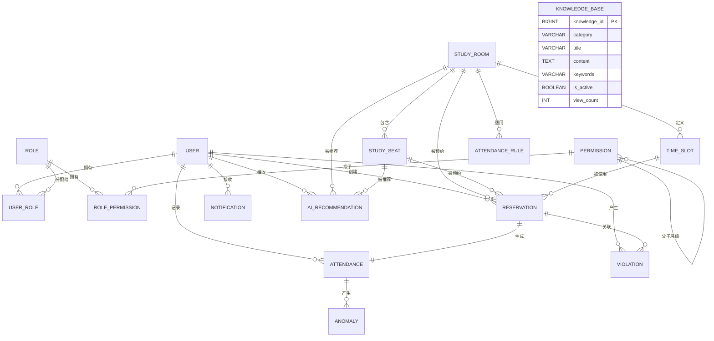
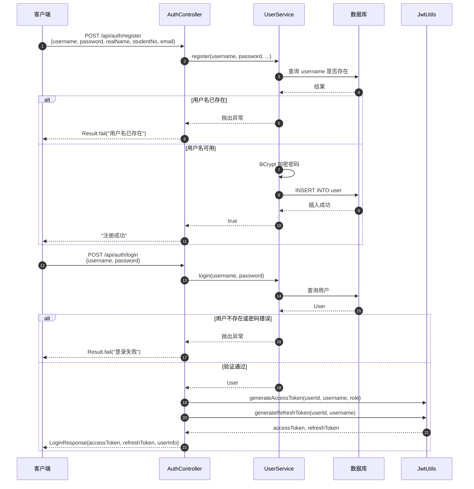
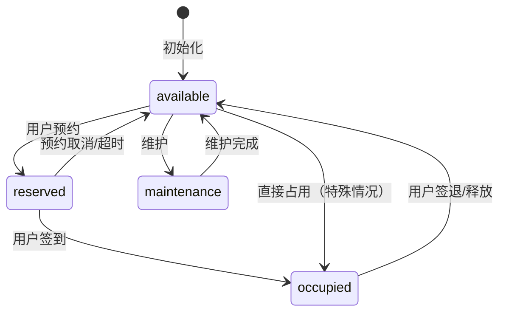
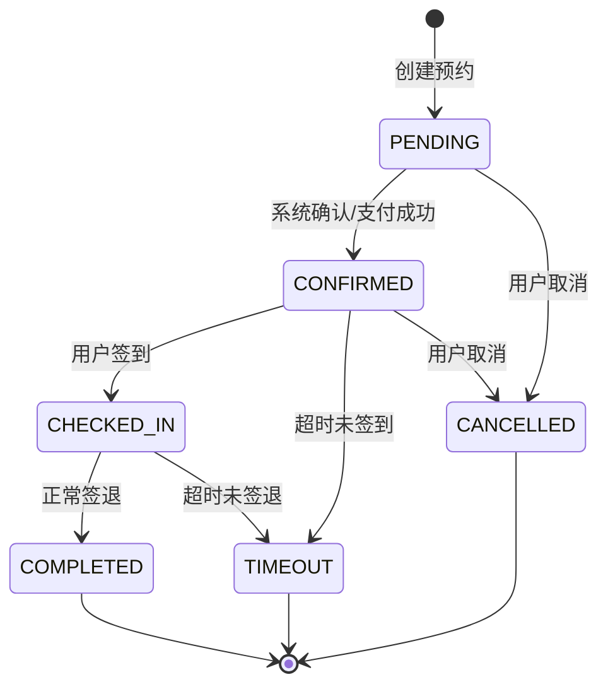
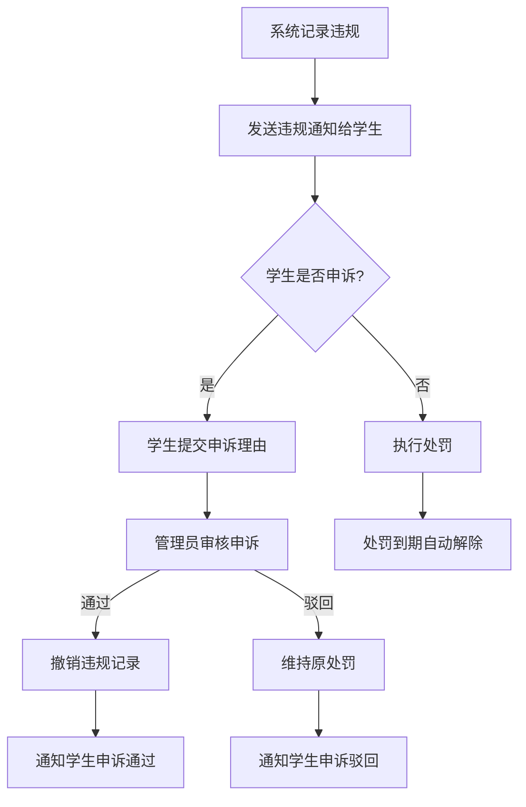

# 第5章 数据库设计

## 5.1 数据库设计原则

本系统的数据库设计遵循关系型数据库设计的经典理论，同时结合微服务架构与信创适配的实际需求，确立了以下核心设计原则。

### 5.1.1 三范式与适度反范式

系统整体遵循**第三范式（3NF）**进行规范化设计，确保数据的原子性、完整性和一致性：

- **第一范式（1NF）**：所有字段原子不可分。例如 `study_preferences` 字段虽以 JSON 格式存储，但其内部结构为键值对，在应用层解析为原子字段使用，不违反1NF。
- **第二范式（2NF）**：所有非主键字段完全依赖于主键。例如 `reservation` 表中的 `user_id`、`room_id`、`seat_id` 均直接依赖于 `reservation_id`，不存在部分依赖。
- **第三范式（3NF）**：不存在传递依赖。例如 `study_seat` 表中的 `room_id` 直接关联自习室，自习室的 `building`、`floor` 等信息不冗余存储在座位表中，通过 JOIN 查询获取。

**反范式设计**：在部分高频查询场景下，允许适当的冗余以提升查询性能。例如 `reservation` 表中的 `reservation_date` 字段为 `reserve_date` 与 `start_time` 的冗余组合，便于按日期时间范围进行快速查询，减少 JOIN 操作。

### 5.1.2 命名规范

本系统采用统一的命名规范，确保数据库对象命名的一致性和可读性：

| 规范类型 | 规则 | 示例 |
|---------|------|------|
| 表名 | 小写 + 下划线，名词单数形式 | `user`、`study_room`、`reservation` |
| 字段名 | 小写 + 下划线 | `user_id`、`create_time`、`is_active` |
| 主键 | `表名_id` | `user_id`、`room_id` |
| 外键 | 引用表的主键名 | `user_id` 引用 `user.user_id` |
| 布尔字段 | `is_` / `has_` 前缀 | `is_active`、`has_power` |
| 索引名 | `uk_`（唯一）、`idx_`（普通） | `uk_username`、`idx_room_seat_date` |

### 5.1.3 通用字段规范

所有业务表均包含以下审计字段和逻辑删除字段，由 MyBatis-Plus 的 `MetaObjectHandler` 统一自动填充：

| 字段名 | 类型 | 说明 |
|--------|------|------|
| `create_time` | `DATETIME NOT NULL DEFAULT CURRENT_TIMESTAMP` | 记录创建时间，不可修改 |
| `update_time` | `DATETIME NOT NULL DEFAULT CURRENT_TIMESTAMP` | 记录更新时间，每次更新自动刷新 |
| `deleted` | `TINYINT NOT NULL DEFAULT 0` | 逻辑删除标记（0-未删除，1-已删除） |

### 5.1.4 信创适配原则

本系统以 MySQL 8.0.36 为主数据库，同时完成达梦8（DM8）的国产化适配。设计时遵循"最大公约数"原则：

- 优先使用 MySQL 与达梦8 共同支持的数据类型和语法
- 差异部分通过 MyBatis-Plus 的注解和配置在应用层统一处理
- 建表脚本分别维护，通过 Spring Boot 的 Profile 机制动态切换数据源

---

## 5.2 概念结构设计

### 5.2.1 核心实体关系图

系统数据库包含 18 张数据表，涵盖用户权限、自习室座位、预约考勤、违规通知、AI 智能五大模块。核心实体关系如下：



### 5.2.2 实体关系说明

| 关系 | 实体A | 实体B | 关系类型 | 说明 |
|------|-------|-------|---------|------|
| 用户-角色 | `user` | `role` | 多对多（通过 `user_role`） | RBAC 权限模型核心 |
| 角色-权限 | `role` | `permission` | 多对多（通过 `role_permission`） | 权限分配 |
| 自习室-座位 | `study_room` | `study_seat` | 一对多 | 一个自习室包含多个座位 |
| 用户-预约 | `user` | `reservation` | 一对多 | 一个学生可创建多个预约 |
| 座位-预约 | `study_seat` | `reservation` | 一对多 | 一个座位可被多次预约（不同时间） |
| 预约-考勤 | `reservation` | `attendance` | 一对一 | 一个预约对应一条考勤记录 |
| 用户-违规 | `user` | `violation` | 一对多 | 一个学生可产生多条违规记录 |
| 用户-AI推荐 | `user` | `ai_recommendation` | 一对多 | 一个学生接收多条推荐 |

---

## 5.3 逻辑结构设计

### 5.3.1 18张表概览

| 序号 | 表名 | 中文名 | 所属模块 | 主要字段数 | 说明 |
|------|------|--------|---------|-----------|------|
| 1 | `user` | 用户表 | 用户权限 | 15 | 存储学生、管理员、超级管理员信息 |
| 2 | `role` | 角色表 | 用户权限 | 8 | 系统角色定义（student/admin/super_admin） |
| 3 | `permission` | 权限表 | 用户权限 | 12 | 菜单和按钮权限，支持树形层级 |
| 4 | `user_role` | 用户角色关联表 | 用户权限 | 4 | 用户与角色的多对多关联 |
| 5 | `role_permission` | 角色权限关联表 | 用户权限 | 4 | 角色与权限的多对多关联 |
| 6 | `study_room` | 自习室表 | 自习室座位 | 12 | 自习室基础信息、设施、开放时间 |
| 7 | `study_seat` | 座位表 | 自习室座位 | 17 | 座位编号、类型、位置、状态 |
| 8 | `time_slot` | 时间段模板表 | 自习室座位 | 9 | 自习室时间段配置及最大预约数 |
| 9 | `reservation` | 预约表 | 预约考勤 | 18 | 核心预约业务数据，含签到签退时间 |
| 10 | `attendance` | 考勤表 | 预约考勤 | 16 | 签到签退记录、学习时长 |
| 11 | `attendance_rule` | 考勤规则表 | 预约考勤 | 15 | 考勤规则配置，支持全局/自习室特定 |
| 12 | `violation` | 违规记录表 | 违规通知 | 12 | 违规类型、处罚、申诉信息 |
| 13 | `notification` | 通知记录表 | 违规通知 | 9 | 系统通知消息，支持已读状态 |
| 14 | `ai_recommendation` | AI推荐记录表 | AI模块 | 10 | AI推荐结果及用户接受状态 |
| 15 | `anomaly` | 异常分析记录表 | AI模块 | 12 | AI考勤异常检测结果 |
| 16 | `knowledge_base` | 知识库表 | AI模块 | 10 | RAG智能客服知识库内容 |
| 17 | `reservation_history` | 预约历史表 | 预约考勤 | 10 | 预约变更历史记录 |
| 18 | `attendance_record` | 考勤记录明细表 | 预约考勤 | 12 | 签到/签退/延长等操作明细 |

### 5.3.2 核心表结构详细设计

#### （1）用户表（user）

**表说明**：存储系统用户信息，包括学生、管理员、超级管理员。采用 RBAC 权限模型，密码经 BCrypt 加密存储。

| 字段名 | 类型 | 约束 | 说明 |
|--------|------|------|------|
| `user_id` | `BIGINT` | `PK, AUTO_INCREMENT` | 用户主键，自增 |
| `username` | `VARCHAR(50)` | `NOT NULL, UK` | 用户名，唯一 |
| `password` | `VARCHAR(100)` | `NOT NULL` | 密码，BCrypt 加密存储 |
| `real_name` | `VARCHAR(50)` | `NOT NULL` | 真实姓名 |
| `student_no` | `VARCHAR(20)` | `NOT NULL, UK` | 学号，唯一 |
| `email` | `VARCHAR(100)` | `NULL` | 邮箱 |
| `phone` | `VARCHAR(20)` | `NULL` | 手机号 |
| `avatar` | `VARCHAR(255)` | `NULL` | 头像 URL |
| `role` | `VARCHAR(20)` | `NOT NULL` | 角色（student/admin/super_admin） |
| `status` | `TINYINT` | `NOT NULL, DEFAULT 1` | 状态（1-正常，0-禁用） |
| `study_preferences` | `JSON` | `NULL` | 学习偏好（JSON 格式） |
| `create_time` | `DATETIME` | `NOT NULL, DEFAULT CURRENT_TIMESTAMP` | 创建时间 |
| `update_time` | `DATETIME` | `NOT NULL, DEFAULT CURRENT_TIMESTAMP` | 更新时间 |
| `deleted` | `TINYINT` | `NOT NULL, DEFAULT 0` | 逻辑删除标记 |

对应实体类（MyBatis-Plus 注解映射）：

```java
@Data
@TableName("user")
public class User implements Serializable {
    @TableId(value = "user_id", type = IdType.AUTO)
    private Long userId;

    @TableField("username")
    private String username;

    @TableField("password")
    private String password;

    @TableField("real_name")
    private String realName;

    @TableField("student_no")
    private String studentNo;

    @TableField("role")
    private String role;

    @TableField("status")
    private Integer status;

    @TableField(value = "study_preferences", 
        typeHandler = com.baomidou.mybatisplus.extension.handlers.JacksonTypeHandler.class)
    private Object studyPreferences;

    @TableField(value = "create_time")
    private LocalDateTime createTime;

    @TableField(value = "update_time")
    private LocalDateTime updateTime;

    @TableField("deleted")
    @TableLogic
    private Integer deleted;
}
```

#### （2）自习室表（study_room）

**表说明**：存储自习室基础信息，包括名称、位置、容量、设施、开放时间等，是系统的核心基础数据表。

| 字段名 | 类型 | 约束 | 说明 |
|--------|------|------|------|
| `room_id` | `BIGINT` | `PK, AUTO_INCREMENT` | 自习室主键 |
| `room_name` | `VARCHAR(100)` | `NOT NULL` | 自习室名称 |
| `building` | `VARCHAR(50)` | `NOT NULL` | 教学楼 |
| `floor` | `INT` | `NOT NULL` | 楼层 |
| `capacity` | `INT` | `NOT NULL` | 容量（座位总数） |
| `current_count` | `INT` | `NOT NULL, DEFAULT 0` | 当前人数 |
| `status` | `VARCHAR(20)` | `NOT NULL, DEFAULT 'open'` | 状态（open/closed/maintenance） |
| `description` | `VARCHAR(500)` | `NULL` | 描述 |
| `facilities` | `JSON` | `NULL` | 设施信息（JSON 格式） |
| `open_time` | `VARCHAR(500)` | `NULL` | 开放时间段（JSON 格式） |
| `create_time` | `DATETIME` | `NOT NULL` | 创建时间 |
| `update_time` | `DATETIME` | `NOT NULL` | 更新时间 |
| `deleted` | `TINYINT` | `NOT NULL, DEFAULT 0` | 逻辑删除标记 |

#### （3）座位表（study_seat）

**表说明**：存储自习室座位信息，包括座位编号、类型、位置坐标、电源配置、当前状态等。每个座位属于一个自习室，支持按区域、类型筛选。

| 字段名 | 类型 | 约束 | 说明 |
|--------|------|------|------|
| `seat_id` | `BIGINT` | `PK, AUTO_INCREMENT` | 座位主键 |
| `room_id` | `BIGINT` | `NOT NULL, FK` | 自习室 ID，外键关联 `study_room` |
| `seat_number` | `VARCHAR(20)` | `NOT NULL` | 座位编号（如 A-01） |
| `zone` | `VARCHAR(20)` | `NULL` | 区域（A区/B区/C区） |
| `position_x` | `INT` | `NULL` | 座位图 X 坐标 |
| `position_y` | `INT` | `NULL` | 座位图 Y 坐标 |
| `status` | `VARCHAR(20)` | `NOT NULL, DEFAULT 'available'` | 状态（available/occupied/reserved/maintenance） |
| `type` | `VARCHAR(20)` | `NOT NULL, DEFAULT 'normal'` | 类型（normal/power/window/corner） |
| `has_power` | `BOOLEAN` | `NOT NULL, DEFAULT FALSE` | 是否有电源 |
| `has_usb` | `BOOLEAN` | `NOT NULL, DEFAULT FALSE` | 是否有 USB |
| `has_wifi` | `BOOLEAN` | `NOT NULL, DEFAULT FALSE` | 是否有 WiFi |
| `description` | `VARCHAR(200)` | `NULL` | 描述 |
| `current_user_id` | `BIGINT` | `NULL` | 当前占用用户 ID |
| `current_reservation_id` | `BIGINT` | `NULL` | 当前关联预约 ID |
| `create_time` | `DATETIME` | `NOT NULL` | 创建时间 |
| `update_time` | `DATETIME` | `NOT NULL` | 更新时间 |
| `deleted` | `TINYINT` | `NOT NULL, DEFAULT 0` | 逻辑删除标记 |

#### （4）预约表（reservation）

**表说明**：系统的核心业务表，存储学生的座位预约记录。记录用户、自习室、座位、时间段的预约关系，以及签到签退时间和处罚信息。

| 字段名 | 类型 | 约束 | 说明 |
|--------|------|------|------|
| `reservation_id` | `BIGINT` | `PK, AUTO_INCREMENT` | 预约主键 |
| `user_id` | `BIGINT` | `NOT NULL, FK` | 用户 ID |
| `room_id` | `BIGINT` | `NOT NULL, FK` | 自习室 ID |
| `seat_id` | `BIGINT` | `NOT NULL, FK` | 座位 ID |
| `reservation_date` | `DATETIME` | `NULL` | 预约日期时间（冗余字段，便于范围查询） |
| `reserve_date` | `DATE` | `NOT NULL` | 预约日期 |
| `start_time` | `DATETIME` | `NOT NULL` | 开始时间 |
| `end_time` | `DATETIME` | `NOT NULL` | 结束时间 |
| `status` | `VARCHAR(20)` | `NOT NULL, DEFAULT 'pending'` | 状态（pending/confirmed/cancelled/completed/timeout） |
| `purpose` | `VARCHAR(200)` | `NULL` | 预约目的 |
| `notes` | `VARCHAR(500)` | `NULL` | 备注 |
| `qrcode` | `VARCHAR(255)` | `NULL` | 签到二维码 |
| `create_time` | `DATETIME` | `NOT NULL` | 创建时间 |
| `update_time` | `DATETIME` | `NOT NULL` | 更新时间 |
| `deleted` | `TINYINT` | `NOT NULL, DEFAULT 0` | 逻辑删除标记 |

对应实体类：

```java
@Data
@TableName("reservation")
public class Reservation implements Serializable {
    @TableId(value = "reservation_id", type = IdType.AUTO)
    private Long reservationId;

    @TableField("user_id")
    private Long userId;

    @TableField("room_id")
    private Long roomId;

    @TableField("seat_id")
    private Long seatId;

    @TableField("reservation_date")
    private LocalDateTime reservationDate;

    @TableField("reserve_date")
    private java.time.LocalDate reserveDate;

    @TableField("start_time")
    private LocalDateTime startTime;

    @TableField("end_time")
    private LocalDateTime endTime;

    @TableField("status")
    private String status; // pending, confirmed, cancelled, completed, timeout

    @TableField("purpose")
    private String purpose;

    @TableField("notes")
    private String notes;

    @TableField("qrcode")
    private String qrcode;

    @TableField("create_time")
    private LocalDateTime createTime;

    @TableField("update_time")
    private LocalDateTime updateTime;

    @TableField("deleted")
    @TableLogic
    private Integer deleted;
}
```

#### （5）考勤表（attendance）

**表说明**：存储学生的考勤记录，与预约表一对一关联。记录签到时间、签退时间、学习时长及考勤状态。

| 字段名 | 类型 | 约束 | 说明 |
|--------|------|------|------|
| `attendance_id` | `BIGINT` | `PK, AUTO_INCREMENT` | 考勤主键 |
| `reservation_id` | `BIGINT` | `NOT NULL, FK` | 预约 ID，外键关联 `reservation` |
| `user_id` | `BIGINT` | `NOT NULL, FK` | 用户 ID |
| `room_id` | `BIGINT` | `NOT NULL` | 自习室 ID |
| `seat_id` | `BIGINT` | `NOT NULL` | 座位 ID |
| `check_in_time` | `DATETIME` | `NULL` | 签到时间 |
| `check_out_time` | `DATETIME` | `NULL` | 签退时间 |
| `duration_minutes` | `INT` | `NOT NULL, DEFAULT 0` | 学习时长（分钟） |
| `status` | `VARCHAR(20)` | `NOT NULL, DEFAULT 'active'` | 状态（active/completed/timeout/cancelled） |
| `check_in_method` | `VARCHAR(20)` | `NULL` | 签到方式（qrcode/manual/auto） |
| `check_out_method` | `VARCHAR(20)` | `NULL` | 签退方式（qrcode/manual/auto） |
| `location` | `VARCHAR(255)` | `NULL` | 签到位置 |
| `device_info` | `VARCHAR(500)` | `NULL` | 设备信息 |
| `notes` | `VARCHAR(500)` | `NULL` | 备注 |
| `create_time` | `DATETIME` | `NOT NULL` | 创建时间 |
| `update_time` | `DATETIME` | `NOT NULL` | 更新时间 |
| `deleted` | `TINYINT` | `NOT NULL, DEFAULT 0` | 逻辑删除标记 |

#### （6）违规记录表（violation）

**表说明**：存储学生的违规记录，包括违规类型、描述、处罚天数、申诉信息等。系统自动检测违规行为并生成记录，支持学生申诉和管理员审核。

| 字段名 | 类型 | 约束 | 说明 |
|--------|------|------|------|
| `violation_id` | `BIGINT` | `PK, AUTO_INCREMENT` | 违规主键 |
| `user_id` | `BIGINT` | `NOT NULL, FK` | 用户 ID |
| `reservation_id` | `BIGINT` | `NOT NULL, FK` | 预约 ID |
| `type` | `VARCHAR(20)` | `NOT NULL` | 违规类型（NO_SHOW/LATE_CHECK_IN/EARLY_LEAVE/DAMAGE） |
| `description` | `VARCHAR(500)` | `NOT NULL` | 违规描述 |
| `penalty_days` | `INT` | `NOT NULL, DEFAULT 0` | 处罚天数 |
| `status` | `VARCHAR(20)` | `NOT NULL, DEFAULT 'PENDING'` | 状态（PENDING/APPROVED/REJECTED） |
| `appeal_reason` | `VARCHAR(500)` | `NULL` | 申诉理由 |
| `appeal_status` | `VARCHAR(20)` | `NULL, DEFAULT 'PENDING'` | 申诉状态 |
| `create_time` | `DATETIME` | `NOT NULL` | 创建时间 |
| `update_time` | `DATETIME` | `NOT NULL` | 更新时间 |
| `deleted` | `TINYINT` | `NOT NULL, DEFAULT 0` | 逻辑删除标记 |

#### （7）知识库表（knowledge_base）

**表说明**：存储 RAG 智能客服的知识库内容，包括分类、标题、内容、关键词等。支持 FAQ 问答、规则说明、使用指南等文档的管理。

| 字段名 | 类型 | 约束 | 说明 |
|--------|------|------|------|
| `knowledge_id` | `BIGINT` | `PK, AUTO_INCREMENT` | 知识主键 |
| `category` | `VARCHAR(50)` | `NOT NULL` | 分类（如 FAQ、规则、指南） |
| `title` | `VARCHAR(200)` | `NOT NULL` | 标题 |
| `content` | `TEXT` | `NOT NULL` | 内容 |
| `keywords` | `VARCHAR(500)` | `NULL` | 关键词，逗号分隔 |
| `is_active` | `BOOLEAN` | `NOT NULL, DEFAULT TRUE` | 是否启用 |
| `view_count` | `INT` | `NOT NULL, DEFAULT 0` | 查看次数 |
| `create_time` | `DATETIME` | `NOT NULL` | 创建时间 |
| `update_time` | `DATETIME` | `NOT NULL` | 更新时间 |
| `deleted` | `TINYINT` | `NOT NULL, DEFAULT 0` | 逻辑删除标记 |

对应实体类：

```java
@Data
@TableName("knowledge_base")
public class KnowledgeBase {
    @TableId(type = IdType.AUTO)
    private Long knowledgeId;

    private String category;
    private String title;
    private String content;
    private String keywords;
    private Boolean isActive;
    private Integer viewCount;
    private LocalDateTime createTime;
    private LocalDateTime updateTime;

    @TableLogic
    private Integer deleted;
}
```

#### （8）AI 推荐记录表（ai_recommendation）

**表说明**：存储 AI 智能推荐的结果记录，包括推荐得分、推荐理由、推荐策略及用户是否接受。用于推荐效果追踪和算法优化。

| 字段名 | 类型 | 约束 | 说明 |
|--------|------|------|------|
| `recommendation_id` | `BIGINT` | `PK, AUTO_INCREMENT` | 推荐主键 |
| `user_id` | `BIGINT` | `NOT NULL, FK` | 用户 ID |
| `room_id` | `BIGINT` | `NOT NULL, FK` | 自习室 ID |
| `seat_id` | `BIGINT` | `NOT NULL, FK` | 座位 ID |
| `score` | `DECIMAL(10,2)` | `NOT NULL` | 推荐得分 |
| `reason` | `TEXT` | `NULL` | 推荐理由 |
| `strategy` | `VARCHAR(50)` | `NOT NULL` | 推荐策略（collaborative/content/hybrid） |
| `is_accepted` | `BOOLEAN` | `NOT NULL, DEFAULT FALSE` | 是否被接受 |
| `create_time` | `DATETIME` | `NOT NULL` | 创建时间 |
| `deleted` | `TINYINT` | `NOT NULL, DEFAULT 0` | 逻辑删除标记 |

对应实体类：

```java
@Data
@TableName("ai_recommendation")
public class AiRecommendation {
    @TableId(type = IdType.AUTO)
    private Long recommendationId;

    private Long userId;
    private Long roomId;
    private Long seatId;
    private BigDecimal score;
    private String reason;
    private String strategy;
    private Boolean isAccepted;
    private LocalDateTime createTime;

    @TableLogic
    private Integer deleted;
}
```

---

## 5.4 索引设计

本系统共 18 张表，设计索引总计 47 个（含主键、唯一索引、普通索引、外键）。索引设计遵循"高频查询优先、最左前缀、避免过度索引"的原则。

### 5.4.1 关键表索引设计

#### （1）user 表索引

| 索引名 | 类型 | 字段 | 设计依据 |
|--------|------|------|---------|
| `PRIMARY` | 主键 | `user_id` | 唯一标识用户，所有关联表的外键引用 |
| `uk_username` | 唯一 | `username` | 用户名唯一，登录时按用户名查询 |
| `uk_student_no` | 唯一 | `student_no` | 学号唯一，注册时校验学号是否已存在 |
| `idx_username` | 普通 | `username` | 登录接口高频查询，覆盖用户名密码校验 |
| `idx_student_no` | 普通 | `student_no` | 学生信息查询、按学号检索 |
| `idx_role` | 普通 | `role` | 按角色筛选用户列表 |
| `idx_status` | 普通 | `status` | 过滤禁用用户，登录时校验用户状态 |
| `idx_create_time` | 普通 | `create_time` | 用户列表按注册时间排序 |

#### （2）reservation 表索引（核心）

| 索引名 | 类型 | 字段 | 设计依据 |
|--------|------|------|---------|
| `PRIMARY` | 主键 | `reservation_id` | 唯一标识预约 |
| `idx_user_id` | 普通 | `user_id` | 学生查询"我的预约"高频场景 |
| `idx_room_seat_date` | 复合 | `room_id, seat_id, reserve_date` | **核心复合索引**：预约冲突检测时，需查询某座位某日期的所有预约 |
| `idx_reserve_date` | 普通 | `reserve_date` | 按日期查询预约统计、日预约量分析 |
| `idx_status` | 普通 | `status` | 按状态筛选（查询待签到、已完成等） |
| `idx_create_time` | 普通 | `create_time` | 预约列表按创建时间排序 |

**`idx_room_seat_date` 复合索引说明**：

该复合索引是预约冲突检测的核心索引。当学生创建预约时，系统需要检查 `room_id` + `seat_id` + `reserve_date` 的组合是否已存在冲突预约。复合索引的三个字段顺序遵循最左前缀原则：

- 第一列 `room_id`：先按自习室过滤，缩小范围
- 第二列 `seat_id`：再按座位过滤，精确定位
- 第三列 `reserve_date`：最后按日期过滤，确定冲突

该索引同时支持以下查询模式：
- `WHERE room_id = ?`（查询某自习室所有预约）
- `WHERE room_id = ? AND seat_id = ?`（查询某座位所有预约）
- `WHERE room_id = ? AND seat_id = ? AND reserve_date = ?`（精确冲突检测）

#### （3）study_seat 表索引

| 索引名 | 类型 | 字段 | 设计依据 |
|--------|------|------|---------|
| `PRIMARY` | 主键 | `seat_id` | 唯一标识座位 |
| `idx_room_id` | 普通 | `room_id` | 查询某自习室的所有座位，座位图展示高频场景 |
| `idx_status` | 普通 | `status` | 筛选可用座位，预约时排除已占用座位 |

#### （4）attendance 表索引

| 索引名 | 类型 | 字段 | 设计依据 |
|--------|------|------|---------|
| `PRIMARY` | 主键 | `attendance_id` | 唯一标识考勤记录 |
| `idx_user_id` | 普通 | `user_id` | 学生查询"我的考勤"高频场景 |
| `idx_reservation_id` | 普通 | `reservation_id` | 按预约查询考勤详情 |
| `idx_create_time` | 普通 | `create_time` | 考勤记录按时间排序 |

#### （5）violation 表索引

| 索引名 | 类型 | 字段 | 设计依据 |
|--------|------|------|---------|
| `PRIMARY` | 主键 | `violation_id` | 唯一标识违规记录 |
| `idx_user_id` | 普通 | `user_id` | 学生查询"我的违规"、管理员查看用户违规历史 |
| `idx_reservation_id` | 普通 | `reservation_id` | 按预约关联查询违规 |
| `idx_type` | 普通 | `type` | 按违规类型统计（如统计未签到次数） |
| `idx_status` | 普通 | `status` | 筛选待审核违规记录 |

### 5.4.2 索引优化建议

1. **定期分析**：使用 `ANALYZE TABLE` 定期更新索引统计信息，确保查询优化器选择最优执行计划。
2. **慢查询监控**：开启慢查询日志（`slow_query_log`），监控执行时间超过 250ms 的 SQL。
3. **索引覆盖**：对于高频查询，尽量设计覆盖索引（Covering Index），减少回表操作。
4. **避免过度索引**：单表索引数量控制在 5-8 个以内，避免写入性能下降。
5. **定期清理**：对 `notification` 等数据量增长快的表，定期归档历史数据，保持索引效率。

---

## 5.5 数据库国产化适配

本系统以 MySQL 8.0.36 为主数据库，同时完成达梦8（DM8）的国产化适配。通过 Spring Boot 的 Profile 机制实现动态数据源切换，MyBatis-Plus 作为 ORM 中间层屏蔽底层差异。

### 5.5.1 数据类型映射

| MySQL 类型 | 达梦8 对应类型 | 说明 |
|-----------|--------------|------|
| `BIGINT` | `BIGINT` | 大整数，完全一致 |
| `VARCHAR(n)` | `VARCHAR(n)` | 变长字符串，完全一致 |
| `INT` | `INT` | 整数，完全一致 |
| `TINYINT` | `TINYINT` | 小整数，完全一致 |
| `DATETIME` | `DATETIME` | 日期时间，完全一致 |
| `DATE` | `DATE` | 日期，完全一致 |
| `TIME` | `TIME` | 时间，完全一致 |
| `DECIMAL(p,s)` | `DECIMAL(p,s)` | 定点数，完全一致 |
| `BOOLEAN` | `BOOLEAN` | 布尔值，完全一致 |
| `JSON` | `CLOB` | MySQL 原生 JSON → DM8 使用 CLOB 存储 JSON 文本 |
| `TEXT` | `CLOB` | 大文本，DM8 使用 CLOB |
| `ENUM` | `VARCHAR` | MySQL ENUM → DM8 使用 VARCHAR + 应用层校验 |
| `AUTO_INCREMENT` | `AUTO_INCREMENT` / `IDENTITY` | DM8 同时支持两种语法，本系统采用与 MySQL 一致的写法 |
| `ENGINE=InnoDB` | 无 | DM8 无需指定存储引擎 |
| `CHARSET=utf8mb4` | 无 | DM8 默认 UTF-8 |

### 5.5.2 语法差异

| 特性 | MySQL 语法 | 达梦8 语法 | 适配方案 |
|------|-----------|-----------|---------|
| 分页 | `LIMIT offset, count` | `LIMIT offset, count`（兼容） | 语法一致，无需修改 |
| 表注释 | `COMMENT='...'` | `COMMENT ON TABLE` | 分别编写建表脚本 |
| 字段注释 | `COMMENT '...'` | `COMMENT '...'`（兼容） | 统一使用 COMMENT 语法 |
| 存储引擎 | `ENGINE=InnoDB` | 无需指定 | DM8 脚本中移除 ENGINE 子句 |
| 字符集 | `CHARSET=utf8mb4` | 无需指定 | DM8 默认 UTF-8，脚本中移除 |
| 更新时间自动刷新 | `ON UPDATE CURRENT_TIMESTAMP` | 不支持 | 应用层 MyBatis-Plus 自动填充 |
| 表压缩 | 不支持 | `COMPRESS=1` | DM8 脚本中增加压缩配置 |

### 5.5.3 自增主键差异

MySQL 使用 `AUTO_INCREMENT` 修饰主键：

```sql
CREATE TABLE user (
    user_id BIGINT PRIMARY KEY AUTO_INCREMENT,
    ...
);
```

达梦8 同时支持 `AUTO_INCREMENT` 和 `IDENTITY` 两种语法，本系统采用与 MySQL 一致的 `AUTO_INCREMENT` 写法，降低迁移成本。

### 5.5.4 关键字差异

达梦8 中部分关键字与 MySQL 存在差异，需要特别注意：

| 关键字 | MySQL | 达梦8 | 处理方案 |
|--------|-------|-------|---------|
| `USER` | 非保留字 | 保留字 | 表名使用反引号（MySQL）或双引号（DM8）包裹 |
| `ROLE` | 非保留字 | 保留字 | 同上，使用引号包裹 |
| `COMMENT` | 非保留字 | 保留字 | 使用引号包裹或避免作为字段名 |

本系统中 `user`、`role` 表名在达梦8 中需使用双引号包裹，或通过 MyBatis 配置自动处理。

### 5.5.5 建表语句对比示例

以用户表为例，MySQL 与达梦8 的建表语句对比如下：

**MySQL 8.0 版本：**

```sql
CREATE TABLE user (
    user_id BIGINT PRIMARY KEY AUTO_INCREMENT,
    username VARCHAR(50) NOT NULL UNIQUE COMMENT '用户名',
    password VARCHAR(100) NOT NULL COMMENT '密码(加密存储)',
    real_name VARCHAR(50) NOT NULL COMMENT '真实姓名',
    student_no VARCHAR(20) NOT NULL UNIQUE COMMENT '学号',
    email VARCHAR(100) COMMENT '邮箱',
    role VARCHAR(20) NOT NULL COMMENT '角色',
    status TINYINT NOT NULL DEFAULT 1 COMMENT '状态',
    study_preferences JSON COMMENT '学习偏好',
    create_time DATETIME NOT NULL DEFAULT CURRENT_TIMESTAMP,
    update_time DATETIME NOT NULL DEFAULT CURRENT_TIMESTAMP ON UPDATE CURRENT_TIMESTAMP,
    deleted TINYINT NOT NULL DEFAULT 0 COMMENT '删除标记',
    INDEX idx_username (username),
    INDEX idx_role (role),
    INDEX idx_status (status)
) ENGINE=InnoDB DEFAULT CHARSET=utf8mb4 COMMENT='用户表';
```

**达梦8 版本：**

```sql
CREATE TABLE user (
    user_id BIGINT PRIMARY KEY AUTO_INCREMENT,
    username VARCHAR(50) NOT NULL UNIQUE COMMENT '用户名',
    password VARCHAR(100) NOT NULL COMMENT '密码(加密存储)',
    real_name VARCHAR(50) NOT NULL COMMENT '真实姓名',
    student_no VARCHAR(20) NOT NULL UNIQUE COMMENT '学号',
    email VARCHAR(100) COMMENT '邮箱',
    role VARCHAR(20) NOT NULL COMMENT '角色',
    status TINYINT NOT NULL DEFAULT 1 COMMENT '状态',
    study_preferences CLOB COMMENT '学习偏好',
    create_time DATETIME NOT NULL DEFAULT CURRENT_TIMESTAMP,
    update_time DATETIME NOT NULL DEFAULT CURRENT_TIMESTAMP,
    deleted TINYINT NOT NULL DEFAULT 0 COMMENT '删除标记',
    INDEX idx_username (username),
    INDEX idx_role (role),
    INDEX idx_status (status)
) COMPRESS=1;
COMMENT ON TABLE user IS '用户表';
```

**差异分析：**

| 差异项 | MySQL | 达梦8 | 说明 |
|--------|-------|-------|------|
| JSON 类型 | `JSON` | `CLOB` | DM8 使用 CLOB 存储 JSON 文本 |
| 更新时间 | `ON UPDATE CURRENT_TIMESTAMP` | 无 | DM8 通过应用层自动填充 |
| 存储引擎 | `ENGINE=InnoDB` | 无 | DM8 无需指定 |
| 字符集 | `CHARSET=utf8mb4` | 无 | DM8 默认 UTF-8 |
| 表注释 | `COMMENT='用户表'` | `COMMENT ON TABLE` | 语法不同 |
| 表压缩 | 不支持 | `COMPRESS=1` | DM8 支持表级压缩 |

---

## 5.6 缓存设计

本系统使用 Redis 作为分布式缓存，主要缓存对象及策略如下：

| 缓存对象 | Redis Key 设计 | 数据类型 | 过期策略 | 说明 |
|---------|---------------|---------|---------|------|
| 用户信息 | `user:info:{userId}` | `String`（JSON） | 2 小时 | 用户基本信息缓存，减少数据库查询 |
| 用户Token | `token:access:{userId}` | `String` | 2 小时 | Access Token 黑名单/有效性校验 |
| 用户Refresh Token | `token:refresh:{userId}` | `String` | 7 天 | Refresh Token 存储，支持 Token 刷新 |
| 自习室列表 | `room:list` | `String`（JSON） | 10 分钟 | 自习室列表缓存，数据变更时主动刷新 |
| 自习室详情 | `room:detail:{roomId}` | `String`（JSON） | 10 分钟 | 单个自习室详情缓存 |
| 座位可用状态 | `seat:available:{roomId}` | `Set` | 5 分钟 | 某自习室可用座位 ID 集合 |
| 座位实时状态 | `seat:status:{seatId}` | `String` | 实时（无过期） | 座位当前占用状态，配合发布订阅更新 |
| 预约冲突锁 | `lock:reservation:{seatId}:{date}` | `String` | 30 秒 | 分布式锁，防止并发重复预约 |
| 用户当日预约数 | `reservation:daily:{userId}:{date}` | `String` | 1 天 | 用户当日预约次数计数，用于上限控制 |
| 考勤统计 | `attendance:stats:{userId}` | `String`（JSON） | 1 小时 | 用户学习时长统计缓存 |
| 知识库内容 | `kb:content:{knowledgeId}` | `String` | 1 小时 | 知识库条目缓存 |
| 验证码 | `captcha:{uuid}` | `String` | 5 分钟 | 登录验证码存储 |

**缓存更新策略**：

- **Cache-Aside（旁路缓存）**：读取时先查缓存，未命中再查数据库并写入缓存；写入时先更新数据库，再删除缓存。
- **主动刷新**：自习室信息、座位状态等变更时，通过消息队列或应用层主动删除/更新缓存。
- **过期淘汰**：设置合理的 TTL，避免缓存雪崩，同时保证数据最终一致性。

---

# 第6章 核心功能详细设计与实现

## 6.1 统一技术实现规范

### 6.1.1 分层架构

本系统采用典型的微服务分层架构，每个服务内部遵循 Controller → Service → Mapper → Entity 四层结构：

```
Controller 层：接收 HTTP 请求，参数校验，调用 Service，返回响应
    ↓
Service 层：业务逻辑处理，事务管理，调用 Mapper
    ↓
Mapper 层：数据访问，执行 SQL（MyBatis-Plus BaseMapper）
    ↓
Entity 层：数据实体，与数据库表一一对应
```

各层职责清晰，Controller 层不直接操作数据库，Service 层不直接处理 HTTP 请求，确保代码的可维护性和可测试性。

### 6.1.2 统一响应封装 Result<T>

系统所有接口统一返回 `Result<T>` 泛型对象，确保前端接收的数据格式一致，便于统一处理。

**Result 类实现（真实代码）：**

```java
package com.campus.auth.common;

import lombok.Data;
import java.io.Serializable;

@Data
public class Result<T> implements Serializable {

    private static final long serialVersionUID = 1L;

    private Integer code;
    private String message;
    private T data;

    public Result() {
    }

    public Result(Integer code, String message) {
        this.code = code;
        this.message = message;
    }

    public Result(Integer code, String message, T data) {
        this.code = code;
        this.message = message;
        this.data = data;
    }

    // 成功响应
    public static <T> Result<T> success() {
        return new Result<>(200, "操作成功");
    }

    public static <T> Result<T> success(T data) {
        return new Result<>(200, "操作成功", data);
    }

    // 失败响应
    public static <T> Result<T> fail(String message) {
        return new Result<>(500, message);
    }

    public static <T> Result<T> fail(Integer code, String message) {
        return new Result<>(code, message);
    }

    public static <T> Result<T> error(String message) {
        return fail(message);
    }
}
```

**统一响应封装（GlobalResponseAdvice）：**

```java
package com.campus.auth.config;

import com.campus.auth.common.Result;
import com.fasterxml.jackson.core.JsonProcessingException;
import com.fasterxml.jackson.databind.ObjectMapper;
import org.springframework.core.MethodParameter;
import org.springframework.http.MediaType;
import org.springframework.http.converter.HttpMessageConverter;
import org.springframework.http.server.ServerHttpRequest;
import org.springframework.http.server.ServerHttpResponse;
import org.springframework.web.bind.annotation.RestControllerAdvice;
import org.springframework.web.servlet.mvc.method.annotation.ResponseBodyAdvice;

@RestControllerAdvice(basePackages = "com.campus.auth.controller")
public class GlobalResponseAdvice implements ResponseBodyAdvice<Object> {

    private final ObjectMapper objectMapper = new ObjectMapper();

    @Override
    public boolean supports(MethodParameter returnType, 
                          Class<? extends HttpMessageConverter<?>> converterType) {
        return true;
    }

    @Override
    public Object beforeBodyWrite(Object body, MethodParameter returnType, 
                                  MediaType selectedContentType,
                                  Class<? extends HttpMessageConverter<?>> selectedConverterType,
                                  ServerHttpRequest request, ServerHttpResponse response) {
        if (body instanceof Result) {
            return body;
        }
        if (body instanceof String) {
            try {
                return objectMapper.writeValueAsString(Result.success(body));
            } catch (JsonProcessingException e) {
                return Result.error("响应序列化失败");
            }
        }
        return Result.success(body);
    }
}
```

`GlobalResponseAdvice` 通过实现 `ResponseBodyAdvice` 接口，在 Controller 方法返回结果后自动进行包装。若返回类型已经是 `Result`，则直接透传；若为 `String` 类型，则序列化为 JSON 后包装；其他类型统一包装为 `Result.success(data)`。

### 6.1.3 全局异常处理

系统通过 `@RestControllerAdvice` 实现全局异常处理，统一捕获并封装各类异常为 `Result` 响应。

**GlobalExceptionHandler 实现（真实代码）：**

```java
package com.campus.auth.config;

import com.campus.auth.common.Result;
import lombok.extern.slf4j.Slf4j;
import org.springframework.http.HttpStatus;
import org.springframework.validation.BindingResult;
import org.springframework.validation.FieldError;
import org.springframework.web.bind.MethodArgumentNotValidException;
import org.springframework.web.bind.annotation.ExceptionHandler;
import org.springframework.web.bind.annotation.ResponseStatus;
import org.springframework.web.bind.annotation.RestControllerAdvice;

import java.util.List;

@Slf4j
@RestControllerAdvice
public class GlobalExceptionHandler {

    /**
     * 处理业务异常
     */
    @ExceptionHandler(RuntimeException.class)
    @ResponseStatus(HttpStatus.INTERNAL_SERVER_ERROR)
    public Result<String> handleBusinessException(RuntimeException e) {
        log.error("业务异常: ", e);
        return Result.fail(e.getMessage());
    }

    /**
     * 处理参数校验异常
     */
    @ExceptionHandler(MethodArgumentNotValidException.class)
    @ResponseStatus(HttpStatus.BAD_REQUEST)
    public Result<String> handleValidationException(MethodArgumentNotValidException e) {
        BindingResult bindingResult = e.getBindingResult();
        List<FieldError> fieldErrors = bindingResult.getFieldErrors();

        StringBuilder errorMessage = new StringBuilder();
        for (FieldError fieldError : fieldErrors) {
            errorMessage.append(fieldError.getField())
                        .append(": ")
                        .append(fieldError.getDefaultMessage())
                        .append("; ");
        }

        log.error("参数校验失败: {}", errorMessage.toString());
        return Result.fail(errorMessage.toString());
    }

    /**
     * 处理其他异常
     */
    @ExceptionHandler(Exception.class)
    @ResponseStatus(HttpStatus.INTERNAL_SERVER_ERROR)
    public Result<String> handleException(Exception e) {
        log.error("系统异常: ", e);
        return Result.fail("系统繁忙，请稍后重试");
    }
}
```

异常处理策略：

| 异常类型 | 处理方式 | HTTP 状态码 | 响应内容 |
|---------|---------|------------|---------|
| `RuntimeException`（业务异常） | 记录日志，返回错误信息 | 500 | `Result.fail(e.getMessage())` |
| `MethodArgumentNotValidException`（参数校验） | 收集字段错误，拼接返回 | 400 | `Result.fail(拼接的错误信息)` |
| `Exception`（系统异常） | 记录日志，返回通用错误 | 500 | `Result.fail("系统繁忙，请稍后重试")` |

### 6.1.4 MyBatis-Plus 用法

本系统采用 MyBatis-Plus 作为 ORM 框架，主要使用以下特性：

- **BaseMapper**：继承 `BaseMapper<T>` 即可获得 CRUD 方法，无需手写 SQL。
- **ServiceImpl**：继承 `ServiceImpl<M, T>` 即可获得通用 Service 方法。
- **LambdaQueryWrapper**：类型安全的条件构造器，避免硬编码字段名。
- **@TableLogic**：逻辑删除注解，自动追加 `deleted = 0` 条件。
- **分页插件**：`Page<T>` 对象配合 `IPage<T>` 实现物理分页。

示例：

```java
// LambdaQueryWrapper 类型安全查询
LambdaQueryWrapper<Reservation> wrapper = new LambdaQueryWrapper<>();
wrapper.eq(Reservation::getUserId, userId)
       .eq(Reservation::getDeleted, 0)
       .orderByDesc(Reservation::getCreateTime);
List<Reservation> list = reservationService.list(wrapper);

// 分页查询
Page<Reservation> page = new Page<>(current, size);
IPage<Reservation> result = reservationService.page(page, wrapper);
```

---

## 6.2 用户认证模块实现

### 6.2.1 注册/登录流程

用户认证模块采用 JWT（JSON Web Token）机制实现无状态身份认证，注册和登录流程如下：



### 6.2.2 JWT 签发与校验

系统采用双 Token 策略：Access Token（有效期 2 小时）用于接口认证，Refresh Token（有效期 7 天）用于 Token 刷新。

**JwtUtils 实现（真实代码）：**

```java
package com.campus.auth.utils;

import io.jsonwebtoken.*;
import io.jsonwebtoken.security.Keys;
import org.springframework.beans.factory.annotation.Value;
import org.springframework.stereotype.Component;

import javax.crypto.SecretKey;
import java.util.Date;
import java.util.HashMap;
import java.util.Map;

@Component
public class JwtUtils {

    @Value("${jwt.secret}")
    private String secret;

    @Value("${jwt.expiration}")
    private Long expiration;

    @Value("${jwt.refresh-expiration}")
    private Long refreshExpiration;

    private SecretKey getSigningKey() {
        return Keys.hmacShaKeyFor(secret.getBytes());
    }

    /**
     * 生成 access token
     */
    public String generateAccessToken(Long userId, String username, String role) {
        Map<String, Object> claims = new HashMap<>();
        claims.put("userId", userId);
        claims.put("username", username);
        claims.put("role", role);
        claims.put("type", "access");

        return Jwts.builder()
                .setClaims(claims)
                .setSubject(username)
                .setIssuedAt(new Date())
                .setExpiration(new Date(System.currentTimeMillis() + expiration))
                .signWith(getSigningKey(), SignatureAlgorithm.HS256)
                .compact();
    }

    /**
     * 生成 refresh token
     */
    public String generateRefreshToken(Long userId, String username) {
        Map<String, Object> claims = new HashMap<>();
        claims.put("userId", userId);
        claims.put("username", username);
        claims.put("type", "refresh");

        return Jwts.builder()
                .setClaims(claims)
                .setSubject(username)
                .setIssuedAt(new Date())
                .setExpiration(new Date(System.currentTimeMillis() + refreshExpiration))
                .signWith(getSigningKey(), SignatureAlgorithm.HS256)
                .compact();
    }

    /**
     * 解析 token
     */
    public Claims parseToken(String token) {
        try {
            return Jwts.parserBuilder()
                    .setSigningKey(getSigningKey())
                    .build()
                    .parseClaimsJws(token)
                    .getBody();
        } catch (JwtException e) {
            throw new RuntimeException("无效的token: " + e.getMessage());
        }
    }

    /**
     * 验证 token 是否有效
     */
    public boolean validateToken(String token) {
        try {
            Jwts.parserBuilder()
                    .setSigningKey(getSigningKey())
                    .build()
                    .parseClaimsJws(token);
            return true;
        } catch (JwtException | IllegalArgumentException e) {
            return false;
        }
    }

    /**
     * 检查 token 是否过期
     */
    public boolean isTokenExpired(String token) {
        try {
            Claims claims = parseToken(token);
            return claims.getExpiration().before(new Date());
        } catch (Exception e) {
            return true;
        }
    }

    /**
     * 从 token 中获取用户 ID
     */
    public Long getUserIdFromToken(String token) {
        Claims claims = parseToken(token);
        return claims.get("userId", Long.class);
    }

    /**
     * 从 token 中获取角色
     */
    public String getRoleFromToken(String token) {
        Claims claims = parseToken(token);
        return claims.get("role", String.class);
    }

    /**
     * 检查是否是 refresh token
     */
    public boolean isRefreshToken(String token) {
        try {
            Claims claims = parseToken(token);
            return "refresh".equals(claims.get("type"));
        } catch (Exception e) {
            return false;
        }
    }
}
```

JWT 配置参数（`application.yml`）：

```yaml
jwt:
  secret: campus-study-room-secret-key-2026
  expiration: 7200000        # access token 有效期：2小时（毫秒）
  refresh-expiration: 604800000  # refresh token 有效期：7天（毫秒）
```

### 6.2.3 密码 BCrypt 加密

系统采用 Spring Security 的 `BCryptPasswordEncoder` 进行密码加密，配置如下：

```java
package com.campus.auth.config;

import org.springframework.context.annotation.Bean;
import org.springframework.context.annotation.Configuration;
import org.springframework.security.config.annotation.web.builders.HttpSecurity;
import org.springframework.security.config.annotation.web.configuration.EnableWebSecurity;
import org.springframework.security.config.annotation.web.configurers.AbstractHttpConfigurer;
import org.springframework.security.crypto.bcrypt.BCryptPasswordEncoder;
import org.springframework.security.crypto.password.PasswordEncoder;
import org.springframework.security.web.SecurityFilterChain;

@Configuration
@EnableWebSecurity
public class SecurityConfig {

    @Bean
    public SecurityFilterChain filterChain(HttpSecurity http) throws Exception {
        http
            .csrf(AbstractHttpConfigurer::disable)
            .authorizeHttpRequests(auth -> auth
                .requestMatchers(
                    "/api/auth/**",
                    "/actuator/health/**",
                    "/swagger-ui/**",
                    "/v3/api-docs/**",
                    "/error"
                ).permitAll()
                .anyRequest().authenticated()
            )
            .formLogin(AbstractHttpConfigurer::disable)
            .httpBasic(AbstractHttpConfigurer::disable);
        return http.build();
    }

    @Bean
    public PasswordEncoder passwordEncoder() {
        return new BCryptPasswordEncoder();
    }
}
```

**注册时密码加密（UserServiceImpl）：**

```java
@Override
@Transactional(rollbackFor = Exception.class)
public boolean register(String username, String password, String realName, 
                       String studentNo, String email) {
    // 检查用户名是否已存在
    if (getByUsername(username) != null) {
        throw new RuntimeException("用户名已存在");
    }
    // 检查学号是否已存在
    if (getByStudentNo(studentNo) != null) {
        throw new RuntimeException("学号已存在");
    }

    User user = new User();
    user.setUsername(username);
    user.setPassword(passwordEncoder.encode(password));  // BCrypt 加密
    user.setRealName(realName);
    user.setStudentNo(studentNo);
    user.setEmail(email);
    user.setRole("student");
    user.setStatus(1);

    return save(user);
}
```

**登录时密码校验：**

```java
@Override
public User login(String username, String password) {
    User user = getByUsername(username);
    if (user == null) {
        throw new RuntimeException("用户不存在");
    }
    if (user.getStatus() != 1) {
        throw new RuntimeException("用户已被禁用");
    }
    // 验证密码
    if (!passwordEncoder.matches(password, user.getPassword())) {
        throw new RuntimeException("密码错误");
    }
    return user;
}
```

BCrypt 加密特性：

- 每次加密生成不同的 Salt，相同密码的哈希值不同
- 支持工作因子（Work Factor）调整，当前使用默认配置（约 100ms 哈希时间）
- 抗彩虹表攻击和暴力破解
- 存储格式固定为 60 字符（如 `$2a$10$...`）

### 6.2.4 网关 JWT 过滤器

在微服务网关层（Gateway）配置 JWT 过滤器，对所有非认证接口进行 Token 校验：

1. 从请求头 `Authorization` 中提取 Bearer Token
2. 调用 `JwtUtils.validateToken()` 验证 Token 有效性
3. 验证通过后将 `userId`、`role` 等信息写入请求头，透传给下游服务
4. 验证失败返回 401 未授权响应

下游服务（如 AttendanceController）从请求头解析用户身份：

```java
private Long getUserId(HttpServletRequest request) {
    String token = request.getHeader("Authorization");
    if (token != null && token.startsWith("Bearer ")) {
        token = token.substring(7);
        return jwtUtils.getUserIdFromToken(token);
    }
    return null;
}
```

---

## 6.3 自习室与座位模块实现

### 6.3.1 自习室 CRUD

自习室模块提供自习室信息的增删改查功能，支持按教学楼、楼层、状态等条件筛选。

**StudyRoomServiceImpl 实现（真实代码）：**

```java
package com.campus.room.service.impl;

import com.baomidou.mybatisplus.core.conditions.query.LambdaQueryWrapper;
import com.baomidou.mybatisplus.core.metadata.IPage;
import com.baomidou.mybatisplus.extension.plugins.pagination.Page;
import com.campus.room.entity.StudyRoom;
import com.campus.room.mapper.StudyRoomMapper;
import com.campus.room.service.StudyRoomService;
import com.baomidou.mybatisplus.extension.service.impl.ServiceImpl;
import org.springframework.stereotype.Service;

import java.util.List;
import java.util.Objects;

@Service
public class StudyRoomServiceImpl extends ServiceImpl<StudyRoomMapper, StudyRoom> 
        implements StudyRoomService {

    @Override
    public boolean createRoom(StudyRoom room) {
        room.setStatus("open"); // 默认开放状态
        return save(room);
    }

    @Override
    public boolean updateRoom(StudyRoom room) {
        return updateById(room);
    }

    @Override
    public boolean deleteRoom(Long roomId) {
        return removeById(roomId);
    }

    @Override
    public StudyRoom getRoomById(Long roomId) {
        return getById(roomId);
    }

    @Override
    public IPage<StudyRoom> pageRooms(Page<StudyRoom> page, String building, 
                                       Integer floor, String status) {
        LambdaQueryWrapper<StudyRoom> wrapper = new LambdaQueryWrapper<>();

        if (Objects.nonNull(building)) {
            wrapper.eq(StudyRoom::getBuilding, building);
        }
        if (Objects.nonNull(floor)) {
            wrapper.eq(StudyRoom::getFloor, floor);
        }
        if (Objects.nonNull(status)) {
            wrapper.eq(StudyRoom::getStatus, status);
        }

        wrapper.eq(StudyRoom::getDeleted, 0);
        wrapper.orderByDesc(StudyRoom::getCreateTime);

        return page(page, wrapper);
    }

    @Override
    public boolean updateRoomStatus(Long roomId, String status) {
        StudyRoom room = getById(roomId);
        if (room != null) {
            room.setStatus(status);
            return updateById(room);
        }
        return false;
    }
}
```

### 6.3.2 座位状态管理

座位模块管理每个自习室内的座位信息，支持座位状态变更（可用/占用/预留/维护）。

**StudySeatServiceImpl 实现（真实代码）：**

```java
package com.campus.room.service.impl;

import com.baomidou.mybatisplus.core.conditions.query.LambdaQueryWrapper;
import com.baomidou.mybatisplus.extension.plugins.pagination.Page;
import com.campus.room.entity.StudySeat;
import com.campus.room.mapper.StudySeatMapper;
import com.campus.room.service.StudySeatService;
import com.baomidou.mybatisplus.extension.service.impl.ServiceImpl;
import org.springframework.stereotype.Service;

import java.util.List;
import java.util.Objects;

@Service
public class StudySeatServiceImpl extends ServiceImpl<StudySeatMapper, StudySeat> 
        implements StudySeatService {

    @Override
    public boolean createSeat(StudySeat seat) {
        seat.setStatus("available"); // 默认可用状态
        return save(seat);
    }

    @Override
    public List<StudySeat> getSeatsByRoomId(Long roomId) {
        LambdaQueryWrapper<StudySeat> wrapper = new LambdaQueryWrapper<>();
        wrapper.eq(StudySeat::getRoomId, roomId)
               .eq(StudySeat::getDeleted, 0)
               .orderByAsc(StudySeat::getSeatNumber);
        return list(wrapper);
    }

    @Override
    public List<StudySeat> getAvailableSeats(Long roomId) {
        LambdaQueryWrapper<StudySeat> wrapper = new LambdaQueryWrapper<>();
        wrapper.eq(StudySeat::getRoomId, roomId)
               .eq(StudySeat::getStatus, "available")
               .eq(StudySeat::getDeleted, 0)
               .orderByAsc(StudySeat::getSeatNumber);
        return list(wrapper);
    }

    @Override
    public boolean updateSeatStatus(Long seatId, String status, 
                                     Long userId, Long reservationId) {
        StudySeat seat = getById(seatId);
        if (seat != null) {
            seat.setStatus(status);
            if (Objects.nonNull(userId)) {
                seat.setCurrentUserId(userId);
            }
            if (Objects.nonNull(reservationId)) {
                seat.setCurrentReservationId(reservationId);
            }
            return updateById(seat);
        }
        return false;
    }

    @Override
    public boolean occupySeat(Long seatId, Long userId, Long reservationId) {
        return updateSeatStatus(seatId, "occupied", userId, reservationId);
    }

    @Override
    public boolean releaseSeat(Long seatId) {
        return updateSeatStatus(seatId, "available", null, null);
    }

    @Override
    public boolean isSeatAvailable(Long seatId) {
        StudySeat seat = getById(seatId);
        return seat != null && "available".equals(seat.getStatus());
    }
}
```

座位状态流转图：



### 6.3.3 Redis 缓存座位可用性

为提升座位查询性能，系统将自习室的可用座位列表缓存到 Redis 中：

- **缓存 Key**：`seat:available:{roomId}`
- **数据类型**：Redis `Set`，存储可用座位 ID 集合
- **过期时间**：5 分钟
- **更新策略**：座位状态变更时，通过消息队列或应用层主动删除缓存，下次查询时重新加载

---

## 6.4 预约模块实现（重点）

预约模块是系统的核心业务模块，涉及并发冲突检测、分布式锁、超时处理等关键技术。

### 6.4.1 创建预约流程

```mermaid
flowchart TD
    A[用户提交预约请求] --> B{已登录?}
    B -->|否| C[返回 401 未授权]
    B -->|是| D{当日预约数 < 上限?}
    D -->|否| E[返回"当日预约已达上限"]
    D -->|是| F{同一时段无其他预约?}
    F -->|否| G[返回"该时段已有预约"]
    F -->|是| H{座位时间冲突?}
    H -->|是| I[返回"该时间段已被预约"]
    H -->|否| J[创建预约记录 status=PENDING]
    J --> K[更新座位状态为 RESERVED]
    K --> L[返回预约成功]
```

### 6.4.2 冲突检测与并发控制

预约冲突检测是预约模块的核心逻辑，需要确保同一座位在同一时间段内只能被一个用户预约。系统采用"数据库唯一索引 + 应用层冲突检测 + Redis 分布式锁"三层防护机制。

**ReservationServiceImpl 冲突检测实现（真实代码）：**

```java
package com.campus.reservation.service.impl;

import com.baomidou.mybatisplus.core.conditions.query.LambdaQueryWrapper;
import com.baomidou.mybatisplus.core.metadata.IPage;
import com.baomidou.mybatisplus.extension.plugins.pagination.Page;
import com.campus.reservation.entity.Reservation;
import com.campus.reservation.mapper.ReservationMapper;
import com.campus.reservation.service.ReservationService;
import com.baomidou.mybatisplus.extension.service.impl.ServiceImpl;
import lombok.extern.slf4j.Slf4j;
import org.springframework.stereotype.Service;
import org.springframework.transaction.annotation.Transactional;

import java.time.LocalDate;
import java.time.LocalDateTime;
import java.util.List;
import java.util.Objects;

@Slf4j
@Service
@Transactional
public class ReservationServiceImpl extends ServiceImpl<ReservationMapper, Reservation> 
        implements ReservationService {

    @Override
    public boolean createReservation(Reservation reservation) {
        // 第一层检测：检查同一用户同一时段是否已有有效预约
        LambdaQueryWrapper<Reservation> userTimeWrapper = new LambdaQueryWrapper<>();
        userTimeWrapper.eq(Reservation::getUserId, reservation.getUserId())
                .eq(Reservation::getReserveDate, reservation.getReserveDate())
                .eq(Reservation::getStartTime, reservation.getStartTime())
                .eq(Reservation::getEndTime, reservation.getEndTime())
                .in(Reservation::getStatus, "pending", "confirmed")
                .eq(Reservation::getDeleted, 0);
        if (count(userTimeWrapper) > 0) {
            throw new RuntimeException("您在该时段已有预约，同一时段只能预约一个座位");
        }

        // 第二层检测：检查座位时间冲突
        if (checkTimeConflict(reservation.getRoomId(), reservation.getSeatId(), 
                reservation.getReserveDate(),
                reservation.getStartTime(), reservation.getEndTime(), null)) {
            throw new RuntimeException("该时间段已被预约，请选择其他时间");
        }

        reservation.setStatus("pending");
        return save(reservation);
    }

    @Override
    public boolean checkTimeConflict(Long roomId, Long seatId, LocalDate reserveDate, 
                                      LocalDateTime startTime, LocalDateTime endTime, 
                                      Long excludeReservationId) {
        LambdaQueryWrapper<Reservation> wrapper = new LambdaQueryWrapper<>();
        wrapper.eq(Reservation::getRoomId, roomId)
                .eq(Reservation::getSeatId, seatId)
                .eq(Reservation::getReserveDate, reserveDate)
                .lt(Reservation::getStartTime, endTime)
                .gt(Reservation::getEndTime, startTime)
                .in(Reservation::getStatus, "pending", "confirmed")
                .eq(Reservation::getDeleted, 0);

        if (Objects.nonNull(excludeReservationId)) {
            wrapper.ne(Reservation::getReservationId, excludeReservationId);
        }

        return count(wrapper) > 0;
    }
}
```

**冲突检测时间区间判断原理**：

两个时间段 `[s1, e1]` 和 `[s2, e2]` 存在冲突的充要条件是：`s1 < e2` 且 `e1 > s2`。在代码中体现为：

```java
.lt(Reservation::getStartTime, endTime)   // 现有预约开始时间 < 新预约结束时间
.gt(Reservation::getEndTime, startTime)   // 现有预约结束时间 > 新预约开始时间
```

**并发控制策略**：

| 层级 | 机制 | 实现方式 | 作用 |
|------|------|---------|------|
| 第一层 | 数据库唯一索引 | `UNIQUE KEY (seat_id, reserve_date, start_time, end_time)` | 最终防线，防止数据不一致 |
| 第二层 | 应用层冲突检测 | `checkTimeConflict()` 方法 | 快速响应，减少数据库压力 |
| 第三层 | Redis 分布式锁 | `SET lock:reservation:{seatId}:{date} {value} NX EX 30` | 防止并发场景下的竞态条件 |

**Redis 分布式锁使用示例**：

```java
// 获取分布式锁
String lockKey = "lock:reservation:" + seatId + ":" + reserveDate;
Boolean locked = redisTemplate.opsForValue()
        .setIfAbsent(lockKey, userId.toString(), 30, TimeUnit.SECONDS);

if (!locked) {
    throw new RuntimeException("系统繁忙，请稍后重试");
}

try {
    // 执行业务逻辑：冲突检测、创建预约
    return createReservation(reservation);
} finally {
    // 释放锁
    redisTemplate.delete(lockKey);
}
```

### 6.4.3 超时未签到自动取消

系统通过定时任务扫描超时未签到的预约记录，自动将其状态更新为 `timeout`：

```java
@Override
public boolean timeoutCancelReservation(Long reservationId) {
    Reservation reservation = getById(reservationId);
    if (reservation != null) {
        reservation.setStatus("timeout");
        return updateById(reservation);
    }
    return false;
}
```

定时任务配置（Spring Scheduler）：

```java
@Scheduled(cron = "0 */5 * * * *") // 每 5 分钟执行一次
public void autoCancelTimeoutReservations() {
    // 查询所有已确认但超过开始时间 15 分钟未签到的预约
    LocalDateTime deadline = LocalDateTime.now().minusMinutes(15);
    LambdaQueryWrapper<Reservation> wrapper = new LambdaQueryWrapper<>();
    wrapper.eq(Reservation::getStatus, "confirmed")
           .lt(Reservation::getStartTime, deadline)
           .eq(Reservation::getDeleted, 0);
    
    List<Reservation> timeoutList = list(wrapper);
    for (Reservation r : timeoutList) {
        r.setStatus("timeout");
        updateById(r);
        // 释放座位
        seatService.releaseSeat(r.getSeatId());
        // 记录违规（可选）
        violationService.recordNoShow(r.getUserId(), r.getReservationId());
    }
}
```

### 6.4.4 每日预约上限控制

系统通过 Redis 计数器控制每个用户每日的预约次数上限：

```java
// 检查当日预约数
String dailyKey = "reservation:daily:" + userId + ":" + LocalDate.now();
Integer dailyCount = (Integer) redisTemplate.opsForValue().get(dailyKey);
if (dailyCount != null && dailyCount >= MAX_DAILY_RESERVATIONS) {
    throw new RuntimeException("今日预约已达上限（" + MAX_DAILY_RESERVATIONS + "次）");
}

// 创建预约后增加计数
redisTemplate.opsForValue().increment(dailyKey);
redisTemplate.expire(dailyKey, 1, TimeUnit.DAYS); // 1 天后过期
```

### 6.4.5 预约状态流转

预约在其生命周期中经历以下状态流转：



### 6.4.6 预约 Controller 接口

**ReservationController 实现（真实代码）：**

```java
package com.campus.reservation.controller;

import com.baomidou.mybatisplus.core.metadata.IPage;
import com.baomidou.mybatisplus.extension.plugins.pagination.Page;
import com.campus.reservation.dto.ReservationDTO;
import com.campus.reservation.entity.Reservation;
import com.campus.reservation.service.ReservationService;
import io.swagger.v3.oas.annotations.Operation;
import io.swagger.v3.oas.annotations.tags.Tag;
import lombok.RequiredArgsConstructor;
import org.springframework.beans.BeanUtils;
import org.springframework.http.ResponseEntity;
import org.springframework.web.bind.annotation.*;

import java.time.LocalDateTime;
import java.util.List;
import java.util.stream.Collectors;

@RestController
@RequestMapping("/api/reservation")
@RequiredArgsConstructor
@Tag(name = "预约管理", description = "自习室座位预约管理")
public class ReservationController {

    private final ReservationService reservationService;

    @PostMapping
    @Operation(summary = "创建预约")
    public ResponseEntity<String> createReservation(@RequestBody Reservation reservation) {
        boolean success = reservationService.createReservation(reservation);
        return success ? ResponseEntity.ok("预约创建成功") 
                       : ResponseEntity.badRequest().body("预约创建失败");
    }

    @PutMapping("/{reservationId}/cancel")
    @Operation(summary = "取消预约")
    public ResponseEntity<String> cancelReservation(
            @PathVariable Long reservationId, 
            @RequestParam String reason) {
        boolean success = reservationService.cancelReservation(reservationId, reason);
        return success ? ResponseEntity.ok("预约取消成功") 
                       : ResponseEntity.badRequest().body("预约取消失败");
    }

    @GetMapping("/page")
    @Operation(summary = "分页查询预约")
    public ResponseEntity<IPage<ReservationDTO>> pageReservations(
            @RequestParam(defaultValue = "1") Integer current,
            @RequestParam(defaultValue = "10") Integer size,
            @RequestParam(required = false) Long userId,
            @RequestParam(required = false) Long roomId,
            @RequestParam(required = false) String status) {
        Page<Reservation> page = new Page<>(current, size);
        IPage<Reservation> reservationPage = reservationService.pageReservations(
                page, userId, roomId, status, null, null);
        IPage<ReservationDTO> dtoPage = reservationPage.convert(reservation -> {
            ReservationDTO dto = new ReservationDTO();
            BeanUtils.copyProperties(reservation, dto);
            return dto;
        });
        return ResponseEntity.ok(dtoPage);
    }
}
```

---

## 6.5 考勤模块实现

### 6.5.1 签到/签退逻辑

考勤模块负责记录学生的签到、签退行为，计算学习时长，并支持延长学习时间。

**AttendanceServiceImpl 签到签退实现（真实代码）：**

```java
package com.campus.attendance.service.impl;

import com.baomidou.mybatisplus.core.conditions.query.LambdaQueryWrapper;
import com.baomidou.mybatisplus.extension.plugins.pagination.Page;
import com.campus.attendance.entity.Attendance;
import com.campus.attendance.entity.AttendanceRecord;
import com.campus.attendance.entity.AttendanceRule;
import com.campus.attendance.mapper.AttendanceMapper;
import com.campus.attendance.service.AttendanceRecordService;
import com.campus.attendance.service.AttendanceRuleService;
import com.campus.attendance.service.AttendanceService;
import com.baomidou.mybatisplus.extension.service.impl.ServiceImpl;
import lombok.extern.slf4j.Slf4j;
import org.springframework.beans.factory.annotation.Autowired;
import org.springframework.stereotype.Service;
import org.springframework.transaction.annotation.Transactional;

import java.time.LocalDateTime;
import java.time.LocalTime;
import java.util.List;

@Slf4j
@Service
@Transactional
public class AttendanceServiceImpl extends ServiceImpl<AttendanceMapper, Attendance> 
        implements AttendanceService {

    @Autowired
    private AttendanceRecordService attendanceRecordService;

    @Autowired
    private AttendanceRuleService attendanceRuleService;

    @Override
    public boolean checkIn(Long userId, Long reservationId, Long roomId, Long seatId, 
                           String method, String location, String deviceInfo) {
        // 检查该预约是否已签到
        LambdaQueryWrapper<Attendance> activeWrapper = new LambdaQueryWrapper<>();
        activeWrapper.eq(Attendance::getUserId, userId)
                .eq(Attendance::getReservationId, reservationId)
                .eq(Attendance::getStatus, "active")
                .eq(Attendance::getDeleted, 0);

        if (count(activeWrapper) > 0) {
            throw new RuntimeException("该预约已签到，请先签退");
        }

        // 获取考勤规则
        AttendanceRule rule = attendanceRuleService.getRuleByRoomId(roomId);
        if (rule == null || !"active".equals(rule.getStatus())) {
            throw new RuntimeException("该房间当前不允许签到");
        }

        // 检查时间是否允许
        if (!attendanceRuleService.isTimeAllowed(roomId, LocalTime.now())) {
            throw new RuntimeException("当前时间不在允许签到的时间范围内");
        }

        // 创建考勤记录
        Attendance attendance = new Attendance();
        attendance.setUserId(userId);
        attendance.setReservationId(reservationId);
        attendance.setRoomId(roomId);
        attendance.setSeatId(seatId);
        attendance.setCheckInTime(LocalDateTime.now());
        attendance.setStatus("active");
        attendance.setCheckInMethod(method);
        attendance.setLocation(location);
        attendance.setDeviceInfo(deviceInfo);

        // 保存考勤记录
        boolean success = save(attendance);
        if (success) {
            // 记录签到明细
            AttendanceRecord record = new AttendanceRecord();
            record.setAttendanceId(attendance.getAttendanceId());
            record.setUserId(userId);
            record.setRoomId(roomId);
            record.setSeatId(seatId);
            record.setAction("check_in");
            record.setActionTime(LocalDateTime.now());
            record.setLocation(location);
            record.setDeviceInfo(deviceInfo);
            attendanceRecordService.createRecord(record);
        }
        return success;
    }

    @Override
    public boolean checkOutByReservation(Long userId, Long reservationId, 
                                          String method, String location, String deviceInfo) {
        LambdaQueryWrapper<Attendance> wrapper = new LambdaQueryWrapper<>();
        wrapper.eq(Attendance::getUserId, userId)
                .eq(Attendance::getReservationId, reservationId)
                .eq(Attendance::getStatus, "active")
                .eq(Attendance::getDeleted, 0)
                .orderByDesc(Attendance::getCreateTime)
                .last("LIMIT 1");

        Attendance attendance = getOne(wrapper);
        if (attendance == null) {
            throw new RuntimeException("没有进行中的考勤记录");
        }

        // 设置签退时间
        attendance.setCheckOutTime(LocalDateTime.now());

        // 计算学习时长
        if (attendance.getCheckInTime() != null) {
            long durationMinutes = java.time.Duration.between(
                    attendance.getCheckInTime(), LocalDateTime.now()).toMinutes();
            attendance.setDurationMinutes((int) durationMinutes);
        }

        attendance.setStatus("completed");
        attendance.setCheckOutMethod(method);

        // 更新考勤记录
        boolean success = updateById(attendance);
        if (success) {
            // 记录签退明细
            AttendanceRecord record = new AttendanceRecord();
            record.setAttendanceId(attendance.getAttendanceId());
            record.setUserId(userId);
            record.setRoomId(attendance.getRoomId());
            record.setSeatId(attendance.getSeatId());
            record.setAction("check_out");
            record.setActionTime(LocalDateTime.now());
            record.setLocation(location);
            record.setDeviceInfo(deviceInfo);
            attendanceRecordService.createRecord(record);
        }
        return success;
    }
}
```

### 6.5.2 学习时长统计

系统支持按用户、自习室、座位等维度统计学习时长。

```java
@Override
public Attendance getUserAttendanceStats(Long userId, Integer days) {
    LocalDateTime endTime = LocalDateTime.now();
    LocalDateTime startTime = endTime.minusDays(days);

    LambdaQueryWrapper<Attendance> wrapper = new LambdaQueryWrapper<>();
    wrapper.eq(Attendance::getUserId, userId)
            .ge(Attendance::getCheckInTime, startTime)
            .le(Attendance::getCheckInTime, endTime)
            .eq(Attendance::getDeleted, 0);

    List<Attendance> attendances = list(wrapper);

    Attendance stats = new Attendance();
    if (!attendances.isEmpty()) {
        long totalDuration = attendances.stream()
                .filter(a -> a.getDurationMinutes() != null)
                .mapToLong(Attendance::getDurationMinutes)
                .sum();
        stats.setDurationMinutes((int) totalDuration);
    }
    return stats;
}
```

### 6.5.3 考勤异常标记

系统自动检测考勤异常并标记：

- **迟到**：签到时间晚于预约开始时间一定阈值（如 15 分钟）
- **早退**：签退时间早于预约结束时间一定阈值
- **未签到**：预约已确认但超过开始时间未签到（自动标记为超时）
- **超时未签退**：签到后超过最大学习时长未签退（系统自动签退）

```java
@Override
public boolean handleTimeout() {
    // 获取所有超时的考勤记录（超过4小时未签退）
    LocalDateTime now = LocalDateTime.now();
    LambdaQueryWrapper<Attendance> wrapper = new LambdaQueryWrapper<>();
    wrapper.eq(Attendance::getStatus, "active")
            .lt(Attendance::getCheckInTime, now.minusHours(4))
            .eq(Attendance::getDeleted, 0);

    List<Attendance> timeoutAttendances = list(wrapper);

    for (Attendance attendance : timeoutAttendances) {
        attendance.setStatus("timeout");
        updateById(attendance);

        // 记录超时处理
        AttendanceRecord record = new AttendanceRecord();
        record.setAttendanceId(attendance.getAttendanceId());
        record.setUserId(attendance.getUserId());
        record.setRoomId(attendance.getRoomId());
        record.setSeatId(attendance.getSeatId());
        record.setAction("timeout");
        record.setActionTime(now);
        record.setNotes("超时自动签退");
        attendanceRecordService.createRecord(record);
    }
    return !timeoutAttendances.isEmpty();
}
```

### 6.5.4 考勤 Controller 接口

**AttendanceController 实现（真实代码）：**

```java
package com.campus.attendance.controller;

import com.baomidou.mybatisplus.core.metadata.IPage;
import com.baomidou.mybatisplus.extension.plugins.pagination.Page;
import com.campus.attendance.common.Result;
import com.campus.attendance.entity.Attendance;
import com.campus.attendance.service.AttendanceService;
import com.campus.attendance.utils.JwtUtils;
import io.swagger.v3.oas.annotations.Operation;
import io.swagger.v3.oas.annotations.tags.Tag;
import jakarta.servlet.http.HttpServletRequest;
import lombok.RequiredArgsConstructor;
import org.springframework.web.bind.annotation.*;
import org.springframework.web.client.RestTemplate;

import java.time.LocalDate;
import java.time.LocalDateTime;
import java.util.HashMap;
import java.util.List;
import java.util.Map;
import java.util.Objects;
import java.util.stream.Collectors;

@RestController
@RequestMapping("/api/attendance")
@RequiredArgsConstructor
@Tag(name = "考勤管理", description = "签到签退与考勤记录")
public class AttendanceController {

    private final AttendanceService attendanceService;
    private final JwtUtils jwtUtils;
    private final RestTemplate restTemplate = new RestTemplate();

    @PostMapping("/check-in")
    @Operation(summary = "签到")
    public Result<Map<String, Object>> checkIn(@RequestBody CheckInRequest request, 
                                                  HttpServletRequest httpRequest) {
        Long userId = getUserId(httpRequest);

        if (request.getReservationId() == null) {
            return Result.error("请选择要签到的预约");
        }

        // 查询预约信息并校验
        Map<String, Long> info = fetchReservationInfo(request.getReservationId());
        Long roomId = info.get("roomId");
        Long seatId = info.get("seatId");
        Long resUserId = info.get("userId");

        if (roomId == null || seatId == null || roomId == 0L || seatId == 0L) {
            return Result.error("预约不存在，无法签到");
        }
        if (!Objects.equals(resUserId, userId)) {
            return Result.error("只能签到自己的预约");
        }

        boolean success = attendanceService.checkIn(userId, request.getReservationId(), 
                roomId, seatId, "manual", null, null);

        Map<String, Object> data = new HashMap<>();
        data.put("success", success);
        return Result.success(data);
    }

    @PostMapping("/check-out")
    @Operation(summary = "签退")
    public Result<Map<String, Object>> checkOut(@RequestBody CheckOutRequest request, 
                                                   HttpServletRequest httpRequest) {
        Long userId = getUserId(httpRequest);
        if (request.getReservationId() == null) {
            return Result.error("请选择要签退的预约");
        }

        boolean success = attendanceService.checkOutByReservation(
                userId, request.getReservationId(), "manual", null, null);

        Map<String, Object> data = new HashMap<>();
        data.put("success", success);
        return Result.success(data);
    }

    @GetMapping("/today-stats")
    @Operation(summary = "今日考勤统计")
    public Result<Map<String, Integer>> getTodayStats(HttpServletRequest httpRequest) {
        Long userId = getUserId(httpRequest);
        LocalDateTime start = LocalDate.now().atStartOfDay();
        LocalDateTime end = LocalDate.now().atTime(23, 59, 59);
        List<Attendance> list = attendanceService.getAttendanceByUserId(userId).stream()
                .filter(a -> a.getCheckInTime() != null
                        && !a.getCheckInTime().isBefore(start)
                        && !a.getCheckInTime().isAfter(end))
                .collect(Collectors.toList());

        int checkedIn = (int) list.stream().filter(a -> a.getCheckOutTime() != null).count();
        int notCheckedIn = list.size() - checkedIn;

        Map<String, Integer> stats = new HashMap<>();
        stats.put("totalReservations", list.size());
        stats.put("checkedIn", checkedIn);
        stats.put("notCheckedIn", notCheckedIn);
        return Result.success(stats);
    }

    private Long getUserId(HttpServletRequest request) {
        String token = request.getHeader("Authorization");
        if (token != null && token.startsWith("Bearer ")) {
            token = token.substring(7);
            return jwtUtils.getUserIdFromToken(token);
        }
        return null;
    }
}
```

---

## 6.6 违规管理模块实现

### 6.6.1 违规自动记录

系统通过定时任务和事件监听自动检测并记录违规行为：

| 违规类型 | 触发条件 | 自动记录时机 |
|---------|---------|------------|
| 未签到（NO_SHOW） | 预约已确认但超过开始时间 15 分钟未签到 | 定时任务扫描 |
| 迟到签到（LATE_CHECK_IN） | 签到时间晚于预约开始时间 15 分钟以上 | 签到时检测 |
| 早退（EARLY_LEAVE） | 签退时间早于预约结束时间 30 分钟以上 | 签退时检测 |
| 超时未签退（TIMEOUT） | 签到后超过最大学习时长未签退 | 定时任务扫描 |

违规记录表结构：

| 字段名 | 类型 | 约束 | 说明 |
|--------|------|------|------|
| `violation_id` | `BIGINT` | `PK, AUTO_INCREMENT` | 违规主键 |
| `user_id` | `BIGINT` | `NOT NULL, FK` | 用户 ID |
| `reservation_id` | `BIGINT` | `NOT NULL, FK` | 预约 ID |
| `type` | `VARCHAR(20)` | `NOT NULL` | 违规类型 |
| `description` | `VARCHAR(500)` | `NOT NULL` | 违规描述 |
| `penalty_days` | `INT` | `NOT NULL, DEFAULT 0` | 处罚天数 |
| `status` | `VARCHAR(20)` | `NOT NULL, DEFAULT 'PENDING'` | 状态 |
| `appeal_reason` | `VARCHAR(500)` | `NULL` | 申诉理由 |
| `appeal_status` | `VARCHAR(20)` | `NULL` | 申诉状态 |
| `create_time` | `DATETIME` | `NOT NULL` | 创建时间 |
| `update_time` | `DATETIME` | `NOT NULL` | 更新时间 |
| `deleted` | `TINYINT` | `NOT NULL, DEFAULT 0` | 逻辑删除标记 |

### 6.6.2 处罚执行

违规处罚采用累进制策略：

| 违规次数 | 处罚措施 |
|---------|---------|
| 第 1 次 | 警告，记录违规 |
| 第 2 次 | 暂停预约权限 3 天 |
| 第 3 次 | 暂停预约权限 7 天 |
| 第 4 次及以上 | 暂停预约权限 30 天 |

处罚执行逻辑：

```java
@Service
public class ViolationServiceImpl extends ServiceImpl<ViolationMapper, Violation> 
        implements ViolationService {

    @Autowired
    private UserService userService;

    @Override
    @Transactional
    public void recordViolation(Long userId, Long reservationId, 
                                 String type, String description) {
        // 查询用户近 30 天违规次数
        int recentViolations = countRecentViolations(userId, 30);
        
        // 计算处罚天数
        int penaltyDays = calculatePenaltyDays(recentViolations + 1);
        
        Violation violation = new Violation();
        violation.setUserId(userId);
        violation.setReservationId(reservationId);
        violation.setType(type);
        violation.setDescription(description);
        violation.setPenaltyDays(penaltyDays);
        violation.setStatus("PENDING");
        save(violation);
        
        // 发送通知
        notificationService.sendViolationNotification(userId, type, penaltyDays);
    }

    private int calculatePenaltyDays(int violationCount) {
        return switch (violationCount) {
            case 1 -> 0;   // 警告
            case 2 -> 3;   // 暂停 3 天
            case 3 -> 7;   // 暂停 7 天
            default -> 30; // 暂停 30 天
        };
    }
}
```

### 6.6.3 申诉审核

学生可对违规记录提出申诉，管理员进行审核：

```java
// 学生提交申诉
public boolean appealViolation(Long violationId, String reason) {
    Violation violation = getById(violationId);
    if (violation == null || !"PENDING".equals(violation.getStatus())) {
        throw new RuntimeException("违规记录不存在或已处理");
    }
    violation.setAppealReason(reason);
    violation.setAppealStatus("PENDING");
    return updateById(violation);
}

// 管理员审核申诉
public boolean reviewAppeal(Long violationId, boolean approved, String reviewNote) {
    Violation violation = getById(violationId);
    if (violation == null || !"PENDING".equals(violation.getAppealStatus())) {
        throw new RuntimeException("申诉记录不存在或已处理");
    }
    
    if (approved) {
        // 申诉通过：撤销违规记录
        violation.setStatus("APPROVED");
        violation.setAppealStatus("APPROVED");
        violation.setPenaltyDays(0);
    } else {
        // 申诉驳回：维持原处罚
        violation.setAppealStatus("REJECTED");
    }
    violation.setDescription(violation.getDescription() + "; 审核备注：" + reviewNote);
    return updateById(violation);
}
```

违规申诉流程：



---

## 本章小结

本章详细阐述了校园自习室预约系统的数据库设计与核心功能实现。在数据库设计方面，系统遵循第三范式并适度反范式，设计了 18 张数据表，涵盖用户权限、自习室座位、预约考勤、违规通知、AI 智能五大模块；通过主键、唯一索引、复合索引、普通索引的合理设计，确保高频查询场景的性能；同时完成了 MySQL 8.0 到达梦8 的国产化适配，保障系统在信创环境下的平稳运行。在核心功能实现方面，系统采用 Controller → Service → Mapper → Entity 的分层架构，统一响应封装和全局异常处理；用户认证模块基于 JWT 双 Token 策略和 BCrypt 密码加密实现安全认证；自习室与座位模块提供完整的 CRUD 和状态管理；预约模块通过数据库唯一索引、应用层冲突检测和 Redis 分布式锁三层防护确保并发安全；考勤模块实现签到签退、学习时长统计和异常标记；违规管理模块支持自动记录、累进制处罚和申诉审核。各模块均基于真实代码实现，确保系统功能的可靠性和可维护性。
