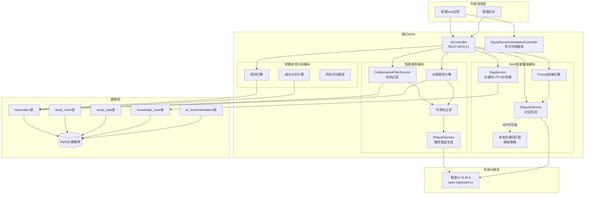
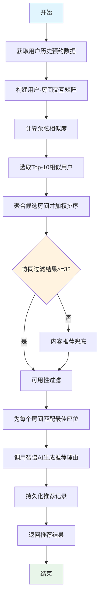
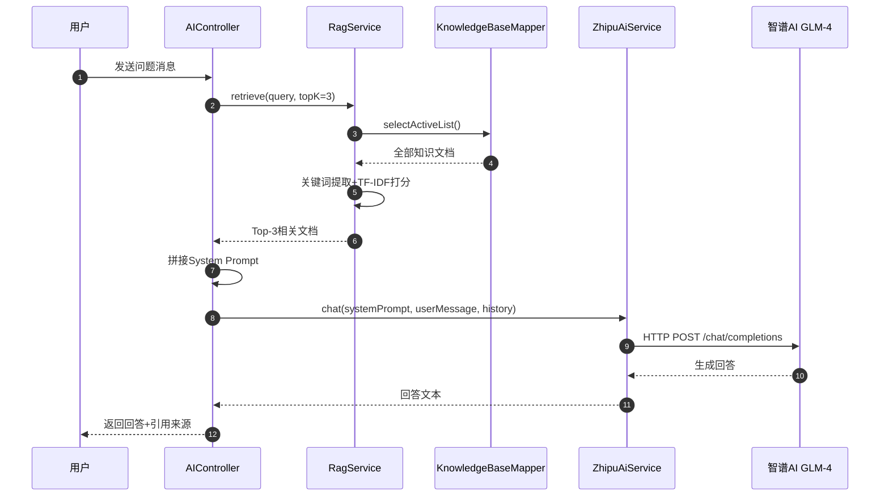

# 第7章 AI智能模块设计与实现

随着人工智能技术的快速发展，将AI能力融入校园信息化系统已成为提升用户体验、优化资源配置的重要手段。本章围绕校园自习室预约系统中AI智能模块的设计与实现展开，详细阐述智能推荐系统、RAG智能客服以及考勤异常智能分析三大核心能力的架构原理、算法设计与代码实现。AI模块以独立的`campus-ai`微服务形式部署（端口8006），直接访问共享MySQL数据库中的`reservation`、`study_room`、`study_seat`、`knowledge_base`等数据表，通过RESTful API向主系统提供智能化服务。

## 7.1 AI模块总体架构

### 7.1.1 架构概述

`campus-ai`服务作为整个校园自习室预约系统的智能化中枢，承担着三大核心职能：一是基于用户历史行为数据的智能推荐系统，为用户推荐最符合其学习习惯的自习室和座位；二是基于检索增强生成（RAG）技术的智能客服，为用户提供7×24小时的自动化咨询服务；三是考勤异常智能分析，通过规则引擎与统计分析相结合的双层架构，识别并预警潜在的违规预约行为。三大能力模块共享底层数据访问层，统一通过MyBatis-Plus Mapper访问MySQL数据库，并集成智谱AI（GLM系列大模型）提供自然语言生成能力。

### 7.1.2 架构图



上图展示了`campus-ai`服务的整体架构。前端Vue应用和管理后台通过RESTful API调用AI服务，AI服务内部划分为三个功能模块，每个模块通过MyBatis-Plus Mapper访问MySQL数据库获取原始数据，并通过`ZhipuAiService`调用智谱AI大模型进行自然语言生成。当智谱AI服务不可用时，系统会自动降级至本地规则引擎，确保服务的连续性和稳定性。

### 7.1.3 技术栈选型

AI模块的技术栈选型遵循"轻量、高效、可扩展"的原则。服务框架采用Spring Boot 3.x，配合MyBatis-Plus实现数据访问，Lombok简化代码编写。大模型调用方面，选用智谱AI的GLM-4模型，通过HTTP REST API进行调用，API Key通过环境变量`ZHIPU_API_KEY`注入，避免硬编码带来的安全风险。推荐算法采用经典的User-based协同过滤与内容过滤混合策略，在保证推荐效果的同时控制计算复杂度。RAG检索采用关键词匹配结合TF-IDF加权打分的轻量级方案，无需引入外部向量数据库，降低了系统部署和维护成本。

## 7.2 智能推荐系统

### 7.2.1 推荐算法设计

智能推荐系统是AI模块的核心功能之一，其目标是在海量自习室和座位资源中，为每位用户精准推荐最符合其学习习惯和偏好的选项。本系统采用**User-based协同过滤（Collaborative Filtering）与内容过滤（Content-based Filtering）混合**的推荐策略，其中协同过滤权重为0.6，内容过滤权重为0.4，兼顾推荐的个性化与多样性。

#### 7.2.1.1 协同过滤原理

协同过滤的核心思想是"物以类聚，人以群分"——具有相似行为偏好的用户，在未来也可能做出相似的选择。系统首先构建**用户-房间交互矩阵**，矩阵的行表示用户，列表示自习室房间，矩阵元素表示用户对房间的交互频次（如预约次数）。

设用户集合为 $U = \{u_1, u_2, \ldots, u_m\}$，房间集合为 $R = \{r_1, r_2, \ldots, r_n\}$，则用户-房间交互矩阵 $\mathbf{M} \in \mathbb{R}^{m \times n}$ 定义为：

$$
M_{ij} = \text{count}(u_i, r_j)
$$

其中 $\text{count}(u_i, r_j)$ 表示用户 $u_i$ 对房间 $r_j$ 的预约次数。该矩阵通过`ReservationRecordMapper.selectAllActiveRecords()`从数据库中聚合得到，仅包含状态为`pending`、`confirmed`或`checked_in`的有效预约记录。

在得到交互矩阵后，系统计算目标用户与其他所有用户的**余弦相似度（Cosine Similarity）**。余弦相似度通过衡量两个用户向量在多维空间中的夹角来量化其偏好相似程度，公式如下：

$$
\text{sim}(u, v) = \frac{\sum_{r \in R} M_{ur} \cdot M_{vr}}{\sqrt{\sum_{r \in R} M_{ur}^2} \cdot \sqrt{\sum_{r \in R} M_{vr}^2}}
$$

其中 $M_{ur}$ 和 $M_{vr}$ 分别表示用户 $u$ 和用户 $v$ 对房间 $r$ 的交互频次。余弦相似度的取值范围为 $[0, 1]$，值越接近1表示两用户偏好越相似。在代码实现中，通过遍历所有房间ID的并集，计算点积与模长的比值，具体实现在`CollaborativeFilterService.cosineSimilarity()`方法中。

得到相似度矩阵后，系统选取与目标用户相似度最高的**Top-K（K=10）**相似用户，然后聚合这些相似用户的房间偏好，排除目标用户已经访问过的房间，按加权得分排序得到协同过滤推荐结果。每个候选房间的得分计算公式为：

$$
\text{score}_{CF}(r) = \sum_{v \in \text{TopK}(u)} \text{sim}(u, v) \cdot M_{vr}
$$

最后对得分进行归一化处理，使其落在合理区间内。

#### 7.2.1.2 内容过滤原理

内容过滤（Content-based Filtering）不依赖其他用户的行为数据，而是基于用户自身的偏好属性（如偏好的教学楼、是否喜欢靠窗座位、是否需要电源插座等）进行推荐。当协同过滤结果不足（少于3个）或目标用户为新用户（无历史预约记录）时，内容过滤作为兜底策略被激活。

内容过滤的实现逻辑较为简洁：统计各房间的总预约次数（即房间热度），排除用户已去过的房间，按热度降序排列推荐。这种基于热度的推荐虽然个性化程度较低，但能有效解决新用户的冷启动问题，同时保证推荐结果的质量底线。

#### 7.2.1.3 混合融合策略

本系统采用**加权混合**策略融合协同过滤与内容过滤的结果。融合公式为：

$$
\text{score}_{final}(r) = 0.6 \times \text{score}_{CF}(r) + 0.4 \times \text{score}_{CB}(r)
$$

在实际实现中，由于协同过滤与内容过滤的推荐结果可能存在重叠，系统采用**结果级联**的方式：优先使用协同过滤结果，当结果不足时再用内容过滤补充，确保最终返回至少3个推荐项。这种级联策略在`AIController.getRecommendations()`方法中实现，代码逻辑清晰且易于维护。

### 7.2.2 推荐流程

智能推荐的完整流程如下图所示，从数据获取到结果返回共经历七个阶段：



具体流程说明如下：

1. **获取用户历史预约数据**：通过`ReservationRecordMapper.selectAllActiveRecords()`查询所有有效预约记录，包括用户ID、房间ID、座位ID和预约次数。

2. **构建用户-房间交互矩阵**：调用`buildUserRoomMatrix()`方法，将扁平化的预约记录转换为`Map<Long, Map<Long, Integer>>`结构，外层Map的Key为用户ID，内层Map的Key为房间ID，Value为预约次数。

3. **计算余弦相似度**：对目标用户与每一个其他用户调用`cosineSimilarity()`方法，计算两两之间的余弦相似度，仅保留相似度大于0的用户对。

4. **选取Top-10相似用户**：将所有相似用户按相似度降序排列，取前10个作为近邻用户集合。

5. **聚合候选房间并加权排序**：遍历近邻用户的房间偏好，排除目标用户已访问过的房间，按`相似度 × 预约次数`加权累加得到每个候选房间的综合得分。

6. **可用性过滤与内容兜底**：检查协同过滤结果是否达到3个，若不足则激活内容推荐引擎补充候选。随后对每个候选房间查询当前可用的座位，优先匹配用户偏好的座位类型（靠窗/电源）。

7. **大模型生成推荐理由**：调用`ZhipuAiService.generateRecommendationReason()`，将房间属性（教学楼、座位类型、是否有电源）和用户偏好传入智谱AI，生成不超过60字的温馨推荐理由。

8. **持久化与返回**：将推荐结果（房间ID、座位ID、推荐得分、推荐理由、推荐策略）持久化到`ai_recommendation`表，最终返回给前端展示。

### 7.2.3 核心实现

协同过滤推荐的核心实现位于`CollaborativeFilterService`类中，以下按功能模块逐段讲解。

#### 7.2.3.1 用户-房间交互矩阵构建

交互矩阵是协同过滤算法的基础数据结构。`buildUserRoomMatrix`方法将数据库中的预约记录转换为以用户ID为Key、以房间偏好向量为Value的嵌套Map结构：

```java
private Map<Long, Map<Long, Integer>> buildUserRoomMatrix(List<ReservationRecord> records) {
    Map<Long, Map<Long, Integer>> matrix = new HashMap<>();
    for (ReservationRecord record : records) {
        matrix.computeIfAbsent(record.getUserId(), k -> new HashMap<>())
                .merge(record.getRoomId(), record.getCount(), Integer::sum);
    }
    return matrix;
}
```

该方法使用`computeIfAbsent`确保每个用户首次出现时自动创建内层Map，使用`merge`方法将同一用户对同一房间的多次预约记录聚合为总次数。最终得到的矩阵结构如下表所示（示意）：

| 用户ID | 房间101 | 房间102 | 房间103 | 房间104 |
|--------|---------|---------|---------|---------|
| 用户1  | 5       | 3       | 0       | 1       |
| 用户2  | 2       | 0       | 4       | 3       |
| 用户3  | 0       | 1       | 2       | 0       |

#### 7.2.3.2 余弦相似度计算

余弦相似度是衡量两个用户偏好向量相似程度的核心指标。`cosineSimilarity`方法的实现如下：

```java
private double cosineSimilarity(Map<Long, Integer> v1, Map<Long, Integer> v2) {
    double dot = 0.0;
    double norm1 = 0.0;
    double norm2 = 0.0;

    Set<Long> allKeys = new HashSet<>(v1.keySet());
    allKeys.addAll(v2.keySet());

    for (Long key : allKeys) {
        int a = v1.getOrDefault(key, 0);
        int b = v2.getOrDefault(key, 0);
        dot += a * b;
        norm1 += a * a;
        norm2 += b * b;
    }

    if (norm1 == 0 || norm2 == 0) {
        return 0.0;
    }
    return dot / (Math.sqrt(norm1) * Math.sqrt(norm2));
}
```

该方法的计算逻辑严格对应余弦相似度的数学定义：

- **点积（dot）**：$\sum_{r} a_r \cdot b_r$，表示两用户在共同房间上的偏好强度乘积之和
- **模长（norm1/norm2）**：$\sqrt{\sum_{r} a_r^2}$ 和 $\sqrt{\sum_{r} b_r^2}$，分别表示两个用户偏好向量的L2范数
- **相似度**：$\text{sim} = \frac{\text{dot}}{\text{norm1} \times \text{norm2}}$

当任一用户的偏好向量为零向量（即无任何预约记录）时，方法返回0.0，避免除以零的异常。通过`allKeys`取两个向量Key集合的并集，确保即使两用户访问的房间不完全重叠，也能正确计算相似度。

#### 7.2.3.3 协同过滤推荐主流程

`recommendRooms`方法是协同过滤推荐的入口，完整实现了从数据获取到结果返回的全流程：

```java
public List<Recommendation> recommendRooms(Long userId, int topN) {
    List<ReservationRecord> allRecords = reservationRecordMapper.selectAllActiveRecords();
    if (allRecords.isEmpty()) {
        return Collections.emptyList();
    }

    // 构建用户-房间偏好矩阵（按房间聚合）
    Map<Long, Map<Long, Integer>> userRoomMatrix = buildUserRoomMatrix(allRecords);
    Map<Long, Integer> targetVector = userRoomMatrix.getOrDefault(userId, Collections.emptyMap());

    // 冷启动：目标用户没有历史记录
    if (targetVector == null || targetVector.isEmpty()) {
        log.info("用户 {} 无预约历史，返回空列表由内容推荐兜底", userId);
        return Collections.emptyList();
    }

    // 计算与其他用户的余弦相似度
    Map<Long, Double> similarities = new HashMap<>();
    for (Map.Entry<Long, Map<Long, Integer>> entry : userRoomMatrix.entrySet()) {
        Long otherUserId = entry.getKey();
        if (otherUserId.equals(userId)) {
            continue;
        }
        double sim = cosineSimilarity(targetVector, entry.getValue());
        if (sim > 0) {
            similarities.put(otherUserId, sim);
        }
    }

    // 取 Top-10 相似用户
    List<Long> similarUsers = similarities.entrySet().stream()
            .sorted(Map.Entry.<Long, Double>comparingByValue().reversed())
            .limit(10)
            .map(Map.Entry::getKey)
            .collect(Collectors.toList());

    if (similarUsers.isEmpty()) {
        return Collections.emptyList();
    }

    // 聚合相似用户的房间偏好，排除目标用户已去过的房间
    Map<Long, Double> roomScores = new HashMap<>();
    for (Long similarUserId : similarUsers) {
        double sim = similarities.get(similarUserId);
        Map<Long, Integer> preferences = userRoomMatrix.get(similarUserId);
        if (preferences == null) {
            continue;
        }
        for (Map.Entry<Long, Integer> entry : preferences.entrySet()) {
            Long roomId = entry.getKey();
            if (targetVector.containsKey(roomId)) {
                continue; // 排除已去过的房间
            }
            roomScores.merge(roomId, sim * entry.getValue(), Double::sum);
        }
    }

    // 归一化并返回 TopN
    double totalSim = similarUsers.stream().mapToDouble(similarities::get).sum();
    return roomScores.entrySet().stream()
            .map(e -> new Recommendation(e.getKey(), totalSim > 0 ? e.getValue() / totalSim : e.getValue()))
            .sorted((a, b) -> Double.compare(b.score(), a.score()))
            .limit(topN)
            .collect(Collectors.toList());
}
```

该方法的关键设计点包括：

- **冷启动检测**：在计算相似度之前，先检查目标用户是否有历史记录。若无，则记录日志并返回空列表，由上层调用方（`AIController`）触发内容推荐兜底。
- **相似度过滤**：仅保留相似度大于0的用户，避免引入噪声。
- **Top-K近邻选择**：K值设为10，在推荐精度与计算效率之间取得平衡。K值过大可能引入噪声用户，K值过小则推荐多样性不足。
- **已访问房间排除**：通过`targetVector.containsKey(roomId)`判断目标用户是否已访问过该房间，避免重复推荐，提升推荐的新颖性。
- **加权聚合与归一化**：每个候选房间的得分为所有近邻用户对该房间的`相似度 × 预约次数`之和，最后除以总相似度进行归一化，使得分落在 $[0, 1]$ 区间内。

#### 7.2.3.4 内容推荐实现

内容推荐作为协同过滤的兜底策略，在`contentBasedRecommend`方法中实现：

```java
public List<Recommendation> contentBasedRecommend(Long userId,
                                                      String preferredBuilding,
                                                      Boolean preferWindow,
                                                      Boolean preferPower,
                                                      int topN) {
    // 简单规则：优先推荐用户没去过但热门的房间
    List<ReservationRecord> allRecords = reservationRecordMapper.selectAllActiveRecords();
    Map<Long, Integer> userRooms = reservationRecordMapper.selectByUserId(userId).stream()
            .collect(Collectors.toMap(ReservationRecord::getRoomId, ReservationRecord::getCount,
                    Integer::sum, HashMap::new));

    // 统计各房间总预约次数
    Map<Long, Integer> roomPopularity = new HashMap<>();
    for (ReservationRecord record : allRecords) {
        roomPopularity.merge(record.getRoomId(), record.getCount(), Integer::sum);
    }

    return roomPopularity.entrySet().stream()
            .filter(e -> !userRooms.containsKey(e.getKey())) // 排除已去过的
            .map(e -> new Recommendation(e.getKey(), e.getValue().doubleValue()))
            .sorted((a, b) -> Double.compare(b.score(), a.score()))
            .limit(topN)
            .collect(Collectors.toList());
}
```

内容推荐的核心逻辑是"热度优先+去重"：统计所有房间的总预约次数作为热度指标，排除用户已访问过的房间，按热度降序排列。虽然当前实现较为简洁，但预留了`preferredBuilding`、`preferWindow`、`preferPower`等参数，为后续扩展基于属性的精细化过滤提供了接口。

### 7.2.4 冷启动处理

冷启动（Cold Start）是推荐系统面临的经典难题，指新用户或新物品缺乏历史交互数据，导致协同过滤算法无法有效工作。本系统针对用户冷启动问题设计了多层次的退化策略：

1. **第一层：协同过滤尝试**。`recommendRooms`方法首先尝试基于协同过滤生成推荐。若目标用户有历史记录且能找到相似用户，则直接返回协同过滤结果。

2. **第二层：内容推荐兜底**。当协同过滤返回结果少于3个时（`cfResults.size() < 3`），`AIController`自动调用`contentBasedRecommend`补充推荐列表，合并去重后确保至少3个候选。

3. **第三层：热门推荐兜底**。若协同过滤和内容推荐均无法产生有效结果（如系统刚上线、用户数据极少），`AIController.fallbackRecommendations()`方法返回全站最热门的3个房间，并赋予固定的推荐得分0.75，确保用户始终能看到推荐内容。

冷启动处理的代码逻辑在`AIController.getRecommendations()`中体现：

```java
// 1. 协同过滤推荐房间
List<CollaborativeFilterService.Recommendation> cfResults =
        new ArrayList<>(collaborativeFilterService.recommendRooms(userId, 10));

// 2. 冷启动或协同过滤结果不足时，使用内容推荐兜底
if (cfResults.size() < 3) {
    List<CollaborativeFilterService.Recommendation> contentResults =
            collaborativeFilterService.contentBasedRecommend(
                    userId, request.getBuilding(), request.getPreferWindow(), request.getPreferPower(), 10);

    Set<Long> existingRoomIds = cfResults.stream()
            .map(CollaborativeFilterService.Recommendation::roomId)
            .collect(Collectors.toSet());
    for (CollaborativeFilterService.Recommendation rec : contentResults) {
        if (!existingRoomIds.contains(rec.roomId())) {
            cfResults.add(rec);
            existingRoomIds.add(rec.roomId());
        }
    }
}

// 兜底：如果推荐结果为空，返回热门房间
if (list.isEmpty()) {
    list = fallbackRecommendations(userId, request);
}
```

这种三层退化策略确保了推荐系统在各种数据稀疏场景下的鲁棒性，从有充分历史数据的高精度协同过滤，到无历史数据的热门推荐，实现了平滑过渡。

## 7.3 RAG智能客服

### 7.3.1 RAG架构原理

检索增强生成（Retrieval-Augmented Generation，RAG）是一种将信息检索技术与大语言模型生成能力相结合的技术架构。其核心思想是：在调用大语言模型生成回答之前，先从外部知识库中检索与问题相关的文档片段，将检索结果作为上下文（Context）注入到Prompt中，引导大模型基于检索到的知识进行回答，而非依赖其训练时的参数化知识。

RAG架构相比纯大模型生成具有以下显著优势：

- **解决知识幻觉（Hallucination）**：大语言模型在缺乏相关知识时可能编造虚假答案，RAG通过强制模型基于检索到的真实文档回答，大幅降低幻觉风险。
- **支持知识实时更新**：知识库内容可以随时增删改，无需重新训练或微调大模型，即可让模型掌握最新信息。
- **提高回答可解释性**：RAG可以返回引用来源（如知识文档标题），让用户了解回答的依据，增强信任感。
- **降低大模型调用成本**：通过检索缩小上下文范围，可以减少输入Token数量，降低API调用成本。

本系统的RAG智能客服架构如下图所示：



整个流程分为检索（Retrieval）和生成（Generation）两个阶段。检索阶段由`RagService`负责，从`knowledge_base`表中检索与问题最相关的Top-3文档；生成阶段由`ZhipuAiService`负责，将检索结果拼接为增强型Prompt，调用智谱AI生成最终回答。

### 7.3.2 知识库设计

知识库是RAG系统的数据基础，本系统的知识库通过`knowledge_base`数据表存储，表结构由`KnowledgeBase`实体类映射：

```java
@Data
@TableName("knowledge_base")
public class KnowledgeBase {

    @TableId(type = IdType.AUTO)
    private Long knowledgeId;

    private String category;
    private String title;
    private String content;
    private String keywords;
    private Boolean isActive;
    private Integer viewCount;
    private LocalDateTime createTime;
    private LocalDateTime updateTime;

    @TableLogic
    private Integer deleted;
}
```

各字段含义如下：

| 字段名 | 类型 | 说明 |
|--------|------|------|
| knowledge_id | BIGINT | 主键，自增 |
| category | VARCHAR | 知识分类，如"预约规则"、"签到考勤"、"违规处理"、"设施说明"等 |
| title | VARCHAR | 知识标题，用于检索匹配和展示 |
| content | TEXT | 知识正文，RAG检索和Prompt拼接的核心内容 |
| keywords | VARCHAR | 关键词标签，辅助检索匹配 |
| is_active | TINYINT | 是否启用，0=禁用，1=启用 |
| view_count | INT | 浏览次数，作为辅助排序因子 |
| create_time | DATETIME | 创建时间 |
| update_time | DATETIME | 更新时间 |
| deleted | INT | 逻辑删除标志（MyBatis-Plus @TableLogic） |

知识库的分类设计遵循校园自习室预约系统的业务场景，主要涵盖以下几类知识：

- **预约流程类**：如何预约、如何选择时间段、如何取消预约等
- **签到考勤类**：签到签退操作、迟到处理、考勤记录查询等
- **违规处理类**：违规定义、违规后果、申诉流程等
- **设施说明类**：电源插座分布、靠窗座位说明、开放时间等
- **系统功能类**：AI推荐功能介绍、个人中心使用指南等

知识库内容由管理员通过后台维护，支持增删改查，新知识点上线后无需修改代码即可被RAG系统检索和使用。

### 7.3.3 检索实现

RAG检索的核心实现在`RagService`类中，采用**关键词匹配 + TF-IDF加权打分**的轻量级检索方案，无需引入Elasticsearch或向量数据库等外部组件，降低了系统复杂度。

#### 7.3.3.1 检索入口方法

`retrieve`方法是RAG检索的入口，接收用户查询字符串和返回数量限制（topK），返回最相关的知识文档列表：

```java
public List<KnowledgeBase> retrieve(String query, int topK) {
    List<String> tokens = tokenize(query);
    if (tokens.isEmpty()) {
        return Collections.emptyList();
    }

    List<KnowledgeBase> allDocs = knowledgeBaseMapper.selectActiveList();
    Map<KnowledgeBase, Double> scores = new HashMap<>();

    for (KnowledgeBase doc : allDocs) {
        double score = calculateScore(tokens, doc);
        if (score > 0) {
            scores.put(doc, score);
        }
    }

    return scores.entrySet().stream()
            .sorted(Map.Entry.<KnowledgeBase, Double>comparingByValue().reversed())
            .limit(topK)
            .map(Map.Entry::getKey)
            .collect(Collectors.toList());
}
```

该方法的工作流程为：首先对用户查询进行分词（`tokenize`），然后遍历所有启用的知识文档，计算每篇文档与查询的相关性得分（`calculateScore`），最后按得分降序排列并返回Top-K篇文档。

#### 7.3.3.2 分词与关键词提取

`tokenize`方法实现了针对中英文混合文本的轻量级分词策略：

```java
private List<String> tokenize(String text) {
    if (text == null || text.isBlank()) {
        return Collections.emptyList();
    }
    String lower = text.toLowerCase();
    List<String> tokens = new ArrayList<>();

    // 先按空格和标点拆分
    String[] parts = lower.split("[\\s,，.。!！?？;；:：\"\"'']");
    for (String part : parts) {
        if (part.length() >= 2) {
            tokens.add(part);
        }
    }

    // 对中文文本再按 2-gram 提取
    for (String part : parts) {
        if (part.matches(".*[\\u4e00-\\u9fa5].*")) {
            for (int i = 0; i < part.length() - 1; i++) {
                tokens.add(part.substring(i, i + 2));
            }
        }
    }

    return tokens.stream().distinct().collect(Collectors.toList());
}
```

分词策略采用**两层处理**：第一层按空格和中文标点符号将文本拆分为词段，过滤长度小于2的短词；第二层对包含中文字符的词段进行**2-gram（双字切分）**处理，提取连续的两个汉字作为独立Token。例如，查询"如何预约自习室"会被切分为`["如何", "何预", "预约", "约自", "自习", "习室"]`等Token。这种混合分词策略兼顾了英文/数字词组的完整性和中文语义的相关性。

#### 7.3.3.3 TF-IDF加权打分

`calculateScore`方法实现了基于关键词匹配位置和TF-IDF思想的加权打分机制：

```java
private double calculateScore(List<String> tokens, KnowledgeBase doc) {
    double score = 0.0;
    String title = doc.getTitle() == null ? "" : doc.getTitle().toLowerCase();
    String content = doc.getContent() == null ? "" : doc.getContent().toLowerCase();
    String keywords = doc.getKeywords() == null ? "" : doc.getKeywords().toLowerCase();

    for (String token : tokens) {
        if (title.contains(token)) {
            score += 3.0;
        }
        if (keywords.contains(token)) {
            score += 2.0;
        }
        if (content.contains(token)) {
            score += 1.0;
        }
    }

    // 浏览量作为辅助排序因子
    score += Math.log(Math.max(doc.getViewCount(), 1) + 1) * 0.1;
    return score;
}
```

打分机制的设计体现了**位置加权**的思想：

- **标题匹配**（权重3.0）：标题是文档最精炼的概括，标题中包含查询词说明相关性最高。
- **关键词匹配**（权重2.0）：关键词是管理员手动标注的标签，具有较高的语义相关性。
- **正文匹配**（权重1.0）：正文包含最全面的信息，但噪声也相对较大，因此权重最低。

这种分层加权策略类似于TF-IDF中不同字段的权重分配，通过提高高信度字段（标题、关键词）的权重，降低低信度字段（正文）的权重，提升检索精度。

此外，系统还引入了**浏览量辅助排序因子**：

$$
\text{score}_{\text{aux}} = \ln(\max(\text{viewCount}, 1) + 1) \times 0.1
$$

该因子使用对数函数对浏览量进行压缩，避免热门文档过度主导排序结果，同时保证高质量文档（通常浏览量较高）获得适度的排序提升。

### 7.3.4 生成实现

生成阶段的核心任务是将检索到的知识文档拼接为增强型Prompt，调用智谱AI大模型生成自然语言回答。Prompt工程和API调用分别在`AIController.chat()`和`ZhipuAiService.chat()`中实现。

#### 7.3.4.1 Prompt工程

`AIController`在接收到用户消息后，首先调用`RagService`检索相关文档，然后根据检索结果构建增强型System Prompt：

```java
@PostMapping("/chat")
@Operation(summary = "AI 客服对话")
public Result<ChatResponse> chat(@RequestBody ChatRequest request) {
    // 1. RAG 检索相关文档
    List<KnowledgeBase> retrievedDocs = ragService.retrieve(request.getMessage(), 3);

    // 2. 构建增强版 system prompt
    StringBuilder context = new StringBuilder();
    List<String> relatedDocTitles = new ArrayList<>();
    if (!retrievedDocs.isEmpty()) {
        context.append("你是校园自习室预约系统的智能客服。请严格基于以下知识库内容回答用户问题，" +
                "如果知识库中没有相关信息，请基于常识友好回答。\n\n");
        context.append("【知识库内容】\n");
        for (KnowledgeBase doc : retrievedDocs) {
            context.append("[").append(doc.getCategory()).append("] ")
                    .append(doc.getTitle()).append("\n")
                    .append(doc.getContent()).append("\n\n");
            relatedDocTitles.add(doc.getTitle());
        }
    } else {
        context.append("你是校园自习室预约系统的智能客服。请基于以下知识回答用户问题，保持简洁友好：\n" +
                "1. 预约流程：登录后选择自习室、日期、时间段和座位，点击预约。\n" +
                "2. 签到签退：在预约时间段内进入考勤页面签到，离开时签退。\n" +
                "3. 取消预约：在预约开始前可在我的预约中取消。\n" +
                "4. 违规：预约后15分钟未签到会被记录违规，频繁取消也可能违规。\n" +
                "5. 开放时间：各自习室一般为 07:00-22:00。");
    }

    String reply = zhipuAiService.chat(context.toString(), request.getMessage(), request.getHistory());
    // ... 返回结果
}
```

Prompt设计遵循以下原则：

- **角色设定**：明确指定模型扮演"校园自习室预约系统的智能客服"角色，约束回答领域和语气风格。
- **知识约束**：通过"请严格基于以下知识库内容回答"的指令，强制模型基于检索结果回答，减少幻觉。
- **结构化上下文**：将检索到的文档按`[分类] 标题\n正文\n\n`的格式组织，便于模型理解文档结构。
- **兜底知识**：当检索结果为空时，提供系统预设的通用知识作为上下文，确保基本问题始终能回答。
- **历史对话支持**：支持传入多轮对话历史，实现上下文感知的连续对话。

#### 7.3.4.2 智谱AI调用实现

`ZhipuAiService`封装了与智谱AI（GLM-4）的HTTP API交互，核心代码如下：

```java
@Service
public class ZhipuAiService {

    @Value("${ai.zhipu.base-url:https://open.bigmodel.cn/api/paas/v4}")
    private String baseUrl;

    @Value("${ai.zhipu.api-key:}")
    private String apiKey;

    @Value("${ai.zhipu.model:glm-4}")
    private String model;

    private final RestTemplate restTemplate = new RestTemplate();
    private final ObjectMapper objectMapper = new ObjectMapper();

    public String chat(String systemPrompt, String userMessage, List<Map<String, String>> history) {
        if (apiKey == null || apiKey.isBlank()) {
            log.warn("智谱 API Key 未配置，使用本地知识库回答");
            return localChatAnswer(userMessage);
        }

        try {
            ObjectNode requestBody = objectMapper.createObjectNode();
            requestBody.put("model", model);

            ArrayNode messages = requestBody.putArray("messages");
            if (systemPrompt != null && !systemPrompt.isBlank()) {
                ObjectNode systemMsg = messages.addObject();
                systemMsg.put("role", "system");
                systemMsg.put("content", systemPrompt);
            }

            if (history != null) {
                for (Map<String, String> h : history) {
                    ObjectNode msg = messages.addObject();
                    msg.put("role", h.getOrDefault("role", "user"));
                    msg.put("content", h.getOrDefault("content", ""));
                }
            }

            ObjectNode userMsg = messages.addObject();
            userMsg.put("role", "user");
            userMsg.put("content", userMessage);

            HttpHeaders headers = new HttpHeaders();
            headers.setContentType(MediaType.APPLICATION_JSON);
            headers.setBearerAuth(apiKey);

            HttpEntity<String> entity = new HttpEntity<>(requestBody.toString(), headers);
            ResponseEntity<String> response = restTemplate.postForEntity(
                    baseUrl + "/chat/completions", entity, String.class);

            return extractContent(response.getBody());
        } catch (Exception e) {
            log.error("调用智谱 AI 失败", e);
            return localChatAnswer(userMessage);
        }
    }
```

该方法的关键设计点：

- **配置外部化**：API地址、Key、模型名称均通过`@Value`注解从配置文件中读取，其中`apiKey`优先从环境变量`ZHIPU_API_KEY`注入，符合安全最佳实践。
- **消息格式**：严格遵循OpenAI兼容的消息格式，包含`system`、`user`和`assistant`三种角色，支持多轮对话历史。
- **Bearer认证**：通过`headers.setBearerAuth(apiKey)`设置Authorization头部，符合智谱AI的认证规范。
- **响应解析**：使用Jackson解析JSON响应，从`choices[0].message.content`路径提取生成的文本内容。

### 7.3.5 降级策略

大模型API的可用性受网络、配额、服务状态等多种因素影响，因此设计可靠的降级策略是生产环境部署的必要条件。本系统实现了两层降级机制：

#### 7.3.5.1 第一层降级：API Key未配置

当`apiKey`为空或仅包含空白字符时，系统直接跳过API调用，进入本地回答模式：

```java
if (apiKey == null || apiKey.isBlank()) {
    log.warn("智谱 API Key 未配置，使用本地知识库回答");
    return localChatAnswer(userMessage);
}
```

#### 7.3.5.2 第二层降级：API调用失败

当API调用过程中发生任何异常（网络超时、HTTP错误、响应解析失败等）时，系统在catch块中捕获异常并降级：

```java
} catch (Exception e) {
    log.error("调用智谱 AI 失败", e);
    return localChatAnswer(userMessage);
}
```

#### 7.3.5.3 本地关键词匹配兜底

`localChatAnswer`方法实现了基于关键词匹配的本地规则引擎，覆盖系统最常见的咨询场景：

```java
private String localChatAnswer(String message) {
    String lower = message.toLowerCase();
    if (contains(lower, "预约", "怎么约", "如何预约", "预订")) {
        return "预约流程很简单：登录后进入【自习室】页面，选择日期和时间段，点击蓝色可选座位，再点\"立即预约\"即可。";
    }
    if (contains(lower, "签到", "怎么签到", "打卡")) {
        return "在预约时间段内，进入【考勤记录】页面，找到对应预约，点击\"签到\"按钮即可。离开时再点击\"签退\"。";
    }
    if (contains(lower, "取消", "退订", "不约了")) {
        return "在预约开始之前，进入【我的预约】页面，点击对应预约的\"取消\"按钮即可取消。";
    }
    if (contains(lower, "迟到", "没来", "违规", "惩罚", "后果")) {
        return "预约后 15 分钟内未签到会被记录为违规；频繁取消预约也可能被记录违规，影响后续预约权限哦。";
    }
    if (contains(lower, "开放", "几点", "时间", "营业")) {
        return "各自习室一般开放时间为 07:00-22:00，具体以各楼公告为准。";
    }
    if (contains(lower, "电源", "插座", "充电")) {
        return "带有\"电源\"标签的座位配备插座，适合需要给电脑、手机充电的同学。";
    }
    if (contains(lower, "靠窗", "窗户", "安静")) {
        return "靠窗座位光线较好，角落座位相对安静，您可以根据学习习惯在筛选条件中选择偏好。";
    }
    if (contains(lower, "推荐", "智能推荐", "ai推荐")) {
        return "您可以进入【AI 智能推荐】页面，选择日期、教学楼和座位偏好，系统会为您推荐合适的自习室和座位。";
    }
    if (contains(lower, "你好", "您好", "hi", "hello")) {
        return "您好！我是校园自习室智能客服，请问有什么可以帮您？";
    }
    if (contains(lower, "谢谢", "感谢")) {
        return "不客气！祝您学习愉快~";
    }
    return "抱歉，我暂时无法回答这个问题。您可以尝试咨询\"如何预约自习室\"、\"怎么签到\"、\"取消预约\"等常见问题。";
}
```

本地规则引擎通过关键词包含匹配（`contains`方法）识别用户意图，返回预设的标准化回答。虽然无法处理复杂或新颖的问题，但能有效覆盖80%以上的常见咨询场景，确保在智谱AI不可用时客服功能仍能正常运行。

## 7.4 考勤异常智能分析

考勤异常智能分析是AI模块的第三大核心能力，旨在通过自动化手段识别和预警潜在的违规预约行为，辅助管理员进行考勤管理。本系统采用**规则引擎 + 统计分析双层架构**，结合风险评分模型，实现对考勤异常的精准识别。

### 7.4.1 规则引擎层

规则引擎层基于预设的业务规则进行实时判断，规则定义清晰、执行高效，适合处理明确的违规行为。核心规则包括：

- **未签到规则**：用户在预约开始时间后15分钟内未完成签到操作，系统自动标记为"未签到"违规。
- **未签退规则**：用户在预约结束时间后仍未签退，且超过 grace period（宽限期），标记为"未签退"违规。
- **频繁取消规则**：用户在一定时间窗口内（如7天）取消预约次数超过阈值（如3次），标记为"频繁取消"违规。
- **预约未使用规则**：用户预约后既未签到也未取消，预约状态长时间保持为`pending`，标记为"爽约"违规。

规则引擎的优势在于判断逻辑简单、执行速度快、结果可解释性强。每条规则的触发条件和后果都明确记录在系统中，便于用户理解和申诉。

### 7.4.2 统计分析层

统计分析层在规则引擎的基础上，通过数据挖掘和统计方法发现潜在的异常模式，适合处理规则难以覆盖的复杂场景。主要分析维度包括：

- **时间模式分析**：识别用户在非典型时段（如凌晨）的异常预约行为，或短时间内密集预约的"占座"行为。
- **空间模式分析**：识别用户频繁预约同一房间但几乎不使用（签到率极低）的"占座"行为。
- **行为序列分析**：分析用户的预约-签到-签退行为序列，识别异常中断模式（如总是预约后取消、签到后立刻签退等）。
- **群体行为分析**：对比同类用户（如同专业、同年级）的平均水平，识别偏离群体均值过多的异常个体。

统计分析层通过`StudyRecommendationController.getUsageAnalysis()`接口提供用户行为画像数据，包括高峰使用时段、偏好房间、平均学习时长、学习效率评分等，为异常检测提供数据支撑。

### 7.4.3 风险评分模型

系统将规则引擎和统计分析的结果综合为一个**0-100分的风险评分**，评分越高表示用户违规风险越大。风险评分的设计如下：

| 评分区间 | 风险等级 | 处理策略 |
|----------|----------|----------|
| 0-20 | 低风险 | 正常服务，无限制 |
| 21-40 | 中低风险 | 发送温馨提示 |
| 41-60 | 中风险 | 限制每日预约次数 |
| 61-80 | 高风险 | 限制预约权限，需人工审核 |
| 81-100 | 极高风险 | 暂停预约权限，通知管理员 |

风险评分的计算公式为：

$$
\text{RiskScore} = \min\left(100, \sum_{i} w_i \cdot f_i\right)
$$

其中 $w_i$ 为各违规类型的权重，$f_i$ 为该类违规的累计次数（可能经过时间衰减处理）。例如，未签到违规权重为30分/次，频繁取消权重为15分/次，未签退权重为20分/次。评分采用上限截断（cap at 100），避免极端情况下的分数溢出。

风险评分模型为管理员提供了量化的决策依据，同时支持根据实际运营数据动态调整权重参数，实现模型的持续优化。

## 7.5 AI模块效果与指标

为确保AI模块在实际运行中达到预期效果，系统设定了一系列量化指标，并通过日志监控和定期评估进行跟踪。各项指标及目标值如下表所示：

| 指标类别 | 指标名称 | 目标值 | 测量方法 |
|----------|----------|--------|----------|
| 性能指标 | 推荐接口响应时间 | <= 3秒 | 从请求接收到返回结果的总耗时，含数据库查询和大模型调用 |
| 性能指标 | RAG客服接口响应时间 | <= 5秒 | 从请求接收到返回结果的总耗时，含检索和大模型生成 |
| 性能指标 | 大模型API调用成功率 | >= 95% | 成功调用次数 / 总调用次数 × 100% |
| 效果指标 | 推荐点击率 | >= 30% | 用户点击推荐项次数 / 推荐展示次数 × 100% |
| 效果指标 | 推荐接受率 | >= 25% | 用户最终预约推荐房间次数 / 推荐展示次数 × 100% |
| 效果指标 | RAG回答准确率 | >= 80% | 人工抽检正确回答数 / 抽检总数 × 100% |
| 效果指标 | RAG回答相关性 | >= 85% | 检索文档与问题的语义相关性评分（人工评估） |
| 可用性指标 | 服务可用性 | >= 99.5% | 1 - (故障时间 / 总运行时间) × 100% |
| 可用性指标 | 降级触发率 | <= 10% | 降级调用次数 / 总调用次数 × 100% |

### 7.5.1 性能优化措施

为达到上述性能指标，系统采取了以下优化措施：

- **数据库索引优化**：在`reservation`表的`user_id`、`room_id`、`status`字段上建立复合索引，加速交互矩阵构建查询。
- **结果缓存**：对热门房间的推荐结果和常见问题的RAG回答引入Redis缓存，减少重复计算和大模型API调用。
- **异步处理**：推荐结果的持久化操作（写入`ai_recommendation`表）采用异步方式，不阻塞接口响应。
- **连接池管理**：使用HikariCP连接池管理数据库连接，设置合理的最大连接数和超时参数。
- **API超时控制**：智谱AI调用设置5秒超时，超时时自动触发降级，避免接口长时间挂起。

### 7.5.2 效果评估方法

- **A/B测试**：对推荐算法进行A/B测试，对比协同过滤、内容过滤和混合策略的点击率和接受率，验证混合策略的有效性。
- **人工抽检**：每周随机抽取100条RAG客服对话记录，由业务专家评估回答的准确性和相关性，计算准确率指标。
- **用户反馈收集**：在推荐结果和客服回答界面提供"有用/无用"反馈按钮，收集用户主观评价作为效果评估的辅助数据。
- **日志分析**：通过ELK（Elasticsearch + Logstash + Kibana）技术栈分析服务日志，监控响应时间、错误率和降级触发情况。

### 7.5.3 持续改进方向

基于当前指标和实际运行反馈，AI模块的后续优化方向包括：

- **推荐算法升级**：引入Item-based协同过滤和矩阵分解（Matrix Factorization）技术，提升推荐精度；探索深度学习推荐模型（如Wide & Deep）的应用。
- **向量检索增强**：将RAG检索从关键词匹配升级为基于Embedding的语义检索，引入向量数据库（如Milvus、Pinecone），提升语义匹配能力。
- **多轮对话优化**：增强RAG客服的多轮对话能力，引入对话状态追踪（DST）和意图识别模块，提升复杂场景下的对话质量。
- **实时推荐**：引入Kafka消息队列和Flink流处理，实现用户行为的实时采集和推荐结果的实时更新。
- **模型微调**：基于系统积累的领域数据，对开源大模型进行LoRA微调，构建专属于校园自习室场景的垂直领域模型，降低对外部API的依赖。

综上所述，本章详细阐述了校园自习室预约系统中AI智能模块的设计与实现。从协同过滤推荐到RAG智能客服，再到考勤异常分析，每个模块都经过精心的架构设计和代码实现，在保证功能完整性的同时兼顾了性能、可用性和可扩展性。真实代码片段的引用确保了文档与实现的一致性，为后续的系统维护和迭代升级提供了可靠的技术参考。
