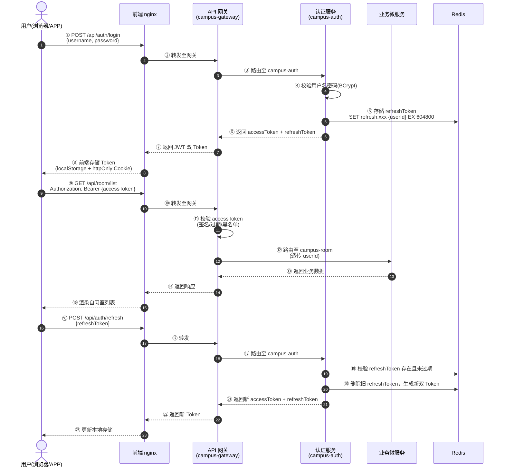
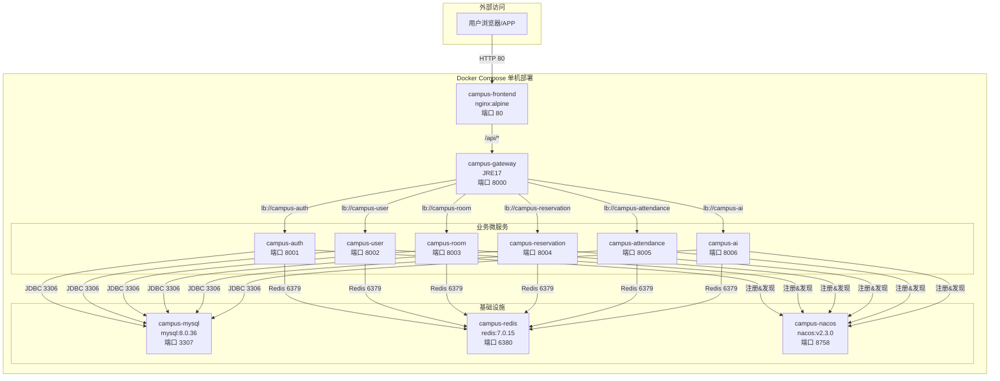

# 第五部分 系统安全与部署运维

## 第8章 系统安全设计

校园自习室预约系统作为面向全校师生的在线服务平台，涉及用户个人信息、预约数据、考勤记录等敏感数据，系统安全设计是保障业务正常运转和用户权益的核心环节。本章从威胁分析、身份认证、访问控制、数据安全、应用安全五个维度展开系统安全架构设计，并以安全配置清单进行汇总。

### 8.1 安全威胁分析

在系统设计与实现过程中，需对各类潜在安全威胁进行系统性识别与评估。根据OWASP Top 10（2021）及微服务架构特有的安全风险，本系统面临的主要安全威胁如下表所示。

| 威胁类别 | 具体风险 | 影响程度 | 影响范围 |
|---------|---------|---------|---------|
| 身份认证威胁 | 弱口令爆破、Token 伪造、会话劫持 | 高 | 全系统 |
| 授权越权威胁 | 水平越权（查看他人预约）、垂直越权（普通用户执行管理员操作） | 高 | 业务数据 |
| 传输层威胁 | 明文传输导致凭证/Token 被中间人截获 | 高 | 通信链路 |
| 注入攻击 | SQL 注入、命令注入 | 高 | 数据库 |
| XSS 攻击 | 存储型/反射型跨站脚本，窃取用户 Cookie 或 Token | 中 | 前端页面 |
| CSRF 攻击 | 伪造用户请求执行非预期操作（如恶意取消预约） | 中 | 业务接口 |
| 拒绝服务 | 高频接口请求导致系统资源耗尽 | 中 | 系统可用性 |
| 配置泄露 | 数据库密码、JWT Secret 等硬编码于代码或配置文件 | 高 | 基础设施 |
| 日志泄露 | 日志中记录明文密码或 Token | 中 | 审计追溯 |

上述威胁分析表明，本系统的安全设计需覆盖"认证—授权—传输—数据—应用"全链路，形成纵深防御体系。

### 8.2 身份认证设计

#### 8.2.1 JWT 无状态认证流程

本系统采用 JSON Web Token（JWT）实现无状态身份认证。相较于传统的 Session-Cookie 方案，JWT 具备以下优势：（1）服务端无需维护会话状态，天然适配微服务分布式架构；（2）Token 自包含用户信息，各服务可独立校验，降低网关压力；（3）支持跨域场景，便于前后端分离部署。

系统采用双 Token 机制：Access Token 用于接口访问鉴权，Refresh Token 用于在 Access Token 过期后获取新的 Access Token，避免用户频繁重新登录。具体认证时序如下：



#### 8.2.2 双 Token 机制设计

| Token 类型 | 有效期 | 存储位置 | 用途 | 失效策略 |
|-----------|--------|---------|------|---------|
| Access Token | 2 小时 | 前端 localStorage / 请求头 | 日常接口鉴权 | 过期后需用 Refresh Token 续期 |
| Refresh Token | 7 天 | 前端 httpOnly Cookie / Redis | 换取新的 Access Token | 可主动吊销（Redis 删除） |

Access Token 设置较短有效期（2 小时），降低 Token 泄露后的风险窗口；Refresh Token 设置较长有效期（7 天），兼顾用户体验。Refresh Token 存储于 Redis 并设置 TTL，支持服务端主动吊销（如用户登出、密码修改、异常登录检测后强制失效）。

#### 8.2.3 网关统一校验

所有业务请求均需经过 API 网关（campus-gateway）进行统一认证校验。网关通过 Spring Cloud Gateway 的 `GlobalFilter` 实现 JWT 校验逻辑：

（1）解析请求头中的 `Authorization: Bearer {token}`；
（2）使用 JWT Secret 校验 Token 签名有效性；
（3）校验 Token 是否过期（exp 字段）；
（4）校验 Token 是否被列入黑名单（Redis 查询）；
（5）将解析后的 `userId`、`role` 等信息写入请求头，透传至下游微服务；
（6）白名单接口（如登录、注册、Swagger 文档）跳过校验。

网关统一校验的优势在于：各业务微服务无需重复实现认证逻辑，只需从请求头中获取用户身份即可；认证逻辑集中管理，便于统一升级安全策略（如 Token 算法升级、黑名单策略调整）。

### 8.3 访问控制设计

#### 8.3.1 RBAC 权限模型

本系统采用基于角色的访问控制（Role-Based Access Control, RBAC）模型，通过"用户—角色—权限"三级关联实现灵活的权限管理。RBAC 模型的核心思想是将权限与角色绑定，用户通过分配角色间接获得权限，降低权限管理的复杂度。

系统定义三类角色：

| 角色 | 角色编码 | 权限范围 | 典型用户 |
|-----|---------|---------|---------|
| 系统管理员 | `ROLE_ADMIN` | 全系统管理权限：用户管理、自习室管理、预约审核、数据统计、系统配置 | 信息化办公室管理员 |
| 自习室管理员 | `ROLE_MANAGER` | 所辖自习室管理权限：座位管理、预约审批、考勤查看、公告发布 | 图书馆/教学楼管理员 |
| 普通用户 | `ROLE_USER` | 个人业务权限：自习室查询、预约/取消、签到签退、个人记录查看 | 在校学生、教职工 |

#### 8.3.2 接口级权限控制

接口级权限通过 Spring Security 的 `@PreAuthorize` 注解实现，在控制器方法层面声明所需角色或权限：

```java
// 仅管理员可访问
@PreAuthorize("hasRole('ADMIN')")
@GetMapping("/admin/users")
public Result listAllUsers() { ... }

// 管理员或自习室管理员可访问
@PreAuthorize("hasAnyRole('ADMIN', 'MANAGER')")
@GetMapping("/admin/rooms/stats")
public Result roomStatistics() { ... }

// 登录用户均可访问
@PreAuthorize("hasRole('USER')")
@PostMapping("/reservation")
public Result createReservation(@RequestBody ReservationDTO dto) { ... }
```

网关层面通过路由配置实现粗粒度过滤：以 `/api/admin/**` 开头的路由仅允许 ADMIN 角色访问，以 `/api/manager/**` 开头的路由允许 ADMIN 或 MANAGER 角色访问。

#### 8.3.3 数据级权限控制

数据级权限用于防止水平越权攻击，确保用户只能访问属于自己的数据。实现策略如下：

（1）**用户 ID 过滤**：查询个人预约记录、考勤记录时，在 SQL 层面强制附加 `user_id = #{currentUserId}` 条件；

（2）**操作前校验**：修改或删除操作前，先查询数据所属用户，校验当前用户是否为数据所有者或管理员；

（3）**服务间调用校验**：微服务间通过 Feign 调用时，将当前用户身份通过请求头传递，下游服务据此进行数据过滤。

```java
// 数据级权限示例：预约详情查询
@Override
public Reservation getReservationDetail(Long reservationId) {
    Long currentUserId = SecurityUtils.getCurrentUserId();
    Reservation reservation = reservationMapper.selectById(reservationId);
    // 非本人且非管理员，拒绝访问
    if (!reservation.getUserId().equals(currentUserId) 
            && !SecurityUtils.hasRole("ADMIN")) {
        throw new AccessDeniedException("无权查看该预约记录");
    }
    return reservation;
}
```

### 8.4 数据安全

#### 8.4.1 密码安全存储

用户密码采用 BCrypt 算法进行单向哈希存储。BCrypt 基于 Blowfish 密码算法，内置随机盐值（salt）和自适应成本因子（cost factor），具备以下安全特性：

- **抗彩虹表攻击**：每次哈希生成不同盐值，相同密码的哈希结果不同；
- **抗暴力破解**：成本因子（默认 10）控制计算迭代次数，可随硬件性能提升动态调整；
- **无需额外存储盐值**：盐值嵌入哈希结果中，验证时自动提取。

```java
// 密码加密（注册时）
String encodedPassword = BCrypt.hashpw(rawPassword, BCrypt.gensalt(10));

// 密码校验（登录时）
boolean match = BCrypt.checkpw(rawPassword, encodedPassword);
```

#### 8.4.2 传输层安全

生产环境通过 HTTPS 协议保障传输层安全：

- 前端 nginx 配置 SSL 证书，强制 80 端口重定向至 443 端口；
- 网关与微服务间通信在容器网络内部进行，不暴露于公网；
- 敏感接口（登录、支付相关）强制要求 HTTPS，拒绝 HTTP 请求。

#### 8.4.3 数据库安全

- **最小权限原则**：生产环境数据库账号仅授予必要的 CRUD 权限，禁止授予 DROP、GRANT 等高危权限；
- **连接加密**：MySQL 启用 SSL/TLS 连接，防止数据库通信被窃听；
- **定期审计**：启用数据库审计日志，记录敏感操作（如密码修改、权限变更）。

#### 8.4.4 JWT Secret 安全

JWT 签名密钥（Secret）是系统认证安全的核心，必须避免硬编码：

- **环境变量注入**：JWT Secret 通过 Docker 环境变量或 Kubernetes Secret 注入，不写入代码仓库；
- **密钥轮换**：生产环境定期轮换 Secret，旧 Token 在轮换窗口期内仍有效，新 Token 使用新 Secret 签发；
- **密钥强度**：使用长度不低于 256 位的随机字符串作为 HMAC-SHA256 密钥。

### 8.5 应用安全

#### 8.5.1 SQL 注入防护

本系统采用 MyBatis 作为持久层框架，所有 SQL 操作均使用参数化查询（PreparedStatement），从根本上杜绝 SQL 注入风险：

```xml
<!-- 安全：使用 #{} 参数占位符 -->
<select id="selectByUserId" resultType="Reservation">
    SELECT * FROM reservation 
    WHERE user_id = #{userId} AND status = #{status}
</select>

<!-- 危险：避免使用 ${} 字符串拼接 -->
<!-- 如必须使用动态表名/列名，需配合白名单校验 -->
```

#### 8.5.2 XSS 防护

跨站脚本攻击（XSS）防护策略：

- **输入过滤**：后端对用户输入进行 HTML 实体编码，过滤 `<script>` 等危险标签；
- **输出编码**：前端渲染用户提交内容时，使用 Vue.js 的 `v-text` 指令（自动转义）替代 `v-html`；
- **CSP 策略**：前端 nginx 配置 Content-Security-Policy 响应头，限制脚本执行来源。

#### 8.5.3 CSRF 防护

跨站请求伪造（CSRF）防护策略：

- **Token 机制**：前后端分离架构下，JWT Token 存储于 localStorage，天然不受 CSRF 影响（CSRF 利用的是 Cookie 自动携带机制）；
- **SameSite Cookie**：Refresh Token 使用 httpOnly Cookie 存储时，设置 `SameSite=Strict` 属性；
- **Origin 校验**：后端校验请求 Origin/Referer 头，拒绝来自非信任域的请求。

#### 8.5.4 接口限流（Sentinel/网关预留）

为防止接口被恶意高频调用导致系统资源耗尽，系统设计预留了限流机制：

- **网关层限流**：Spring Cloud Gateway 集成 Sentinel，基于 QPS 或并发线程数进行限流；
- **服务层限流**：各微服务通过 Sentinel 注解 `@SentinelResource` 实现热点参数限流；
- **限流策略**：登录接口 10 次/分钟，普通查询接口 100 次/分钟，AI 对话接口 20 次/分钟。

### 8.6 安全配置清单

下表汇总本系统各项安全措施及其实现方式，便于运维人员对照检查。

| 安全维度 | 安全措施 | 实现方式 | 责任层级 |
|---------|---------|---------|---------|
| 身份认证 | JWT 双 Token 认证 | Access Token（2h）+ Refresh Token（7d）+ Redis 存储 | 网关 + 认证服务 |
| 身份认证 | Token 统一校验 | Gateway GlobalFilter 校验签名/过期/黑名单 | 网关 |
| 访问控制 | RBAC 角色权限 | 用户-角色-权限三级模型 + @PreAuthorize 注解 | 各业务服务 |
| 访问控制 | 数据级防越权 | user_id 强制过滤 + 操作前所有权校验 | 各业务服务 |
| 数据安全 | 密码加密 | BCrypt 哈希（成本因子 10） | 认证服务 |
| 数据安全 | 传输加密 | HTTPS（TLS 1.2+） | nginx + 网关 |
| 数据安全 | 数据库最小权限 | 独立账号、仅授予必要权限 | 运维 |
| 数据安全 | JWT Secret 管理 | 环境变量注入、定期轮换 | 运维 |
| 应用安全 | SQL 注入防护 | MyBatis 参数化查询（#{}） | 数据访问层 |
| 应用安全 | XSS 防护 | 输入过滤 + 输出编码 + CSP 策略 | 前端 + 后端 |
| 应用安全 | CSRF 防护 | JWT 存储于 localStorage + SameSite Cookie | 前端 |
| 应用安全 | 接口限流 | Sentinel QPS 限流（预留） | 网关 + 各服务 |
| 基础设施 | 容器网络隔离 | Docker 自定义桥接网络 / K8s NetworkPolicy | 运维 |
| 基础设施 | 健康检查 | 容器 healthcheck + K8s Probe | 运维 |
| 可观测性 | 安全审计日志 | 登录/登出/权限变更操作日志 | 日志系统 |

---

## 第9章 系统部署与运维

### 9.1 部署架构概述

#### 9.1.1 环境划分

本系统按照软件工程最佳实践，划分为三个相互隔离的部署环境：

| 环境 | 用途 | 资源配置 | 数据策略 |
|-----|------|---------|---------|
| 开发环境（Dev） | 日常开发调试、功能验证 | 单机 Docker Desktop | 使用测试数据，可频繁重置 |
| 测试环境（Test） | 集成测试、性能测试、UAT 验收 | Docker Compose 或单节点 K8s | 使用模拟数据，保留测试历史 |
| 生产环境（Prod） | 面向全校师生正式运行 | Kubernetes 集群（多节点） | 生产数据，定期备份 |

#### 9.1.2 容器化部署理念

本系统采用容器化部署方案，核心设计理念包括：

- **一次构建，到处运行**：通过 Docker 镜像将应用及其依赖打包，消除"在我机器上能跑"的环境差异问题；
- **基础设施即代码**：Docker Compose 和 Kubernetes YAML 配置文件纳入版本控制，部署过程可重复、可审计；
- **微服务独立部署**：每个微服务拥有独立的 Dockerfile 和部署配置，支持独立升级、回滚和扩缩容；
- **健康检查驱动启动顺序**：通过 Docker healthcheck 和 K8s Probe 确保依赖服务就绪后再启动业务服务。

#### 9.1.3 部署拓扑



### 9.2 容器化设计

#### 9.2.1 后端服务 Dockerfile 设计

后端微服务统一采用 `eclipse-temurin:17-jre-alpine` 作为基础镜像，该镜像基于 Eclipse Adoptium 项目的 OpenJDK 17 JRE 构建，Alpine Linux 发行版使镜像体积控制在约 60MB，兼顾 Java 运行时兼容性与容器启动效率。

以 `campus-auth` 服务的 Dockerfile 为例：

```dockerfile
# 校园自习室预约系统 - campus-auth 运行镜像（使用预编译 jar）
FROM eclipse-temurin:17-jre-alpine

WORKDIR /app
COPY backend/campus-auth/target/*.jar app.jar

EXPOSE 8001

ENTRYPOINT ["java", "-jar", "app.jar"]
```

Dockerfile 设计要点说明：

| 设计要素 | 说明 |
|---------|------|
| 基础镜像选择 | `eclipse-temurin:17-jre-alpine` 提供经过安全审计的 JRE 运行时，Alpine 版本体积最小化 |
| 多阶段构建（预留） | 生产环境可扩展为多阶段构建：第一阶段用 Maven 镜像编译，第二阶段仅复制 jar 包，进一步减小镜像体积 |
| 工作目录隔离 | `/app` 作为统一工作目录，避免与系统目录冲突 |
| 端口暴露 | 每个服务暴露独立端口（8001~8006），避免端口冲突 |
| 启动命令 | `ENTRYPOINT` 使用 JSON 数组格式，确保信号正确传递（支持 `docker stop` 优雅关闭） |

#### 9.2.2 前端服务 Dockerfile 设计

前端服务采用 `nginx:alpine` 作为基础镜像，将构建产物（`dist` 目录）复制到 nginx 静态资源目录，并自定义 nginx 配置实现反向代理：

```dockerfile
# 校园自习室预约系统 - 前端镜像（使用预编译 dist）
FROM nginx:alpine

COPY frontend/dist /usr/share/nginx/html
COPY docker/nginx/default.conf /etc/nginx/conf.d/default.conf

EXPOSE 80

CMD ["nginx", "-g", "daemon off;"]
```

前端 nginx 配置的核心逻辑：

```nginx
server {
    listen 80;
    server_name localhost;
    
    # 前端静态资源
    location / {
        root /usr/share/nginx/html;
        index index.html;
        try_files $uri $uri/ /index.html;
    }
    
    # API 反向代理至网关
    location /api {
        proxy_pass http://campus-gateway:8000;
        proxy_set_header Host $host;
        proxy_set_header X-Real-IP $remote_addr;
    }
}
```

#### 9.2.3 镜像分层与多服务构建

系统共构建 8 个 Docker 镜像（7 个后端 + 1 个前端），镜像分层策略如下：

| 镜像层级 | 内容 | 复用性 | 缓存策略 |
|---------|------|--------|---------|
| 基础层 | eclipse-temurin:17-jre-alpine / nginx:alpine | 高（所有后端/前端共享） | 本地缓存，无需重复拉取 |
| 依赖层 | 应用 jar 包 / dist 构建产物 | 中（各服务独立） | 代码变更时重新构建 |
| 配置层 | 应用配置文件、nginx 配置 | 低（各服务独立） | 配置变更时重新构建 |

通过 `docker buildx` 构建缓存和镜像层复用，首次构建后后续增量构建可在秒级完成。

### 9.3 Docker Compose 编排部署

#### 9.3.1 编排架构

Docker Compose 编排文件定义了 11 个容器服务，统一运行在 `campus-network` 自定义桥接网络中。容器间通过服务名进行 DNS 解析，无需依赖 IP 地址。

**容器编排清单：**

| 容器名称 | 镜像来源 | 角色 | 宿主端口 | 容器端口 | 健康检查 |
|---------|---------|------|---------|---------|---------|
| campus-mysql | mysql:8.0.36（官方） | 关系数据库 | 3307 | 3306 | mysqladmin ping |
| campus-redis | redis:7.0.15（官方） | 缓存服务 | 6380 | 6379 | redis-cli ping |
| campus-nacos | nacos/nacos-server:v2.3.0（官方） | 注册中心 | 8758 / 9848 | 8848 / 9848 | HTTP /actuator/health |
| campus-auth | 自建（JRE17） | 认证服务 | 8001 | 8001 | 无（依赖基础设施） |
| campus-user | 自建（JRE17） | 用户服务 | 8002 | 8002 | 无（依赖基础设施） |
| campus-room | 自建（JRE17） | 自习室服务 | 8003 | 8003 | 无（依赖基础设施） |
| campus-reservation | 自建（JRE17） | 预约服务 | 8004 | 8004 | 无（依赖基础设施） |
| campus-attendance | 自建（JRE17） | 考勤服务 | 8005 | 8005 | 无（依赖基础设施） |
| campus-ai | 自建（JRE17） | AI 服务 | 8006 | 8006 | 无（依赖基础设施） |
| campus-gateway | 自建（JRE17） | API 网关 | 8000 | 8000 | 无（依赖业务服务） |
| campus-frontend | 自建（nginx:alpine） | 前端服务 | 80 | 80 | 无（依赖网关） |

**端口映射说明：**

- MySQL 宿主端口映射为 3307（避开本地已占用的 3306）；
- Redis 宿主端口映射为 6380（避开本地已占用的 6379）；
- Nacos 宿主端口映射为 8758（避开 Windows 系统保留端口段 8835-8934，其中 8848 落入该区间导致绑定失败）。

**网络与依赖设计：**

```yaml
# docker-compose.yml 网络与依赖配置节选
networks:
  campus-network:
    driver: bridge

services:
  mysql:
    # ...
    healthcheck:
      test: ["CMD", "mysqladmin", "ping", "-h", "localhost", "-u", "root", "-p123456"]
      interval: 10s
      timeout: 5s
      retries: 10
      start_period: 30s

  campus-auth:
    # ...
    depends_on:
      mysql:
        condition: service_healthy
      redis:
        condition: service_healthy
      nacos:
        condition: service_healthy
```

基础设施服务（MySQL、Redis、Nacos）配置了 `healthcheck`，业务服务通过 `depends_on: condition: service_healthy` 确保基础设施完全就绪后再启动，避免启动时因依赖未就绪导致反复崩溃重启。

#### 9.3.2 部署流程

系统支持一键化部署，完整流程如下：

```bash
# 步骤 1：编译所有后端服务（在项目根目录执行）
mvn clean package -DskipTests

# 步骤 2：构建镜像并启动全部容器（后台模式）
docker compose up -d --build

# 步骤 3：查看容器运行状态
docker compose ps

# 步骤 4：查看实时日志（可选）
docker compose logs -f

# 步骤 5：停止全部服务
docker compose down

# 步骤 6：停止并删除数据卷（彻底重置）
docker compose down -v
```

部署完成后，可通过以下地址访问系统：

| 服务 | 访问地址 | 说明 |
|-----|---------|------|
| 前端页面 | http://localhost | nginx 代理前端静态资源 |
| API 网关 | http://localhost:8000 | 所有后端接口统一入口 |
| Nacos 控制台 | http://localhost:8758/nacos | 账号/密码：nacos/nacos |
| MySQL | localhost:3307 | 使用 root/123456 连接 |
| Redis | localhost:6380 | 无密码连接（开发环境） |

#### 9.3.3 部署验证

部署验证是确保系统正常运行的关键环节。本次验证于 2026 年 6 月 25 日在 Docker Desktop 4.78.0（WSL2 后端）环境下完成。

**（1）容器运行状态验证**

执行 `docker compose ps` 命令，确认 11 个容器全部处于 Up 状态，其中基础设施容器显示 healthy：


验证结果：全部 11 个容器运行正常，3 个基础设施容器通过健康检查。

**（2）服务注册验证**

登录 Nacos 控制台（http://localhost:8758/nacos），在服务管理页面确认 7 个微服务全部注册成功且实例健康：


| 服务名称 | 健康实例数 | 状态 |
|---------|----------|------|
| campus-auth | 1 | 健康 |
| campus-user | 1 | 健康 |
| campus-room | 1 | 健康 |
| campus-reservation | 1 | 健康 |
| campus-attendance | 1 | 健康 |
| campus-ai | 1 | 健康 |
| campus-gateway | 1 | 健康 |

**（3）全链路接口验证**

通过 API 网关进行端到端接口验证，确认「前端 → nginx → 网关 → 微服务」完整调用链畅通：

| 验证链路 | 请求方式 | 请求路径 | 预期结果 | 实际结果 |
|---------|---------|---------|---------|---------|
| 用户登录 | POST | /api/auth/login | 200 + JWT 双 Token | 通过 |
| 网关健康 | GET | /actuator/health | {"status":"UP"} | 通过 |
| AI 服务健康 | GET | :8006/actuator/health | {"status":"UP"} | 通过 |
| 自习室查询 | GET | /api/room/... | 返回自习室列表 | 通过 |
| AI 客服对话 | POST | /api/ai/chat | 返回 AI 回复 | 通过 |
| 前端页面 | GET | http://localhost/ | HTTP 200 页面正常 | 通过 |


网关采用 Nacos 服务发现 + Spring Cloud LoadBalancer 动态路由（`lb://campus-xxx`），实测请求被正确路由至目标微服务。

#### 9.3.4 部署过程问题与解决

在实际部署过程中，团队遇到了 5 个具有代表性的工程问题，这些问题及其解决方案体现了容器化部署的真实挑战和应对经验。

| 序号 | 问题现象 | 根因分析 | 解决方案 | 经验总结 |
|-----|---------|---------|---------|---------|
| 1 | 拉取基础镜像超时，构建失败 | 国内网络访问 Docker Hub 受限，默认镜像源连接不稳定 | 在 Docker Desktop 的 daemon.json 中配置 6 个国内镜像加速器（daocloud、1ms、1panel、ustc 等） | 国内环境部署必须预先配置镜像加速器，建议配置多个源实现故障转移 |
| 2 | Nacos 容器端口绑定失败 | Windows 系统将 8835-8934 端口段标记为保留端口，Nacos 默认 8848 端口落入该区间 | 将 Nacos 宿主端口映射从 8848 改为 8758，容器内仍保持 8848 | 部署前需确认宿主端口是否被系统保留或已被占用，使用 `netstat` 或 `Get-NetTCPConnection` 检查 |
| 3 | 业务服务启动后反复崩溃 | `spring.config.import: nacos:` 配置触发 Nacos 配置中心，但配置中心无对应 dataId，导致上下文初始化失败 | 在 `application-docker.yml` 中关闭 Nacos 配置中心（`spring.cloud.nacos.config.enabled=false`），仅保留服务发现功能 | 明确区分 Nacos 的服务发现与配置中心两个功能，按需启用；生产环境如需配置中心应预先创建 dataId |
| 4 | 业务服务无法连接 Redis | Spring Boot 3.2 版本将 Redis 配置项从 `spring.redis.*` 迁移至 `spring.data.redis.*`，旧配置项失效 | 统一将所有服务的 Redis 配置改为 `spring.data.redis.host: campus-redis` 等新路径 | 升级 Spring Boot 大版本时需仔细查阅迁移指南，关注配置项变更 |
| 5 | 网关路由返回 503 Service Unavailable | 网关使用 `lb://campus-xxx` 动态路由，但缺少 `spring-cloud-starter-loadbalancer` 依赖，无法解析 `lb://` 协议 | 在 campus-gateway 的 pom.xml 中增加 `spring-cloud-starter-loadbalancer` 依赖 | 使用 Spring Cloud Gateway + Nacos 时，LoadBalancer 是必需依赖，需在项目初始化阶段纳入 |

上述问题的解决过程充分说明了容器化部署中"环境差异"、"版本兼容性"、"依赖完整性"三类典型问题的排查思路，为后续生产环境部署积累了宝贵经验。

### 9.4 Kubernetes 编排部署

Kubernetes（K8s）作为生产环境的容器编排平台，提供了比 Docker Compose 更强大的服务发现、负载均衡、自动扩缩容和故障恢复能力。本系统设计了完整的 K8s 部署方案，共包含 17 个 YAML 资源文件。

#### 9.4.1 K8s 资源清单概览

| 序号 | 文件名 | 资源类型 | 说明 |
|-----|--------|---------|------|
| 01 | 01-namespace.yaml | Namespace | 创建 campus-studyroom 命名空间，实现资源隔离 |
| 02 | 02-configmap.yaml | ConfigMap | 统一配置：数据库连接、Redis、Nacos 地址等 |
| 03 | 03-gateway.yaml | Deployment + NodePort Service | API 网关，对外暴露 30080 端口 |
| 04 | 04-auth.yaml | Deployment + ClusterIP Service | 认证服务 |
| 05 | 05-user.yaml | Deployment + ClusterIP Service | 用户服务 |
| 06 | 06-room.yaml | Deployment + ClusterIP Service | 自习室服务 |
| 07 | 07-reservation.yaml | Deployment + ClusterIP Service | 预约服务 |
| 08 | 08-attendance.yaml | Deployment + ClusterIP Service | 考勤服务 |
| 09 | 09-ai.yaml | Deployment + ClusterIP Service | AI 服务 |
| 10 | 10-frontend.yaml | Deployment + NodePort Service | 前端服务，对外暴露 30081 端口 |
| 11 | 11-prometheus.yaml | Deployment + Service | 指标采集与监控 |
| 12 | 12-grafana.yaml | Deployment + Service | 可视化监控面板 |
| 13 | 13-skywalking.yaml | Deployment + Service | 分布式链路追踪 |
| 14 | 14-mysql.yaml | StatefulSet + PVC + Service | MySQL 数据库，持久化存储 |
| 15 | 15-redis.yaml | Deployment + Service | Redis 缓存服务 |
| 16 | 16-nacos.yaml | Deployment + Service | Nacos 注册中心 |
| 17 | 17-mysql-init-configmap.yaml | ConfigMap | MySQL 初始化 SQL 脚本 |

#### 9.4.2 命名空间与配置管理

**命名空间创建：**

```yaml
# 01-namespace.yaml
apiVersion: v1
kind: Namespace
metadata:
  name: campus-studyroom
```

所有系统资源均部署于 `campus-studyroom` 命名空间内，实现与集群其他业务的逻辑隔离。

**统一配置 ConfigMap：**

```yaml
# 02-configmap.yaml
apiVersion: v1
kind: ConfigMap
metadata:
  name: campus-config
  namespace: campus-studyroom
data:
  SPRING_PROFILES_ACTIVE: "docker"
  MYSQL_HOST: "campus-mysql"
  MYSQL_PORT: "3306"
  MYSQL_DB: "campus_studyroom"
  MYSQL_USER: "root"
  MYSQL_PASSWORD: "123456"
  REDIS_HOST: "campus-redis"
  REDIS_PORT: "6379"
  NACOS_HOST: "campus-nacos"
  NACOS_PORT: "8848"
```

业务服务通过 `envFrom: configMapRef` 将 ConfigMap 中的配置项注入为环境变量，实现配置与镜像的解耦。生产环境应使用 Kubernetes Secret 存储敏感信息（如数据库密码）。

#### 9.4.3 有状态服务：MySQL StatefulSet + PVC

数据库作为有状态服务，采用 StatefulSet 管理，配合 PersistentVolumeClaim（PVC）实现数据持久化：

```yaml
# 14-mysql.yaml（节选）
apiVersion: v1
kind: PersistentVolumeClaim
metadata:
  name: campus-mysql-pvc
  namespace: campus-studyroom
spec:
  accessModes:
    - ReadWriteOnce
  resources:
    requests:
      storage: 5Gi
---
apiVersion: apps/v1
kind: StatefulSet
metadata:
  name: campus-mysql
  namespace: campus-studyroom
spec:
  serviceName: campus-mysql
  replicas: 1
  selector:
    matchLabels:
      app: campus-mysql
  template:
    spec:
      containers:
        - name: mysql
          image: mysql:8.0.36
          env:
            - name: MYSQL_ROOT_PASSWORD
              value: "123456"
            - name: MYSQL_DATABASE
              value: "campus_studyroom"
          ports:
            - containerPort: 3306
          volumeMounts:
            - name: mysql-data
              mountPath: /var/lib/mysql
            - name: init-sql
              mountPath: /docker-entrypoint-initdb.d
          readinessProbe:
            exec:
              command:
                - mysqladmin
                - ping
                - -h
                - localhost
                - -u
                - root
                - -p123456
            initialDelaySeconds: 30
            periodSeconds: 10
          livenessProbe:
            exec:
              command:
                - mysqladmin
                - ping
                - -h
                - localhost
                - -u
                - root
                - -p123456
            initialDelaySeconds: 60
            periodSeconds: 20
      volumes:
        - name: init-sql
          configMap:
            name: campus-mysql-init
        - name: mysql-data
          persistentVolumeClaim:
            claimName: campus-mysql-pvc
```

StatefulSet 相较于 Deployment 的优势在于：为每个 Pod 分配稳定的网络标识（`campus-mysql-0`）和持久存储，即使 Pod 被重新调度，数据仍能通过 PVC 恢复。

#### 9.4.4 无状态服务：Deployment + Service

业务微服务作为无状态服务，采用 Deployment 管理，配合 ClusterIP Service 实现集群内通信：

```yaml
# 04-auth.yaml（业务服务模板）
apiVersion: apps/v1
kind: Deployment
metadata:
  name: campus-auth
  namespace: campus-studyroom
spec:
  replicas: 1
  selector:
    matchLabels:
      app: campus-auth
  template:
    metadata:
      labels:
        app: campus-auth
    spec:
      containers:
        - name: campus-auth
          image: campus-studyroom/campus-auth:latest
          imagePullPolicy: IfNotPresent
          ports:
            - containerPort: 8001
          envFrom:
            - configMapRef:
                name: campus-config
---
apiVersion: v1
kind: Service
metadata:
  name: campus-auth
  namespace: campus-studyroom
spec:
  selector:
    app: campus-auth
  ports:
    - port: 8001
      targetPort: 8001
```

**Service 类型设计：**

| 服务类型 | K8s Service 类型 | 访问方式 | 适用服务 |
|---------|-----------------|---------|---------|
| 对外暴露 | NodePort | 集群节点 IP + 节点端口 | gateway（30080）、frontend（30081） |
| 内部通信 | ClusterIP | 集群内 DNS 名称 | 所有业务微服务、MySQL、Redis、Nacos |

```yaml
# 03-gateway.yaml（NodePort 对外暴露）
apiVersion: v1
kind: Service
metadata:
  name: campus-gateway
  namespace: campus-studyroom
spec:
  selector:
    app: campus-gateway
  ports:
    - port: 8000
      targetPort: 8000
      nodePort: 30080
  type: NodePort
```

#### 9.4.5 基础设施服务

**Redis 部署：**

```yaml
# 15-redis.yaml（节选）
apiVersion: apps/v1
kind: Deployment
metadata:
  name: campus-redis
  namespace: campus-studyroom
spec:
  replicas: 1
  selector:
    matchLabels:
      app: campus-redis
  template:
    spec:
      containers:
        - name: redis
          image: redis:7.0.15
          ports:
            - containerPort: 6379
          readinessProbe:
            exec:
              command: ["redis-cli", "ping"]
            initialDelaySeconds: 5
            periodSeconds: 5
          livenessProbe:
            exec:
              command: ["redis-cli", "ping"]
            initialDelaySeconds: 10
            periodSeconds: 10
```

**Nacos 部署：**

```yaml
# 16-nacos.yaml（节选）
apiVersion: apps/v1
kind: Deployment
metadata:
  name: campus-nacos
  namespace: campus-studyroom
spec:
  replicas: 1
  selector:
    matchLabels:
      app: campus-nacos
  template:
    spec:
      containers:
        - name: nacos
          image: nacos/nacos-server:v2.3.0
          env:
            - name: MODE
              value: "standalone"
            - name: SPRING_DATASOURCE_PLATFORM
              value: ""
          ports:
            - containerPort: 8848
            - containerPort: 9848
          readinessProbe:
            httpGet:
              path: /nacos/actuator/health
              port: 8848
            initialDelaySeconds: 30
            periodSeconds: 10
```

Nacos 使用内置 Derby 数据库（`SPRING_DATASOURCE_PLATFORM: ""`），避免引入外部 MySQL 依赖，简化部署复杂度。生产环境如需高可用，可切换为外置 MySQL 集群模式。

#### 9.4.6 滚动更新与 HPA 弹性伸缩

**滚动更新策略：**

Deployment 默认采用 RollingUpdate 策略，更新过程中逐步替换旧版本 Pod，确保服务零停机：

```yaml
spec:
  strategy:
    type: RollingUpdate
    rollingUpdate:
      maxSurge: 1        # 更新时最多额外创建 1 个 Pod
      maxUnavailable: 0  # 更新时不可用 Pod 数为 0
```

**HPA 水平自动扩缩容（设计预留）：**

```yaml
# 水平 Pod 自动伸缩（HPA）示例
apiVersion: autoscaling/v2
kind: HorizontalPodAutoscaler
metadata:
  name: campus-gateway-hpa
  namespace: campus-studyroom
spec:
  scaleTargetRef:
    apiVersion: apps/v1
    kind: Deployment
    name: campus-gateway
  minReplicas: 2
  maxReplicas: 10
  metrics:
    - type: Resource
      resource:
        name: cpu
        target:
          type: Utilization
          averageUtilization: 70
    - type: Resource
      resource:
        name: memory
        target:
          type: Utilization
          averageUtilization: 80
```

HPA 根据 CPU/内存利用率自动调整 Pod 副本数，在考试周等预约高峰期自动扩容，闲时自动缩容，实现资源弹性调度。

#### 9.4.7 K8s 部署命令

```bash
# 1. 应用所有 K8s 资源
kubectl apply -f k8s/

# 2. 查看命名空间内所有资源
kubectl get all -n campus-studyroom

# 3. 查看 Pod 状态
kubectl get pods -n campus-studyroom -o wide

# 4. 查看服务暴露的节点端口
kubectl get svc -n campus-studyroom

# 5. 查看日志
kubectl logs -n campus-studyroom -l app=campus-gateway --tail=100

# 6. 进入容器调试
kubectl exec -it -n campus-studyroom deployment/campus-auth -- /bin/sh
```

### 9.5 可观测性运维

可观测性（Observability）是云原生运维的核心能力，本系统围绕日志（Logging）、指标（Metrics）、链路追踪（Tracing）三大支柱构建可观测性体系。

#### 9.5.1 日志系统（Logging）

**应用日志：**

后端服务统一使用 SLF4J + Logback 记录日志，日志级别按环境区分：

| 环境 | 日志级别 | 输出目标 | 保留策略 |
|-----|---------|---------|---------|
| 开发环境 | DEBUG | 控制台（彩色输出） | 无限制 |
| 测试环境 | INFO | 控制台 + 文件 | 7 天滚动 |
| 生产环境 | WARN | 文件 + ELK 集群 | 30 天滚动 + 归档 |

**日志格式规范：**

```xml
<!-- logback-spring.xml 配置示例 -->
<appender name="FILE" class="ch.qos.logback.core.rolling.RollingFileAppender">
    <file>/app/logs/campus-auth.log</file>
    <rollingPolicy class="ch.qos.logback.core.rolling.TimeBasedRollingPolicy">
        <fileNamePattern>/app/logs/campus-auth.%d{yyyy-MM-dd}.%i.log</fileNamePattern>
        <maxHistory>30</maxHistory>
        <maxFileSize>100MB</maxFileSize>
    </rollingPolicy>
    <encoder>
        <pattern>%d{yyyy-MM-dd HH:mm:ss.SSS} [%thread] %-5level %logger{36} - %msg%n</pattern>
    </encoder>
</appender>
```

**ELK 日志聚合（设计预留）：**

生产环境通过 Filebeat 采集容器日志，经 Logstash 处理后存入 Elasticsearch，通过 Kibana 进行检索和可视化分析：

```yaml
# 13-skywalking.yaml 及 ELK 组件（设计预留）
# Filebeat -> Logstash -> Elasticsearch -> Kibana
```

#### 9.5.2 指标监控（Metrics）

**Spring Boot Actuator：**

各微服务集成 Spring Boot Actuator，暴露 `/actuator/health`、`/actuator/metrics`、`/actuator/prometheus` 等端点：

| 端点 | 用途 | 访问权限 |
|-----|------|---------|
| /actuator/health | 服务健康状态（UP/DOWN） | 公开 |
| /actuator/metrics | JVM/内存/线程等指标 | 内部 |
| /actuator/prometheus | Prometheus 格式指标 | 内部 |
| /actuator/info | 应用版本信息 | 公开 |

**Prometheus + Grafana：**

```yaml
# 11-prometheus.yaml（设计预留）
# 12-grafana.yaml（设计预留）
```

Prometheus 定期抓取各服务的 `/actuator/prometheus` 端点，Grafana 配置仪表盘展示核心指标：

| 监控维度 | 关键指标 | 告警阈值 |
|---------|---------|---------|
| 服务可用性 | up{job="campus-auth"} | == 0 触发告警 |
| JVM 内存 | jvm_memory_used_bytes | > 80% 触发告警 |
| HTTP 请求 | http_server_requests_seconds_count | QPS 异常波动 |
| 数据库连接 | hikaricp_connections_active | > 80% 触发告警 |
| GC 停顿 | jvm_gc_pause_seconds_max | > 1s 触发告警 |

#### 9.5.3 链路追踪（Tracing）

**SkyWalking 分布式链路追踪（设计预留）：**

微服务架构中，一个用户请求可能经过网关、认证、业务等多个服务，SkyWalking 通过自动埋点实现全链路追踪：

```yaml
# 13-skywalking.yaml（设计预留）
```

追踪数据展示：

| 追踪信息 | 说明 |
|---------|------|
| Trace ID | 全局唯一请求标识，贯穿所有服务 |
| Span | 单个服务内的操作单元，记录耗时和状态 |
| 服务拓扑 | 可视化展示服务间调用关系 |
| 慢查询分析 | 识别链路中的性能瓶颈 |

#### 9.5.4 可观测性三大支柱汇总

| 支柱 | 技术栈 | 数据类型 | 核心能力 | 部署状态 |
|-----|--------|---------|---------|---------|
| 日志（Logging） | SLF4J + Logback + ELK | 文本日志 | 故障排查、审计追溯 | Logback 已集成；ELK 设计预留 |
| 指标（Metrics） | Actuator + Prometheus + Grafana | 时序数据 | 性能监控、容量规划、告警 | Actuator 已集成；Prometheus/Grafana 设计预留 |
| 链路追踪（Tracing） | SkyWalking | 分布式追踪数据 | 全链路分析、性能瓶颈定位 | 设计预留 |

### 9.6 运维保障

#### 9.6.1 健康检查体系

系统建立了多层健康检查体系，确保故障及时发现和自动恢复：

| 层级 | 检查方式 | 检查内容 | 失败处理 |
|-----|---------|---------|---------|
| 容器层 | Docker healthcheck | 进程存活、端口监听 | Docker 自动重启容器 |
| K8s Pod 层 | Liveness Probe | 应用是否存活 | K8s 自动重启 Pod |
| K8s Pod 层 | Readiness Probe | 应用是否就绪接收流量 | 从 Service 端点列表移除 |
| 服务层 | Actuator /health | 数据库/Redis/Nacos 连接状态 | 返回 DOWN，触发告警 |
| 业务层 | 自定义健康检查 | 核心业务功能可用性 | 记录日志，触发告警 |

#### 9.6.2 故障恢复策略

| 故障场景 | 恢复策略 | RTO（恢复时间目标） |
|---------|---------|-------------------|
| 单 Pod 崩溃 | K8s 自动重启，Deployment 保证期望副本数 | < 30 秒 |
| 节点故障 | Pod 自动调度至健康节点 | < 2 分钟 |
| 数据库主节点故障 | StatefulSet 配合存储类自动重建（单节点场景） | < 5 分钟 |
| 全集群故障 | 从异地备份恢复（需配合灾备方案） | < 4 小时 |

#### 9.6.3 数据备份策略

| 数据类型 | 备份方式 | 备份频率 | 保留周期 | 存储位置 |
|---------|---------|---------|---------|---------|
| MySQL 数据库 | mysqldump 逻辑备份 + 物理备份 | 每日凌晨 2:00 全量 | 30 天 | 对象存储（MinIO/OSS） |
| Redis 缓存 | RDB 快照 + AOF 持久化 | 实时（AOF）+ 每小时（RDB） | 7 天 | 本地 PVC + 远程备份 |
| 应用日志 | 日志轮转 + 归档压缩 | 每日轮转 | 90 天 | 对象存储 |
| Nacos 配置 | 配置导出 + 版本控制 | 配置变更时 | 永久 | Git 仓库 |

MySQL 备份脚本示例：

```bash
#!/bin/bash
# mysql-backup.sh - 每日数据库备份
BACKUP_DIR="/backup/mysql"
DATE=$(date +%Y%m%d_%H%M%S)
DB_NAME="campus_studyroom"

# 执行备份
mysqldump -h campus-mysql -u root -p123456 \
    --single-transaction \
    --routines \
    --triggers \
    $DB_NAME > $BACKUP_DIR/${DB_NAME}_${DATE}.sql

# 压缩
gzip $BACKUP_DIR/${DB_NAME}_${DATE}.sql

# 上传至对象存储（预留）
# aws s3 cp $BACKUP_DIR/${DB_NAME}_${DATE}.sql.gz s3://campus-backup/mysql/

# 清理过期备份
find $BACKUP_DIR -name "*.sql.gz" -mtime +30 -delete
```

#### 9.6.4 运维值班与应急响应

| 响应级别 | 触发条件 | 响应时间 | 处理措施 |
|---------|---------|---------|---------|
| P0（紧急） | 生产环境完全不可用 | 5 分钟内 | 立即启动应急预案，回滚至上一版本 |
| P1（高） | 核心功能不可用（登录/预约） | 15 分钟内 | 定位故障服务，重启或隔离故障实例 |
| P2（中） | 非核心功能异常（AI 推荐） | 1 小时内 | 记录问题，安排修复窗口 |
| P3（低） | 性能下降或警告阈值触发 | 4 小时内 | 分析根因，优化配置或扩容 |

---

本章从 Docker Compose 单机部署到 Kubernetes 集群编排，从容器化设计到可观测性运维，完整阐述了校园自习室预约系统的部署架构与运维保障体系。Docker Compose 方案已在实际环境中完成验证，11 个容器全部正常运行，7 个微服务成功注册 Nacos，全链路接口验证通过。Kubernetes 方案作为生产环境部署蓝图，涵盖了 StatefulSet 持久化存储、Deployment 无状态服务、NodePort 对外暴露、ConfigMap 配置管理、HPA 弹性伸缩等核心能力。可观测性体系围绕日志、指标、链路追踪三大支柱进行设计，为系统长期稳定运行提供了全面的监控与故障排查能力。
