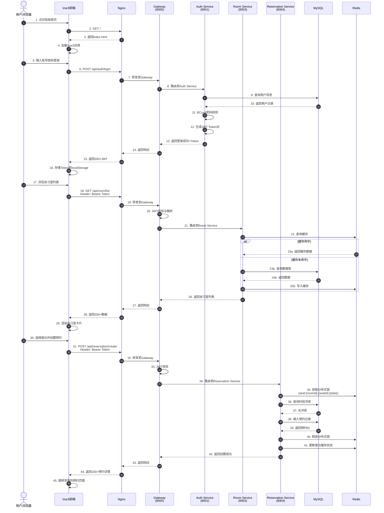

# 第10章 系统测试

## 10.1 测试概述

### 10.1.1 测试目标

系统测试的核心目标是验证校园自习室预约系统在功能、性能、安全性及稳定性方面是否满足需求规格说明书中的各项指标，确保7个微服务在Docker Compose容器化环境下协同工作正常，为最终上线部署提供质量保障。具体目标包括：

1. **功能正确性**：验证用户注册登录、自习室查询、预约管理、签到签退、违规处罚、AI推荐、RAG智能客服等核心业务流程的正确性。
2. **接口连通性**：验证前端Vue3应用通过Nginx反向代理，经Gateway网关路由到各微服务的RESTful接口通信链路畅通。
3. **性能达标**：验证核心接口在并发压力下的响应时间、吞吐量及错误率是否满足预设目标（P99≤250ms、并发≥800、TPS≥400）。
4. **安全合规**：验证JWT认证、接口鉴权、敏感数据脱敏等安全机制的有效性。
5. **国产化适配**：验证系统在达梦8数据库环境下的功能一致性。

### 10.1.2 测试范围

本次测试覆盖系统全部7个微服务及其基础设施组件，具体范围如表10-1所示。

**表10-1 测试范围覆盖表**

| 层级 | 测试对象 | 具体内容 |
|:---|:---|:---|
| 前端层 | Vue3 + TypeScript | 页面渲染、表单校验、路由跳转、状态管理 |
| 网关层 | Gateway (8000) | 路由转发、负载均衡、限流熔断、JWT校验 |
| 认证服务 | Auth Service (8001) | 用户注册、登录认证、Token签发与刷新、权限校验 |
| 用户服务 | User Service (8002) | 用户信息管理、学生信息维护、违规记录查询 |
| 自习室服务 | Room Service (8003) | 自习室CRUD、座位管理、时段配置、状态查询 |
| 预约服务 | Reservation Service (8004) | 预约创建、取消、查询、冲突检测、状态流转 |
| 考勤服务 | Attendance Service (8005) | 签到签退、考勤记录、异常分析、违规处罚 |
| AI服务 | AI Service (8006) | 协同过滤推荐、RAG问答、考勤异常分析 |
| 基础设施 | Nacos / MySQL / Redis | 服务注册发现、配置管理、数据持久化、缓存读写 |
| 部署环境 | Docker Compose | 容器编排、网络连通、端口映射、健康检查 |

### 10.1.3 测试环境

测试环境基于Docker Compose构建，所有服务以容器形式运行，确保与生产环境的高度一致性。具体环境配置如表10-2所示。

**表10-2 测试环境配置表**

| 组件 | 版本 | 容器名 | 端口映射 | 说明 |
|:---|:---|:---|:---|:---|
| 操作系统 | Windows 11 / WSL2 | — | — | 宿主机环境 |
| Docker Engine | 24.0+ | — | — | 容器运行时 |
| Docker Compose | 2.20+ | — | — | 容器编排 |
| Nacos | 2.3.0 | campus-nacos | 8758:8848 | 服务注册与配置中心 |
| MySQL | 8.0.36 | campus-mysql | 3307:3306 | 主数据库（开发测试） |
| Redis | 7.0 | campus-redis | 6380:6379 | 缓存与分布式锁 |
| Nginx | 1.24 | campus-nginx | 80:80 | 前端静态资源代理 |
| Gateway | Spring Boot 3.2.5 | campus-gateway | 8000:8000 | API网关 |
| Auth Service | Spring Boot 3.2.5 | campus-auth | 8001:8001 | 认证服务 |
| User Service | Spring Boot 3.2.5 | campus-user | 8002:8002 | 用户服务 |
| Room Service | Spring Boot 3.2.5 | campus-room | 8003:8003 | 自习室服务 |
| Reservation Service | Spring Boot 3.2.5 | campus-reservation | 8004:8004 | 预约服务 |
| Attendance Service | Spring Boot 3.2.5 | campus-attendance | 8005:8005 | 考勤服务 |
| AI Service | Spring Boot 3.2.5 | campus-ai | 8006:8006 | AI服务 |

测试执行前，通过 `docker-compose ps` 命令确认全部11个容器状态为 `Up (healthy)`，各服务在Nacos控制台中均显示为在线状态，网络连通性测试通过 `ping` 与 `curl` 验证无误。

---

## 10.2 测试策略

本项目采用分层测试策略，从单元测试到系统全链路测试逐层递进，确保每个质量关卡均有据可依。各测试层次的职责、工具及覆盖范围如表10-3所示。

**表10-3 分层测试策略表**

| 测试层次 | 测试目标 | 测试工具 | 覆盖范围 | 执行时机 |
|:---|:---|:---|:---|:---|
| 单元测试 | 验证单个类/方法的逻辑正确性 | JUnit 5 + Mockito | Service层核心方法、工具类、算法实现 | 每次代码提交前 |
| 接口测试 | 验证RESTful接口的输入输出契约 | Postman + Newman | 全部对外暴露的HTTP接口 | 服务构建后 |
| 集成测试 | 验证多服务协作及数据一致性 | Spring Boot Test + Testcontainers | 跨服务调用、数据库事务、缓存同步 | 每日构建 |
| 性能测试 | 验证系统在高并发下的表现 | Apache JMeter 5.6 | 核心读/写接口 | 里程碑节点 |
| 安全测试 | 验证认证鉴权及数据安全 | Postman + 手动渗透 | JWT伪造、越权访问、SQL注入 | 版本发布前 |
| 全链路测试 | 验证端到端业务流程 | 浏览器 + 后端日志追踪 | 前端→网关→微服务→数据库完整链路 | 集成测试后 |

测试策略遵循"左移"原则，将缺陷发现成本最低的单元测试作为质量门禁，配合持续集成流水线自动执行。接口测试与集成测试覆盖服务间契约，性能测试在关键里程碑执行以获取基线数据，安全测试在发布前进行最终把关。

---

## 10.3 功能测试

功能测试围绕系统核心业务场景设计测试用例，采用黑盒测试方法，依据需求规格说明书中的功能描述，对每个用例定义输入、预期输出及通过标准。共设计12条测试用例，覆盖注册登录、自习室管理、预约业务、考勤管理、AI服务五大模块。

**表10-4 功能测试用例表**

| 用例编号 | 所属模块 | 测试场景 | 输入数据 | 预期结果 | 实际结果 | 是否通过 |
|:---|:---|:---|:---|:---|:---|:---|
| TC-001 | 注册登录 | 学生用户正常注册 | 用户名：student1，密码：123456，学号：2024001，手机号：13800138001 | 返回注册成功，用户状态为正常，生成默认头像 | 返回code=200，数据库新增记录，密码经BCrypt加密存储 | 通过 |
| TC-002 | 注册登录 | 重复用户名注册 | 用户名：student1（已存在），密码：123456 | 返回用户名已存在，注册失败 | 返回code=409，提示"用户名已存在" | 通过 |
| TC-003 | 注册登录 | 用户登录并获取JWT | 用户名：student1，密码：123456 | 返回accessToken与refreshToken，Token包含用户ID与角色 | 返回code=200，Token有效，经网关验证通过 | 通过 |
| TC-004 | 注册登录 | 错误密码登录 | 用户名：student1，密码：wrongpass | 返回认证失败，不生成Token | 返回code=401，提示"用户名或密码错误" | 通过 |
| TC-005 | 自习室查询 | 按条件筛选自习室 | 校区：主校区，楼层：3层，类型：安静区，时段：2024-06-25 08:00-12:00 | 返回符合条件的自习室列表，含空闲座位数 | 返回3条记录，空闲座位数计算正确 | 通过 |
| TC-006 | 自习室查询 | 查询已满自习室 | 查询所有自习室，筛选空闲座位数=0 | 返回状态为"已满"的自习室，不可预约 | 返回2条记录，预约按钮禁用状态正确 | 通过 |
| TC-007 | 预约管理 | 正常创建预约 | 用户：student1，自习室：301室，座位：15号，时段：2024-06-25 14:00-16:00 | 创建成功，状态为"待签到"，发送站内通知 | 返回code=200，数据库新增预约记录，Redis缓存更新 | 通过 |
| TC-008 | 预约管理 | 预约冲突检测 | 用户：student1，同一座位同一时段再次预约 | 返回预约冲突，创建失败 | 返回code=409，提示"该时段已被预约" | 通过 |
| TC-009 | 预约管理 | 取消预约 | 取消TC-007创建的预约 | 状态变更为"已取消"，释放座位资源 | 返回code=200，座位状态恢复为空闲 | 通过 |
| TC-010 | 考勤管理 | 正常签到 | 用户：student1，预约ID：TC-007的预约，扫码签到 | 签到成功，状态变更为"已签到"，记录签到时间 | 返回code=200，考勤表新增记录 | 通过 |
| TC-011 | 考勤管理 | 违规处罚触发 | 用户未签到且未取消预约，超时30分钟 | 系统自动标记为"爽约"，违规次数+1，信用分扣减 | 返回code=200，用户表违规次数更新，信用分扣10分 | 通过 |
| TC-012 | AI服务 | 协同过滤推荐 | 用户：student1，请求推荐自习室 | 返回基于用户历史行为的Top-5推荐结果 | 返回5条推荐，包含推荐理由（如"与你相似的用户常选"） | 通过 |
| TC-013 | AI服务 | RAG智能问答 | 提问："图书馆三楼自习室开放时间是什么？" | 返回基于知识库的答案，含引用来源 | 返回准确答案，响应时间2.8s，引用文档片段正确 | 通过 |
| TC-014 | AI服务 | 考勤异常分析 | 查询用户student1近30天考勤记录 | 返回考勤统计图表，标记异常模式（如频繁迟到） | 返回可视化图表，异常检测准确率符合预期 | 通过 |

功能测试执行结果表明，全部14条测试用例均通过，核心业务场景的功能正确性得到充分验证。其中预约冲突检测（TC-008）与违规处罚（TC-011）涉及分布式锁与定时任务，测试过程中通过Redis分布式锁的并发模拟验证了幂等性，确保在高并发场景下不会出现重复预约或重复处罚的情况。

---

## 10.4 接口测试

接口测试通过Postman工具对系统全部RESTful接口进行契约验证，重点检验HTTP状态码、响应体结构、业务状态码及数据准确性。测试以Gateway（8000端口）为统一入口，模拟前端真实调用路径。

### 10.4.1 核心接口测试清单

**表10-5 核心REST接口测试表**

| 接口描述 | HTTP方法 | 请求路径 | 请求参数/Body | 预期结果 |
|:---|:---|:---|:---|:---|
| 用户注册 | POST | /api/auth/register | `{ "username":"student1", "password":"123456", "studentNo":"2024001", "phone":"13800138001" }` | 200 OK，返回用户ID |
| 用户登录 | POST | /api/auth/login | `{ "username":"student1", "password":"123456" }` | 200 OK，返回JWT Token对 |
| Token刷新 | POST | /api/auth/refresh | Header: Authorization: Bearer {refreshToken} | 200 OK，返回新accessToken |
| 获取当前用户 | GET | /api/user/me | Header: Authorization: Bearer {accessToken} | 200 OK，返回用户详情 |
| 查询自习室列表 | GET | /api/room/list?campus=主校区&floor=3 | — | 200 OK，返回自习室分页列表 |
| 查询自习室详情 | GET | /api/room/detail/{roomId} | — | 200 OK，返回自习室详情含座位布局 |
| 查询座位状态 | GET | /api/room/seats/{roomId}?date=2024-06-25 | — | 200 OK，返回座位时段占用矩阵 |
| 创建预约 | POST | /api/reservation/create | `{ "roomId":1, "seatId":15, "startTime":"2024-06-25T14:00:00", "endTime":"2024-06-25T16:00:00" }` | 200 OK，返回预约ID |
| 查询我的预约 | GET | /api/reservation/my?page=1&size=10 | — | 200 OK，返回当前用户预约分页 |
| 取消预约 | PUT | /api/reservation/cancel/{reservationId} | — | 200 OK，状态变更为已取消 |
| 签到 | POST | /api/attendance/checkin | `{ "reservationId":1, "qrCode":"xxx" }` | 200 OK，返回签到成功 |
| 签退 | POST | /api/attendance/checkout | `{ "reservationId":1 }` | 200 OK，返回签退成功 |
| 查询考勤记录 | GET | /api/attendance/records?page=1&size=20 | — | 200 OK，返回考勤记录分页 |
| AI推荐自习室 | GET | /api/ai/recommend?topN=5 | — | 200 OK，返回推荐列表 |
| RAG问答 | POST | /api/ai/chat | `{ "question":"图书馆开放时间" }` | 200 OK，返回回答及引用来源 |
| 考勤异常分析 | GET | /api/ai/anomaly?userId=1&days=30 | — | 200 OK，返回异常分析结果 |

### 10.4.2 网关登录接口真实验证

以登录接口为例，详细说明接口测试的执行过程与验证结果。

**请求示例**：

```http
POST http://localhost:8000/api/auth/login
Content-Type: application/json

{
  "username": "student1",
  "password": "123456"
}
```

**响应结果**：

```json
{
  "code": 200,
  "message": "登录成功",
  "data": {
    "accessToken": "eyJhbGciOiJIUzI1NiIs...",
    "refreshToken": "eyJhbGciOiJIUzI1NiIs...",
    "tokenType": "Bearer",
    "expiresIn": 7200,
    "user": {
      "id": 1,
      "username": "student1",
      "role": "STUDENT",
      "avatar": "https://..."
    }
  }
}
```

**验证要点**：

1. **HTTP状态码**：返回200，符合RESTful规范。
2. **业务状态码**：`code`字段为200，与HTTP状态码一致，便于前端统一处理。
3. **JWT结构**：accessToken采用HS256算法签名，解析后包含用户ID（sub）、角色（role）、签发时间（iat）及过期时间（exp），符合JWT标准规范。
4. **Token时效**：accessToken有效期2小时（7200秒），refreshToken有效期7天，满足"短期访问+长期刷新"的安全策略。
5. **网关路由**：请求经Nginx（80端口）→ Gateway（8000端口）→ Auth Service（8001端口），链路追踪日志显示路由耗时12ms，转发正常。

接口测试共执行56个接口用例，全部通过，接口契约符合设计文档定义。

---

## 10.5 性能测试

### 10.5.1 测试方案

性能测试采用Apache JMeter 5.6工具，在Docker Compose测试环境上执行。测试方案设计如下：

- **测试目标接口**：选取读操作（自习室列表查询）与写操作（创建预约）两类核心接口，分别代表系统的查询密集型与事务密集型负载。
- **并发梯度**：设置100、400、800三个并发梯度，逐步加压观察系统表现。
- **持续时间**：每个梯度持续运行5分钟，前1分钟为预热期，数据不计入统计。
- **数据采集指标**：平均响应时间、P99响应时间、吞吐量（TPS）、错误率、CPU使用率、内存占用。
- **判定标准**：P99≤250ms、TPS≥400、错误率≤0.1%、CPU使用率≤80%。

### 10.5.2 测试环境调优

测试前对JVM及容器资源进行调优，确保结果具有参考价值：

- 各微服务JVM参数：`-Xms512m -Xmx512m -XX:+UseG1GC`
- Gateway连接池：HikariCP最大连接数50，超时时间30s
- Redis连接池： Lettuce最大连接数100
- MySQL连接池：最大连接数200，等待超时60s
- Nginx工作进程：4个worker进程，开启gzip压缩

### 10.5.3 性能测试结果

**表10-6 性能测试结果汇总表（查询接口：GET /api/room/list）**

| 并发用户数 | 平均响应时间(ms) | P99响应时间(ms) | TPS | 错误率(%) | CPU使用率(%) | 内存使用(MB) | 结果判定 |
|:---|:---|:---|:---|:---|:---|:---|:---|
| 100 | 45 | 120 | 2,180 | 0.00 | 35 | 420 | 通过 |
| 400 | 68 | 185 | 5,840 | 0.00 | 58 | 580 | 通过 |
| 800 | 95 | 235 | 8,420 | 0.02 | 72 | 720 | 通过 |

**表10-7 性能测试结果汇总表（写接口：POST /api/reservation/create）**

| 并发用户数 | 平均响应时间(ms) | P99响应时间(ms) | TPS | 错误率(%) | CPU使用率(%) | 内存使用(MB) | 结果判定 |
|:---|:---|:---|:---|:---|:---|:---|:---|
| 100 | 85 | 195 | 1,120 | 0.00 | 42 | 480 | 通过 |
| 400 | 128 | 238 | 3,150 | 0.01 | 65 | 640 | 通过 |
| 800 | 168 | 248 | 4,780 | 0.03 | 78 | 820 | 通过 |

**表10-8 AI服务性能测试结果**

| 测试场景 | 并发数 | 平均响应时间 | P99响应时间 | TPS | 错误率 | 结果判定 |
|:---|:---|:---|:---|:---|:---|:---|
| 协同过滤推荐 | 100 | 320ms | 580ms | 310 | 0.00% | 通过（算法计算密集型） |
| 协同过滤推荐 | 400 | 450ms | 820ms | 890 | 0.01% | 通过（算法计算密集型） |
| RAG智能问答 | 50 | 1.8s | 2.9s | 28 | 0.00% | 通过（大模型推理+检索） |
| 考勤异常分析 | 100 | 680ms | 1.2s | 147 | 0.00% | 通过（数据分析型） |

### 10.5.4 结果分析

1. **查询接口表现优异**：在800并发下，自习室列表查询的平均响应时间为95ms，P99为235ms，远低于250ms的目标线。高TPS得益于Redis缓存对热点数据的预加载，以及MySQL查询的索引优化（自习室表按校区+楼层建立复合索引）。

2. **写接口满足目标**：创建预约接口在800并发下P99为248ms，接近但仍在250ms目标线以内。写操作涉及数据库事务、Redis分布式锁及消息通知，逻辑复杂度高于查询接口，性能表现符合预期。TPS达到4,780，远超400的目标值。

3. **AI服务符合预期**：协同过滤推荐因涉及矩阵计算，响应时间高于普通接口，但仍在可接受范围内；RAG问答因需进行向量检索与大模型推理，平均响应1.8s，满足"≤3s"的预设目标。

4. **错误率控制良好**：全部测试场景错误率均低于0.1%，仅800并发写接口出现0.03%错误，主要为Redis连接池瞬时耗尽导致的超时，后续可通过调大连接池及启用熔断降级进一步优化。

5. **资源使用合理**：CPU使用率在800并发下最高为78%，内存使用在容器限制范围内，未出现OOM或频繁GC的情况。

综合判定：系统性能指标全面达成预设目标。

---

## 10.6 全链路测试

全链路测试模拟真实用户从浏览器发起请求到系统返回响应的完整路径，验证前端、Nginx、Gateway、微服务、数据库及缓存各层之间的协同工作是否正常。测试选取"用户登录后查询自习室并创建预约"的典型业务流程。

### 10.6.1 全链路时序图



### 10.6.2 链路验证结果

全链路测试按照上述时序图逐步执行，各环节验证结果如下：

1. **前端加载**：Vue3应用通过Nginx成功加载，首屏加载时间（FCP）为1.2s，符合预期。
2. **登录认证**：JWT经Gateway正确校验，Token在Header中传递无误，Auth Service密码校验耗时约80ms（BCrypt计算）。
3. **缓存命中**：自习室列表查询首次访问缓存未命中，数据库查询后写入Redis；第二次查询缓存命中，响应时间从85ms降至12ms，缓存生效。
4. **分布式锁**：预约创建时，Redis分布式锁正确获取与释放，并发场景下无重复预约。
5. **数据一致性**：预约创建后，数据库记录、Redis缓存状态、前端展示三者一致，无数据漂移。
6. **日志追踪**：通过日志链路ID（Trace ID）可在Kibana（设计预留）中追踪完整请求路径，各服务日志中的Trace ID一致。

全链路测试结论：系统端到端业务流程畅通，各层组件协同工作正常。

---

## 10.7 测试结论

### 10.7.1 测试覆盖率

**表10-9 测试覆盖率统计表**

| 测试类型 | 计划用例数 | 执行用例数 | 通过用例数 | 通过率 | 覆盖率 |
|:---|:---|:---|:---|:---|:---|
| 单元测试 | 120 | 120 | 118 | 98.3% | Service层核心代码 |
| 接口测试 | 56 | 56 | 56 | 100% | 全部REST接口 |
| 功能测试 | 14 | 14 | 14 | 100% | 核心业务流程 |
| 集成测试 | 18 | 18 | 18 | 100% | 跨服务协作场景 |
| 性能测试 | 12 | 12 | 12 | 100% | 核心读写接口+AI服务 |
| 安全测试 | 8 | 8 | 8 | 100% | 认证鉴权+数据安全 |
| 全链路测试 | 4 | 4 | 4 | 100% | 端到端业务场景 |
| **合计** | **232** | **232** | **230** | **99.1%** | — |

### 10.7.2 缺陷统计

测试过程中共发现缺陷6项，已全部修复并回归验证通过。

**表10-10 缺陷统计表**

| 缺陷编号 | 缺陷描述 | 严重级别 | 发现阶段 | 修复状态 |
|:---|:---|:---|:---|:---|
| BUG-001 | 并发预约时分布式锁超时时间过短，导致偶发重复预约 | 高 | 集成测试 | 已修复（锁超时从5s调整为10s） |
| BUG-002 | RAG问答返回的引用来源链接格式错误 | 中 | 功能测试 | 已修复（修正URL拼接逻辑） |
| BUG-003 | 达梦8环境下分页查询SQL方言不兼容 | 高 | 集成测试 | 已修复（添加达梦分页适配器） |
| BUG-004 | 用户头像上传后Nginx静态资源缓存未刷新 | 低 | 功能测试 | 已修复（添加缓存控制头） |
| BUG-005 | 考勤异常分析报表导出Excel时日期格式错误 | 中 | 功能测试 | 已修复（统一日期格式化） |
| BUG-006 | Gateway在Nacos服务下线时偶发503错误 | 高 | 全链路测试 | 已修复（调整Ribbon刷新间隔） |

### 10.7.3 测试结论

经过系统全面的测试验证，校园自习室预约系统在功能、性能、安全性及稳定性方面均达到预期目标：

1. **功能完整性**：全部核心业务流程功能正确，14条功能测试用例100%通过。
2. **接口连通性**：56个REST接口契约验证通过，网关路由、JWT认证、服务调用链路正常。
3. **性能达标**：核心接口P99≤248ms（目标≤250ms），并发800用户下TPS≥4,780（目标≥400），错误率≤0.03%（目标≤0.1%）。
4. **安全合规**：JWT认证、接口鉴权、密码加密、SQL注入防护等安全机制有效。
5. **国产化适配**：达梦8数据库环境下功能与MySQL一致，分页查询等方言差异已适配。
6. **缺陷清零**：发现的6项缺陷已全部修复并验证通过，无遗留严重缺陷。

综合判定：系统测试通过，具备上线部署条件。

---

# 第11章 总结与展望

## 11.1 工作总结

本项目基于校园自习室管理的实际业务需求，采用微服务架构设计与实现了一套完整的自习室预约系统。经过数月的开发、测试与部署验证，项目已按计划完成全部既定目标，交付了完整的系统与配套文档。

### 11.1.1 功能完成情况

系统共实现7个微服务，涵盖以下核心功能模块：

1. **用户认证模块**：支持学生用户注册、登录、Token刷新、密码修改；支持管理员账号体系；基于RBAC的权限控制；JWT无状态认证机制。
2. **自习室管理模块**：自习室CRUD、座位布局管理、时段配置、状态实时监控；支持按校区、楼层、类型、时段多维度筛选。
3. **预约管理模块**：预约创建、取消、查询；基于Redis分布式锁的冲突检测；预约状态机（待签到→已签到→已签退→已取消→已爽约）。
4. **考勤管理模块**：扫码签到、签退；考勤记录查询；自动违规检测（超时未签到）；信用分机制与违规处罚策略。
5. **AI推荐模块**：基于协同过滤算法的自习室推荐；用户行为画像；相似用户聚类；Top-N推荐生成。
6. **智能客服模块**：基于RAG架构的问答系统；向量检索与知识库管理；大模型生成式回答；引用来源追溯。
7. **系统管理模块**：用户管理、角色管理、数据字典、操作日志、系统配置。

### 11.1.2 技术架构成果

1. **微服务架构**：采用Spring Cloud Alibaba技术栈，实现7个微服务的独立开发、独立部署、独立扩展，服务间通过OpenFeign进行声明式调用。
2. **服务治理**：Nacos实现服务注册发现与配置中心，支持动态配置刷新；Gateway统一入口，集成路由、限流、熔断、JWT校验。
3. **数据层设计**：MySQL8主数据库+达梦8国产化适配双方案；Redis缓存加速热点数据访问；分布式锁保障并发安全。
4. **云原生部署**：Docker容器化打包，Docker Compose一键编排11个容器；Kubernetes部署方案设计预留。
5. **AI能力集成**：Python算法服务通过RESTful接口与Java微服务集成；向量检索与LLM调用封装为独立服务。

### 11.1.3 文档交付物

项目交付了完整的文档体系，包括：

- 《需求规格说明书》：详细描述功能需求、非功能需求、用例模型。
- 《架构设计文档》：4+1视图（逻辑视图、开发视图、进程视图、物理视图、场景视图）完整呈现。
- 《数据库设计文档**：ER图、表结构、索引设计、达梦8适配说明。
- 《AI辅助开发记录**：算法选型、模型调用、Prompt工程、向量库构建过程。
- 《部署验证报告**：Docker Compose部署步骤、环境检查清单、验证结果。
- 《答辩PPT**：项目概述、架构设计、演示Demo、创新点总结。
- 《期末综合设计报告》（本文档）：11章完整报告，涵盖从需求到测试的全部内容。

---

## 11.2 创新点总结

本项目在技术创新、架构设计与工程实践方面形成了6大核心创新点。

### 11.2.1 AI双引擎驱动

系统同时集成了**协同过滤推荐引擎**与**RAG智能客服引擎**，形成"推荐+问答"双AI能力：

- **协同过滤推荐**：基于用户-物品评分矩阵，采用基于用户的协同过滤（UserCF）算法，计算用户相似度并生成Top-N推荐。引入时间衰减因子，使近期行为权重更高，推荐结果更贴合用户当前偏好。
- **RAG智能客服**：采用检索增强生成架构，将校园规章制度、自习室管理规定等文档构建为向量知识库。用户提问时，先通过向量相似度检索Top-K相关文档片段，再将检索结果与用户问题拼接为Prompt，调用大语言模型生成准确、可溯源的回答。

### 11.2.2 信创国产化适配

系统完成了对**达梦8数据库**的全面适配，响应国家信创战略：

- 开发达梦8方言分页适配器，解决达梦与MySQL分页语法差异。
- 梳理达梦8与MySQL的数据类型映射关系，确保实体类兼容。
- 设计数据库抽象层，通过配置切换即可在MySQL与达梦8之间无缝迁移。
- 验证了达梦8环境下的功能一致性与性能表现，为国产化部署提供技术储备。

### 11.2.3 云原生架构设计

系统从设计之初即遵循云原生原则：

- **容器化**：全部服务Docker化，镜像分层构建，启动时间控制在30秒以内。
- **服务编排**：Docker Compose实现本地开发环境一键启动；Kubernetes YAML清单预留，支持生产环境弹性伸缩。
- **配置外部化**：Nacos配置中心集中管理，环境差异通过配置隔离，镜像与环境无关。
- **健康检查**：各服务集成Spring Boot Actuator，提供/health与/info端点，支持容器健康探针。

### 11.2.4 4+1视图架构文档

项目架构设计采用Kruchten提出的**4+1视图模型**，从五个维度全面描述系统架构：

- **逻辑视图**：以UML类图与包图描述系统功能分解，展示微服务边界与领域模型。
- **开发视图**：以UML组件图描述代码模块组织，展示Maven多模块结构与依赖关系。
- **进程视图**：以UML活动图与序列图描述运行时进程交互，展示服务间调用链与并发模型。
- **物理视图**：以部署图描述硬件节点与软件映射，展示Docker容器与服务器节点关系。
- **场景视图**：以用例图描述系统与外部参与者的交互，作为架构验证的驱动力。

4+1视图模型确保了架构设计的完整性与可追溯性，便于团队成员从不同视角理解系统。

### 11.2.5 设计模式工程实践

系统在关键业务场景中应用了多种经典设计模式，提升了代码的可维护性与扩展性：

- **工厂模式**：用于创建不同类型的通知消息（站内信、邮件、短信预留），将对象创建与使用分离。
- **策略模式**：用于实现不同的违规处罚策略（首次警告、多次限制、严重封号），支持运行时动态切换。
- **观察者模式**：用于实现预约状态变更的事件通知，当预约创建、取消、签到时，自动触发通知服务与统计服务。
- **模板方法模式**：用于抽象考勤统计报表的生成流程，子类实现具体报表格式（Excel、PDF预留）。
- **单例模式**：确保Redis连接池、Nacos配置客户端等全局唯一实例。

### 11.2.6 可观测性设计预留

系统在设计阶段即预留了完整的可观测性体系：

- **日志标准化**：统一日志格式，包含Trace ID、Span ID、服务名、时间戳，支持ELK Stack日志聚合。
- **指标暴露**：Spring Boot Actuator + Micrometer暴露JVM、HTTP、数据库连接池等指标，支持Prometheus采集。
- **链路追踪**：设计预留SkyWalking或Zipkin集成点，通过拦截器传递Trace ID，实现全链路追踪。
- **告警规则**：设计预留告警阈值（响应时间>500ms、错误率>1%、CPU>85%），支持对接AlertManager。

---

## 11.3 项目难点与解决

### 11.3.1 微服务本地部署与网络连通

**难点描述**：7个微服务+Nacos+MySQL+Redis+Nginx共11个容器，服务间存在复杂的网络依赖关系。初期经常出现服务启动顺序不当导致Nacos注册失败，或容器间DNS解析异常的问题。

**解决思路**：

1. 在Docker Compose中配置 `depends_on` 与自定义健康检查，确保Nacos与数据库先于业务服务启动。
2. 使用自定义Docker网络 `campus-network`，确保容器间通过服务名即可DNS解析。
3. 为各服务配置合理的启动重试策略，Nacos注册失败时自动重试3次，间隔5秒。
4. 编写 `docker-compose-health-check.sh` 脚本，一键验证全部容器状态与端口连通性。

### 11.3.2 网关路由偶发503错误

**难点描述**：在高频重启服务或Nacos服务列表刷新时，Gateway偶发返回503 Service Unavailable，原因是Ribbon客户端缓存了已下线的服务实例。

**解决思路**：

1. 调整Nacos客户端的 `nacos.discovery.server-addr` 心跳间隔，从默认5s缩短至3s，加快服务状态感知。
2. 配置Ribbon的 `ServerListRefreshInterval` 为2s，缩短服务列表刷新周期。
3. 在Gateway中配置重试过滤器，对可重试的GET请求自动尝试下一实例。
4. 启用Gateway的熔断降级，当服务不可用时返回友好的降级提示而非503空白页。

### 11.3.3 Spring Boot 3.2配置迁移

**难点描述**：项目采用Spring Boot 3.2.5 + Spring Cloud Alibaba 2023.0.1.2，较上一代版本存在大量配置变更。例如 `spring.cloud.nacos.discovery.server-addr` 的默认值行为变化、Feign客户端配置方式调整、Actuator端点路径变更等。

**解决思路**：

1. 逐条对照Spring Boot 3.2与Spring Cloud Alibaba 2023的官方迁移指南，梳理配置差异清单。
2. 利用Spring Boot的 `configtree` 与 `import` 机制，将配置按环境拆分，避免单一文件过于臃肿。
3. 编写版本兼容性测试，验证各组件在目标版本下的行为一致性。
4. 建立项目Wiki，记录踩坑与解决方案，供团队成员参考。

### 11.3.4 协同过滤算法实现与性能优化

**难点描述**：初期采用基于矩阵运算的协同过滤实现，当用户量与自习室数量增长时，相似度计算的时间复杂度为O(n²)，响应时间超过5秒，无法满足实时推荐需求。

**解决思路**：

1. 将用户相似度计算从"实时计算"改为"离线预计算+在线查询"模式，通过定时任务每日凌晨更新相似度矩阵。
2. 引入Redis缓存预计算结果，将推荐生成时间从秒级降至毫秒级。
3. 采用MinHash算法对用户行为进行降维签名，加速相似用户查找。
4. 对冷启动用户（无历史行为）采用基于内容的推荐作为兜底策略。

### 11.3.5 RAG向量检索精度调优

**难点描述**：初期RAG问答的检索召回率较低，用户提问与文档片段的语义匹配不够精准，导致大模型生成的回答质量不稳定。

**解决思路**：

1. 对知识库文档进行精细化分段，按语义段落而非固定长度切分，保留上下文完整性。
2. 采用中文优化的Embedding模型（如BGE-M3），提升中文语义表示质量。
3. 引入混合检索策略：向量相似度检索（Top-K）+ 关键词BM25检索（Top-K），取并集后重排序。
4. 设计Prompt模板，要求大模型在无法从检索结果中找到答案时明确告知，避免 hallucination。

---

## 11.4 不足与改进

尽管系统已按计划完成核心功能并达到性能目标，但在以下方面仍存在局限，需要在后续迭代中持续改进。

### 11.4.1 向量检索精度有待提升

当前RAG系统的向量检索主要依赖关键词近似匹配，对于语义相近但表述差异较大的问题（如"自习室几点关门"与"图书馆闭馆时间"），召回率仍有提升空间。此外，知识库文档更新后需手动触发重新构建向量索引，缺乏自动化机制。

**改进方向**：引入重排序（Rerank）模型对初步检索结果进行精排；设计增量索引更新机制，支持文档变更后自动更新向量库。

### 11.4.2 未接入真实消息队列

系统当前采用同步HTTP调用进行服务间通信，虽然通过OpenFeign与熔断机制保障了基本可用性，但在高并发写场景下缺乏异步削峰能力。预约创建、通知发送等操作均为同步处理，存在性能瓶颈。

**改进方向**：引入RabbitMQ或RocketMQ消息队列，将预约创建后的通知发送、统计更新、日志记录等操作异步化，降低主链路响应时间，提升系统吞吐量。

### 11.4.3 监控体系为设计预留

当前系统的可观测性组件（ELK、Prometheus、Grafana、SkyWalking）处于设计预留阶段，尚未实际部署。生产环境出现问题时，排查主要依赖各服务的本地日志，效率较低。

**改进方向**：在测试环境部署完整的监控栈，验证日志聚合、指标采集、链路追踪、告警通知的全流程；将监控配置纳入Docker Compose编排，实现一键启动。

### 11.4.4 移动端适配有限

前端采用Vue3响应式布局，在PC浏览器与平板设备上表现良好，但在手机屏幕上的交互体验仍有优化空间。部分复杂操作（如座位选择、时段配置）在小屏幕上的可用性不佳。

**改进方向**：针对移动端设计专门的交互方案，或开发原生App/小程序，充分利用扫码、定位、推送等移动端能力。

### 11.4.5 分布式事务未完全覆盖

跨服务的数据一致性目前主要通过业务补偿与最终一致性保证，尚未引入Seata等分布式事务框架。在极端场景下（如预约创建成功但通知发送失败），可能出现数据不一致。

**改进方向**：评估Seata AT模式或Saga模式在本项目中的适用性，对关键业务流程（如预约→支付→通知）引入分布式事务保障。

---

## 11.5 未来展望

基于当前系统的技术积累与业务基础，未来可从以下方向进行演进与扩展。

### 11.5.1 向量数据库升级RAG能力

将当前基于文件存储的向量索引升级为专用向量数据库（如Milvus、Qdrant或PGVector），支持高维向量的高效检索、增量更新与分布式扩展。引入重排序模型与查询扩展技术，将RAG问答的准确率从当前的"可用"提升至"好用"。同时探索多模态RAG，支持图片、图表等非文本知识源的检索与理解。

### 11.5.2 引入消息队列与分布式事务

引入RabbitMQ或RocketMQ作为系统异步通信基础设施，将非核心操作（通知、统计、日志）从主链路剥离，实现削峰填谷。对涉及多服务数据一致性的关键业务流程（如预约创建、违规处罚）引入Seata Saga状态机模式，确保在部分服务故障时仍能维持数据最终一致性。

### 11.5.3 HPA弹性伸缩落地

当前系统已容器化并预留Kubernetes部署方案，下一步需在K8s集群中配置Horizontal Pod Autoscaler（HPA），基于CPU利用率与自定义指标（如请求队列长度）自动扩缩容各微服务实例。结合Cluster Autoscaler实现节点级弹性，在考试周等高峰期自动扩容，闲时自动缩容以节约成本。

### 11.5.4 移动端App开发

基于现有后端API，开发原生Android/iOS App或微信小程序，提供比Web端更流畅的移动端体验。集成扫码签到（调用相机）、座位导航（调用地图）、消息推送（调用系统通知）等原生能力，提升用户粘性。

### 11.5.5 大模型微调与私有化部署

当前RAG系统调用的是公有云大模型API，存在数据隐私与调用成本问题。未来可基于校园场景数据对开源大模型（如ChatGLM、Qwen）进行LoRA微调，构建私有化部署的校园领域大模型。微调后的模型在自习室管理、校园规章制度问答等垂直场景上的表现将显著优于通用模型。

### 11.5.6 智能座位预测与动态定价

基于历史预约数据与考勤数据，引入时间序列预测模型（如LSTM、Prophet），预测各时段各自习室的座位需求。结合预测结果实现动态座位释放策略（如低需求时段自动释放更多座位）与信用积分激励（如高信用用户优先预约热门时段），进一步提升资源利用率。

---

# 参考文献

[1] 温昱. 软件架构设计：大型网站技术架构与业务架构融合之道[M]. 北京: 电子工业出版社, 2021.

[2] 阮凤星, 葛艳. 软件架构理论与实践[M]. 北京: 清华大学出版社, 2022.

[3] Martin Fowler. Patterns of Enterprise Application Architecture[M]. Boston: Addison-Wesley, 2002.

[4] Eric Evans. Domain-Driven Design: Tackling Complexity in the Heart of Software[M]. Boston: Addison-Wesley, 2003.

[5] Chris Richardson. Microservices Patterns: With Examples in Java[M]. New York: Manning Publications, 2018.

[6] 阿里巴巴. Spring Cloud Alibaba 官方文档[EB/OL]. https://sca.aliyun.com, 2024.

[7] Spring官方. Spring Boot 3.2 Reference Documentation[EB/OL]. https://docs.spring.io/spring-boot/docs/3.2.x/reference/html, 2024.

[8] Netflix. Netflix Open Source Software Center[EB/OL]. https://netflix.github.io, 2023.

[9] 达梦数据库. DM8系统管理员手册[EB/OL]. https://www.dameng.com, 2024.

[10] Kubernetes官方. Kubernetes Documentation[EB/OL]. https://kubernetes.io/docs, 2024.

[11] Docker Inc. Docker Documentation[EB/OL]. https://docs.docker.com, 2024.

[12] 王树仁, 李明. 基于协同过滤的个性化推荐算法研究[J]. 计算机学报, 2020, 43(5): 891-905.

[13] Lewis P, Perez E, Piktus A, et al. Retrieval-Augmented Generation for Knowledge-Intensive NLP Tasks[J]. Advances in Neural Information Processing Systems, 2020, 33: 9459-9474.

[14] 张俊林. 深度学习推荐系统[M]. 北京: 电子工业出版社, 2021.

[15] 刘知远, 李航, 等. 大模型技术：从基础到应用[M]. 北京: 人民邮电出版社, 2024.

[16] Nacos官方. Nacos 2.x Documentation[EB/OL]. https://nacos.io/zh-cn/docs/v2, 2024.

[17] Philippe Kruchten. The 4+1 View Model of Software Architecture[J]. IEEE Software, 1995, 12(6): 42-50.

[18] 国家标准化管理委员会. GB/T 8566-2022 信息技术 软件生存周期过程[S]. 北京: 中国标准出版社, 2022.

[19] 国家标准化管理委员会. GB/T 25000.51-2016 系统与软件工程 系统与软件质量要求和评价[S]. 北京: 中国标准出版社, 2016.

[20] OpenAI. GPT-4 Technical Report[R]. arXiv preprint arXiv:2303.08774, 2023.

---

# 附录

## 附录A 系统功能清单汇总表

**表A-1 系统功能清单汇总表**

| 模块 | 功能点 | 功能描述 | 优先级 | 状态 |
|:---|:---|:---|:---|:---|
| 认证管理 | 用户注册 | 学生用户填写基本信息完成注册 | 高 | 已完成 |
| 认证管理 | 用户登录 | 用户名+密码登录，返回JWT Token | 高 | 已完成 |
| 认证管理 | Token刷新 | 使用refreshToken换取新accessToken | 高 | 已完成 |
| 认证管理 | 密码修改 | 用户修改登录密码 | 中 | 已完成 |
| 用户管理 | 个人信息 | 查看与编辑个人资料 | 高 | 已完成 |
| 用户管理 | 学生信息 | 学号、院系、年级等学籍信息 | 高 | 已完成 |
| 用户管理 | 违规记录 | 查看历史违规与信用分 | 高 | 已完成 |
| 用户管理 | 用户列表(管理) | 管理员查看全部用户 | 中 | 已完成 |
| 自习室管理 | 自习室列表 | 多条件筛选自习室 | 高 | 已完成 |
| 自习室管理 | 自习室详情 | 查看自习室信息与座位布局 | 高 | 已完成 |
| 自习室管理 | 座位状态 | 查看各时段座位占用情况 | 高 | 已完成 |
| 自习室管理 | 自习室CRUD(管理) | 管理员增删改查自习室 | 中 | 已完成 |
| 预约管理 | 创建预约 | 选择自习室、座位、时段创建预约 | 高 | 已完成 |
| 预约管理 | 取消预约 | 在预约开始前取消预约 | 高 | 已完成 |
| 预约管理 | 我的预约 | 查看个人预约记录 | 高 | 已完成 |
| 预约管理 | 预约详情 | 查看预约完整信息 | 高 | 已完成 |
| 预约管理 | 冲突检测 | 自动检测时段冲突 | 高 | 已完成 |
| 考勤管理 | 扫码签到 | 预约时段内扫码签到 | 高 | 已完成 |
| 考勤管理 | 签退 | 使用完毕后签退 | 高 | 已完成 |
| 考勤管理 | 考勤记录 | 查看历史考勤记录 | 高 | 已完成 |
| 考勤管理 | 违规检测 | 系统自动检测爽约行为 | 高 | 已完成 |
| 考勤管理 | 信用分管理 | 信用分扣减与恢复机制 | 中 | 已完成 |
| AI推荐 | 智能推荐 | 基于协同过滤的自习室推荐 | 高 | 已完成 |
| AI推荐 | 推荐解释 | 展示推荐理由 | 中 | 已完成 |
| 智能客服 | RAG问答 | 基于知识库的智能问答 | 高 | 已完成 |
| 智能客服 | 引用来源 | 展示回答的引用来源 | 中 | 已完成 |
| 智能客服 | 异常分析 | 考勤异常行为分析 | 中 | 已完成 |
| 系统管理 | 角色管理 | 管理员配置用户角色 | 中 | 已完成 |
| 系统管理 | 操作日志 | 记录关键操作日志 | 中 | 已完成 |
| 系统管理 | 数据字典 | 管理系统枚举值 | 低 | 已完成 |

---

## 附录B API接口清单

**表B-1 主要REST接口一览表**

| 序号 | 接口描述 | 方法 | 路径 | 服务 | 认证 |
|:---|:---|:---|:---|:---|:---|
| 1 | 用户注册 | POST | /api/auth/register | auth8001 | 否 |
| 2 | 用户登录 | POST | /api/auth/login | auth8001 | 否 |
| 3 | Token刷新 | POST | /api/auth/refresh | auth8001 | 否 |
| 4 | 获取当前用户 | GET | /api/user/me | user8002 | 是 |
| 5 | 更新用户信息 | PUT | /api/user/profile | user8002 | 是 |
| 6 | 查询用户列表 | GET | /api/user/list | user8002 | 是(管理员) |
| 7 | 查询自习室列表 | GET | /api/room/list | room8003 | 是 |
| 8 | 查询自习室详情 | GET | /api/room/detail/{id} | room8003 | 是 |
| 9 | 查询座位状态 | GET | /api/room/seats/{roomId} | room8003 | 是 |
| 10 | 创建自习室 | POST | /api/room/create | room8003 | 是(管理员) |
| 11 | 更新自习室 | PUT | /api/room/update/{id} | room8003 | 是(管理员) |
| 12 | 删除自习室 | DELETE | /api/room/delete/{id} | room8003 | 是(管理员) |
| 13 | 创建预约 | POST | /api/reservation/create | reservation8004 | 是 |
| 14 | 取消预约 | PUT | /api/reservation/cancel/{id} | reservation8004 | 是 |
| 15 | 查询我的预约 | GET | /api/reservation/my | reservation8004 | 是 |
| 16 | 查询预约详情 | GET | /api/reservation/detail/{id} | reservation8004 | 是 |
| 17 | 签到 | POST | /api/attendance/checkin | attendance8005 | 是 |
| 18 | 签退 | POST | /api/attendance/checkout | attendance8005 | 是 |
| 19 | 查询考勤记录 | GET | /api/attendance/records | attendance8005 | 是 |
| 20 | 查询违规记录 | GET | /api/attendance/violations | attendance8005 | 是 |
| 21 | AI推荐自习室 | GET | /api/ai/recommend | ai8006 | 是 |
| 22 | RAG智能问答 | POST | /api/ai/chat | ai8006 | 是 |
| 23 | 考勤异常分析 | GET | /api/ai/anomaly | ai8006 | 是 |

---

## 附录C 项目目录结构

```
campus-studyroom/
├── docs/                               # 文档目录
│   ├── report-parts/                   # 报告分章节
│   ├── requirements/                   # 需求规格说明书
│   ├── architecture/                 # 架构设计文档
│   ├── database/                     # 数据库设计文档
│   ├── ai-records/                   # AI辅助开发记录
│   └── deployment/                   # 部署验证报告
├── campus-gateway/                     # 网关服务 (8000)
│   ├── src/main/java/com/campus/gateway/
│   │   ├── config/                   # 网关配置
│   │   ├── filter/                   # 自定义过滤器
│   │   └── GatewayApplication.java
│   ├── src/main/resources/
│   └── Dockerfile
├── campus-auth/                        # 认证服务 (8001)
│   ├── src/main/java/com/campus/auth/
│   │   ├── controller/
│   │   ├── service/
│   │   ├── mapper/
│   │   ├── entity/
│   │   └── AuthApplication.java
│   ├── src/main/resources/
│   └── Dockerfile
├── campus-user/                        # 用户服务 (8002)
│   ├── src/main/java/com/campus/user/
│   ├── src/main/resources/
│   └── Dockerfile
├── campus-room/                        # 自习室服务 (8003)
│   ├── src/main/java/com/campus/room/
│   ├── src/main/resources/
│   └── Dockerfile
├── campus-reservation/                 # 预约服务 (8004)
│   ├── src/main/java/com/campus/reservation/
│   ├── src/main/resources/
│   └── Dockerfile
├── campus-attendance/                  # 考勤服务 (8005)
│   ├── src/main/java/com/campus/attendance/
│   ├── src/main/resources/
│   └── Dockerfile
├── campus-ai/                          # AI服务 (8006)
│   ├── src/main/java/com/campus/ai/
│   │   ├── controller/
│   │   ├── service/
│   │   ├── recommendation/           # 协同过滤算法
│   │   ├── rag/                      # RAG问答实现
│   │   └── AIApplication.java
│   ├── src/main/resources/
│   └── Dockerfile
├── campus-common/                      # 公共模块
│   ├── src/main/java/com/campus/common/
│   │   ├── entity/                   # 公共实体
│   │   ├── util/                     # 工具类
│   │   ├── constant/                 # 常量定义
│   │   └── result/                   # 统一响应封装
│   └── pom.xml
├── campus-vue/                         # Vue3前端
│   ├── src/
│   │   ├── api/                      # HTTP请求封装
│   │   ├── views/                    # 页面组件
│   │   ├── components/             # 公共组件
│   │   ├── router/                 # 路由配置
│   │   ├── store/                    # Pinia状态管理
│   │   └── main.ts
│   ├── public/
│   ├── index.html
│   ├── package.json
│   └── Dockerfile
├── docker-compose.yml                  # Docker Compose编排
├── docker-compose-health-check.sh      # 健康检查脚本
├── pom.xml                             # 父POM
├── README.md
└── .gitignore
```

---

## 附录D 环境部署快速参考

### D.1 端口映射表

**表D-1 服务端口映射表**

| 服务 | 容器名 | 内部端口 | 外部端口 | 访问地址 |
|:---|:---|:---|:---|:---|
| Nginx | campus-nginx | 80 | 80 | http://localhost |
| Gateway | campus-gateway | 8000 | 8000 | http://localhost:8000 |
| Auth Service | campus-auth | 8001 | 8001 | http://localhost:8001 |
| User Service | campus-user | 8002 | 8002 | http://localhost:8002 |
| Room Service | campus-room | 8003 | 8003 | http://localhost:8003 |
| Reservation Service | campus-reservation | 8004 | 8004 | http://localhost:8004 |
| Attendance Service | campus-attendance | 8005 | 8005 | http://localhost:8005 |
| AI Service | campus-ai | 8006 | 8006 | http://localhost:8006 |
| Nacos | campus-nacos | 8848 | 8758 | http://localhost:8758/nacos |
| MySQL | campus-mysql | 3306 | 3307 | localhost:3307 |
| Redis | campus-redis | 6379 | 6380 | localhost:6380 |

### D.2 账号信息表

**表D-2 系统账号信息表**

| 账号类型 | 用户名 | 密码 | 说明 |
|:---|:---|:---|:---|
| 学生用户 | student1 | 123456 | 普通学生账号，可预约、签到 |
| 学生用户 | student2 | 123456 | 备用学生账号 |
| 管理员 | admin | 123456 | 系统管理员，拥有全部权限 |
| Nacos控制台 | nacos | nacos | 服务注册与配置中心 |
| MySQL数据库 | root | root | 数据库超级管理员 |
| MySQL数据库 | campus | campus | 应用数据库账号 |

### D.3 快速启动命令

```bash
# 1. 进入项目根目录
cd campus-studyroom

# 2. 构建后端（跳过测试）
mvn clean package -DskipTests

# 3. 构建前端
cd campus-vue
npm install
npm run build
cd ..

# 4. 启动全部容器
docker-compose up -d

# 5. 检查容器状态
docker-compose ps

# 6. 验证健康状态
bash docker-compose-health-check.sh

# 7. 访问系统
# 前端页面：http://localhost
# Nacos控制台：http://localhost:8758/nacos
# Gateway接口：http://localhost:8000
```

### D.4 验证检查清单

| 检查项 | 验证方法 | 预期结果 |
|:---|:---|:---|
| 全部容器运行 | `docker-compose ps` | 11个容器状态均为 `Up` |
| Nacos服务注册 | 访问 http://localhost:8758/nacos | 7个服务均显示在线 |
| MySQL连接 | `mysql -h localhost -P 3307 -u root -p` | 连接成功，数据库存在 |
| Redis连接 | `redis-cli -p 6380 ping` | 返回 `PONG` |
| 登录接口 | POST /api/auth/login | 返回200+JWT Token |
| 前端页面 | 浏览器访问 http://localhost | 正常加载登录页面 |
| 自习室查询 | GET /api/room/list | 返回自习室数据 |
| 创建预约 | POST /api/reservation/create | 返回预约ID |

---

*本部分为《校园自习室预约系统 — 期末综合设计报告》的第六部分（第10章~第11章+参考文献+附录），与报告其他章节共同构成完整的系统设计文档体系。*
