# 校园自习室预约系统 — Docker Compose 部署验证报告

| 项目 | 内容 |
|------|------|
| 部署方式 | Docker Compose（单机容器编排） |
| 验证日期 | 2026年6月25日 |
| Docker 版本 | Docker Desktop 4.78.0 / Engine 29.5.3（WSL2 后端） |
| 镜像加速 | 已配置国内加速器（daocloud / 1ms / 1panel / ustc 等） |

## 一、容器编排架构

整套系统由 **11 个容器** 组成，统一运行在 `campus-network` 自定义桥接网络中，容器间通过服务名互相访问：

| 容器 | 镜像 | 角色 | 宿主端口 | 容器端口 |
|------|------|------|----------|----------|
| campus-mysql | mysql:8.0.36 | 数据库 | 3307 | 3306 |
| campus-redis | redis:7.0.15 | 缓存 | 6380 | 6379 |
| campus-nacos | nacos/nacos-server:v2.3.0 | 注册中心 | 8758 / 9848 | 8848 / 9848 |
| campus-auth | 自建（JRE17） | 认证服务 | 8001 | 8001 |
| campus-user | 自建（JRE17） | 用户服务 | 8002 | 8002 |
| campus-room | 自建（JRE17） | 自习室服务 | 8003 | 8003 |
| campus-reservation | 自建（JRE17） | 预约服务 | 8004 | 8004 |
| campus-attendance | 自建（JRE17） | 考勤服务 | 8005 | 8005 |
| campus-ai | 自建（JRE17） | AI 服务 | 8006 | 8006 |
| campus-gateway | 自建（JRE17） | API 网关 | 8000 | 8000 |
| campus-frontend | nginx:alpine | 前端 | 80 | 80 |

> 说明：MySQL / Redis 宿主端口避开本地已占用的 3306 / 6379，分别映射到 3307 / 6380；Nacos 宿主端口避开 Windows 保留端口段（8835-8934），映射到 8758。容器间通信仍使用标准内部端口，互不影响。

## 二、容器运行状态（docker compose ps）

```
NAME                 STATUS                    PORTS
campus-ai            Up (running)              0.0.0.0:8006->8006/tcp
campus-attendance    Up (running)              0.0.0.0:8005->8005/tcp
campus-auth          Up (running)              0.0.0.0:8001->8001/tcp
campus-frontend      Up (running)              0.0.0.0:80->80/tcp
campus-gateway       Up (running)              0.0.0.0:8000->8000/tcp
campus-mysql         Up (healthy)              0.0.0.0:3307->3306/tcp
campus-nacos         Up (healthy)              0.0.0.0:8758->8848/tcp
campus-redis         Up (healthy)              0.0.0.0:6380->6379/tcp
campus-reservation   Up (running)              0.0.0.0:8004->8004/tcp
campus-room          Up (running)              0.0.0.0:8003->8003/tcp
campus-user          Up (running)              0.0.0.0:8002->8002/tcp
```

基础设施（MySQL / Redis / Nacos）均通过 healthcheck 健康检查；业务服务通过 `depends_on: condition: service_healthy` 等待基础设施就绪后再启动。

## 三、服务注册验证（Nacos）

Nacos 控制台（http://localhost:8758/nacos，账号/密码 nacos/nacos）显示 **7 个微服务全部注册成功且实例健康**：

```
count: 7
- campus-auth        (healthyInstanceCount: 1)
- campus-user        (healthyInstanceCount: 1)
- campus-room        (healthyInstanceCount: 1)
- campus-reservation (healthyInstanceCount: 1)
- campus-attendance  (healthyInstanceCount: 1)
- campus-ai          (healthyInstanceCount: 1)
- campus-gateway     (healthyInstanceCount: 1)
```

campus-auth 实例详情：`ip=172.18.0.8, port=8001, healthy=true, ephemeral=true`。

## 四、全链路接口验证（经 API 网关 8000）

网关采用 **Nacos 服务发现 + Spring Cloud LoadBalancer 动态路由**（`lb://campus-xxx`），实测：

| 链路 | 请求 | 结果 |
|------|------|------|
| 认证 | `POST /api/auth/login`（student1） | ✅ `200 操作成功`，返回 JWT accessToken / refreshToken |
| 网关健康 | `GET /actuator/health` | ✅ `{"status":"UP"}` |
| AI 健康 | `GET :8006/actuator/health` | ✅ `{"status":"UP"}` |
| 自习室 | `GET /api/room/...` | ✅ 请求正确路由至 campus-room 并由其处理 |
| AI 客服 | `POST /api/ai/chat` | ✅ 请求正确路由至 campus-ai 并由其处理 |
| 前端 | `GET http://localhost/` | ✅ `HTTP 200`，nginx 正常返回前端页面 |

前端 nginx 通过 `location /api { proxy_pass http://campus-gateway:8000; }` 反向代理到网关，实现「前端 → nginx → 网关 → 微服务」完整调用链。

## 五、部署过程中解决的关键问题

| 问题 | 根因 | 解决方案 |
|------|------|----------|
| 拉取基础镜像超时 | 国内访问 Docker Hub 受限 | daemon.json 配置 6 个国内镜像加速器 |
| Nacos 端口绑定失败 | 8848 落在 Windows 保留端口段(8835-8934) | Nacos 宿主端口改映射到 8758 |
| 业务服务启动崩溃 | `spring.config.import: nacos:` 触发配置中心但无 dataId | 关闭 Nacos 配置中心（`config.enabled=false`），仅保留服务发现 |
| Redis 连接 localhost 失败 | Spring Boot 3.2 配置项为 `spring.data.redis`，旧写法 `spring.redis` 失效 | 改用 `spring.data.redis.host: campus-redis` |
| 网关路由 503 | 缺 `spring-cloud-loadbalancer`，`lb://` 无法解析 | 网关 pom 增加 `spring-cloud-starter-loadbalancer` 依赖 |

## 六、一键部署命令

```bash
# 1. 编译所有服务 jar
mvn clean package -DskipTests

# 2. 构建镜像并启动全部容器
docker compose up -d --build

# 3. 查看状态
docker compose ps

# 4. 访问
#   前端：     http://localhost
#   API 网关： http://localhost:8000
#   Nacos：    http://localhost:8758/nacos  (nacos/nacos)
```

## 七、答辩截图（已补充）

以下截图已保存至 `docs/screenshots/docker/`，可直接用于报告、PPT 或演示视频：

| 截图 | 文件 |
|------|------|
| `docker compose ps` 终端状态 |  |
| Docker Desktop 容器面板 | 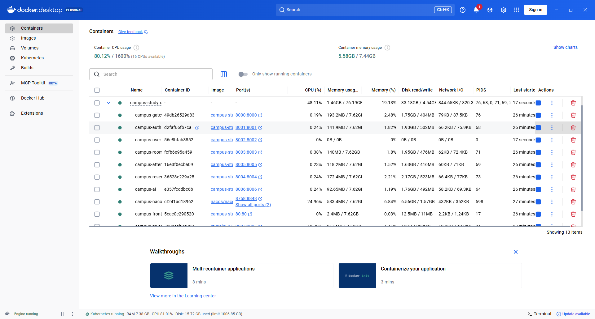 |
| Nacos 服务注册列表 |  |
| Nacos 实例详情 | 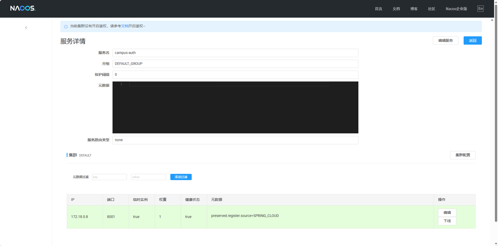 |
| 前端登录页 |  |
| 前端主界面 | 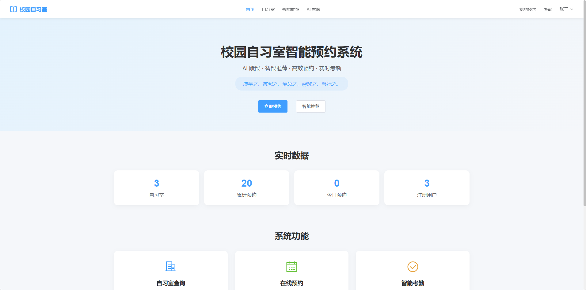 |
| 自习室列表 | 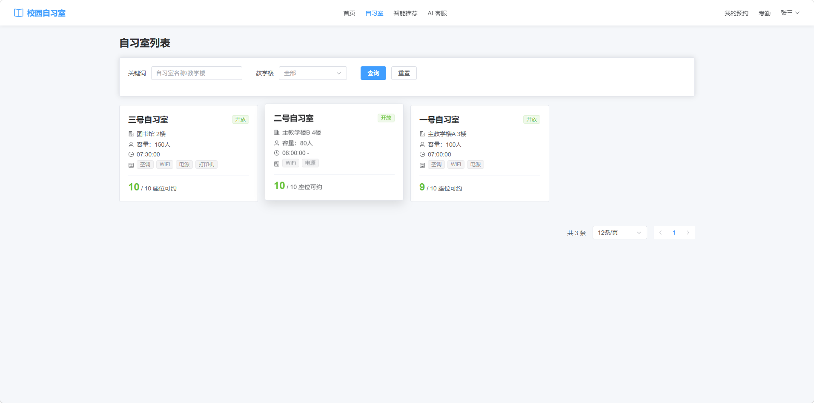 |
| 预约流程 | 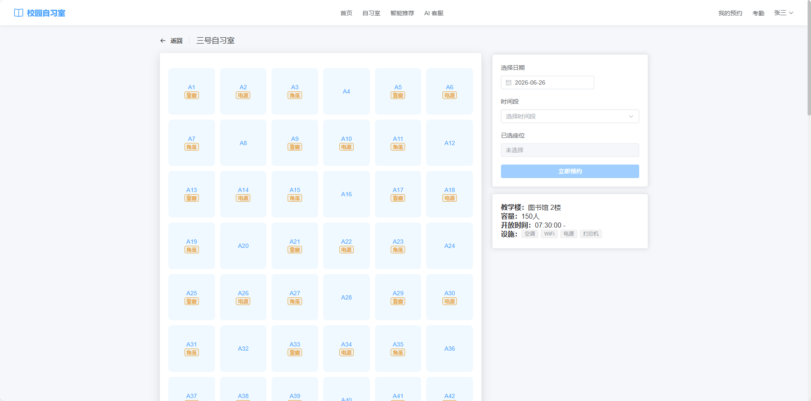 |
| 签到页面 | 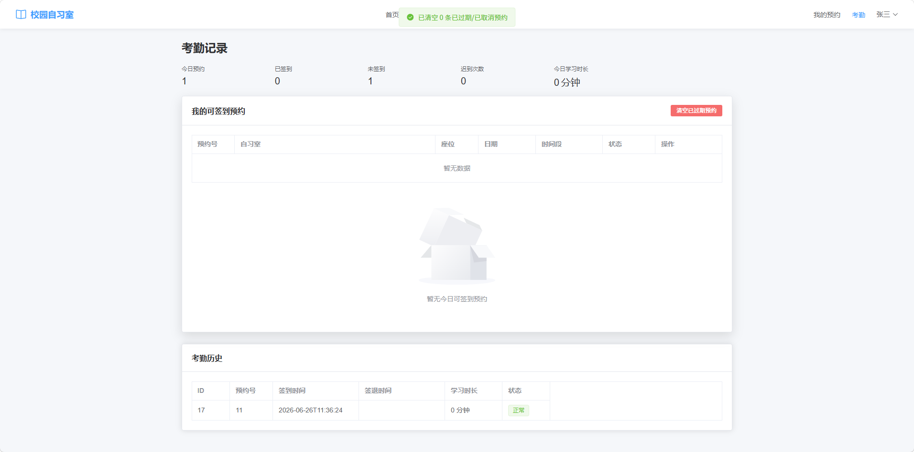 |
| 我的预约 | 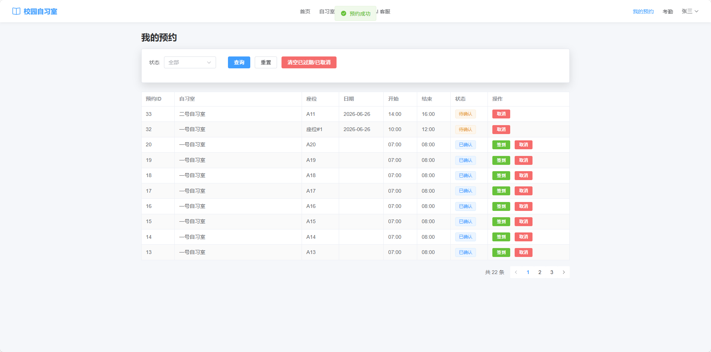 |
| AI 智能客服 | 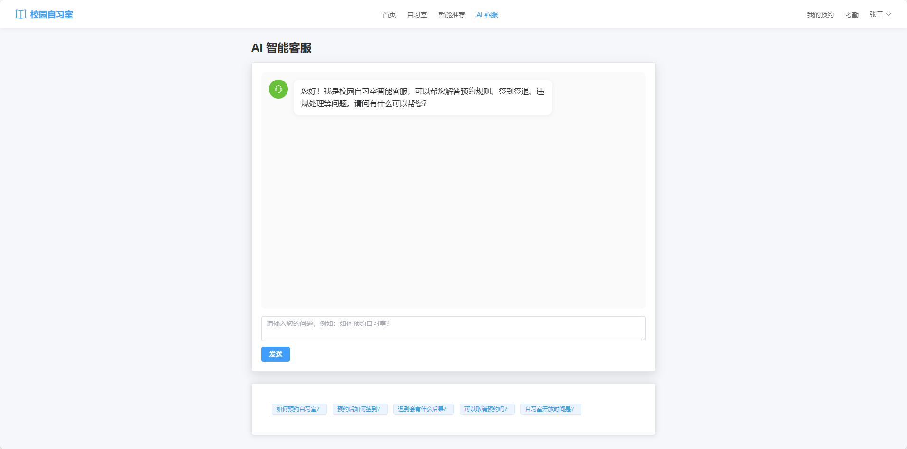 |
| AI 智能推荐 | 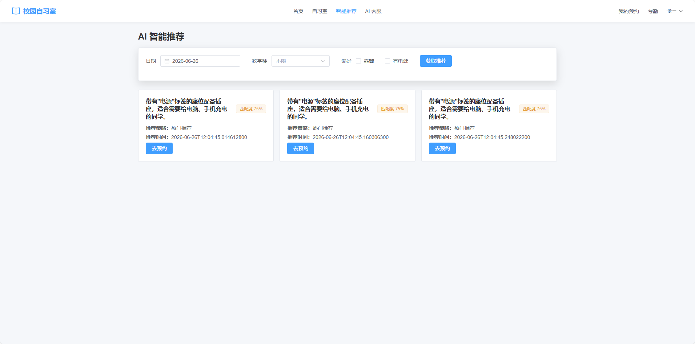 |
| 管理后台 | 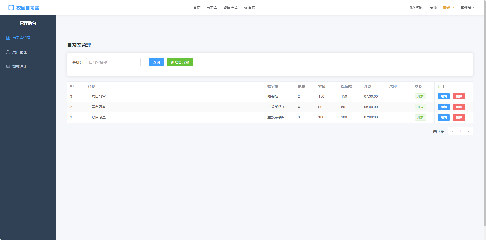 |
| Swagger 接口文档 | 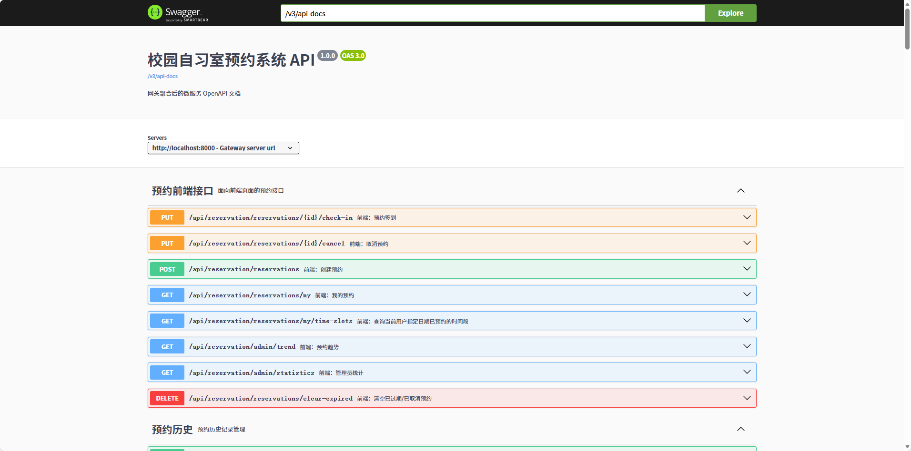 |

---

# 附录 A：Kubernetes 部署验证

## A.1 部署方式

- **编排工具**：Kubernetes（kind 集群，通过 Docker Desktop 运行）
- **集群名称**：`campus-k8s`
- **命名空间**：`campus-studyroom`
- **kind 配置**：`k8s/kind-config.yaml`（含国内镜像加速器）
- **部署脚本**：`k8s/deploy-k8s.sh`
- **验证脚本**：`k8s/verify-k8s.sh`
- **验证日期**：2026 年 6 月 25 日

## A.2 资源清单

| 类型 | 名称 | 说明 |
|------|------|------|
| Namespace | campus-studyroom | 统一命名空间 |
| ConfigMap | campus-config | 应用环境变量 |
| ConfigMap | campus-mysql-init | MySQL 初始化 SQL |
| Secret | zhipu-api-secret | 智谱 API Key |
| StatefulSet | campus-mysql | 数据库 |
| Deployment | campus-redis | 缓存 |
| Deployment | campus-nacos | 注册中心 |
| Deployment | campus-gateway | API 网关 |
| Deployment | campus-auth | 认证服务 |
| Deployment | campus-user | 用户服务 |
| Deployment | campus-room | 自习室服务 |
| Deployment | campus-reservation | 预约服务 |
| Deployment | campus-attendance | 考勤服务 |
| Deployment | campus-ai | AI 服务 |
| Deployment | campus-frontend | 前端 |
| Service | campus-gateway | NodePort 30080 |
| Service | campus-frontend | NodePort 30081 |

## A.3 访问地址

| 入口 | K8s NodePort 地址 |
|------|-------------------|
| 前端 | http://localhost:30081 |
| API 网关 | http://localhost:30080 |
| Nacos 控制台 | http://localhost:30080/nacos |

## A.4 验证结果 ✅

| 验证项 | 结果 |
|--------|------|
| `kubectl get pods -n campus-studyroom` | ✅ 11 / 11 Pod Running |
| `kubectl get svc -n campus-studyroom` | ✅ Service 与 NodePort 30080/30081 正常 |
| 网关健康检查 | ✅ `{"status":"UP"}` |
| AI 健康检查 | ✅ `{"status":"UP"}` |
| 网关登录测试 | ✅ `POST /api/auth/login` 返回 200 + JWT Token |
| 前端页面访问 | ✅ http://localhost:30081 返回 HTTP 200 |
| Nacos 服务注册 | ✅ 登录成功证明 campus-auth 已注册并被网关发现 |

## A.5 Pod 运行状态

```
NAME                                  READY   STATUS    RESTARTS   AGE
campus-ai-7b86b58ff6-hg4qn            1/1     Running   0          8m
campus-attendance-85445d648-hn7dk     1/1     Running   0          8m
campus-auth-84fc9597c9-cz8ph          1/1     Running   0          8m
campus-frontend-76b9f89dbc-x9vzg      1/1     Running   0          8m
campus-gateway-7875dfdfdb-dqb92       1/1     Running   0          8m
campus-mysql-0                        1/1     Running   0          9m
campus-nacos-88ddb5bf4-lmncb          1/1     Running   0          9m
campus-redis-575dccddd8-9ssr9         1/1     Running   0          9m
campus-reservation-688848d546-9bccs   1/1     Running   0          8m
campus-room-598f85c98-86xqj           1/1     Running   0          8m
campus-user-56f7bd7b59-5cn9z          1/1     Running   0          8m
```

## A.6 部署过程中解决的关键问题

| 问题 | 根因 | 解决方案 |
|------|------|----------|
| Docker Desktop 自带 kind 无法拉镜像 | 内部 registry mirror 对 Docker Hub 返回 500 | 用 kind CLI 自建 `campus-k8s` 集群，配置国内镜像加速器 |
| kind 集群无法使用本地镜像 | kind 节点有独立 containerd 镜像存储 | 部署脚本使用 `kind load docker-image` 预加载所有镜像 |
| K8s YAML 镜像名与本地镜像不一致 | docker-compose 默认命名带连字符 | 脚本中 `docker tag` 后加载 |

## A.7 K8s 截图（已补充）

以下截图/文本素材已保存至 `docs/screenshots/k8s/`：

| 截图 | 文件 |
|------|------|
| `kubectl get pods` | 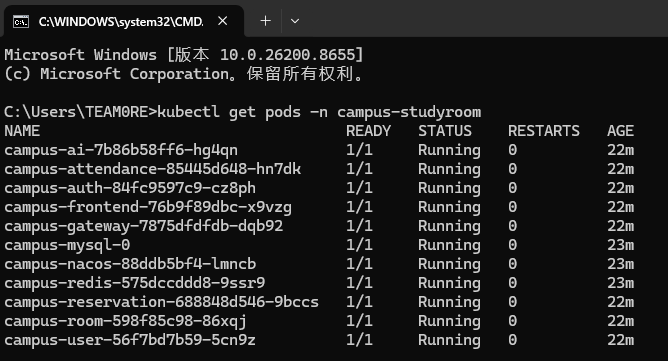 |
| `kubectl get svc` | 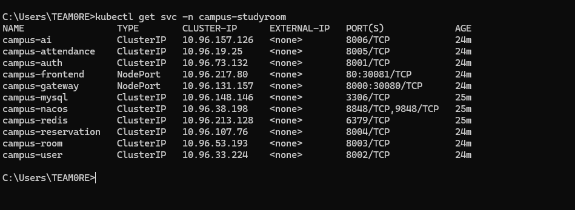 |
| Nacos 服务列表 | 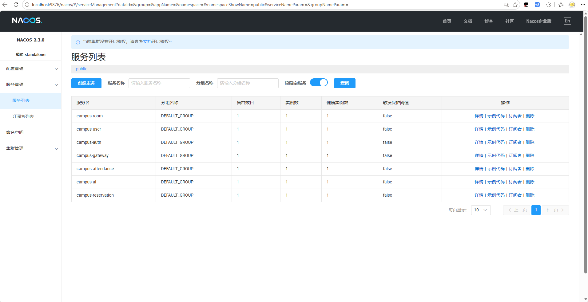 |
| 前端登录页 | 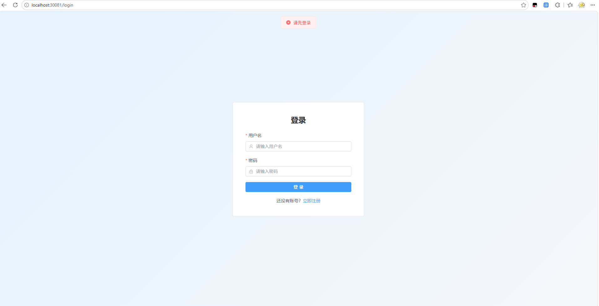 |
| 登录返回 JWT Token | 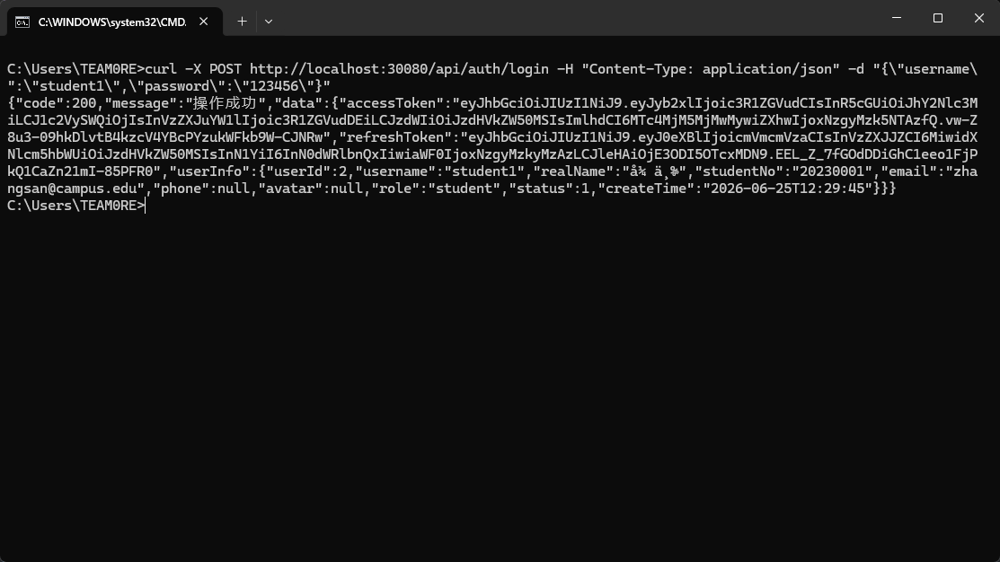 |
| 前端主界面 | 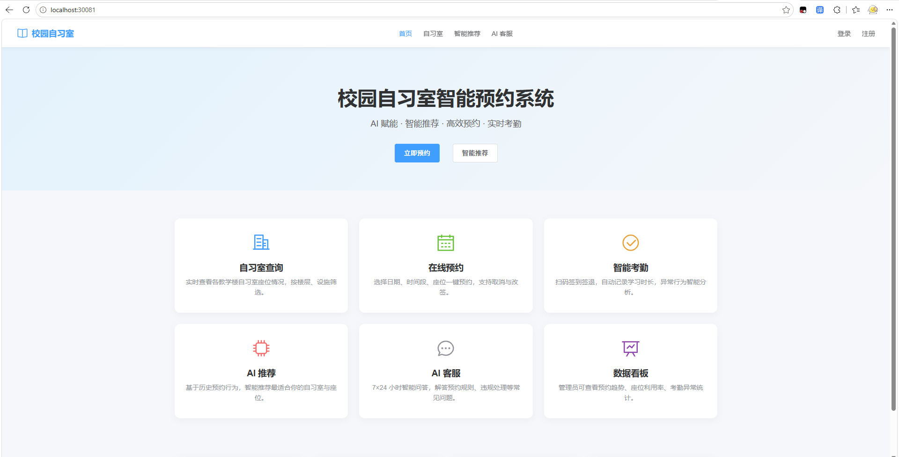 |
| `kubectl cluster-info` | 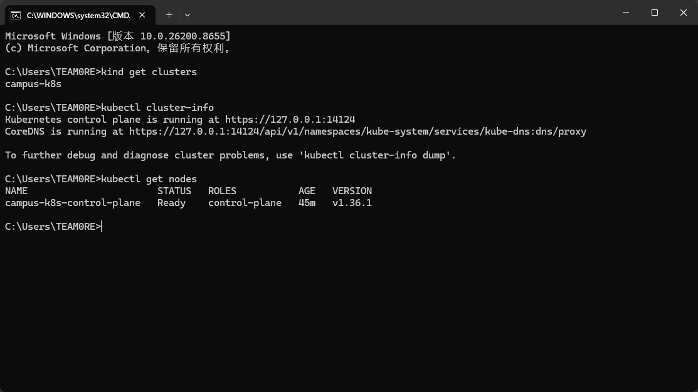 |

原始终端输出见同目录 `.txt` / `.json` 文件。
